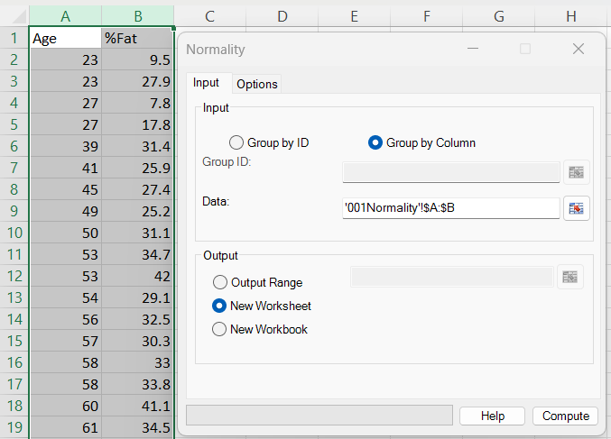
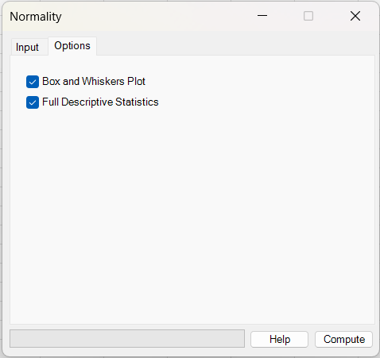
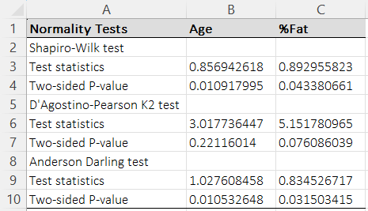

# Normality Tests

**Includes:** Shapiro–Wilk (W), D’Agostino–Pearson (K²), Anderson–Darling (AD²).  
**Purpose:** Check whether a sample distribution is consistent with normality—often used before parametric tests (t-tests, ANOVA, linear regression).

---

## Overview

The Normality dialog runs up to three normality tests for each selected dataset (each **column** / **group**).  
For each dataset, the null hypothesis is:

**H₀:** the data come from a normal distribution.

Small p-values (commonly < 0.05) indicate evidence *against* normality. Large p-values mean the sample is *consistent* with normality (not proof).

---

## Dialog: inputs and options

### Input tab

You can define datasets in two ways:

#### A) Group by Column (most common)
- Select a **rectangular range** where **each column is one variable** (group).
- The **first row is treated as a column name** (e.g., `Age`, `%Fat`). If the header cell is empty, a default name is used.
- Each column is imported and cleaned **independently**, so columns can end up with different sample sizes after removing missing/non-numeric cells.

This mode corresponds to how the form is used in the screenshot.

#### B) Group by ID (grouping column + data column)
Use this when your data are stored like:

| GroupID | Value |
|---|---|
| A | 12.3 |
| A | 11.7 |
| B | 9.8 |
| ... | ... |

- **Group ID:** the range containing group labels (text or numbers).
- **Data:** the numeric values.
- Groups are formed from unique IDs and the test is run separately per group.

> Tip: in both modes, you can type a range (e.g. `Sheet1!A1:C50`) or use the range picker button.

---

### Options tab

Optional outputs:

- **Full Descriptive Statistics** — produces an additional descriptive table.  
  See: [Descriptive Statistics](descriptive-statistics.md)
- **Box and Whiskers Plot** — produces a boxplot output for the same groups/variables.  
  See: [Box and Whiskers](box-and-whiskers.md)

For a visual normality check, also consider:

- [Normal Plot (Q–Q plot)](normal-plot.md)

---

## What it does (math and implementation details)

BESHStatNG computes the following tests per dataset. The output reports the **test statistic** and a **p-value**.

### 1) Shapiro–Wilk test (W)

**Computed in this dialog when:** `n > 3` and `n < 5000` (so effectively n ≥ 4, and 4999 max in the current UI logic).  
(Internally the Shapiro–Wilk routine supports n ≥ 3 and n ≤ 5000, but the dialog currently applies the stricter check above.)

Let the ordered sample be:

\(x_{(1)} \le x_{(2)} \le \dots \le x_{(n)}\) and mean \(\bar x\).

The Shapiro–Wilk statistic is:

\[
W = \frac{\left(\sum_{i=1}^{n} a_i\,x_{(i)}\right)^2}{\sum_{i=1}^{n}\left(x_i-\bar x\right)^2}
\]

where the coefficients `a_i` depend on `n` and approximate expected normal order statistics.

**How BESHStatNG computes it**

- Uses Algorithm **AS R94** (*Applied Statistics*, 1995).
- Builds coefficients `a_i` via inverse normal (`NormSInv`) and polynomial corrections.
- Computes W in a numerically stable form using \(w_1 = 1 - W\).

**P-value**

- For n = 3 an exact transformation is available in the routine.
- For n ≤ 11: uses the AS R94 small-sample transformation.
- For n > 11: uses the AS R94 large-sample approximation with parameters that depend on `log(n)`.
- The final p-value is computed via the normal CDF (`PNorm`).

**Interpretation**

- W is in (0, 1]; values closer to 1 indicate closer agreement with normality.
- Small p-values suggest non-normality.

---

### 2) D’Agostino–Pearson omnibus normality test (K²)

**Computed in this dialog when:** `n ≥ 9`.  

This is an omnibus test combining **skewness** and **kurtosis**.

Compute:

- skewness `Skew = Skewness(x)`
- kurtosis `Kurt = Kurtosis(x)`

Then the code applies D’Agostino–Pearson transformations to obtain two approximately standard normal z-scores:

- `Z_skewness` (from skewness)
- `Z_kurtosis` (from kurtosis)

The omnibus statistic is:

\[
K^2 = Z_{\mathrm{skewness}}^2 + Z_{\mathrm{kurtosis}}^2
\]

Under H₀, \(K^2 \sim \chi^2_{2}\) approximately, and the p-value is:

\[
p = 1 - F_{\chi^2_{2}}\!\left(K^2\right)
\]

**Interpretation**

- Sensitive to asymmetry (skewness) and tail weight (kurtosis).
- Useful as a general “normal vs not normal” check for moderate/large n.

---

### 3) Anderson–Darling normality test (adjusted AD²)

**Computed in this dialog when:** `n > 1` (so n ≥ 2).

This test is especially sensitive to departures in the **tails**.

BESHStatNG:
1. Estimates mean \(\hat\mu = \mathrm{mean}(x)\) and standard deviation \(\hat\sigma = \mathrm{sd}(x)\).
2. Sorts the sample.
3. Computes fitted-normal CDF values:

\[
F_i = \Phi\!\left(\frac{x_{(i)}-\hat\mu}{\hat\sigma}\right)
\]

The Anderson–Darling statistic is:

\[
AD = -n - \frac{1}{n}\sum_{i=1}^{n}(2i-1)\left[\ln(F_i) + \ln\!\left(1 - F_{(n+1-i)}\right)\right]
\]

Then it applies the sample-size adjustment:

\[
AD^2 = AD\left(1 + \frac{0.75}{n} + \frac{2.25}{n^2}\right)
\]

**P-value**
Computed from AD² using a piecewise approximation:

If \(AD^2 \ge 0.6\):

\[
p = \exp\!\left(1.2937 - 5.709\,AD^2 + 0.0186\,(AD^2)^2\right)
\]

If \(0.34 \le AD^2 < 0.6\):

\[
p = \exp\!\left(0.9177 - 4.279\,AD^2 - 1.38\,(AD^2)^2\right)
\]

If \(0.2 \le AD^2 < 0.34\):

\[
p = 1 - \exp\!\left(-8.318 + 42.796\,AD^2 - 59.938\,(AD^2)^2\right)
\]

If \(AD^2 < 0.2\):

\[
p = 1 - \exp\!\left(-13.436 + 101.14\,AD^2 - 223.73\,(AD^2)^2\right)
\]

**Interpretation**

- More sensitive in tails than many alternatives.
- Use alongside a Q–Q plot for practical assessment.

---

## Steps in the add-in

1. Excel ribbon: **BESH Stat NG → Analyse → Assumptions → Normality Tests**
2. Choose **Group by Column** (or **Group by ID**) on the **Input** tab.
3. Select your data using the range picker.
4. Choose the output destination:
   - **Output Range** (write into a specific area)
   - **New Worksheet** (recommended)
   - **New Workbook**
5. (Optional) In **Options**, check:
   - **Full Descriptive Statistics**
   - **Box and Whiskers Plot**
6. Click **Compute**.

---

## Output

The output table is structured as:
- A header row: **Normality Tests** plus one column per selected variable/group (e.g., `Age`, `%Fat`)
- For each test:
  - **Test statistics**
  - **Two-sided P-value**

### How to interpret (mini-example)

In the example output shown above, **Age** has Shapiro–Wilk *p* ≈ 0.0109 and Anderson–Darling *p* ≈ 0.0105, which suggests **evidence against normality at the 0.05 level** (even though D’Agostino–Pearson K² gives *p* ≈ 0.221, which can happen because K² often has lower power at smaller sample sizes). For **%Fat**, Shapiro–Wilk *p* ≈ 0.043 and Anderson–Darling *p* ≈ 0.031 also suggest **non-normality**, while K² is borderline (*p* ≈ 0.076). Practically: confirm with a **Q–Q plot**, and if normality is important for your next step, consider a transformation (e.g., log), robust methods, or a nonparametric alternative.

### “NA …” results
If a dataset is too small for a test, BESHStatNG writes “NA …” in the corresponding cells. In the current UI logic:

- Shapiro–Wilk: NA if `n < 4` or `n ≥ 5000`
- D’Agostino–Pearson: NA if `n < 9`
- Anderson–Darling: NA if `n < 2`

---

## Notes and practical guidance

- **Visual checks matter.** A p-value can be influenced by sample size; always consider a plot:

  - [Normal Plot (Q–Q plot)](normal-plot.md)
  - [Box and Whiskers](box-and-whiskers.md)

- **Missing/non-numeric values.**

  - In **Group by Column** mode, each column is cleaned independently.
  - Rows containing missing/error/text values are dropped from that column’s analysis.

- **Multiple testing.** If you test many variables/groups, expect some small p-values by chance. Consider adjusting your interpretation accordingly.

Download the example dataset used here: [001Normality.csv](../assets/data/001normality/001Normality.csv)

---

## References

- Anderson T.W., Darling D.A. (1952). Asymptotic theory of certain "goodness-of-fit" criteria based on stochastic processes. Annals of Mathematical Statistics 23: 193–212.
- D'Agostino R.B. and Pearson E.S. (1973). Tests of departure from normality. Empirical results for the distribution of b2 and √b1. Biometrika, 60, 613-622.
- D'Agostino R.B., Belanger A. and D'Agostino Jr. R.B. (1990).  A suggestion for using powerful and informative tests of normality. American Statistician, 44, 316-321.
- D'Agostino R.B. (1986). Tests for the Normal Distribution. In D'Agostino R.B. and Stephens M.A.. Goodness-of-Fit Techniques. New York: Marcel Dekker.
- Royston P. (1982). Algorithm AS 181: The W Test for Normality. Journal of the Royal Statistical Society. Series C (Applied Statistics), 31(2), 176-180.
- Royston P. (1995). AS R94: A remark on AS 181: The W-test for normality. Applied Statistics 44:547-551.
- Shapiro S.S., Wilk M. B. (1965). An analysis of variance test for normality (complete samples). Biometrika 52:591–611.
- Yap B.W. and Sim C.H. Comparisons of various types of normality tests. Journal of Statistical Computation and Simulation, 81:12, 2011, 2141-2155.

## See also
- [Descriptive Statistics](descriptive-statistics.md)
- [Box and Whiskers](box-and-whiskers.md)
- [Normal Plot (Q–Q plot)](normal-plot.md)
- [Home](../index.md)
