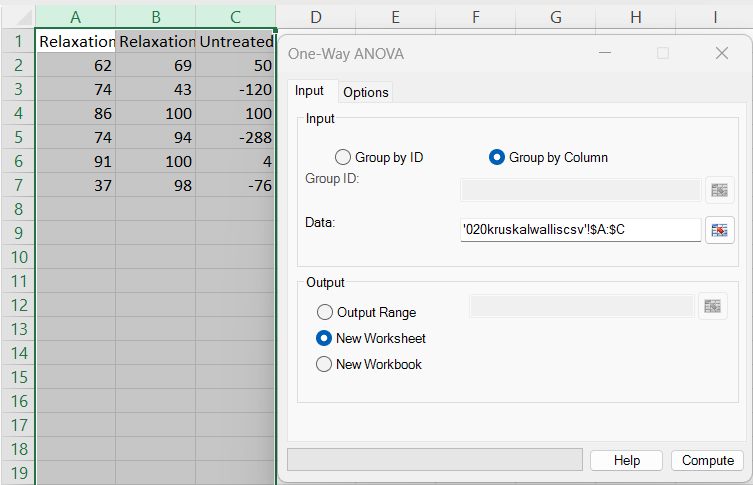
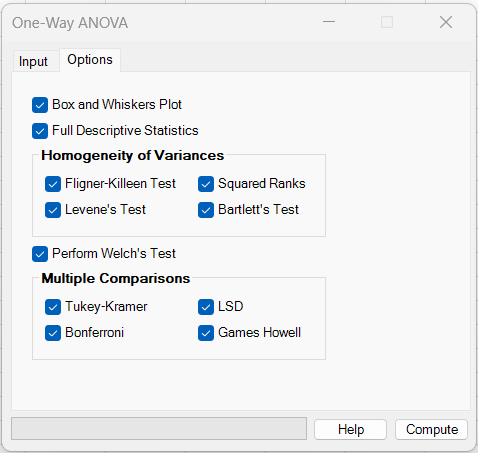
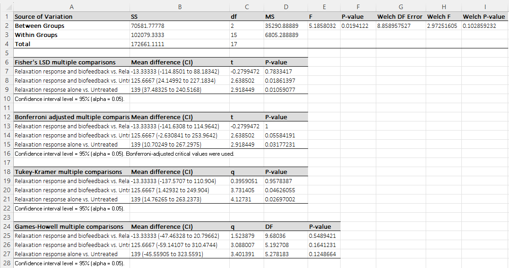
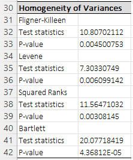
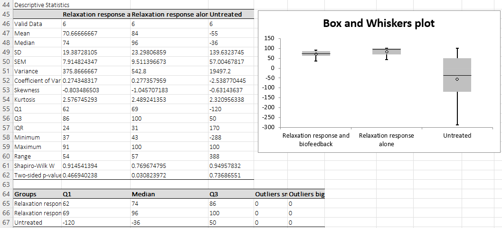

# One-Way ANOVA

**Includes:** Classic one-way ANOVA, Welch ANOVA, Post-hoc: LSD, Bonferroni, Tukey–Kramer, Games–Howell.  
**Purpose:** Compare means across multiple independent groups and run common post-hoc procedures when differences are detected.

---

## Overview

The **one-way analysis of variance (ANOVA)** tests whether the means of **2 or more independent groups** are equal.

BESHStatNG provides:

- **Classic one-way ANOVA** (assumes equal variances across groups).
- **Welch ANOVA** (does *not* assume equal variances).
- **Multiple comparisons** (post-hoc) tables:
  - Fisher’s **LSD**
  - **Bonferroni** adjusted pairwise tests
  - **Tukey–Kramer**
  - **Games–Howell**
- Optional:
  - **Homogeneity of variances** tests (Fligner–Killeen, Levene, squared-ranks, Bartlett)
  - **Full descriptive statistics**
  - **Box-and-whiskers plot**

---

## Example dataset

In the screenshots, the three columns from this file were used (each column is one group):

- **Relaxation response and biofeedback**
- **Relaxation response alone**
- **Untreated**

Download:

- [020kruskalwalliscsv.csv](../assets/data/020kruskalwallis/020kruskalwalliscsv.csv)

---

## Screenshots

### Input tab


### Options tab


### Results (ANOVA + multiple comparisons)


### Results (homogeneity tests)


### Results (descriptives + boxplot)


---

## When to use it

Use one-way ANOVA when:

- You have a **continuous** outcome and **one categorical grouping variable** with ≥ 3 levels (groups).
- Observations are **independent** between groups.

Common assumptions and checks:

- **Classic ANOVA** assumes:
  - approximate **normality** within each group, and
  - **homogeneity of variances** across groups.
- If variances are unequal, consider **Welch ANOVA** and/or **Games–Howell** post-hoc tests.

---

## Inputs in Excel

### Group by Column (as in the screenshots)
- Select a **rectangular range** where **each column is one group**.
- Column headers (first row) are used as group names in the output.

### Group by ID (long format)
- Provide:
  - **Group ID** range (categorical values),
  - **Data** range (numeric values).

### Output
Choose one:
- **Output Range**
- **New Worksheet**
- **New Workbook**

---

## Options

- **Box and Whiskers Plot**: adds a boxplot for the groups.
- **Full Descriptive Statistics**: adds per-group summary statistics (N, mean, median, SD, SEM, etc.).
- **Homogeneity of Variances**: adds variance equality tests:
  - Fligner–Killeen (rank-based)
  - Levene
  - Squared ranks
  - Bartlett (sensitive to non-normality)
- **Perform Welch’s Test**: adds Welch ANOVA columns to the ANOVA table.
- **Multiple Comparisons**:
  - Tukey–Kramer
  - Games–Howell
  - LSD
  - Bonferroni

---

## Statistical details

### Classic one-way ANOVA

Let there be **k groups**, with group sizes \(n_i\), observations \(y_{ij}\), group means \(\bar y_i\), and overall mean \(\bar y\).
Let \(N = \sum_i n_i\).

**Sum of squares (SS):**

$$
SS_{\text{between}} = \sum_{i=1}^{k} n_i(\bar y_i - \bar y)^2
$$

$$
SS_{\text{within}} = \sum_{i=1}^{k}\sum_{j=1}^{n_i}(y_{ij} - \bar y_i)^2
$$

$$
SS_{\text{total}} = SS_{\text{between}} + SS_{\text{within}}
$$

**Degrees of freedom (df):**

$$
df_{\text{between}} = k-1,\quad df_{\text{within}} = N-k
$$

**Mean squares (MS) and F-statistic:**

$$
MS_{\text{between}} = SS_{\text{between}}/df_{\text{between}},\quad
MS_{\text{within}} = SS_{\text{within}}/df_{\text{within}}
$$

$$
F = MS_{\text{between}}/MS_{\text{within}}
$$

The p-value is computed from the F distribution with \((df_{\text{between}}, df_{\text{within}})\).

### Welch ANOVA (heteroscedastic)

Welch’s ANOVA relaxes the equal-variance assumption. In BESHStatNG it is implemented using group weights:

$$
w_i = \frac{n_i}{s_i^2}
$$

where \(s_i^2\) is the sample variance in group \(i\).

Weighted grand mean:

$$
\bar y_w = \frac{\sum_i w_i\bar y_i}{\sum_i w_i}
$$

Numerator:

$$
\text{Num} = \sum_i w_i(\bar y_i - \bar y_w)^2
$$

Define:

$$
b = \sum_i \frac{1}{n_i-1}\left(1 - \frac{w_i}{\sum_j w_j}\right)^2
$$

$$
df_1 = k-1
$$

$$
df_2 = \frac{k^2 - 1}{3b}
$$

$$
a = \frac{2(k-2)}{k^2-1}
$$

$$
F_W = \frac{\text{Num}/df_1}{1 + a b}
$$

The Welch p-value is computed from the F distribution with \((df_1, df_2)\).

### Multiple comparisons (post-hoc)

BESHStatNG reports pairwise comparisons in the natural pair-generation order (group 1 vs 2, group 1 vs 3, …).
For methods that report confidence intervals, the interval level is controlled by the selected alpha value.  
The default is `0.05`, corresponding to a 95% confidence interval, and the output tables include a footnote indicating the confidence-interval level used.

Below are the main statistics used (notation: group means \(\bar y_i\), \(\bar y_j\)).

#### Fisher’s LSD (pairwise t-tests using pooled MSwithin)

For each pair \((i,j)\):

$$
\Delta_{ij} = \bar y_i - \bar y_j
$$

A pooled within-group variance estimate comes from the ANOVA:

$$
MS_{\text{within}}
$$

The add-in uses a pooled standard error based on \(MS_{\text{within}}\) and group sizes:

$$
SE_{ij} = \sqrt{MS_{\text{within}}\left(\frac{1}{n_i}+\frac{1}{n_j}\right)}
$$

$$
t_{ij} = \frac{\Delta_{ij}}{SE_{ij}}
$$

with \(df = df_{\text{within}}\). Two-sided p-values come from the t distribution.

Bonferroni uses \(p_{adj} = \min(p \cdot C, 1)\), where \(C=k(k-1)/2\) is the number of pairwise comparisons (and uses \(\alpha/C\) for CI cutoffs).

#### Tukey–Kramer

The add-in reports a confidence interval for the mean difference using the studentized-range critical value \(q_{1-\alpha}\):

$$
\Delta_{ij} \pm \frac{q_{1-\alpha}}{\sqrt{2}}\,
\sqrt{MS_{\text{within}}}\,
\sqrt{\frac{1}{n_i}+\frac{1}{n_j}}
$$

#### Games–Howell (heteroscedastic)

Let \(v_i = s_i^2/n_i\). Then:

$$
SE_{ij} = \sqrt{0.5(v_i + v_j)}
$$

$$
q_{ij} = \frac{|\Delta_{ij}|}{SE_{ij}}
$$

with Satterthwaite-style degrees of freedom:

$$
df_{ij} = \frac{(v_i + v_j)^2}{\frac{v_i^2}{n_i-1} + \frac{v_j^2}{n_j-1}}
$$

p-values are computed from the studentized range distribution using \(df_{ij}\) and \(k\).

The add-in also reports a confidence interval for the mean difference:

$$
\Delta_{ij} \pm q_{1-\alpha}\sqrt{0.5(v_i + v_j)}
$$

---

## Output

### ANOVA summary table
- **SS**, **df**, **MS**, **F**, **P-value**: classic one-way ANOVA.
- If **Welch’s test** is enabled, additional columns are shown:
  - **Welch DF Error**, **Welch F**, **Welch P-value**.

### Multiple comparisons tables
If selected, the following tables are printed:

- **Fisher’s LSD multiple comparisons**
- **Bonferroni adjusted multiple comparisons**
- **Tukey–Kramer multiple comparisons**
- **Games–Howell multiple comparisons**

Rows are reported in natural pair-generation order. For parametric post-hoc methods, the output includes the mean difference with its confidence interval; Games–Howell also includes the comparison-specific degrees of freedom. A footnote indicates the confidence-interval level implied by the selected alpha.

### Optional diagnostics and summaries
- **Homogeneity of variances** test results.
- **Descriptive statistics** per group.
- **Box and Whiskers plot**.

---

## R reference (analogous outputs)

This snippet reproduces the *main* outputs: classic one-way ANOVA, Welch ANOVA, and the post-hoc comparisons.

```r
# Example: One-Way ANOVA (BESHStatNG example dataset)
df <- read.csv("020kruskalwalliscsv.csv")

# Convert wide -> long
long <- stack(df)
names(long) <- c("y", "group")
long$group <- factor(long$group)

# --- Classic one-way ANOVA ---
fit <- aov(y ~ group, data = long)
summary(fit)

# --- Welch ANOVA (unequal variances) ---
oneway.test(y ~ group, data = long, var.equal = FALSE)

# --- Fisher LSD (no multiplicity adjustment) ---
pairwise.t.test(long$y, long$group,
                p.adjust.method = "none",
                pool.sd = TRUE)

# --- Bonferroni-adjusted pairwise tests ---
pairwise.t.test(long$y, long$group,
                p.adjust.method = "bonferroni",
                pool.sd = TRUE)

# --- Tukey–Kramer ---
TukeyHSD(fit)

# --- Games–Howell ---
# install.packages("rstatix")
library(rstatix)
games_howell_test(long, y ~ group)
```

---

## Notes

- **Missing values**: non-numeric and blank cells are ignored.
- For strong non-normality or extreme outliers, consider a nonparametric alternative (e.g., Kruskal–Wallis).

## References

- Welch B.L. (1951) On the Comparison of Several Mean Values: An Alternative Approach. Biometrika 38(3/4), 330-336.

## See also
- [Kruskal–Wallis](kruskal-wallis-test.md)
- [Unpaired t-test](unpaired-two-sample-t-tests.md)
- [Home](../index.md)
