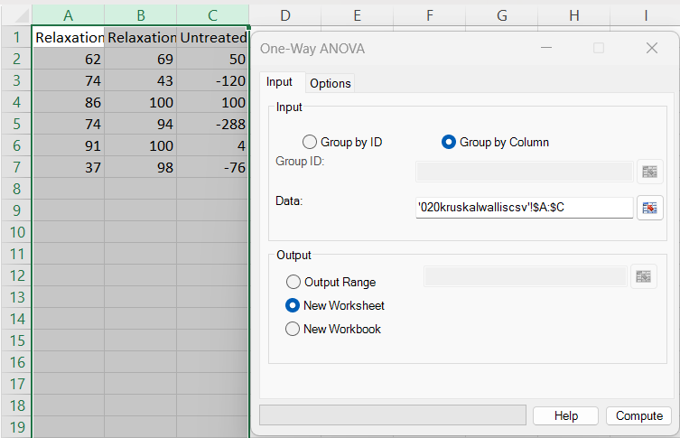
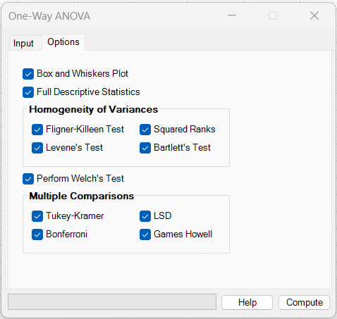
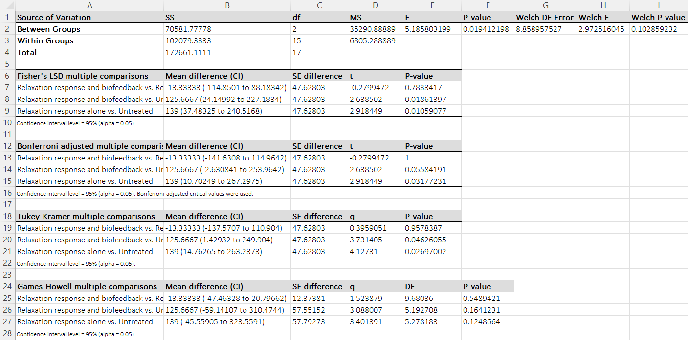
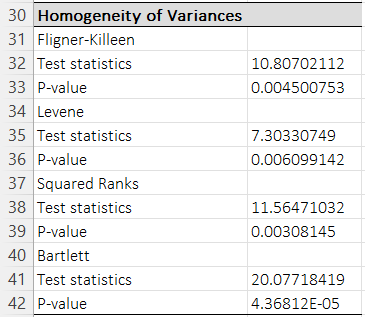
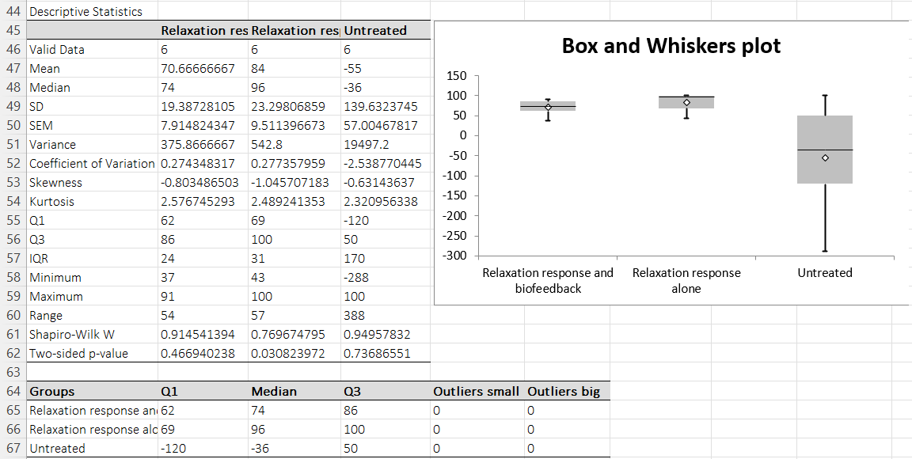
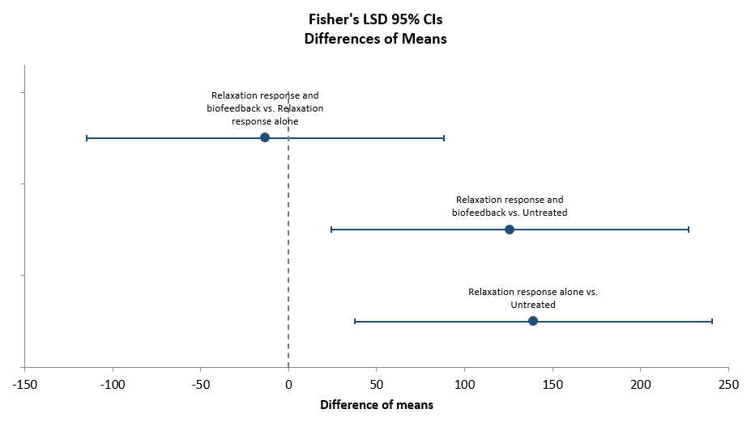
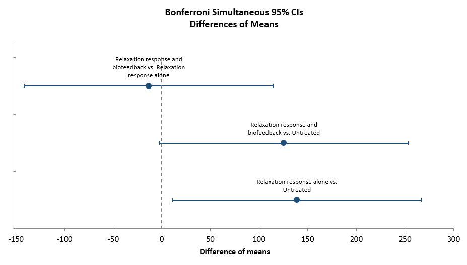
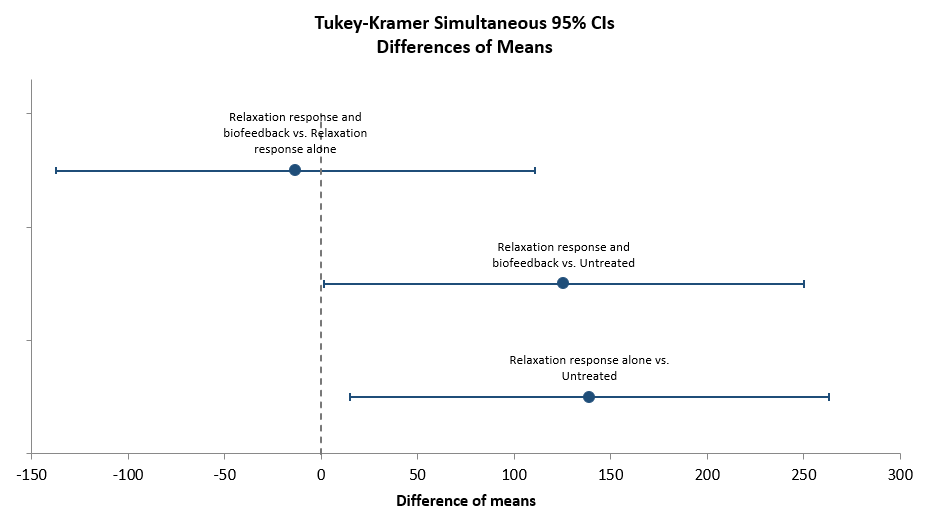
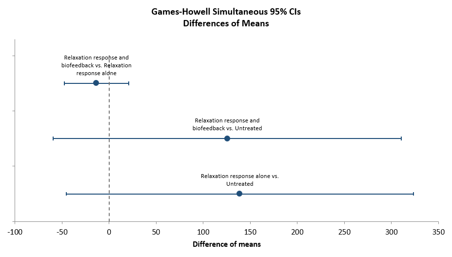

# One-Way ANOVA

**Includes:** Classic one-way ANOVA, Welch ANOVA, Post-hoc: LSD, Bonferroni, Tukey--Kramer, Games--Howell.  
**Purpose:** Compare means across multiple independent groups and run common post-hoc procedures when differences are detected.

---

## Overview

The **one-way analysis of variance (ANOVA)** tests whether the means of **2 or more independent groups** are equal.

BESHStatNG provides:

-   **Classic one-way ANOVA** (assumes equal variances across groups).
-   **Welch ANOVA** (does *not* assume equal variances).
-   **Multiple comparisons** (post-hoc) tables and confidence-interval
    plots:
    -   Fisher's **LSD**
    -   **Bonferroni** adjusted pairwise tests
    -   **Tukey--Kramer**
    -   **Games--Howell**
-   Optional:
    -   **Homogeneity of variances** tests (Fligner--Killeen, Levene, squared-ranks, Bartlett)
    -   **Full descriptive statistics**
    -   **Box-and-whiskers plot**

---

## Example dataset

In the screenshots, the three columns from this file were used (each column is one group):

-   **Relaxation response and biofeedback**
-   **Relaxation response alone**
-   **Untreated**

Download:

-   [020kruskalwalliscsv.csv](../assets/data/020kruskalwallis/020kruskalwalliscsv.csv)

---

## Screenshots

### Input tab



### Options tab



### Results (ANOVA + multiple comparisons)



### Results (homogeneity tests)



### Results (descriptives + boxplot)



### Fisher's LSD confidence intervals



### Bonferroni confidence intervals



### Tukey--Kramer simultaneous confidence intervals



### Games--Howell simultaneous confidence intervals



---

## When to use it

Use one-way ANOVA when:

-   You have a **continuous** outcome and **one categorical grouping variable** with ≥ 3 levels (groups).
-   Observations are **independent** between groups.

Common assumptions and checks:

-   **Classic ANOVA** assumes:
    -   approximate **normality** within each group, and
    -   **homogeneity of variances** across groups.
-   If variances are unequal, consider **Welch ANOVA** and/or **Games--Howell** post-hoc tests.

---

## Inputs in Excel

### Group by Column (as in the screenshots)

-   Select a **rectangular range** where **each column is one group**.
-   Column headers (first row) are used as group names in the output.

### Group by ID (long format)

-   Provide:
    -   **Group ID** range (categorical values),
    -   **Data** range (numeric values).

### Output

Choose one: 
- **Output Range** 
- **New Worksheet** 
- **New Workbook**

---

## Options

-   **Box and Whiskers Plot**: adds a boxplot for the groups.
-   **Full Descriptive Statistics**: adds per-group summary statistics (N, mean, median, SD, SEM, etc.).
-   **Homogeneity of Variances**: adds variance equality tests:
    -   Fligner--Killeen (rank-based)
    -   Levene
    -   Squared ranks
    -   Bartlett (sensitive to non-normality)
-   **Perform Welch's Test**: adds Welch ANOVA columns to the ANOVA table.
-   **Multiple Comparisons**:
    -   Tukey--Kramer
    -   Games--Howell
    -   LSD
    -   Bonferroni

---

## Statistical details

### Classic one-way ANOVA

Let there be **k groups**, with group sizes $n_i$, observations $y_{ij}$, group means $\bar{y}_i$, and overall mean $\bar{y}$. Let $N = \sum_i n_i$.

**Sum of squares (SS):**

$$
SS_{\text{between}} = \sum_{i=1}^{k} n_i(\bar y_i - \bar y)^2
$$

$$
SS_{\text{within}} = \sum_{i=1}^{k}\sum_{j=1}^{n_i}(y_{ij} - \bar y_i)^2
$$

$$
SS_{\text{total}} = SS_{\text{between}} + SS_{\text{within}}
$$

**Degrees of freedom (df):**

$$
df_{\text{between}} = k-1,\quad df_{\text{within}} = N-k
$$

**Mean squares (MS) and F-statistic:**

$$
MS_{\text{between}} = SS_{\text{between}}/df_{\text{between}},\quad
MS_{\text{within}} = SS_{\text{within}}/df_{\text{within}}
$$

$$
F = MS_{\text{between}}/MS_{\text{within}}
$$

The p-value is computed from the F distribution with $(df_{\text{between}}, df_{\text{within}})$.

### Welch ANOVA (heteroscedastic)

Welch's ANOVA relaxes the equal-variance assumption. In BESHStatNG it is implemented using group weights:

$$
w_i = \frac{n_i}{s_i^2}
$$

where $s_i^2$ is the sample variance in group $i$.

Weighted grand mean:

$$
\bar y_w = \frac{\sum_i w_i\bar y_i}{\sum_i w_i}
$$

Numerator:

$$
\text{Num} = \sum_i w_i(\bar y_i - \bar y_w)^2
$$

Define:

$$
b = \sum_i \frac{1}{n_i-1}\left(1 - \frac{w_i}{\sum_j w_j}\right)^2
$$

$$
df_1 = k-1
$$

$$
df_2 = \frac{k^2 - 1}{3b}
$$

$$
a = \frac{2(k-2)}{k^2-1}
$$

$$
F_W = \frac{\text{Num}/df_1}{1 + a b}
$$

The Welch p-value is computed from the F distribution with $(df_1, df_2)$.

### Multiple comparisons (post-hoc)

BESHStatNG reports pairwise comparisons in the natural pair-generation order (group 1 vs 2, group 1 vs 3, ...). For analyses run from the
graphical user interface, the post-hoc procedures use the saved **Default alpha** global setting. The corresponding confidence level is
$100(1-\alpha)\%$; for example, `alpha = 0.05` gives 95% confidence intervals and `alpha = 0.01` gives 99% confidence intervals.
The output tables include a footnote indicating the confidence-interval level used.

Below are the main statistics used (notation: group means $\bar{y}_i$, $\bar{y}_j$).

#### Fisher's LSD (pairwise t-tests using pooled MSwithin)

For each pair $(i,j)$:

$$
\Delta_{ij} = \bar y_i - \bar y_j
$$

A pooled within-group variance estimate comes from the ANOVA:

$$
MS_{\text{within}}
$$

The add-in uses a pooled standard error based on $MS_{\text{within}}$ and group sizes:

$$
SE_{ij} = \sqrt{MS_{\text{within}}\left(\frac{1}{n_i}+\frac{1}{n_j}\right)}
$$

$$
t_{ij} = \frac{\Delta_{ij}}{SE_{ij}}
$$

with $df = df_{\text{within}}$. Two-sided p-values come from the t distribution.

Bonferroni uses $p_{\text{adj}} = \min(p \cdot C, 1)$, where $C=k(k-1)/2$ is the number of pairwise comparisons (and uses $\alpha/C$ for CI cutoffs).

#### Tukey--Kramer

For each pair, the reported **SE difference** is the conventional standard error of the difference between two means:

$$
SE_{ij} =
\sqrt{MS_{\text{within}}
\left(\frac{1}{n_i}+\frac{1}{n_j}\right)}
$$

Tukey--Kramer inference uses the studentized-range distribution. The corresponding statistic is:

$$
q_{ij} =
\frac{|\Delta_{ij}|}
{SE_{ij}/\sqrt{2}}
$$

The confidence interval for the mean difference uses the studentized-range critical value $q_{1-\alpha}$:

$$
\Delta_{ij} \pm \frac{q_{1-\alpha}}{\sqrt{2}} SE_{ij}
$$

Thus, the **SE difference** displayed in the table is the ordinary pairwise standard error. The $1/\sqrt{2}$ scaling is applied when forming the studentized-range statistic and confidence interval.


#### Games--Howell (heteroscedastic)

Let $v_i = s_i^2/n_i$. Unlike pooled-variance procedures, Games--Howell uses the separate variance estimates from the two groups. The reported **SE difference** is:

$$
SE_{ij} = \sqrt{v_i + v_j}
$$

The studentized-range statistic uses $SE_{ij}/\sqrt{2}$ as its denominator:

$$
q_{ij} =
\frac{|\Delta_{ij}|}{SE_{ij}/\sqrt{2}}
=
\frac{|\Delta_{ij}|}{\sqrt{0.5(v_i+v_j)}}
$$

with Satterthwaite-style degrees of freedom:

$$
df_{ij} = \frac{(v_i + v_j)^2}{\frac{v_i^2}{n_i-1} + \frac{v_j^2}{n_j-1}}
$$

p-values are computed from the studentized range distribution using
$df_{ij}$ and $k$.

The add-in also reports a confidence interval for the mean difference:

$$
\Delta_{ij} \pm \frac{q_{1-\alpha}}{\sqrt{2}} SE_{ij}
$$

which is equivalent to:

$$
\Delta_{ij} \pm q_{1-\alpha}\sqrt{0.5(v_i + v_j)}
$$

---

## Output

### ANOVA summary table

-   **SS**, **df**, **MS**, **F**, **P-value**: classic one-way ANOVA.
-   If **Welch's test** is enabled, additional columns are shown:
    -   **Welch DF Error**, **Welch F**, **Welch P-value**.

### Multiple comparisons tables

If selected, the following tables are printed:

-   **Fisher's LSD multiple comparisons**
-   **Bonferroni adjusted multiple comparisons**
-   **Tukey--Kramer multiple comparisons**
-   **Games--Howell multiple comparisons**

Rows are reported in natural pair-generation order. For all four procedures, the output includes the **mean difference with its confidence interval** and the **SE difference**. Fisher's LSD and Bonferroni report a t statistic, while Tukey--Kramer and Games--Howell report the studentized-range q statistic. Games--Howell also includes the comparison-specific degrees of freedom. A footnote indicates the confidence-interval level implied by the alpha setting.

### Multiple-comparison confidence-interval plots

When One-Way ANOVA is run from the graphical user interface, BESHStatNG also creates a confidence-interval plot for each selected multiple-comparison procedure.

Each plot shows:

-   a **point** at the estimated pairwise mean difference;
-   a **horizontal line** representing its confidence interval;
-   the comparison name as a **data label above the point**; and
-   a dashed vertical reference line at **zero difference**.

An interval that does **not contain zero** indicates that the corresponding pairwise difference is statistically significant at the
confidence level used by that multiple-comparison procedure. Intervals that cross zero do not provide evidence of a difference at that level.

For Fisher's LSD the intervals are unadjusted pairwise intervals. Bonferroni uses multiplicity-adjusted intervals, while Tukey--Kramer and
Games--Howell use studentized-range simultaneous intervals. The chart title displays the confidence level actually used, so changing the global **Default alpha** setting also changes the plotted interval level.

The confidence-interval plots are generated for GUI analyses; worksheet-function output remains tabular.

### Optional diagnostics and summaries

-   **Homogeneity of variances** test results.
-   **Descriptive statistics** per group.
-   **Box and Whiskers plot**.

---

## R reference (analogous outputs)

This snippet reproduces the *main* outputs: classic one-way ANOVA, Welch ANOVA, and the post-hoc comparisons.

``` r
# Example: One-Way ANOVA (BESHStatNG example dataset)
df <- read.csv("020kruskalwalliscsv.csv")

# Convert wide -> long
long <- stack(df)
names(long) <- c("y", "group")
long$group <- factor(long$group)

# --- Classic one-way ANOVA ---
fit <- aov(y ~ group, data = long)
summary(fit)

# --- Welch ANOVA (unequal variances) ---
oneway.test(y ~ group, data = long, var.equal = FALSE)

# --- Fisher LSD (no multiplicity adjustment) ---
pairwise.t.test(long$y, long$group,
                p.adjust.method = "none",
                pool.sd = TRUE)

# --- Bonferroni-adjusted pairwise tests ---
pairwise.t.test(long$y, long$group,
                p.adjust.method = "bonferroni",
                pool.sd = TRUE)

# --- Tukey–Kramer ---
TukeyHSD(fit)

# --- Games–Howell ---
# install.packages("rstatix")
library(rstatix)
games_howell_test(long, y ~ group)
```

---

## Notes

-   **Missing values**: non-numeric and blank cells are ignored.
-   For strong non-normality or extreme outliers, consider a nonparametric alternative (e.g., Kruskal--Wallis).

## References

-   Welch B.L. (1951) On the Comparison of Several Mean Values: An Alternative Approach. Biometrika 38(3/4), 330-336.

## See also

-   [Kruskal--Wallis](kruskal-wallis-test.md)
-   [Unpaired t-test](unpaired-two-sample-t-tests.md)
-   [Home](../index.md)
