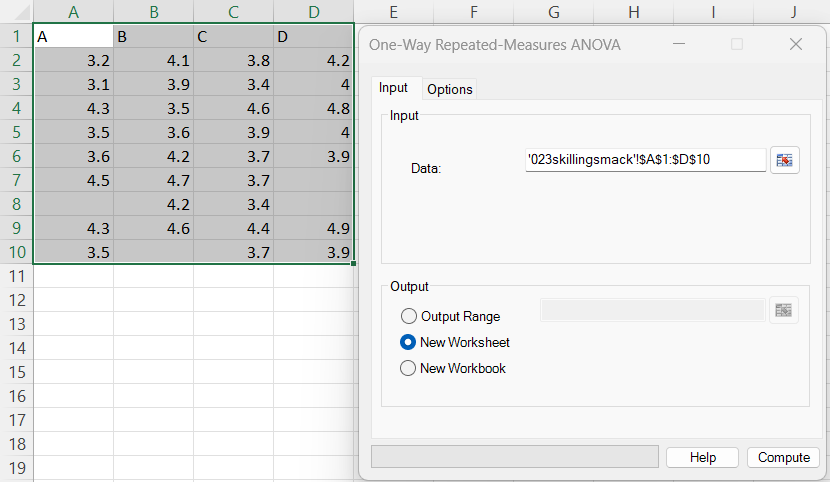
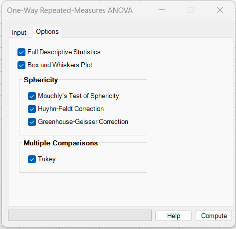
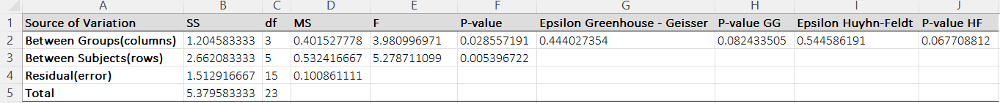
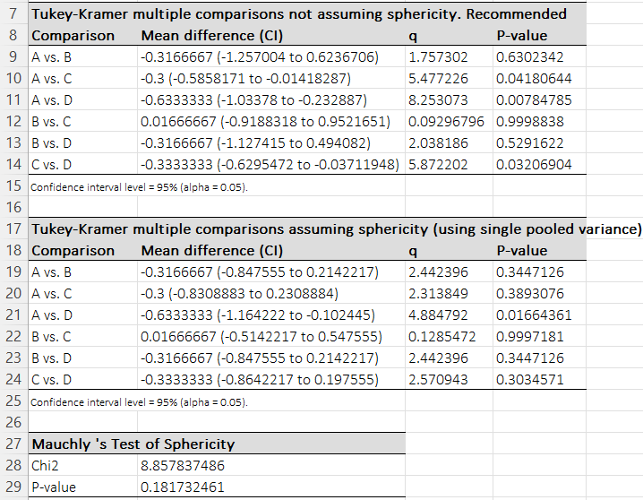
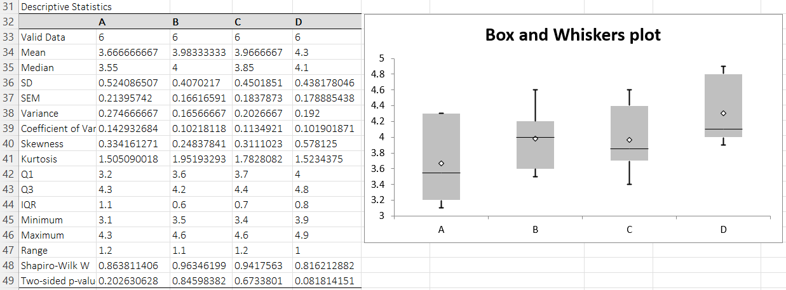

# One-Way Repeated-Measures ANOVA

**Includes:** RM ANOVA, Sphericity: Mauchly test (optional), Corrections: Greenhouse–Geisser, Huynh–Feldt (optional), Post-hoc: Tukey–Kramer (optional), Descriptive stats / box plot (optional).  
**Purpose:** Compare means across repeated conditions for the same subjects, with optional sphericity diagnostics and corrections.

---

## Overview

A **one-way repeated-measures ANOVA** tests whether the mean outcome differs across **≥ 2 repeated conditions** measured on the **same subjects**.  
In BESHStatNG, data are provided in **wide format**:

- **rows** = subjects (blocks),
- **columns** = repeated conditions (treatments).

The add-in reports:

- the classical RM-ANOVA table (Between Groups/columns, Between Subjects/rows, Residual/error),
- optional **Mauchly’s test of sphericity**,
- optional **Greenhouse–Geisser (GG)** and **Huynh–Feldt (HF)** corrected p-values,
- optional **Tukey–Kramer post-hoc** comparisons:
  - **not assuming sphericity** (recommended; based on paired differences),
  - **assuming sphericity** (single pooled variance; as implemented),
- optional descriptive statistics and box plot per condition.

---

## Example dataset

In the screenshots, the following file was used (columns **A–D**):

- [023skillingsmack.csv](../assets/data/023skillingsmack/023skillingsmack.csv)

**Important (missing values):** RM-ANOVA requires each subject to have values in **all** conditions.  
BESHStatNG therefore uses **complete-case subjects**: any row with a missing value in any selected column is excluded from the RM-ANOVA computations (and from the RM post-hoc tests).

For this dataset, that leaves **6 complete subjects** (matching the screenshots).

---

## Screenshots

### Input tab


### Options tab


### Results (ANOVA + corrections)


### Results (post-hoc + Mauchly)


### Results (descriptives + plot)


---

## When to use it

Use one-way repeated-measures ANOVA when:

- the **same subjects** are measured under multiple **conditions/time points**,
- the outcome is approximately continuous (interval/ratio),
- you want an omnibus test for any mean differences across conditions.

Key assumptions:

1. **Independence between subjects** (rows are independent).
2. **Normality of residuals / differences** (especially important for small sample sizes).
3. **Sphericity** (equal variances of all pairwise difference scores).  
   If sphericity is violated, use **GG/HF corrected p-values** and prefer the **“not assuming sphericity”** post-hoc table.

---

## Inputs in Excel

### Data range
Select a **rectangular range** that includes the repeated-measures columns:

- Example: `'023skillingsmack'!$A$1:$D$10`

The first row may contain column labels (A, B, C, D). BESHStatNG uses the column headers as condition names where available.

### Options
- **Full Descriptive Statistics**: adds a descriptive statistics table and Shapiro–Wilk test per column.
- **Box and Whiskers Plot**: adds a box plot chart of the conditions.
- **Sphericity**
  - **Mauchly’s Test of Sphericity**
  - **Greenhouse–Geisser Correction**
  - **Huynh–Feldt Correction**
- **Multiple Comparisons**
  - **Tukey**: produces one or both Tukey–Kramer RM post-hoc tables.

### Output destination
- Output range (current sheet)
- New worksheet
- New workbook

---

## Steps in the add-in

1. Ribbon: **BESH Stat NG → Analyse → Parametric → One-Way Repeated-Measures ANOVA**
2. In **Input**: select the repeated-measures data block.
3. In **Options**: select desired outputs (sphericity tests/corrections, Tukey, descriptives/plot).
4. Click **Compute**.

---

## What it does (math and implementation details)

Let \(y_{ij}\) be the value for subject \(i=1,\dots,N\) under condition \(j=1,\dots,k\).

Define means:

- Grand mean: \(\bar y_{\cdot\cdot} = \frac{1}{Nk}\sum_i\sum_j y_{ij}\)
- Condition means: \(\bar y_{\cdot j} = \frac{1}{N}\sum_i y_{ij}\)
- Subject means: \(\bar y_{i\cdot} = \frac{1}{k}\sum_j y_{ij}\)

### A) Sums of squares (SS)

Total:

$$
SS_{\text{Total}} = \sum_{i=1}^{N}\sum_{j=1}^{k}(y_{ij}-\bar y_{\cdot\cdot})^2
$$

Between conditions (columns):

$$
SS_{\text{Cond}} = N\sum_{j=1}^{k}(\bar y_{\cdot j}-\bar y_{\cdot\cdot})^2
$$

Between subjects (rows):

$$
SS_{\text{Subj}} = k\sum_{i=1}^{N}(\bar y_{i\cdot}-\bar y_{\cdot\cdot})^2
$$

Residual / error:

$$
SS_{\text{Error}} = SS_{\text{Total}} - SS_{\text{Cond}} - SS_{\text{Subj}}
$$

These match the values reported in **Source of Variation**.

### B) Degrees of freedom (df)

$$
df_{\text{Total}} = Nk - 1
$$

$$
df_{\text{Cond}} = k - 1,\quad df_{\text{Subj}} = N - 1
$$

$$
df_{\text{Error}} = df_{\text{Total}} - df_{\text{Cond}} - df_{\text{Subj}} = (k-1)(N-1)
$$

### C) Mean squares (MS), F tests, p-values

$$
MS_{\text{Cond}} = \frac{SS_{\text{Cond}}}{df_{\text{Cond}}},\quad
MS_{\text{Subj}} = \frac{SS_{\text{Subj}}}{df_{\text{Subj}}},\quad
MS_{\text{Error}} = \frac{SS_{\text{Error}}}{df_{\text{Error}}}
$$

Treatment/condition F-test:

$$
F_{\text{Cond}} = \frac{MS_{\text{Cond}}}{MS_{\text{Error}}}
$$

Subject/block F-test:

$$
F_{\text{Subj}} = \frac{MS_{\text{Subj}}}{MS_{\text{Error}}}
$$

p-values are computed from the right tail of the F distribution using the corresponding numerator/denominator df.

---

## Sphericity: Mauchly test and GG/HF corrections

### A) Mauchly’s test of sphericity

BESHStatNG computes a (double-centered) covariance matrix, obtains its eigenvalues \(\lambda_1,\dots,\lambda_{k-1}\), then forms:

$$
W = \frac{\prod_{r=1}^{k-1}\lambda_r}{\left(\frac{1}{k-1}\sum_{r=1}^{k-1}\lambda_r\right)^{k-1}}
$$

A small-sample correction factor:

$$
c = \frac{2(k-1)^2 + k + 2}{6(k-1)(N-1)}
$$

Chi-square statistic:

$$
\chi^2 = -(1-c)(N-1)\ln(W)
$$

with degrees of freedom:

$$
df_{\chi^2} = \frac{k(k-1)}{2}
$$

A small p-value indicates **violation of sphericity**.

### B) Greenhouse–Geisser (GG) epsilon and corrected p-value

Using the same eigenvalues, BESHStatNG computes:

$$
V = \frac{\left(\sum_{r=1}^{k-1}\lambda_r\right)^2}{\sum_{r=1}^{k-1}\lambda_r^2},
\quad
\varepsilon_{GG} = \frac{V}{k-1}
$$

Degrees of freedom are adjusted:

$$
df_{\text{Cond}}^{*} = \varepsilon_{GG}\,df_{\text{Cond}},\quad
df_{\text{Error}}^{*} = \varepsilon_{GG}\,df_{\text{Error}}
$$

The corrected p-value is:

$$
p_{GG} = P\!\left(F_{df_{\text{Cond}}^{*},\,df_{\text{Error}}^{*}} \ge F_{\text{Cond}}\right)
$$

### C) Huynh–Feldt (HF) epsilon and corrected p-value

BESHStatNG uses \(\varepsilon_{GG}\) to compute:

$$
\varepsilon_{HF}
=
\frac{N(k-1)\varepsilon_{GG} - 2}{(k-1)\left(N - 1 - (k-1)\varepsilon_{GG}\right)}
$$

Then:

$$
df_{\text{Cond}}^{*} = \varepsilon_{HF}\,df_{\text{Cond}},\quad
df_{\text{Error}}^{*} = \varepsilon_{HF}\,df_{\text{Error}}
$$

and

$$
p_{HF} = P\!\left(F_{df_{\text{Cond}}^{*},\,df_{\text{Error}}^{*}} \ge F_{\text{Cond}}\right)
$$

---

## Post-hoc multiple comparisons (Tukey–Kramer)

### A) Not assuming sphericity (recommended)

For each pair of conditions \(a,b\), the add-in forms the paired differences per subject:

$$
d_i = y_{i,a} - y_{i,b}
$$

with mean \(\bar d\) and standard deviation \(s_d\). The standard error is:

$$
SE_d = \frac{s_d}{\sqrt{N}}
$$

The studentized range statistic (as implemented) is:

$$
q = \frac{|\bar d|}{SE_d/\sqrt{2}}
$$

p-values use the studentized range distribution with:

- \(k\) means (number of conditions),
- \(df = N-1\).

A confidence interval is reported as:

$$
\bar d \pm \frac{q_{1-\alpha;k,\,N-1}}{\sqrt{2}}\,SE_d
$$

This matches the table labeled **“not assuming sphericity. Recommended”**.

### B) Assuming sphericity (single pooled variance)

BESHStatNG additionally provides a Tukey–Kramer table using a single pooled variance term from the ANOVA output and:

- \(df = (kN) + 1 - k - N = (k-1)(N-1)\).

The statistic is computed as:

$$
q = \frac{|\bar y_{\cdot a}-\bar y_{\cdot b}|}{\sqrt{\frac{MS_{\text{Error}}}{N}}}
$$

with confidence interval:

$$
(\bar y_{\cdot a}-\bar y_{\cdot b}) \pm q_{1-\alpha;k,\,df}\sqrt{\frac{MS_{\text{Error}}}{N}}
$$

This corresponds to the table labeled **“assuming sphericity (using single pooled variance - residual/error MS from the ANOVA table)”**.

---

## Output interpretation

### ANOVA table
- **Between Groups (columns)** tests whether the condition means differ (**main RM-ANOVA test**).
- **Between Subjects (rows)** reflects between-subject variability (often significant when subjects differ).
- **Residual (error)** is the within-subject unexplained variability.

If **Mauchly’s test** is significant, interpret the treatment effect using **GG/HF corrected p-values**.

### Post-hoc tables
- Use **“not assuming sphericity”** as the default for pairwise comparisons.
- The **“assuming sphericity”** table is mainly useful when sphericity is plausible.

---

## R reference (analogous computations)

The code below reproduces:

- the classical RM-ANOVA F and p-value,
- Mauchly + GG/HF corrections,
- and both Tukey–Kramer post-hoc tables in the same style as BESHStatNG.

```r
# Example: One-way repeated-measures ANOVA (BESHStatNG-like)
# Data: 023skillingsmack.csv (columns A–D)

dat <- read.csv("023skillingsmack.csv")
dat <- dat[, c("A","B","C","D")]

# Complete-case subjects only (RM requires all conditions observed)
dat_cc <- na.omit(dat)
N <- nrow(dat_cc)
k <- ncol(dat_cc)

# ---- Long format for RM-ANOVA ----
long <- data.frame(
  subject = rep(seq_len(N), times = k),
  condition = factor(rep(colnames(dat_cc), each = N), levels = colnames(dat_cc)),
  value = as.vector(as.matrix(dat_cc))
)

# Classical RM-ANOVA (omnibus)
fit <- aov(value ~ condition + Error(subject/condition), data = long)
summary(fit)

# Mauchly + GG/HF corrections (requires ez)
# install.packages("ez")
library(ez)
ez_out <- ezANOVA(
  data = long,
  dv = value,
  wid = subject,
  within = .(condition),
  detailed = TRUE,
  type = 3
)
ez_out$ANOVA          # includes GG/HF corrected p-values
ez_out$Mauchly        # Mauchly test

# ---- Tukey–Kramer RM post-hoc: NOT assuming sphericity (BESHStatNG TukeyKramerRM2) ----
pairs <- combn(colnames(dat_cc), 2, simplify = FALSE)
df_ns <- N - 1
qcrit_ns <- qtukey(0.95, nmeans = k, df = df_ns)

posthoc_ns <- do.call(rbind, lapply(pairs, function(p) {
  a <- p[1]; b <- p[2]
  d <- dat_cc[[a]] - dat_cc[[b]]
  md <- mean(d)
  sd_d <- sd(d)
  se <- sd_d / sqrt(N)
  q <- abs(md) / (se / sqrt(2))
  pval <- ptukey(q, nmeans = k, df = df_ns, lower.tail = FALSE)
  lcl <- md - (qcrit_ns / sqrt(2)) * se
  ucl <- md + (qcrit_ns / sqrt(2)) * se
  data.frame(
    comparison = paste(a, "vs.", b),
    mean_diff = md,
    lcl = lcl,
    ucl = ucl,
    q = q,
    p_value = pval
  )
}))
posthoc_ns

# ---- Tukey–Kramer RM post-hoc: assuming sphericity (BESHStatNG Tukey) ----
# Recompute SS/MS like the add-in (wide-matrix formula)
Y <- as.matrix(dat_cc)
grand_mean <- mean(Y)
cond_means <- colMeans(Y)
subj_means <- rowMeans(Y)

SS_tot <- sum((Y - grand_mean)^2)
SS_cond <- N * sum((cond_means - grand_mean)^2)
SS_subj <- k * sum((subj_means - grand_mean)^2)
SS_err <- SS_tot - SS_cond - SS_subj

df_tot <- N * k - 1
df_cond <- k - 1
df_subj <- N - 1
df_err <- df_tot - df_cond - df_subj  # (k-1)(N-1)

MS_err <- SS_err / df_err

qcrit_sph <- qtukey(0.95, nmeans = k, df = df_err)

posthoc_sph <- do.call(rbind, lapply(pairs, function(p) {
  a <- p[1]; b <- p[2]
  diff <- cond_means[a] - cond_means[b]
  se_common <- sqrt(MS_err / N)
  q <- abs(diff) / se_common
  pval <- ptukey(q, nmeans = k, df = df_err, lower.tail = FALSE)
  lcl <- diff - qcrit_sph * se_common
  ucl <- diff + qcrit_sph * se_common
  data.frame(
    comparison = paste(a, "vs.", b),
    mean_diff = diff,
    lcl = lcl,
    ucl = ucl,
    q = q,
    p_value = pval
  )
}))
posthoc_sph
```

---

## Notes

- **Missing values:** subjects with any missing value in the selected columns are removed (complete-case analysis).
- **Sphericity:** if Mauchly is significant, prefer **GG/HF corrected** p-values and the **not assuming sphericity** post-hoc table.
- **Alternatives:** if normality is questionable, consider the **Friedman test** (nonparametric repeated-measures alternative).

---

## References

- Mauchly J.W. (1940). Significance test for sphericity of n-variate normal population. Annals of Mathematical Statistics, 11, 204-209.
- Greenhouse S.W., Geisser S. (1959). On methods in the analysis of profile data. Psychometrika, 24, 95–112.
- Huynh H., Feldt L.S. (1976) Estimation of the Box correction for degrees of freedom from sample data in randomized block and split-plot designs. Journal of Educational Statistics, 1, 69–82.

## See also

- [Paired T-test](paired-t-tests.md)
- [Friedman test](friedman-test.md)
- [Home](../index.md)
