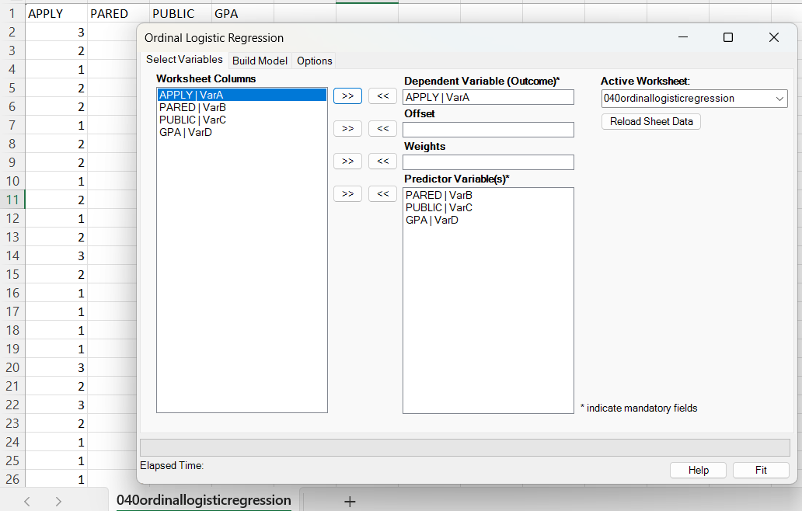
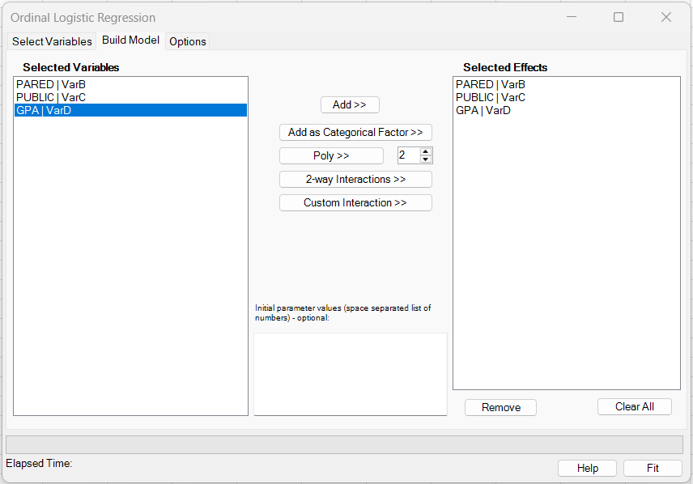
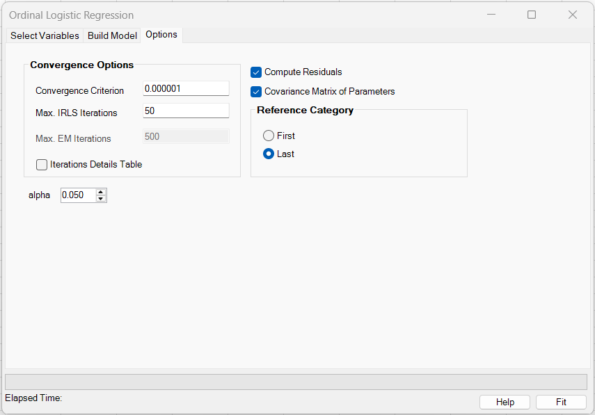
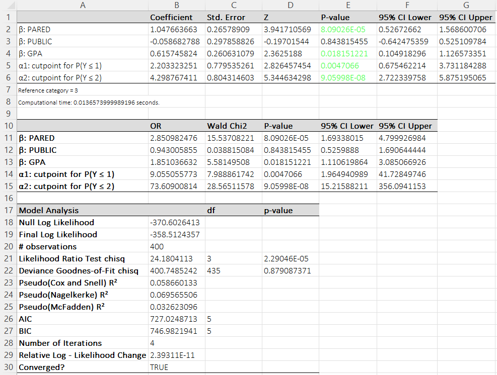
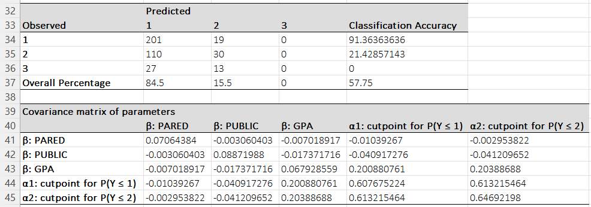

# Ordinal Logistic Regression

**Includes:** Ordinal logistic regression, Reference category selection (first/last), categorical factors, polynomial terms, continuous-variable interactions, optional starting values, optional **offset** and **case weights**, covariance matrix, residuals.  
**Purpose:** Model *ordered* categorical outcomes (e.g., `1 < 2 < 3`) using an ordinal logistic framework.

---

## Overview

Ordinal logistic regression (also called the **proportional-odds cumulative logit model**) is used when the outcome is **ordered categorical** (e.g., 1 < 2 < 3) and you want to relate that ordering to one or more predictors. BESHStatNG fits a cumulative logit model that estimates a set of **cutpoints** (thresholds between outcome levels) and a common set of **slope coefficients** for the predictors. The fitted coefficients are interpreted via **odds ratios**: for a one-unit increase in a predictor, the odds of being in category \(Y \le k\) (versus \(Y > k\)) change by a multiplicative factor \(\exp(\beta)\), assumed to be the same for all cutpoints \(k\) (the proportional-odds assumption). The add-in reports parameter estimates with standard errors, Wald \(Z\) tests, confidence intervals, odds ratios, model fit statistics (log-likelihood, likelihood-ratio test, information criteria, pseudo-\(R^2\)), optional residual diagnostics, and a classification table based on the highest predicted category probability.

## User interface

### Select variables



- **Dependent Variable (Outcome):** the ordered response.
- **Predictor Variable(s):** one or more covariates.
- **Offset (optional):** a known term added to the linear predictor.
- **Weights (optional):** case weights / frequencies.

### Build model



- **Add >>** adds the selected variable(s) as continuous main effects.
- **Add as Categorical Factor >>** marks the selected variable(s) as categorical main effects. Internally, BESHStatNG expands each selected factor into reference-coded indicator columns.
- **Poly >>** creates polynomial terms for the selected variable(s). The degree is taken from the numeric box next to the button.
- **2-way Interactions >>** creates all pairwise interactions among the currently selected variables.
- **Custom Interaction >>** creates one multi-way interaction term spanning all currently selected variables.
- **Initial parameter values** are optional. If supplied, they are used as the optimizer starting values. The required count equals the number of **expanded** predictor coefficients plus the number of threshold parameters.

Current limitations:

- Polynomial terms are supported only for **continuous** predictors.
- Interaction terms are currently supported only for **continuous × continuous** combinations.
- Interactions involving categorical predictors are **not implemented yet**.

!!! note
    In ordinal logistic regression, the fitted model includes **thresholds (cutpoints)** instead of an ordinary intercept term. The **Selected Effects** list contains only the authored predictor terms.

### Options



- **Convergence criterion:** tolerance used for both step size and log-likelihood change.
- **Max. IRLS iterations:** maximum Newton/IRLS iterations.
- **Compute residuals:** outputs fitted probabilities and residual diagnostics.
- **Covariance Matrix of Parameters:** outputs the estimated covariance matrix.
- **Alpha:** two-sided significance level used for Wald confidence intervals. Default: **0.05** (95% confidence interval).
- **Reference category:**
  - **Last** (default): uses the natural ascending order of outcome levels.
  - **First:** reverses the order (useful if you want the opposite cumulative direction).

---

## Example data

Download the example dataset used here: [040ordinallogisticregression.csv](../assets/data/040ordinallogisticregression/040ordinallogisticregression.csv)

The outcome `APPLY` has three ordered categories (1 < 2 < 3) and is modeled using predictors `PARED`, `PUBLIC`, and `GPA`.

---

## Model

Let the ordered outcome take values in ordered categories \(c_1 < c_2 < \dots < c_K\). The proportional-odds cumulative logit model is

$$
\operatorname{logit}\left(P(Y_i \le c_k)\right)
= \alpha_k - \eta_i,
\qquad k=1,\dots,K-1,
$$

with linear predictor

$$
\eta_i = \mathbf{x}_i^\top \beta + \text{offset}_i.
$$

Here \(\mathbf{x}_i\) is the row of predictors (no separate intercept column), \(\beta\) are slope coefficients, and \(\alpha_k\) are increasing cutpoints (thresholds).

Define the logistic CDF \(F(t)=1/(1+\exp(-t))\) and cumulative probabilities

$$
G_{ik} = P(Y_i \le c_k) = F(\alpha_k - \eta_i), \qquad k=1,\dots,K-1.
$$

Then the category probabilities are

$$
\begin{aligned}
P(Y_i=c_1) &= G_{i1},\\
P(Y_i=c_k) &= G_{ik}-G_{i,k-1},\qquad k=2,\dots,K-1,\\
P(Y_i=c_K) &= 1-G_{i,K-1}.
\end{aligned}
$$

### Reference category option

- **Last (default):** uses the ascending order \(c_1<\dots<c_K\) and reports cutpoints as \(\alpha_k\) for \(P(Y\le c_k)\).
- **First:** reverses the outcome order internally. This flips the cumulative direction; it is equivalent to fitting the model to the reversed ordered factor in R.

---

## Estimation and inference

### Log-likelihood

With optional case weights \(w_i\ge 0\), the (weighted) log-likelihood is

$$
\ell(\beta,\alpha)=\sum_{i=1}^n w_i \log P(Y_i=c_{y_i}).
$$

### Optimization algorithm used in BESHStatNG

BESHStatNG fits the model by **Newton-Raphson / IRLS** maximization of the log-likelihood:

1. Initialize slopes to zero and cutpoints from weighted cumulative proportions (logit of empirical cumulative probabilities).
2. Iterate up to `Max. IRLS iterations`:
   - Compute the gradient \(g\) and Hessian \(H\) of \(\ell\).
   - Form the observed information matrix \(I = -H + \lambda I_q\) (a small ridge term is added on the diagonal for numerical stability).
   - Take the Newton step \(\delta = I^{-1} g\).
   - **Backtracking line search:** update parameters by \(\theta_{new}=\theta + s\delta\), halving \(s\) until the log-likelihood increases.
   - If the cutpoints are not strictly increasing after a proposed step, the step is treated as invalid and the line search reduces the step size.
3. Stop when either

$$
\max_j |s\delta_j| < \varepsilon
\quad\text{or}\quad
|\ell_{new}-\ell_{old}| < \varepsilon,
$$

where \(\varepsilon\) is the **Convergence criterion**.

This approach is fast and stable for ordinal logit models, and the backtracking line search makes it more robust than a plain Newton step when probabilities become very small or cutpoints momentarily lose their ordering.

### Standard errors, tests, and confidence intervals

Let \(\widehat{\theta}=(\widehat{\beta},\widehat{\alpha})\) be the MLE and \(\widehat{\mathrm{Cov}}(\widehat{\theta})\approx I^{-1}\) the inverse observed information.

- **Standard error:** \(\mathrm{SE}(\widehat{\theta}_j)=\sqrt{\widehat{\mathrm{Cov}}_{jj}}\).
- **Wald Z:** \(Z_j=\widehat{\theta}_j/\mathrm{SE}(\widehat{\theta}_j)\).
- **Two-sided p-value:** \(p_j=2\big(1-\Phi(|Z_j|)\big)\), where \(\Phi\) is the standard normal CDF.
- **Wald confidence interval at level \(1-\alpha\) (parameter scale):**

$$
\widehat{\theta}_j \pm z_{1-\alpha/2}\,\mathrm{SE}(\widehat{\theta}_j).
$$

- **Odds ratio (slope terms):** for a predictor coefficient \(\beta_r\), the reported OR is \(\exp(\beta_r)\) with CI obtained by exponentiating the Wald CI endpoints.

> Note: BESHStatNG also prints \(\exp(\alpha_k)\) for cutpoints in the OR table. This is not a common interpretive target (cutpoints are typically interpreted on the logit scale), but it is a simple monotone transform.

---

## Output (Excel worksheet)

BESHStatNG writes results to a new worksheet.



The screenshots on this page use the default `alpha = 0.05`, so the example output shows 95% CI labels.

### 1) Coefficients table

For each slope coefficient \(\beta\) and each cutpoint \(\alpha\), the table reports:

- **Coefficient:** estimated parameter (slope $\beta$ or cutpoint $\alpha$).
- **Std. Error:** from the covariance matrix diagonal.
- **Z** and **p-value:** Wald normal test.
- **CI Lower/Upper:** Wald confidence interval at the selected level (estimate $\pm$ $z_{1-\alpha/2}\,\mathrm{SE}$).

Interpretation of slope coefficients:
Holding other variables constant, increasing predictor \(x_r\) by one unit multiplies the cumulative odds by \(\exp(\beta_r)\):

$$
\frac{P(Y\le c_k | x_r+1)/P(Y>c_k | x_r+1)}{P(Y\le c_k | x_r)/P(Y>c_k | x_r)} = \exp(\beta_r).
$$

**Text interpretation.** For a one-unit increase in predictor \(x_r\) (holding all other predictors constant), the log-odds of being in category \(Y \le k\) rather than \(Y > k\) change by \(\beta_r\) for every cutpoint \(k\). Equivalently, the **odds ratio** is \(\exp(\beta_r)\): if \(\exp(\beta_r)>1\), higher values of \(x_r\) increase the odds of being in a **lower** (or equal) outcome category versus a higher category; if \(\exp(\beta_r)<1\), higher values of \(x_r\) decrease those odds (shifting probability toward **higher** categories). Under the **proportional-odds assumption**, the same \(\beta_r\) (and therefore the same odds ratio) applies across all cutpoints \(k\); the cutpoints \(\alpha_k\) shift the baseline category probabilities but do not change the predictor effect.

Example (from this help page output):

- **PARED (β = 1.0477, OR = 2.8510, 95% CI for OR: 1.6934 to 4.7999, p = 8.09×10⁻⁵).**  
  Interpreting the proportional-odds model as reported by BESHStatNG: changing **PARED from 0 to 1** multiplies the odds of being in a **lower or equal** category \(Y \le k\) (vs. a higher category \(Y > k\)) by **2.85**, and this multiplier is the same for every cutpoint \(k\). In other words, \( \exp(1.0477) = 2.8510 \) indicates substantially higher cumulative odds of being in the lower outcome categories when PARED = 1 (holding PUBLIC and GPA fixed).

- **GPA (β = 0.6157, OR = 1.8510, 95% CI for OR: 1.1106 to 3.0851, p = 0.0182).**  
  A **1-point increase in GPA** multiplies the cumulative odds of \(Y \le k\) (vs. \(Y > k\)) by **1.85** for every cutpoint \(k\). This corresponds to about an **85% increase** in the cumulative odds of being in a lower (or equal) category, holding the other predictors constant.


### 2) OR / Wald Chi-square table

For each parameter, BESHStatNG also reports:

- **OR:** \(\exp(\widehat{\theta}_j)\)
- **Wald Chi2:** \(Z_j^2\) with 1 df
- **p-value:** \(1 - F_{\chi^2_1}(Z_j^2)\)
- **CI at selected level:** exponentiated Wald CI endpoints

### 3) Model analysis

The model summary includes:

- **Null Log Likelihood:** log-likelihood of the threshold-only model (slopes fixed at zero).
- **Final Log Likelihood:** log-likelihood of the fitted model.
- **Likelihood Ratio Test (chisq):**

$$
G^2 = 2(\ell_{full} - \ell_{null}) \sim \chi^2_{df}, \qquad df = p_{slopes}.
$$

- **Deviance Goodness-of-Fit (chisq):** a profile-deviance GOF computed by grouping identical covariate patterns (and offset, if used). For \(G\) unique patterns,

$$
D = 2(\ell_{sat} - \ell_{model}), \qquad df = G(K-1) - q,
$$

where \(q\) is the total number of fitted parameters (slopes + cutpoints). A large p-value suggests no evidence of lack of fit at the pattern level.

- **Pseudo R\(^2\):**

$$
R^2_{CS}=1-\exp\Big(\frac{2}{n_{obs}}(\ell_{null}-\ell_{full})\Big),
$$

$$
R^2_{N} = \frac{R^2_{CS}}{1-\exp\Big(\frac{2}{n_{obs}}\ell_{null}\Big)},
\qquad
R^2_{McF}=1-\frac{\ell_{full}}{\ell_{null}}.
$$

- **AIC / BIC:**

$$
\mathrm{AIC}=-2\ell_{full}+2q, \qquad \mathrm{BIC}=-2\ell_{full}+\log(n_{obs})\,q.
$$

Here \(n_{obs}\) is the number of rows when no weights are used, otherwise the sum of positive weights.

### 4) Classification table

BESHStatNG predicts the category with the largest fitted probability:

$$
\widehat{y}_i = \arg\max_k\;P(Y_i=c_k\mid \widehat{\theta}).
$$

It reports a confusion matrix (Observed x Predicted) and the overall classification accuracy.



### 5) Covariance matrix of parameters (optional)

If selected, the add-in prints \(\widehat{\mathrm{Cov}}(\widehat{\theta})\) in the same parameter order as the coefficients table.

### 6) Residuals output (optional)

If **Compute residuals** is checked, BESHStatNG outputs fitted probabilities and residual diagnostics (residuals produced from the example dataset: [040ordinallogisticregression_residuals.csv](../assets/data/040ordinallogisticregression/040ordinallogisticregression_residuals.csv)).

For each row \(i\) and category \(k\):

- Observed indicator (weighted): \(y_{ik}=w_i\) if observed category is \(k\), otherwise \(0\).
- Fitted probability: \(p_{ik}\).
- Fitted mean: \(\mu_{ik}=w_i p_{ik}\).
- Response residual: \(r_{ik}=y_{ik}-\mu_{ik}\).
- Pearson residual:

$$
R^{(P)}_{ik} = \frac{y_{ik}-\mu_{ik}}{\sqrt{ w_i p_{ik}(1-p_{ik})}}.
$$

Deviance contribution per observation (ignoring categories with \(y_{ik}=0\)):

$$
D_i = 2\sum_k y_{ik}\log\left(\frac{y_{ik}}{\mu_{ik}}\right).
$$

The reported deviance residual is \(\sqrt{\max(0,D_i)}\). For single-row (unweighted) data, this reduces to \(D_i=-2\log(p_{i,\mathrm{obs}})\).

**Leverage and standardized residuals.** Leverage (IRLS hat-value). BESHStatNG reports leverage values based on the diagonal of the final IRLS working hat matrix (a GLM-standard analogue of OLS leverage). Standardized residuals use this leverage adjustment to flag potentially influential observations

$$
h_i = \mathrm{tr}(I_i\,\widehat{\mathrm{Cov}}),
$$

where \(I_i\) is the per-observation observed-information contribution and \(\widehat{\mathrm{Cov}}\approx I^{-1}\). When \(0\le h_i<1\), standardized residuals are

$$
R^{(std)} = \frac{R}{\sqrt{1-h_i}}.
$$

When \(h_i\ge 1\) the standardized residuals are returned as missing.

---
## Reproducing results in R

BESHStatNG implements the standard proportional-odds cumulative logit model

$$
\operatorname{logit}(P(Y\le c_k)) = \alpha_k - \eta
$$

which matches the parameterization used by `MASS::polr(..., method = "logistic")` (up to outcome level ordering).

### R code (MASS::polr)

```r
library(MASS)

# Read example data (from MkDocs assets)
df <- read.csv("040ordinallogisticregression.csv")

# Ensure the outcome is an ordered factor in the same order as BESHStatNG (Reference = Last)
df$APPLY <- ordered(df$APPLY, levels = c(1, 2, 3))

fit <- polr(APPLY ~ PARED + PUBLIC + GPA, data = df, method = "logistic", Hess = TRUE)

# Coefficients (slopes) and cutpoints
est <- c(coef(fit), fit$zeta)
V <- vcov(fit)
se <- sqrt(diag(V))

z <- est / se
p <- 2 * (1 - pnorm(abs(z)))

alpha <- 0.05
zcrit <- qnorm(1 - alpha/2)
ci_l <- est - zcrit * se
ci_u <- est + zcrit * se

out_coef <- data.frame(
  term = names(est),
  estimate = est,
  se = se,
  z = z,
  p_value = p,
  ci_lower = ci_l,
  ci_upper = ci_u
)

# Odds ratios (slopes are the meaningful ones)
out_or <- transform(out_coef, OR = exp(estimate), OR_lower = exp(ci_lower), OR_upper = exp(ci_upper), wald_chi2 = z^2)

# Fitted probs and classification table
pr <- predict(fit, type = "probs")
pred <- colnames(pr)[max.col(pr, ties.method = "first")]
obs <- as.character(df$APPLY)
conf <- table(Observed = obs, Predicted = pred)
acc <- mean(obs == pred)

list(coef_table = out_coef, or_table = out_or, confusion = conf, accuracy = acc)
```

### Matching the "Reference category = First" option

If you select **First** in BESHStatNG, it reverses the outcome order internally. In R, fit the same model to the reversed ordered factor:

```r
df$APPLY_rev <- ordered(df$APPLY, levels = c(3, 2, 1))
fit_rev <- polr(APPLY_rev ~ PARED + PUBLIC + GPA, data = df, method = "logistic", Hess = TRUE)
```

### Expected differences vs BESHStatNG

- `polr` does not use the same ridge stabilization and line search, so very small numerical differences can occur in the last digits.
- R often reports *profile likelihood* confidence intervals via `confint(fit)`; BESHStatNG reports *Wald* intervals (estimate $\pm$ $z_{1-\alpha/2}\,\mathrm{SE}$).
- The profile-deviance GOF and leverage/standardized residual definitions in BESHStatNG are not a default output of `polr`; you can compute similar diagnostics, but the exact implementation details may differ.

---

## See also
- [Multinomial Logistic Regression](multinomial-logistic-regression.md)
- [Home](../index.md)
