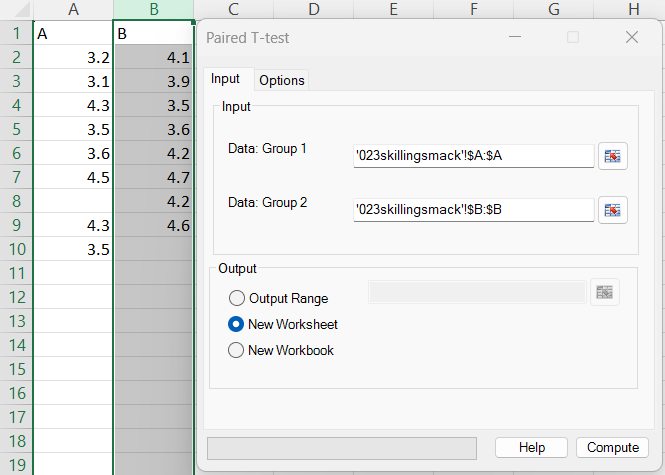
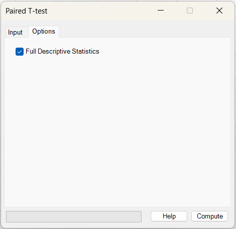
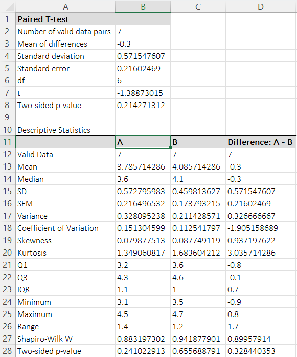

# Paired T tests

**Includes:** Paired (matched-pairs) t-test.  
**Purpose:** Compare two paired measurements on the same subjects by testing the mean of differences.

## Overview
The paired t-test compares two measurements taken on the **same subjects** (or otherwise matched pairs).
Instead of treating the columns as independent groups, the add-in computes the **within-pair differences**
and performs a one-sample t-test on those differences.

Typical use cases:

- Before/after measurements (pre vs. post)
- Two instruments measured on the same sample
- Matched subjects (e.g., case matched to control)

## Example dataset
The screenshots use the first two columns (**A** and **B**) from:

[`023skillingsmack.csv`](../assets/data/023skillingsmack/023skillingsmack.csv)

Only the first two columns are used for the paired t-test example.

## Screenshots

### Input


### Options


### Output


## When to use it
Use the paired t-test when:

- Each value in **Group 1** corresponds to one value in **Group 2** (paired rows).
- You want to test whether the average change/difference is 0.

Main assumptions:

- Pairs are independent of each other.
- The **differences** are approximately normally distributed (especially important for small *n*).
  The add-in reports a Shapiro–Wilk normality test for the differences when *Full Descriptive Statistics* is selected.

If the differences are clearly non-normal (or contain strong outliers), consider a nonparametric alternative such as the
Wilcoxon signed-rank test (if available in your add-in).

## Inputs in Excel
- **Data: Group 1:** first measurement (e.g., baseline).
- **Data: Group 2:** second measurement (e.g., follow-up).

**Important:** pairing is by **row order**. Row *i* in Group 1 is paired with row *i* in Group 2.

### Missing values
Rows with missing / non-numeric values in either group are excluded from the analysis (only complete pairs are used).
The output reports the **Number of valid data pairs**.

## Steps in the add-in
1. Open **Paired T-test**.
2. Select the range for **Data: Group 1** and **Data: Group 2**.
3. (Optional) Check **Full Descriptive Statistics**.
4. Choose an output location (new worksheet / workbook / range).
5. Click **Compute**.

## What it does (math and implementation details)

### Paired differences
For each valid pair, the add-in computes the difference:

\[
d_i = x_i - y_i
\]

where:

- \(x_i\) is the Group 1 value (row \(i\))
- \(y_i\) is the Group 2 value (row \(i\))
- \(d_i\) is the paired difference (reported as **Difference: A − B** in the output)

Let \(n\) be the number of valid pairs.

### Test statistic
The sample mean and sample standard deviation of the differences are:

\[
\bar d = \frac{1}{n}\sum_{i=1}^{n} d_i
\qquad
s_d = \sqrt{\frac{1}{n-1}\sum_{i=1}^{n}(d_i-\bar d)^2}
\]

The standard error of the mean difference is:

\[
SE = \frac{s_d}{\sqrt{n}}
\]

The paired t-statistic is:

\[
t = \frac{\bar d}{SE}
\]

with degrees of freedom:

\[
df = n - 1
\]

### P-value and confidence interval
The two-sided p-value tests \(H_0: \mu_d = 0\):

\[
p = 2\,P\left(T_{df} \ge |t|\right)
\]

A \(100(1-\alpha)\%\) confidence interval for the mean difference is:

\[
\bar d \pm t_{1-\alpha/2,\,df}\,SE
\]

## Options (what each checkbox does)

### Full Descriptive Statistics
When enabled, the add-in outputs descriptive statistics for:

- Group 1 (A)
- Group 2 (B)
- Differences (A − B)

This includes common summaries (mean, median, SD, SEM, quartiles, etc.) and a **Shapiro–Wilk** normality test.

## Output (what BESHStatNG writes)

### Paired t-test table
- **Number of valid data pairs** (\(n\))
- **Mean of differences** (\(\bar d\))
- **Standard deviation** (\(s_d\))
- **Standard error** (\(SE\))
- **df** (\(n-1\))
- **t**
- **Two-sided p-value**

### Descriptive statistics table (optional)
A side-by-side table for A, B, and A − B. The most important normality check for the paired t-test is the
**Shapiro–Wilk p-value for the differences**.

## How to interpret (quick guide)
- **Mean of differences (A − B):** the estimated average change from Group 2 to Group 1 (sign depends on column order).
- **t and p-value:** evidence against \(H_0: \mu_d = 0\). Small p-values suggest a non-zero mean difference.
- **Confidence interval:** a range of plausible values for the true mean difference at the selected level.  
  With the default \(\alpha=0.05\), this is a 95% confidence interval. If the interval excludes 0, the result is statistically significant at the corresponding two-sided level.

## Relationship to R (how to reproduce)
Below is an R snippet that reproduces the paired t-test and the key descriptive checks using the same example dataset.

```r
# Example: paired t-test using the first two columns of 023skillingsmack.csv
dat <- read.csv("023skillingsmack.csv")

x <- dat[[1]]  # Group 1 (column A)
y <- dat[[2]]  # Group 2 (column B)

# Keep complete pairs only (matches add-in behavior)
ok <- is.finite(x) & is.finite(y)
x <- x[ok]; y <- y[ok]

d <- x - y

# Paired t-test (equivalent to one-sample t-test on differences)
t.test(x, y, paired = TRUE)          # gives t, df, p-value, CI for mean(x-y)

# Descriptives + normality check on differences
mean(d); sd(d); sd(d)/sqrt(length(d))
shapiro.test(d)
```

## Notes and limitations
- The paired t-test assumes the **differences** are approximately normal; this is more important for small \(n\).
- The test is sensitive to strong outliers in the differences.
- Pairing is by row order—make sure Group 1 and Group 2 ranges align correctly.

## See also
- [Unpaired (two sample) T tests](unpaired-two-sample-t-tests.md)
- [Descriptive statistics](../methods/descriptive-statistics.md)
- [Normality Tests](normality-tests.md)
- [Home](../index.md)

