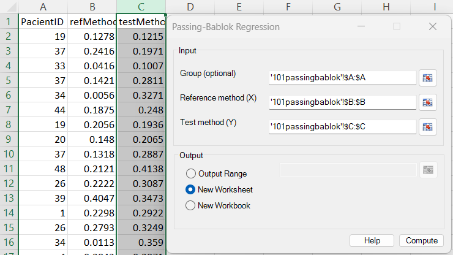
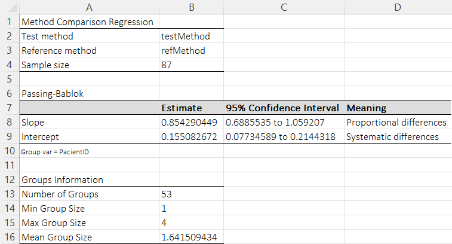
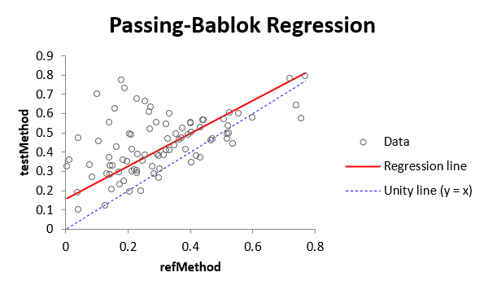
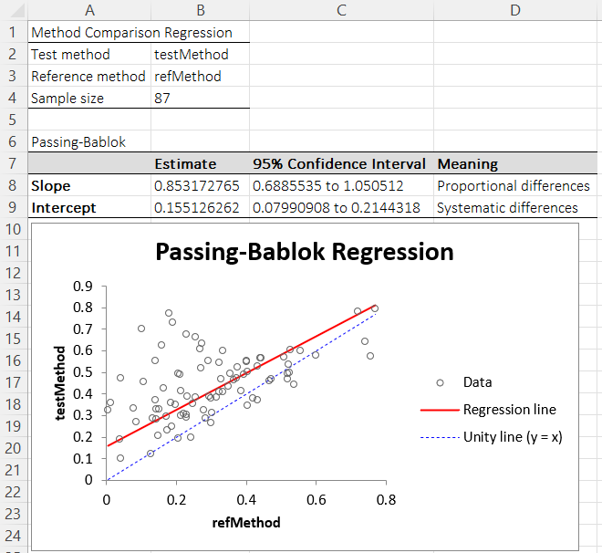

# Passing–Bablok Regression

**Includes:** Passing–Bablok nonparametric linear regression for method comparison, slope/intercept estimates, confidence intervals, and robust handling of outliers.  
**Purpose:** Use when comparing two measurement methods without assuming normal errors or homoscedasticity.

---

## Overview

Passing–Bablok regression is a **non-parametric method comparison regression** used to assess agreement between two quantitative measurement methods.  
It is widely applied in **clinical chemistry, laboratory medicine, and method validation studies**, especially when:

- Both methods are subject to measurement error  
- Errors are not assumed to be normally distributed  
- Robustness against outliers is required  

The regression assumes a **structural linear relationship**

\[
y = \alpha + \beta x
\]

where:

- \(x\) is the reference method  
- \(y\) is the test method  
- \(\alpha\) represents **systematic (constant) bias**  
- \(\beta\) represents **proportional bias**  

Passing–Bablok regression is closely related to the **Theil–Sen estimator**, but includes a correction that makes the two methods **interchangeable**, a key requirement in method comparison studies.

## Example dataset

Download the example dataset used here: [101passingbablok.csv](../assets/data/101passingbablok/101passingbablok.csv)

- Reference method: **refMethod**  
- Test method: **testMethod**  
- Group variable: **PatientID**  

Grouped analysis excludes within-patient slopes and yields valid confidence intervals in the presence of repeated measurements.

## Screenshots

### Input screen



### Results





### Results

Result with no grouped variable - Classical Passing–Bablok regression (independent observations)



## When to Use Passing–Bablok Regression

Passing–Bablok regression is appropriate when:

- Both \(x\) and \(y\) contain random measurement error  
- No reliable estimate of the error variance ratio is available  
- Robust inference is preferred over parametric efficiency  
- The relationship between methods is expected to be linear  

It is recommended by CLSI (EP09) guidelines for laboratory method comparison.

### Relation to Deming Regression

| Aspect | Passing–Bablok | Deming |
|------|---------------|--------|
| Error distribution | Arbitrary | Normal |
| Error variance ratio | Not required | Required |
| Robust to outliers | Yes | No |
| Non-parametric | Yes | No |
| Handles repeated measures | Yes (grouped PB) | No |

---

## Inputs in Excel

- **Group (optional)** – optional grupping variable (e.g., PatientID).
- **Reference method (X)** – reference method variable \(x\) (e.g., refMethod).
- **Test method (Y)** – test method variable \(y\) (e.g., testMethod).

Output destination:

- Output range (current sheet)
- New worksheet
- New workbook

## Steps in the add-in

1. Ribbon: **BESH Stat NG → Analyse → Agreement → Passing-Bablok Regression**
2. In **Input**:
   - Select **Group (optional)** (optional grouping variable), **Reference method (X)** (reference method \(x\)), and **Test method (Y)** (test method \(y\)) ranges.
   - Choose output destination.
3. Click **Compute**.

---

## Classical Passing–Bablok Regression (Independent Observations)

### Model Assumptions

Let \((x_i, y_i)\), \(i = 1, \dots, n\), be paired measurements.

Assumptions:

- **Structural relationship**

   $$
   \tilde{y}_i = \alpha + \beta \tilde{x}_i
   $$

- **Measurement error in both variables**

   $$
   x_i = \tilde{x}_i + \varepsilon_i, \qquad
   y_i = \tilde{y}_i + \eta_i
   $$

- Errors \(\varepsilon_i\) and \(\eta_i\):

   - Are independent  
   - Have zero mean  
   - Follow continuous distributions  
   - Satisfy \(\beta \varepsilon_i\) and \(\eta_i\) having the same distribution  

This symmetry condition ensures that slopes are centered around \(\beta\).

### Estimation of the Slope

For all \(i < j\), compute pairwise slopes:

$$
S_{ij} = \frac{y_i - y_j}{x_i - x_j}
$$

Slopes are then handled as follows:

- **Identical points** \((x_i=x_j \ \text{and}\ y_i=y_j)\) are discarded.
- If **\(x_i=x_j\)** but **\(y_i \neq y_j\)**, the slope is treated as **\(+\infty\)** when \(y_i>y_j\) and **\(-\infty\)** otherwise.
- Slopes **exactly equal to \(-1\)** are discarded (Passing–Bablok convention).

To ensure **method interchangeability**, an offset is applied:

$$
K = \#\{S_{ij} : S_{ij} < -1\}
$$

\# denotes the number of elements in a set. The slope estimate \(\hat{\beta}\) is the **shifted median** of the ordered slopes.

### Estimation of the Intercept

\[
\hat{\alpha} = \text{median}\{y_i - \hat{\beta} x_i\}
\]

## Passing–Bablok Regression with Grouped (Repeated) Measurements

### Motivation

In many laboratory studies, **repeated measurements per subject or sample** are available.  
Naively applying classical Passing–Bablok regression in this setting is problematic because:

- Slopes computed **within the same group** have expected value 0  
- These slopes are **uninformative** about the true method relationship  
- Including them biases the slope estimate and inflates variance  

To address this, a **Block–Passing–Bablok regression** is implemented, following Baumdicker & Hölker (2020).

### Data Structure

Let:

- \(k = 1, \dots, m\) index groups (e.g. patients)  
- \(i = 1, \dots, p_k\) index repeated measurements within group \(k\)  

Observed data:

\[
x_{i,k} = \tilde{x}_k + \varepsilon_{i,k}, \quad
y_{i,k} = \tilde{y}_k + \eta_{i,k}
\]

with

\[
\tilde{y}_k = \alpha + \beta \tilde{x}_k
\]

---

### Estimation Procedure (Grouped Passing–Bablok)

- **Compute slopes only between different groups**

   For any two different groups \(k \neq l\), compute slopes between all pairs of observations \((i,k)\) and \((j,l)\):

$$
S^{kl}_{ij} = \frac{y_{i,k} - y_{j,l}}{x_{i,k} - x_{j,l}}, \qquad k \neq l
$$

- **Discard invalid / uninformative slopes**

   - Slopes from the same group (within-group repeated measurements are excluded)
   - Slopes with identical measurements (e.g., \(x_{i,k} = x_{j,l}\))
   - Slopes equal to \(-1\) (excluded by the original Passing–Bablok convention)

- **Apply Passing–Bablok offset**

$$
K = \#\left\{ S^{kl}_{ij} \; : \; S^{kl}_{ij} < -1 \right\}
$$

- **Estimate slope**

Sort all retained slopes into an ordered sequence:

$$
S_{(1)} \le S_{(2)} \le \dots \le S_{(N)}
$$

The grouped Passing–Bablok slope estimate \(\hat{\beta}\) is the **shifted median**:

If \(N\) is odd:

$$
\hat{\beta} = S_{\left(\frac{N+1}{2}+K\right)}
$$

If \(N\) is even:

$$
\hat{\beta} = \frac{1}{2}\left(
S_{\left(\frac{N}{2}+K\right)} + S_{\left(\frac{N}{2}+K+1\right)}
\right)
$$

- **Estimate intercept**

Using the slope estimate \(\hat{\beta}\), compute:

$$
\hat{\alpha} = \text{median}\left\{ y_{i,k} - \hat{\beta}\, x_{i,k} \right\}
$$

This approach preserves robustness while correctly handling **within-group dependence** by excluding slopes between repeated measurements of the same underlying sample/subject.

## Confidence Intervals

### Slope (\(\beta\))

Confidence intervals are based on **rank statistics** and the asymptotic normality of the statistic

$$
\tilde{C} = \#(S > \beta) - \#(S < \beta)
$$

Let \(w\) be the standard normal quantile \(w = \Phi^{-1}(1-\alpha/2)\). The add-in computes:

$$
\tilde{C}_\gamma = w \cdot \sigma
$$

and uses order statistics of the sorted slopes to form the CI.

#### Classical (no group variable)

For independent observations (classical Passing–Bablok), the standard asymptotic variance is:

$$
\sigma^2 = \frac{n(n-1)(2n+5)}{18}
$$

where \(n\) is the number of observations.

#### Grouped (with group variable)

For grouped/repeated measurements, the add-in applies the **group-size variance correction** for non-overlapping groups (Baumdicker & Hölker, 2020, Eq. (7)):

$$
\sigma^2
= \frac{1}{18}\left(
n(n-1)(2n+5) \;-\; \sum_{k=1}^{m} p_k(p_k-1)(2p_k+5)
\right)
$$

where:

- \(m\) is the number of groups
- \(p_k\) is the size of group \(k\)
- \(n=\sum_k p_k\)

This correction is **exact** when groups are non-overlapping on the \(x\)-axis and **conservative** when groups overlap (it does not estimate overlap terms).

#### CI index calculation used by the add-in

Let \(N\) be the number of retained slopes (after exclusions) and let slopes be sorted:

$$
S_{(1)} \le S_{(2)} \le \dots \le S_{(N)}
$$

The add-in computes:

$$
M_1 = \operatorname{round}\left(\frac{N - \tilde{C}_\gamma}{2}\right), \qquad
M_2 = N - M_1 + 1
$$

(using “banker’s rounding”), and applies the Passing–Bablok offset:

$$
K = \#\{S : S < -1\}
$$

The confidence interval for the slope is:

$$
[\beta_L, \beta_U] =
\left[
S_{(M_1+K)},\;
S_{(M_2+K)}
\right]
$$

### Intercept (\(\alpha\))

Let \([\beta_L,\beta_U]\) be the slope CI. The intercept limits are computed as:

$$
\alpha_L = \text{median}\{y - \beta_U x\}, \qquad
\alpha_U = \text{median}\{y - \beta_L x\}
$$

---

## Interpretation of Results

| Quantity | Interpretation |
|--------|----------------|
| \(\hat{\alpha} \neq 0\) | Constant (systematic) difference |
| \(\hat{\beta} \neq 1\) | Proportional difference |
| \(0 \in CI(\alpha)\) and \(1 \in CI(\beta)\) | Methods are statistically equivalent |

## R Code for Reference

```r
library(mcr)

data <- read.csv("101passingbablok.csv")

fit_classic <- mcreg(
  x = data$refMethod,
  y = data$testMethod,
  method.reg = "PaBa",
  method.ci = "analytical"
)

summary(fit_classic)
```

---

## Notes and limitations

- **Note:** The `mcr` package does not implement grouped (Block) Passing–Bablok regression. Differences in confidence intervals are expected due to ignored dependence.
- Some software includes slopes exactly equal to −1 (because it computes all pairwise slopes as \((y_j-y_i)/(x_j-x_i)\) without filtering), e.g. the R package **MethComp** (`PBreg`) keeps all computed slopes and does not explicitly remove those equal to −1; this add-in follows the original Passing–Bablok convention of excluding slopes equal to −1, which can lead to small differences versus such implementations when data are rounded/quantized and the value −1 occurs more frequently.

---

## References

- Passing, H., & Bablok, W. (1983). A new biometrical procedure for testing the equality of measurements from two different analytical methods.  
- Passing, H., & Bablok, W. (1984). Comparison of regression procedures for method comparison studies.  
- Sen, P. K. (1968). Estimates of the regression coefficient based on Kendall’s tau.  
- Theil, H. (1950). A rank-invariant method of linear regression.  
- NCCLS (2002). Method Comparison and Bias Estimation Using Patient Samples (EP09-A2).  
- Baumdicker, F., & Hölker, U. (2020). Passing–Bablok regression for grouped data with errors in both variables. Statistics & Probability Letters, 164, 108801.

## See also
- [Deming Regression](deming-regression.md)
- [Theil-Sen Simple Regression](theil-sen-simple-regression.md)
- [Home](../index.md)
