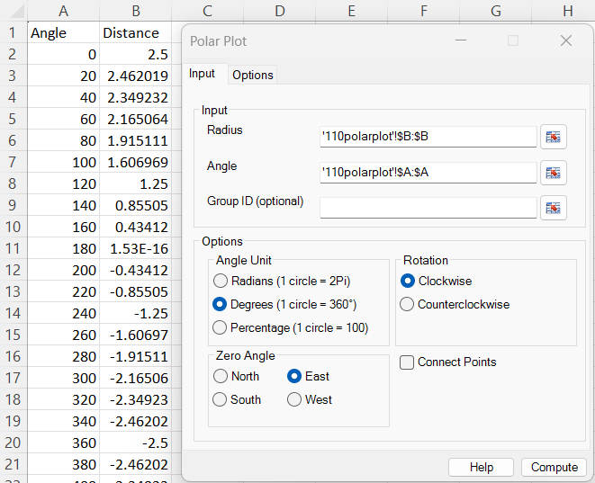
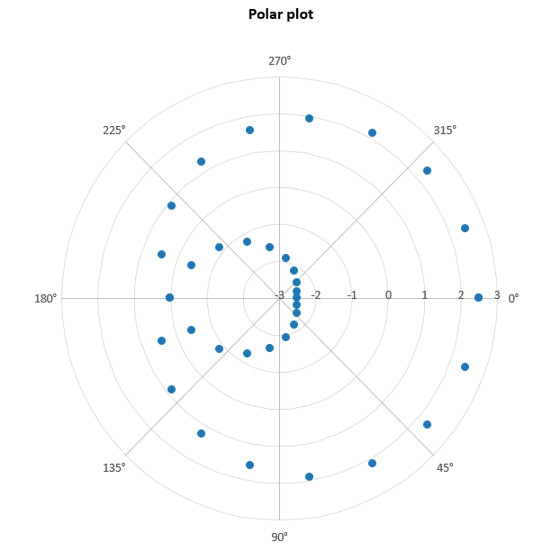
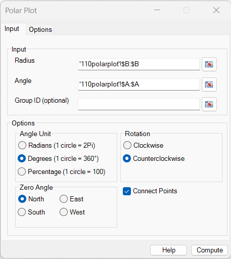
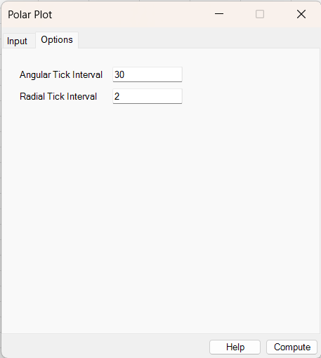
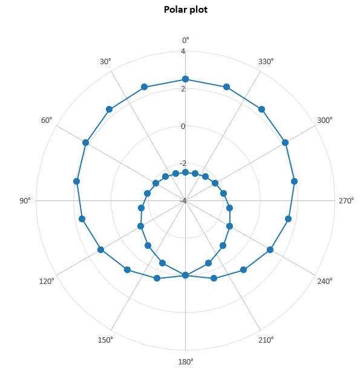

# Polar Plot

**Includes:** Paired radius–angle plots, degrees/radians/percentage angles, clockwise or counterclockwise rotation, four zero-angle positions, optional connecting lines, optional text or numeric grouping, automatic radial scaling, and configurable radial and angular tick intervals.  
**Purpose:** Display observations whose position is defined by a magnitude (radius) and a direction, phase, or position within a cycle (angle).

---

## Overview

A **polar plot** represents every observation by two coordinates:

- **Radius** determines the observation's distance from the centre.
- **Angle** determines its direction around the circle.

BESHStatNG converts the polar coordinates to Cartesian coordinates and creates an embedded Excel **XY scatter chart**. Circular gridlines, angular spokes, labels, markers, optional connecting lines, and optional grouped series are generated automatically. No worksheet helper columns are required.

The radius and angle values on each worksheet row belong to the same observation. An optional third variable, **Group ID**, divides the observations into separate series with different colours and marker shapes.

---

## When to use it

Use a polar plot when angle or phase is an essential part of the measurement, for example:

- direction and magnitude of a vector;
- measurements collected around a circular object;
- amplitude over phase or rotational position;
- seasonal, daily, or other cyclic measurements expressed as a position within one cycle;
- directional trajectories where observation order is meaningful;
- comparisons of directional profiles between groups.

A polar plot is primarily a visualization. It does not estimate circular means, test directional uniformity, or aggregate observations into angular bins.

---

## Example dataset (reproduce both outputs)

Download the sample CSV used in the screenshots:

- [110polarplot.csv](../assets/data/110polarplot/110polarplot.csv)

The file contains 37 paired observations:

| Column | Contents | Use in the dialog |
|---|---|---|
| **Angle** | Angles from 0° to 720° in 20° steps | **Angle** |
| **Distance** | Radius values from -2.5 to 2.5 | **Radius** |

The example values follow, to rounding,

$$
r=2.5\cos\left(\frac{\theta}{2}\right),
$$

where \(\theta\) is the **Angle** column in degrees. The dataset deliberately contains negative radii and angles extending over two complete turns, making it useful for demonstrating radial shifting, angle normalization, direction, zero position, and line connection.

After opening the CSV in Excel, select **Distance** (column B) as Radius and **Angle** (column A) as Angle. The **Group ID** field remains blank in both examples.

!!! important "Radius and angle are not selected in CSV column order"
    The sample file stores Angle first and Distance second. In the dialog, select `B:B` for **Radius** and `A:A` for **Angle**.

---

## Example 1: marker-only plot with automatic ticks

### Dialog settings

Use the following settings:

| Setting | Value |
|---|---|
| Radius | **Distance** (`B:B`) |
| Angle | **Angle** (`A:A`) |
| Group ID | Blank |
| Angle Unit | **Degrees** |
| Rotation | **Clockwise** |
| Zero Angle | **East** |
| Connect Points | Cleared |
| Angular Tick Interval | Blank (automatic) |
| Radial Tick Interval | Blank (automatic) |

With blank interval boxes, the backend resolves an angular interval of 45° and a radial interval of 1. The data range of -2.5 to 2.5 is expanded to readable radial limits of -3 to 3.

### Output

The angle labels start at 0° on the right-hand side and increase clockwise. Each valid row is displayed as a marker, but no trajectory is implied because **Connect Points** is cleared. Angles greater than 360° are normalized to the same directional cycle, so observations from the second turn can share an angular direction with observations from the first turn while retaining their own radius.

---

## Example 2: connected plot with custom tick intervals

### Input and basic options

### Tick interval options

Use the same data with these settings:

| Setting | Value |
|---|---|
| Radius | **Distance** (`B:B`) |
| Angle | **Angle** (`A:A`) |
| Group ID | Blank |
| Angle Unit | **Degrees** |
| Rotation | **Counterclockwise** |
| Zero Angle | **North** |
| Connect Points | Selected |
| Angular Tick Interval | `30` |
| Radial Tick Interval | `2` |

The 30° angular interval creates 12 spokes and labels. With automatic radial limits and a requested interval of 2, the observed range of -2.5 to 2.5 is expanded outwards to interval-aligned limits of -4 to 4.

### Output

The angle labels start at 0° at the top and increase counterclockwise. Consecutive observations are connected in worksheet order. The source data explicitly end at 720° with the same radius as the first 0° observation, so the final marker coincides with the first marker; BESHStatNG itself does not close curves automatically.

The shape differs from Example 1 even though the data are unchanged because the orientation, connection state, and both tick intervals are different.

---

## Required data layout

Select two continuous, single-column ranges from the **same worksheet**, plus an optional third aligned range:

| Input | Meaning | Required |
|---|---|---:|
| **Radius** | Distance or magnitude for each observation | Yes |
| **Angle** | Direction or phase paired with the radius on the same row | Yes |
| **Group ID** | Text or numeric series identifier | No |

All selected ranges must:

- start on the same worksheet row;
- contain the same number of rows;
- contain only one continuous column each;
- keep radius, angle, and group values aligned by row.

Radius and angle must contain numeric data, apart from an optional heading and missing cells. Group IDs may be text or numeric. You may include column headings in the selected ranges.

Example with grouping:

| Radius | Angle | Group ID |
|---:|---:|---|
| 2.0 | 0 | Control |
| 3.5 | 45 | Control |
| 2.7 | 0 | Treatment |
| 4.1 | 45 | Treatment |

!!! important "Keep the rows aligned"
    Do not sort or clean the columns independently. Every selected worksheet row is interpreted as one radius–angle observation and, when supplied, one group membership.

---

## Dialog: inputs and options

### Input tab

#### Inputs

- **Radius** — select the numeric radius column.
- **Angle** — select the paired numeric angle column.
- **Group ID (optional)** — select a row-aligned text or numeric grouping column to create one series per group.

The chart is inserted on the input worksheet, normally two columns to the right of the right-most selected input range.

#### Angle Unit

Choose how the angle values are expressed:

| Option | One complete turn | Quarter turn | Example quarter turn |
|---|---:|---:|---:|
| **Radians** | \(2\pi\) | \(\pi/2\) | `1.570796...` |
| **Degrees** | 360° | 90° | `90` |
| **Percentage** | 100 | 25 | `25` |

Percentage is a percentage of one angular cycle. For example, `25` means one quarter of a turn and `75` means three quarters of a turn. It does **not** rescale the radius or convert the radius to a percentage.

#### Rotation

- **Clockwise** — positive angles increase clockwise, as in compass bearings and clock-like displays.
- **Counterclockwise** — positive angles increase counterclockwise, following the conventional mathematical direction.

#### Zero Angle

Choose where an input angle of zero is drawn:

- **North** — top of the plot;
- **East** — right-hand side of the plot;
- **South** — bottom of the plot;
- **West** — left-hand side of the plot.

Rotation and zero position work together. The following examples use degrees:

| Zero angle | Rotation | 0° is drawn at | +90° is drawn at |
|---|---|---|---|
| East | Counterclockwise | East | North |
| East | Clockwise | East | South |
| North | Counterclockwise | North | West |
| North | Clockwise | North | East |

#### Connect Points

- **Selected** — consecutive valid observations are joined in worksheet order.
- **Cleared** — observations are displayed as markers only.

The final observation is not connected automatically to the first. Repeat the first radius–angle pair as the final row when a closed curve is required.

!!! tip
    Connect points only when worksheet order has substantive meaning, such as time, measurement sequence, or a deliberately ordered angular profile. Connecting unordered observations can imply a trajectory that is not present in the data.

### Options tab

#### Angular Tick Interval

Controls the interval between angular spokes and labels. The value is interpreted in the selected **Angle Unit**:

- `30` means 30° when Degrees is selected;
- `0.5` means 0.5 radians when Radians is selected;
- `10` means 10% of a turn when Percentage is selected.

Leave the box blank for the automatic interval of 45°, \(\pi/4\), or 12.5% of a turn. A supplied interval must be finite, greater than zero, and no larger than one complete turn.

#### Radial Tick Interval

Controls the difference between adjacent radial grid circles and labels. Leave the box blank to select a readable automatic interval using a 1–2–5 scaling rule. A supplied interval must be finite and greater than zero.

When radial limits are automatic, BESHStatNG expands them outwards to multiples of the requested interval. Consequently, changing only the radial interval can also change the inner and outer displayed limits, as illustrated by the two examples.

### Initial dialog selections

The current Windows dialog opens with **Degrees**, **Clockwise**, **East**, and **Connect Points** selected. Both tick interval boxes are blank, requesting automatic intervals.

---

## Grouped polar plots

When **Group ID** is supplied:

- each distinct nonmissing text or numeric ID becomes a separate Excel data series;
- groups appear in the legend in the order of their first plotted observation;
- the default renderer varies both colour and marker shape;
- the ten-colour and eight-marker palettes repeat when there are more groups than available styles;
- markers and connecting lines use the same style within a group.

With **Connect Points** selected, observations are connected independently within each group and in their original worksheet order. Rows belonging to another group are skipped without breaking the current group's line. A missing radius or angle breaks the affected group's line; a completely blank worksheet row breaks every grouped line.

Rows with a valid radius and angle but a missing Group ID are omitted from a grouped plot.

!!! note
    Grouping separates and styles observations; it does not calculate group means, bin angles, or otherwise aggregate the data.

---

## Steps in the add-in

1. In the Excel ribbon, select **BESH Stat NG → Analyse → Graphics → Polar Plot**.
2. Select the **Radius** range.
3. Select the row-aligned **Angle** range.
4. Optionally select a row-aligned **Group ID** range.
5. Choose the **Angle Unit**, **Rotation**, and **Zero Angle**.
6. Select or clear **Connect Points**.
7. On the **Options** tab, enter optional angular and radial tick intervals, or leave either box blank for automatic spacing.
8. Click **Compute**.

---

## Output

BESHStatNG creates a square embedded Excel chart on the input worksheet. Depending on the selected options, it contains:

- a marker for every plotted radius–angle pair;
- one differently styled series and legend entry per group;
- straight lines joining consecutive observations within each series;
- circular radial gridlines at the resolved radial ticks;
- angular spokes at the resolved angular interval;
- angular labels in the selected unit;
- radial tick labels;
- equal hidden Cartesian X and Y scales so the radial gridlines remain circular.

The default chart title is **Polar plot**. The chart is a standard Excel chart and can be moved, resized, formatted, copied, or exported after creation. See [Export Chart](../export-chart.md) for high-resolution image export.

!!! note "Preserve a square plot area"
    BESHStatNG creates a square chart and uses equal X and Y limits. If the chart is resized manually, preserve its aspect ratio; otherwise circular gridlines may appear elliptical.

---

## What it does: calculations and scaling

### 1. Convert the input angle to radians

Let \(\theta\) denote the angle after unit conversion.

For radians:

$$
\theta=\text{angle}
$$

For degrees:

$$
\theta=\text{angle}\frac{\pi}{180}
$$

For percentage of a complete turn:

$$
\theta=\text{angle}\frac{2\pi}{100}
$$

Angles are normalized to one complete turn. Negative angles and values greater than one turn are allowed. For example, -90°, 270°, and 630° have the same normalized direction.

### 2. Apply rotation and zero-angle position

The Cartesian drawing angle is

$$
\phi=\theta_0+s\theta,
$$

where:

| Setting | Value |
|---|---:|
| Counterclockwise | \(s=+1\) |
| Clockwise | \(s=-1\) |
| East | \(\theta_0=0\) |
| North | \(\theta_0=\pi/2\) |
| West | \(\theta_0=\pi\) |
| South | \(\theta_0=-\pi/2\) |

The result is normalized to \([0,2\pi)\).

### 3. Resolve the radial scale

With both limits automatic, the raw range always includes zero:

$$
r_{\mathrm{raw,min}}=\min\left(0,\min_i r_i\right),
\qquad
r_{\mathrm{raw,max}}=\max\left(0,\max_i r_i\right).
$$

If the radial interval is blank, BESHStatNG targets approximately five intervals, rounds the step to a readable 1, 2, 5, or 10 multiple of a power of ten, and expands both limits outwards to step-aligned values.

If the user supplies radial interval \(h\) while both limits remain automatic, the resolved limits are

$$
r_{\min}=h\left\lfloor\frac{r_{\mathrm{raw,min}}}{h}\right\rfloor,
\qquad
r_{\max}=h\left\lceil\frac{r_{\mathrm{raw,max}}}{h}\right\rceil.
$$

The numerical backend also supports explicit `RadialMinimum` and `RadialMaximum` settings. These limits are not currently exposed in the Windows dialog. When supplied programmatically, values outside the resolved limits are retained in the result metadata but are not rendered.

### 4. Shift the radial origin and convert to Cartesian coordinates

The resolved lower radial limit maps to the centre. For observation \(i\), the nonnegative plotted distance is

$$
R_i=r_i-r_{\min}.
$$

The Cartesian coordinates are then

$$
x_i=R_i\cos(\phi_i),
\qquad
y_i=R_i\sin(\phi_i).
$$

The ordinary Cartesian axes are hidden. BESHStatNG applies the same symmetric limits to X and Y and reserves extra space for the angular labels.

---

## Negative radius values

BESHStatNG supports negative values through a **shifted radial scale**. The resolved radial minimum is mapped to the centre, and radial values increase outwards.

For example, if the resolved scale is from -4 to 4:

- radius -4 is at the centre;
- radius 0 is halfway to the outer circle;
- radius 4 is at the outer circle.

This preserves the ordering of the radius variable. It differs from the alternative mathematical convention in which a negative radius is reflected through the centre and its angle is shifted by \(\pi\).

!!! warning
    If your subject area uses the reflected-negative-radius convention, transform those values before plotting. BESHStatNG uses the shifted radial-axis convention described above.

---

## Missing, invalid, and repeated values

- A missing or non-numeric radius or angle makes that observation missing.
- Missing observations are not drawn.
- With **Connect Points** selected, missing observations create line gaps; lines do not bridge the relevant missing row.
- Fully blank rows are preserved logically as line breaks even though the common importer removes them from its cleaned matrix.
- A missing Group ID omits an otherwise valid observation from a grouped plot.
- At least one complete numeric radius–angle pair, and for grouped plots at least one usable Group ID, is required.
- Infinite radius, angle, group, or interval values are rejected.
- Duplicate angles are allowed.
- Observations are never sorted by angle.
- Angles outside one turn are wrapped but remain in their original worksheet order for connecting lines.

---

## How to interpret the plot

Interpret each marker using both components:

- its **direction** indicates the angular value after applying the selected zero and rotation;
- its **distance from the centre**, read against the radial labels, indicates the original radius value on the shifted radial scale;
- its **colour, marker, and legend label** indicate group membership when grouping is used.

Patterns to look for include:

- concentration of observations in one angular sector;
- changes in magnitude around a cycle;
- repeated lobes or periodic structure;
- differences in directional profiles between groups;
- abrupt changes between consecutive observations;
- isolated directions or magnitudes that may merit checking.

Do not interpret a straight line between two connected markers as a fitted curve. It joins observations only to show source order.

---

## Polar plot versus related charts

| Chart | What the axes represent | Typical purpose |
|---|---|---|
| **Polar plot** | Paired numeric radius and angle | Plot exact directional, phase, or cyclic observations |
| **Radar chart** | Separate variables on categorical spokes | Compare multivariate profiles across cases or groups |
| **Rose plot / circular histogram** | Counts or frequencies within angular bins | Summarize an angular distribution |
| **Wind rose** | Directional bins, often subdivided by speed or magnitude class | Summarize wind or other directional frequency data |

Use Polar Plot when every row already supplies an angle and a radius. The tool does not bin angles or create category-specific radial axes.

---

## Implementation details and limitations

- Numerical geometry is computed independently of Excel chart creation.
- Circular gridlines use 72 straight segments (73 points including the repeated endpoint), equivalent to one point every 5°.
- Grid circles, spokes, labels, and data are passed directly to Excel series; no worksheet helper cells are written.
- Group order follows first plotted appearance, and style palettes repeat when necessary.
- Connected sections separated by missing observations are rendered as separate Excel series.
- Excel supports at most 255 chart series. Very dense grid settings, many groups, or highly fragmented connected data can exceed this limit. Increase a tick interval, clear **Connect Points**, or reduce missing-value gaps if this occurs.
- Radial minimum and maximum are automatic in the current dialog; manual limits are available only through the backend options.
- The dialog does not currently expose custom colours, marker shapes, line styles, partial-circle limits, logarithmic radial scales, or angle sorting.
- Lines are straight in Cartesian chart space between adjacent polar observations.
- The tool creates a chart through the ribbon; it is not a worksheet UDF.
- Overlapping observations with identical or very similar radius–angle coordinates can be difficult to distinguish.

---

## Common mistakes

- Reversing the Radius and Angle selections; in the sample CSV, Radius is column B and Angle is column A.
- Selecting degrees when the worksheet contains radians, or vice versa.
- Treating `1` as a complete turn in Percentage mode; one complete turn is `100`.
- Selecting ranges that start on different rows or contain different numbers of rows.
- Supplying a Group ID range that is not aligned with radius and angle.
- Entering an angular tick interval in degrees while Radians or Percentage is selected.
- Entering zero or a negative tick interval.
- Connecting observations whose worksheet order is arbitrary.
- Assuming angles greater than one turn create additional angular axes rather than wrapping.
- Assuming negative radii are reflected through the centre.
- Stretching the chart after creation so circular gridlines become elliptical.

---

## See also

- [XYZ 3D Scatterplot](xyz-3d-scatterplot.md)
- [Scatter Plot Matrix](scatter-plot-matrix.md)
- [Export Chart](../export-chart.md)
- [Home](../index.md)
