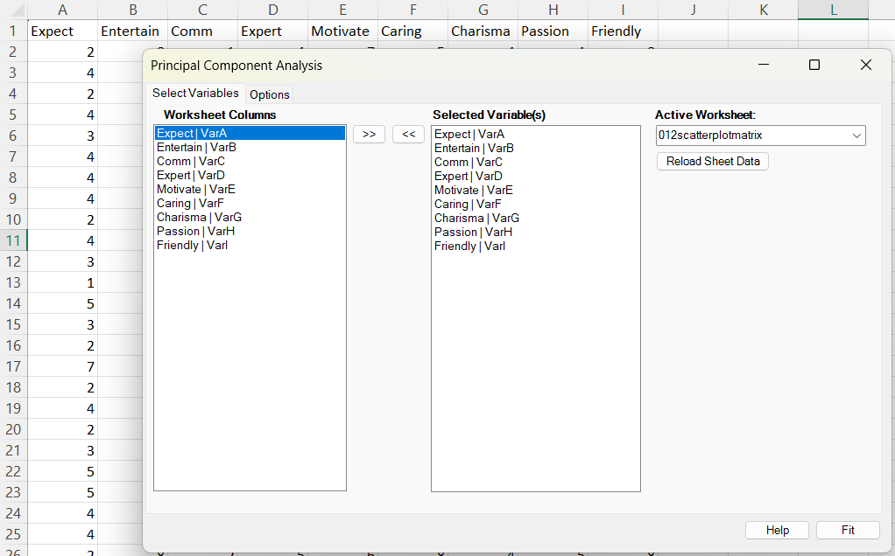
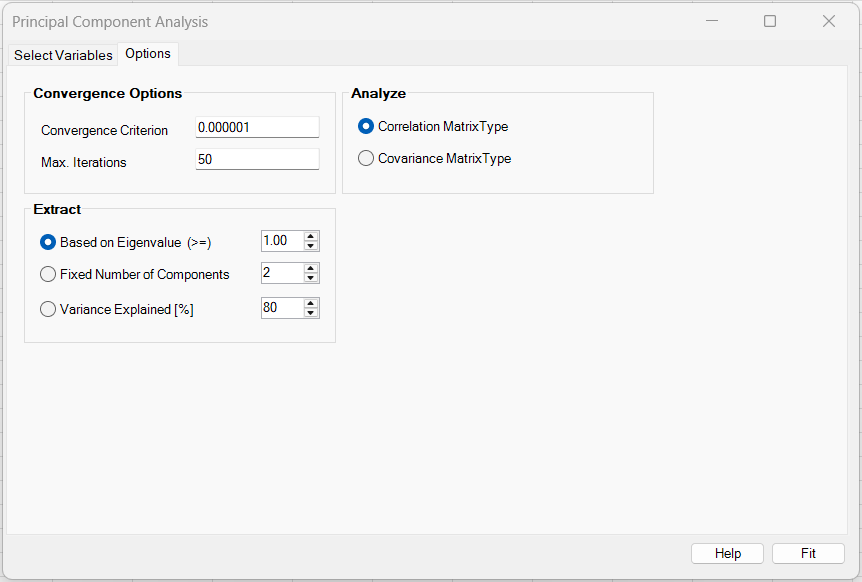
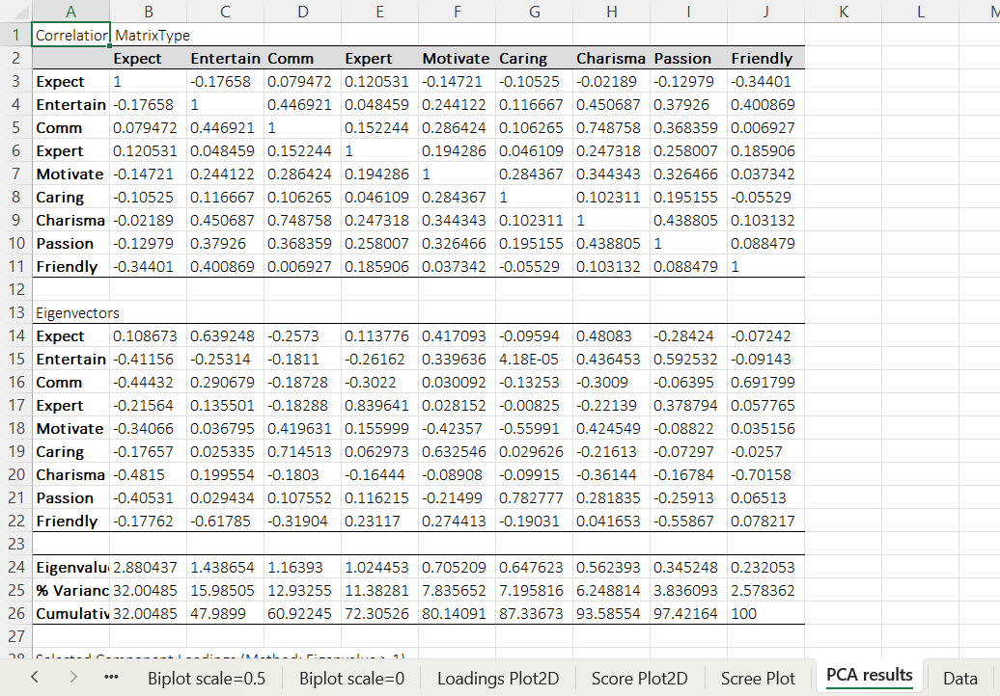
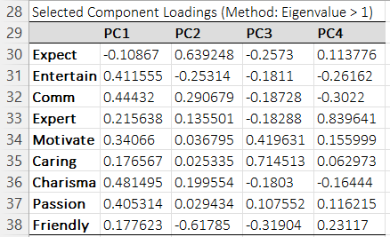
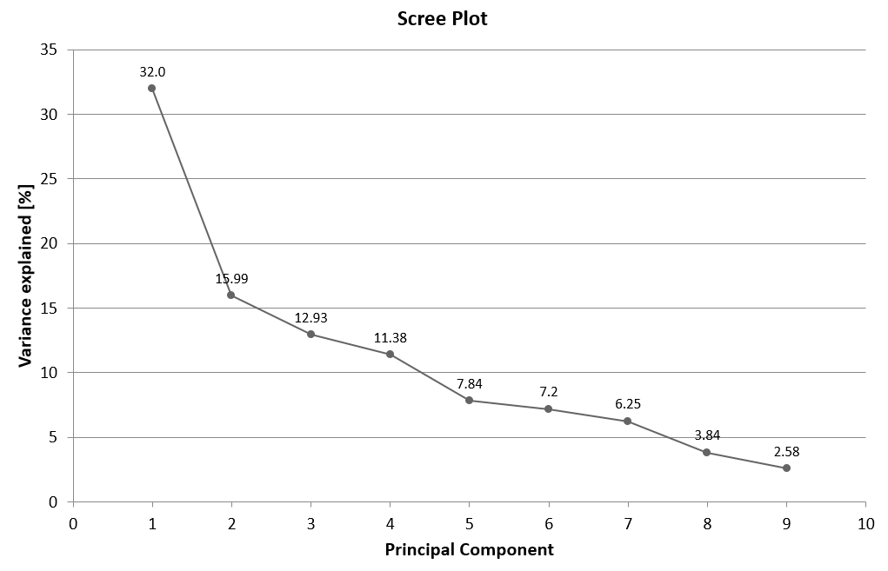
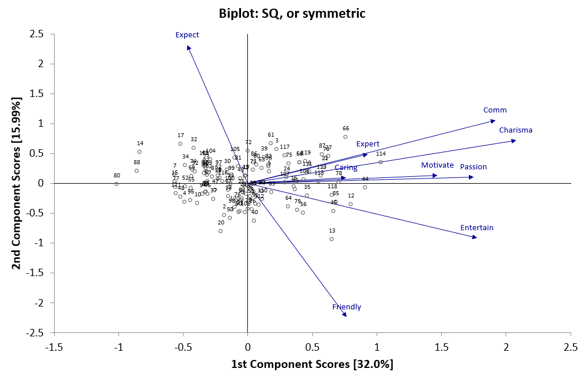
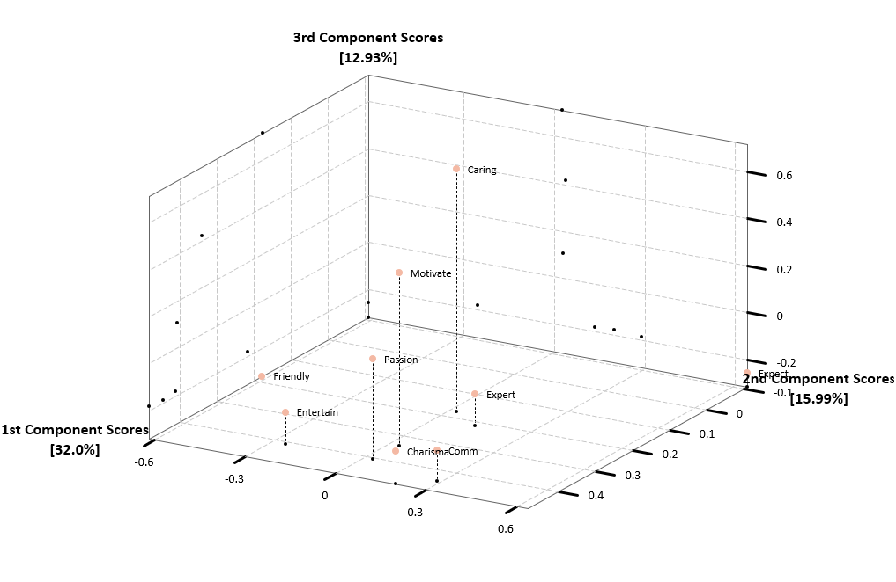

# Principal Component Analysis

**Includes:** PCA on correlation or covariance matrix, Component extraction: eigenvalue, fixed k, variance threshold, Outputs: scores, loadings, reduced dataset, Plots: scree, score/loading plots, biplots (2D/3D).  
**Purpose:** Reduce dimensionality of multivariate numeric data and visualize dominant patterns.

---

## Overview

Principal Component Analysis (PCA) transforms your original variables into a new set of variables called **principal components**:

- **PC1** explains the largest possible share of the total variance,
- **PC2** explains the largest remaining share, subject to being orthogonal to PC1,
- etc.

In BESHStatNG, PCA can be performed on either:

- the **covariance matrix** (keeps original units), or
- the **correlation matrix** (standardizes variables first; recommended when variables have different scales).

BESHStatNG writes:

- a **Data** sheet (original data, standardized data, and reduced dataset = scores),
- a **PCA results** sheet (matrix used, eigenvectors/eigenvalues, explained variance, loadings),
- and creates multiple **chart sheets** (scree, score plots, loading plots, biplots, 3D plots).

---

## Example dataset (used also in Scatter Plot Matrix)

Download the dataset:

- [012scatterplotmatrix.csv](../assets/data/012scatterplotmatrix/012scatterplotmatrix.csv)

In the screenshots you shared earlier for Scatter Plot Matrix, only the first five variables were selected.
You can use the same five variables for PCA to reproduce a compact output:

- Expect
- Entertain
- Comm
- Expert
- Motivate

## Screenshots (BESHStatNG)

Place these images in:


### Select Variables tab


### Options tab


### PCA results sheet (matrix, eigenvectors, eigenvalues, % variance)


### Selected Component Loadings table


### Scree plot


### Biplot (symmetric scaling)


### 3D plot (loadings or scores depending on output)


---

---

## When to use it

Use PCA when you want to:

- reduce dimensionality before regression / clustering / visualization,
- detect strong collinearity and summarize it into a few components,
- visualize observations in 2D/3D component space (score plots),
- understand variable structure (loading plots / biplots).

Requirements:

- variables must be numeric,
- you need enough rows to estimate correlations/covariances sensibly.

---

## Inputs in Excel

### Selecting variables
The PCA dialog uses the same multivariate selection UI as Scatter Plot Matrix:

- **Worksheet Columns** lists available columns.
- Move desired variables to **Selected Variable(s)** with `>>`.
- Use **Active Worksheet** and **Reload Sheet Data** if you switch sheets.

> Tip: Put variable names in row 1. BESHStatNG uses row 1 as labels.

---

## Options (as implemented in BESHStatNG)

### 1) Matrix type
- **Correlation Matrix** (default)  
  Runs PCA on standardized variables (recommended if variables have different units or scales).
- **Covariance Matrix**  
  Runs PCA on centered-but-not-standardized variables.

### 2) How many components to extract
BESHStatNG supports three extraction rules:

- **Based on Eigenvalue (>= cutoff)**  
  Extract all components with eigenvalue \( \lambda_j \ge \text{cutoff} \).  
  (For correlation PCA, cutoff = 1 is the common “Kaiser rule”.)

- **Fixed number of components**  
  Extract exactly \(k\) components.

- **Variance explained [%]**  
  Extract the smallest \(k\) such that cumulative explained variance \(\ge\) the requested percentage.

### 3) Eigen-solver settings
- **Max iterations** and **Eps** are passed to the internal eigen solver (`EIGEN_JK`) which uses iterative orthogonalization (Jacobi/Kogbetliantz-style).
- Smaller `Eps` is stricter (may require more iterations).

---

## What it does (math and implementation details)

Let \(X\) be your data matrix with:

- \(n\) rows (observations),
- \(p\) columns (variables).

Write the value in row \(i\), column \(j\) as \(x_{ij}\).

### A) Centering and (optional) standardization

Compute column means:

$$
\bar{x}_j = \frac{1}{n}\sum_{i=1}^{n} x_{ij}
$$

Centered data:

$$
x^{(c)}_{ij} = x_{ij} - \bar{x}_j
$$

For **Correlation PCA**, BESHStatNG standardizes each column using the **sample** standard deviation (divisor \(n-1\)):

$$
s_j = \sqrt{\frac{1}{n-1}\sum_{i=1}^{n}\left(x_{ij}-\bar{x}_j\right)^2},
\qquad
z_{ij} = \frac{x_{ij}-\bar{x}_j}{s_j}.
$$

Notes:

- The implementation always computes both centered \(X^{(c)}\) and standardized \(Z\),
  but uses one or the other depending on matrix type.

---

### B) Covariance / correlation matrix used for PCA

BESHStatNG uses the sample divisor \(n-1\).

For **Covariance PCA**, the analyzed matrix is:

$$
S = \frac{(X^{(c)})^{\mathsf{T}} X^{(c)}}{n-1}
$$

For **Correlation PCA**, the analyzed matrix is:

$$
S = \frac{Z^{\mathsf{T}} Z}{n-1}
$$

which is numerically the same as the correlation matrix when columns are standardized.

---

### C) Eigen-decomposition and ordering

PCA is computed by eigen-decomposition of \(S\):

$$
S v_j = \lambda_j v_j
$$

where:

- \(v_j\) is the eigenvector (direction),
- \(\lambda_j\) is the eigenvalue (variance explained by component \(j\)).

Eigenvalues are sorted in **descending** order:

$$
\lambda_1 \ge \lambda_2 \ge \dots \ge \lambda_p \ge 0
$$

and eigenvectors are reordered consistently.

Let \(V\) be the \(p\times p\) matrix of eigenvectors as columns:

$$
V = [\, v_1 \;\; v_2 \;\; \dots \;\; v_p \,]
$$

---

### D) Explained variance (what Scree Plot uses)

Total variance is the sum of eigenvalues:

$$
\Lambda_{\mathrm{tot}} = \sum_{j=1}^{p}\lambda_j
$$

Percent variance explained by component \(j\):

$$
\mathrm{PVE}_j = 100\,\frac{\lambda_j}{\Lambda_{\mathrm{tot}}}
$$

Cumulative percent explained through component \(k\):

$$
\mathrm{CPVE}_k = \sum_{j=1}^{k}\mathrm{PVE}_j
$$

**Implementation note:** the “Scree Plot” chart in BESHStatNG plots \(\mathrm{PVE}_j\) vs component index \(j\).

---

### E) Choosing the number of components \(k\)

Let the extracted component count be \(k\), clamped to \(1 \le k \le p\).

1) **Eigenvalue rule**

$$
k = \left|\{\, j \;:\; \lambda_j \ge \text{cutoff} \,\}\right|
$$

2) **Fixed**
\(k\) = user-specified integer.

3) **Cumulative variance threshold**

$$
k = \min\{\, j \;:\; \mathrm{CPVE}_j \ge \text{target percent} \,\}
$$

---

### F) Loadings used by BESHStatNG (with sign convention)

BESHStatNG defines the extracted loading matrix \(L\) as the first \(k\) eigenvectors:

$$
L = \left[ v_1 \;\; v_2 \;\; \cdots \;\; v_k \right].
$$

**Sign convention (important):** each eigenvector may be multiplied by \(-1\) without changing PCA.
BESHStatNG flips a component column if the entry with the largest absolute magnitude would otherwise be negative.
This makes tables and plots more stable across runs.

---

### G) Scores (reduced dataset)

Scores are computed by projecting each observation onto the loading directions.

For **Covariance PCA**:

$$
T = X^{(c)} L
$$

For **Correlation PCA**:

$$
T = Z L
$$

Here \(T\) is \(n \times k\). Each column of \(T\) is a principal component score vector.

---

## Steps in the add-in

1. In Excel ribbon: **BESH Stat NG → Analyse → Multivariate Analysis → Principal Component Analysis**
2. Select variables in **Selected Variable(s)** (e.g., 5 variables from the example CSV).
3. Choose:
   - **Correlation** (recommended) or **Covariance**,
   - extraction rule (Eigenvalue / Fixed / Variance explained),
   - eigen solver settings (Max iter, Eps).
4. Click **Calculate**

---

## Output (everything BESHStatNG writes)

When you run PCA, BESHStatNG creates a **new workbook** and produces:

### 1) Sheet: `Data`

This sheet contains three blocks written side-by-side:

#### A) Original data

- First column: `Row ID`
- Then your selected variables as columns
- Then the numeric values actually used after import/cleaning

#### B) Standardized data

Next to the original data, BESHStatNG writes standardized columns labeled:
- `Standardized_<VarName>`

These are \(z_{ij}\) values:

$$
z_{ij} = \frac{x_{ij}-\bar{x}_j}{s_j}
$$

#### C) Reduced dataset (scores)

Next to standardized data, BESHStatNG writes the extracted component scores \(T\).
Headers are created from `PCnames("Reduced_Data_PC")` and then prefixed by `Standardized_`, so you will see columns like:

- `Standardized_Reduced_Data_PC1`
- `Standardized_Reduced_Data_PC2`
- ...

Mathematically, the score matrix is:
- \(T = ZL\) for correlation PCA
- \(T = X^{(c)}L\) for covariance PCA

---

### 2) Sheet: `PCA results`

The screenshot below shows the typical structure of this sheet in BESHStatNG:


#### A) Correlation Matrix / Variance-Covariance Matrix

Title depends on the selected matrix type.

For **Covariance PCA**:

$$
S = \frac{(X^{(c)})^{\mathsf{T}} X^{(c)}}{n-1}
$$

For **Correlation PCA**:

$$
S = \frac{Z^{\mathsf{T}} Z}{n-1}
$$


#### B) Eigenvectors

A \(p \times p\) table of eigenvectors \(V\) (each column is \(v_j\)).

#### C) Eigenvalues + explained variance table

Rows:

- `Eigenvalues` (\(\lambda_j\))
- `% Variance Explained` (\(\mathrm{PVE}_j\))
- `Cumulative % Explained` (\(\mathrm{CPVE}_j\))

with:

$$
\mathrm{PVE}_j = 100\cdot\frac{\lambda_j}{\sum_{r=1}^{p}\lambda_r},
\qquad
\mathrm{CPVE}_k = \sum_{j=1}^{k}\mathrm{PVE}_j.
$$

#### D) Selected Component Loadings

A \(p \times k\) table of extracted loadings \(L\) with column headers `PC1 ... PCk`.

Example (method: Eigenvalue ≥ 1):


---

### 3) Charts (Excel chart sheets)

BESHStatNG creates the following charts:

#### A) Scree Plot

Shows percent variance explained vs component index.

Plotted values:
- \(x\): \(1,2,\dots,p\)
- \(y\): \(\mathrm{PVE}_j\)

Example:


#### B) Score Plot 2D (PC1 vs PC2)

Scatter plot of observation scores:

- x-axis: PC1 scores
- y-axis: PC2 scores

Each point is labeled with its **Row ID**.

Example (symmetric scaling):


#### C) Loading Plot 2D (PC1 vs PC2)
Vectors from origin to each variable’s loading coordinates:

- x-axis: loading on PC1
- y-axis: loading on PC2

This shows which variables drive PC1/PC2 directions.

#### D) Biplots (PC1 vs PC2) for three scalings
BESHStatNG creates **three** biplots:

- `Biplot scale=0.0`  (labeled “GH, or column-metric preserving”)
- `Biplot scale=0.5`  (labeled “SQ, or symmetric”)
- `Biplot scale=1.0`  (labeled “JK, or row-metric preserving”)

Implementation (as coded):

Let \(t_{ij}\) be the unscaled score of observation \(i\) on component \(j\) (from \(T\)),
and let \(l_{rj}\) be the loading of variable \(r\) on component \(j\) (from \(L\)).

Define:

$$
\alpha_j = \left(\sqrt{\lambda_j}\sqrt{n}\right)^{\,1-c},
\qquad c \in [0,1].
$$

Then BESHStatNG scales:

Scores:

$$
t^{(c)}_{ij} = \frac{t_{ij}}{\alpha_j}.
$$

Loadings:

$$
l^{(c)}_{rj} = l_{rj}\,\alpha_j.
$$

In the chart:

- points = \( (t^{(c)}_{i1}, t^{(c)}_{i2}) \) labeled by Row ID
- arrows = vectors from \((0,0)\) to \( (l^{(c)}_{r1}, l^{(c)}_{r2}) \) labeled by variable name

> Interpretation tip: different \(c\) values change the relative scaling of scores vs loadings. Use \(c=0.5\) as a balanced default view.

#### E) Score Plot 3D (PC1, PC2, PC3)
If at least 3 components are extracted, a 3D plot of observation scores is created and labeled by Row ID.

#### F) Loading Plot 3D (PC1, PC2, PC3)
If at least 3 components are extracted, a 3D plot of variable loadings is created and labeled by variable name.

Example:


---

## How to interpret (mini-example)

Using the example dataset, **Correlation PCA** is typically the best first choice because all variables are on similar ordinal scales but may still differ in spread. Start with the **Scree Plot** to see how many components carry meaningful variance (look for an “elbow” or use your chosen extraction rule). Then use the **Loadings Plot** to understand which variables contribute most strongly to PC1/PC2 (large absolute loadings define the direction of each component). Finally, use the **Score Plot** and **Biplot** to see whether observations cluster or separate in the reduced space and which variables are aligned with those patterns.

---

## Compared to R (how to reproduce)

BESHStatNG PCA on the **Correlation Matrix** corresponds closely to the standard R workflow where variables are centered and scaled before PCA.

### R equivalent (Correlation Matrix PCA)

In R you would typically use `prcomp()` with `scale.=TRUE`:

```r
dat <- read.csv("012scatterplotmatrix.csv")
X <- dat[, c("Expect","Entertain","Comm","Expert","Motivate","Caring","Charisma","Passion","Friendly")]
fit <- prcomp(X, center = TRUE, scale. = TRUE)

# Scores (BESHStatNG “Reduced dataset” / “scores”)
scores <- fit$x

# Loadings (BESHStatNG “Selected Component Loadings”)
loadings <- fit$rotation

# Eigenvalues
eigenvalues <- fit$sdev^2

# % variance explained
pve <- 100 * eigenvalues / sum(eigenvalues)
```

## Notes and limitations

- **Missing/non-numeric values:** removed during import; PCA is performed on the resulting numeric matrix.
- **Sign flips:** eigenvector signs are arbitrary; BESHStatNG applies a deterministic sign convention so outputs look stable.
- **Near-tied eigenvalues:** if eigenvalues are very close, eigenvectors can rotate within that subspace (a normal PCA property).
- **Correlation vs covariance:** choose correlation when variables have different scales or you care about standardized structure.

---

## See also
- [Scatter Plot Matrix](scatter-plot-matrix.md)
- [Descriptive Statistics](descriptive-statistics.md)
- [Multiple Correspondence Analysis](multiple-correspondence-analysis.md)
- [Home](../index.md)
