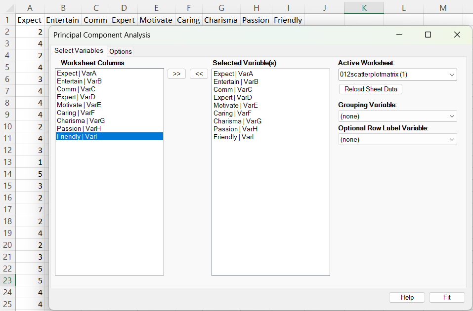
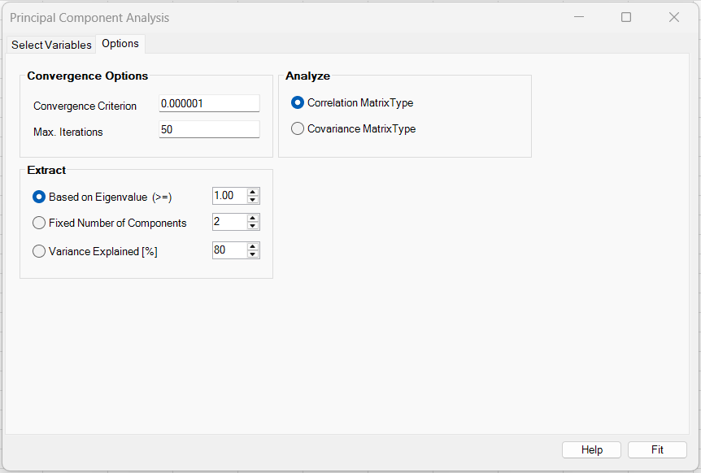
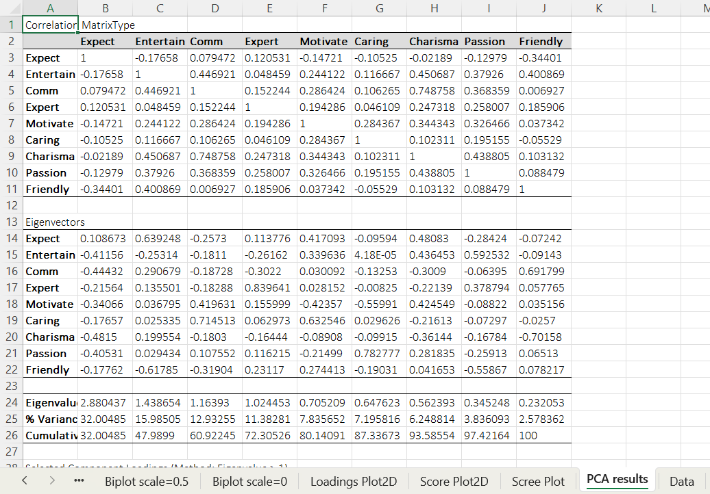
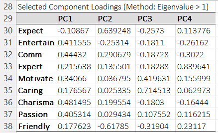
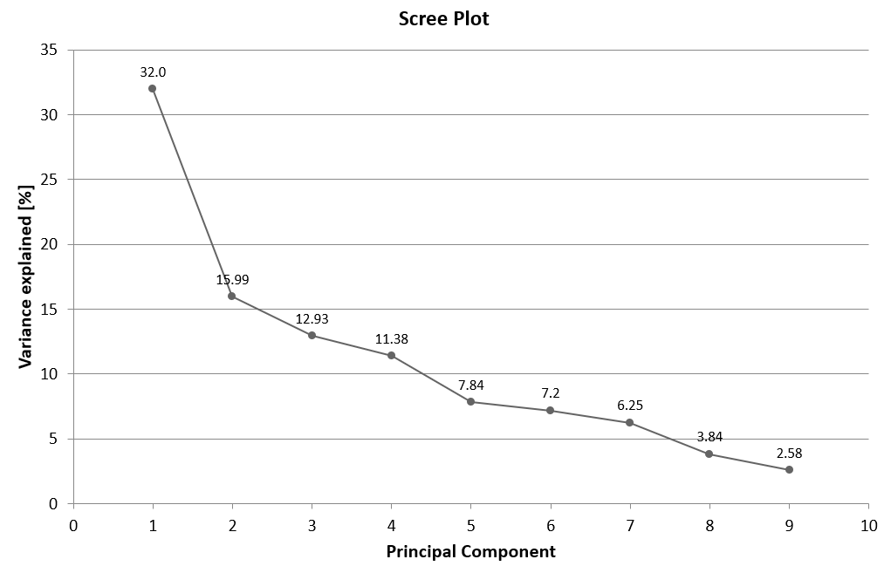
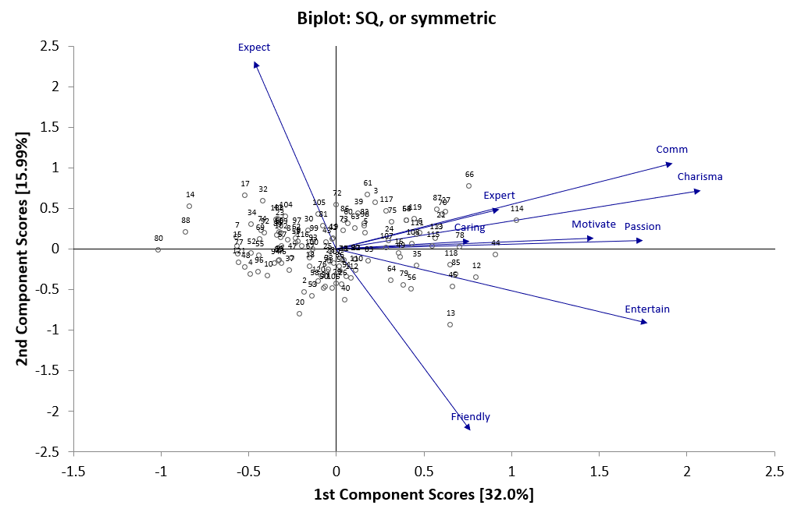
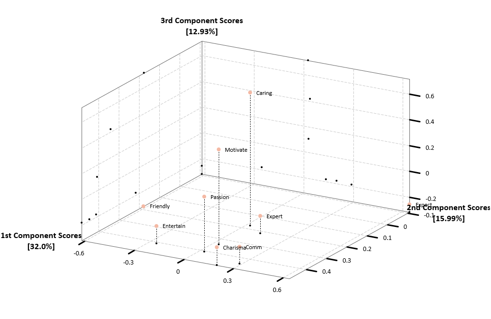

# Principal Component Analysis

**Includes:** PCA on a correlation or covariance matrix; component extraction by eigenvalue, fixed number of components, or variance threshold; scores, loadings, standardized data and reduced dataset; optional observation labels and grouping for score plots/biplots; scree, score/loading, biplot, and 3D plots.  
**Purpose:** Reduce the dimensionality of multivariate numeric data and visualize the dominant patterns among variables and observations.

---

## Overview

Principal Component Analysis (PCA) transforms a set of correlated numeric variables into a new set of mutually orthogonal variables called **principal components**:

- **PC1** explains the largest possible share of the total variance,
- **PC2** explains the largest remaining share, subject to being orthogonal to PC1,
- subsequent components continue in the same way.

In BESHStatNG, PCA can be performed on either:

- the **correlation matrix** (variables are standardized first; usually preferred when variables have different scales), or
- the **covariance matrix** (variables are centered but retain their original scales).

BESHStatNG writes:

- a **Data** sheet containing observation identifiers, optional group identifiers, the analyzed data, standardized data, and component scores,
- a **PCA results** sheet containing the analyzed matrix, eigenvectors, eigenvalues, explained variance, and selected component loadings,
- multiple **chart sheets** including a scree plot, 2D and 3D score plots, loading plots, and three biplots.

The PCA dialog also supports two optional observation-level variables:

- **Optional Row Label Variable** — replaces numeric worksheet row IDs with meaningful record labels on score plots and biplots, for example country, subject, sample, or specimen names.
- **Grouping Variable** — assigns observations to groups and displays those groups with different marker colors/shapes on score plots and biplots.

These two variables are **display metadata only**. They are not included in the PCA calculation and therefore do not change eigenvalues, loadings, scores, or the number of extracted components.

---

## Example dataset (used also in Scatter Plot Matrix)

Download the dataset:

- [012scatterplotmatrix.csv](../assets/data/012scatterplotmatrix/012scatterplotmatrix.csv)

The example dataset contains nine numeric variables:

- Expect
- Entertain
- Comm
- Expert
- Motivate
- Caring
- Charisma
- Passion
- Friendly

You can select all nine variables, as in the current PCA input screenshot, or use a smaller subset for a more compact example.

---

## Screenshots (BESHStatNG)

### Select Variables tab



The **Grouping Variable** and **Optional Row Label Variable** selectors appear on this tab. Both default to `(none)` and are optional.

### Options tab



### PCA results sheet (matrix, eigenvectors, eigenvalues, % variance)



### Selected Component Loadings table



### Scree plot



### Biplot (symmetric scaling)



### 3D plot (loadings or scores depending on output)



---

## When to use PCA

Use PCA when you want to:

- reduce the dimensionality of a dataset before regression, clustering, or visualization,
- summarize several correlated variables using a smaller number of components,
- investigate multicollinearity or dominant multivariate structure,
- visualize observations in 2D or 3D component space,
- investigate which original variables drive the main directions of variation.

### Data requirements

- PCA analysis variables must be **numeric**.
- Each row represents one observation and each selected column represents one variable.
- You should have enough observations to estimate the correlation or covariance structure sensibly.
- Constant or nearly constant variables should generally be removed before PCA.

The optional **Row Label** and **Grouping** variables may contain text or numeric identifiers because they are not part of the numerical PCA matrix.

---

## Inputs in Excel

### Selecting analysis variables

The PCA dialog uses the multivariate variable-selection interface:

- **Worksheet Columns** lists available numeric analysis columns.
- Move the variables to analyze into **Selected Variable(s)** using `>>`.
- Use `<<` to remove selected variables.
- Use **Active Worksheet** and **Reload Sheet Data** after switching worksheets or changing the source data.

> **Tip:** Put variable names in row 1. BESHStatNG uses the worksheet headers as variable names.

### Optional Row Label Variable

Use **Optional Row Label Variable** when each observation has a meaningful identifier such as:

- country,
- patient or subject ID,
- sample name,
- treatment unit,
- site name.

The selected column:

- may contain text or numeric values,
- is **not** included in the PCA calculation,
- is written to the Data sheet as **Record ID**,
- is used instead of the worksheet row number to label observations on the 2D score plot, 3D score plot, and biplots.

If an individual row-label cell is blank, BESHStatNG falls back to that observation's worksheet **Row ID**.

If no row-label variable is selected, the original worksheet row IDs continue to be used exactly as in earlier BESHStatNG versions.

### Grouping Variable

Use **Grouping Variable** to distinguish predefined sets of observations visually, for example:

- treatment arms,
- diagnostic classes,
- geographic regions,
- species,
- experimental batches.

The selected grouping column:

- may contain text or numeric group IDs,
- is **not** included in the PCA calculation,
- is written to the Data sheet as **Group ID**,
- creates separate score-series for the groups on 2D score plots and biplots,
- is also passed to the 3D score plot for grouped display.

On 2D plots, groups are shown with different marker colors and shapes and a legend is shown when more than one group is present. The first four groups use the familiar blue-circle, orange-triangle, gray-diamond, and yellow-square combination; additional groups continue with further distinct marker/color combinations.

Blank grouping values are retained and displayed as a `(missing)` group rather than being used to exclude an otherwise valid PCA observation.

### Rules for row-label and grouping variables

The auxiliary variables are deliberately kept separate from the PCA analysis matrix:

- the **Row Label Variable** cannot also be an analysis variable,
- the **Grouping Variable** cannot also be an analysis variable,
- the Row Label and Grouping variables must be different columns.

When an auxiliary variable is selected after it has already been placed in **Selected Variable(s)**, BESHStatNG removes it from the analysis-variable list. Input validation also prevents the same column from being used simultaneously for both purposes.

The PCA numeric data are imported first and observations with invalid/missing values in the selected analysis variables are handled by the normal PCA import path. Row-label and grouping values are then read for the retained worksheet rows, so the metadata remain aligned with the PCA observations.

### Example with record IDs and groups

For a worksheet arranged like this:

| Country | RedMeat | WhiteMeat | Eggs | Milk | Fish | Cereals | Starch | Nuts | Fr&Veg | Group |
| --- | ---: | ---: | ---: | ---: | ---: | ---: | ---: | ---: | ---: | --- |
| Albania | 10.1 | 1.4 | 0.5 | 8.9 | 0.2 | 42.3 | 0.6 | 5.5 | 1.7 | A |
| Austria | 8.9 | 14.0 | 4.3 | 19.9 | 2.1 | 28.0 | 3.6 | 1.3 | 4.3 | A |
| ... | ... | ... | ... | ... | ... | ... | ... | ... | ... | ... |

select the food-consumption variables as PCA analysis variables, then set:

- **Optional Row Label Variable:** `Country`
- **Grouping Variable:** `Group`

The PCA is still calculated only from the numeric food-consumption variables, while the score plots use country names as point labels and group A/B/C/D as visual categories.

---

## Options

### 1) Matrix type

- **Correlation MatrixType** (default)  
  Runs PCA on standardized variables. This is generally preferred if variables have different units or substantially different variances.

- **Covariance MatrixType**  
  Runs PCA on centered variables while retaining their original relative scales.

### 2) How many components to extract

BESHStatNG supports three extraction rules:

- **Based on Eigenvalue (>= cutoff)**  
  Extracts all components with eigenvalue
  \(\lambda_j \ge \text{cutoff}\).  
  For correlation PCA, a cutoff of 1 is the common **Kaiser rule**.

- **Fixed Number of Components**  
  Extracts exactly \(k\) components, subject to the number of available variables.

- **Variance Explained [%]**  
  Extracts the smallest number of components whose cumulative explained variance reaches or exceeds the requested percentage.

BESHStatNG always retains at least one component and never more components than there are analysis variables.

### 3) Convergence options

- **Convergence Criterion** (`Eps`) controls the tolerance passed to the internal eigen solver.
- **Max. Iterations** controls the maximum number of iterations/sweeps available to the eigen solver.

A smaller convergence criterion is stricter and may require more iterations.

---

## What PCA does

Let \(X\) be the input data matrix with:

- \(n\) rows (observations),
- \(p\) columns (analysis variables).

Write the value in row \(i\), column \(j\) as \(x_{ij}\).

### A) Centering and standardization

For each variable, compute its mean:

$$
\bar{x}_j = \frac{1}{n}\sum_{i=1}^{n}x_{ij}.
$$

The centered values are:

$$
x^{(c)}_{ij}=x_{ij}-\bar{x}_j.
$$

For **correlation PCA**, BESHStatNG also standardizes each column using its sample standard deviation:

$$
s_j=\sqrt{\frac{1}{n-1}\sum_{i=1}^{n}\left(x_{ij}-\bar{x}_j\right)^2},
\qquad
z_{ij}=\frac{x_{ij}-\bar{x}_j}{s_j}.
$$

The implementation computes both centered and standardized data internally and uses the appropriate matrix according to the selected analysis type.

### B) Covariance or correlation matrix

BESHStatNG uses the sample divisor \(n-1\).

For **covariance PCA**:

$$
S=\frac{(X^{(c)})^{\mathsf T}X^{(c)}}{n-1}.
$$

For **correlation PCA**:

$$
S=\frac{Z^{\mathsf T}Z}{n-1},
$$

which is the correlation matrix when the variables are standardized.

### C) Eigen-decomposition

PCA is computed from the eigen-decomposition of \(S\):

$$
Sv_j=\lambda_jv_j,
$$

where:

- \(v_j\) is the eigenvector defining component direction \(j\),
- \(\lambda_j\) is the corresponding eigenvalue.

Eigenvalues are sorted in descending order:

$$
\lambda_1\ge\lambda_2\ge\dots\ge\lambda_p.
$$

The eigenvectors are reordered consistently with the eigenvalues.

### D) Explained variance

Total variance is:

$$
\Lambda_{\mathrm{tot}}=\sum_{j=1}^{p}\lambda_j.
$$

The percentage of variance explained by component \(j\) is:

$$
\mathrm{PVE}_j=100\frac{\lambda_j}{\Lambda_{\mathrm{tot}}}.
$$

Cumulative percentage through component \(k\) is:

$$
\mathrm{CPVE}_k=\sum_{j=1}^{k}\mathrm{PVE}_j.
$$

The BESHStatNG scree plot displays **percentage variance explained** against component number.

### E) Choosing the number of components

For the eigenvalue rule:

$$
k=\left|\{j:\lambda_j\ge\text{cutoff}\}\right|.
$$

For the fixed rule, \(k\) is the requested number of components.

For the cumulative variance rule:

$$
k=\min\{j:\mathrm{CPVE}_j\ge\text{target percentage}\}.
$$

The final value is constrained to \(1\le k\le p\).

### F) Component loadings and sign convention

BESHStatNG uses the first \(k\) eigenvectors as its selected loading directions:

$$
L=[v_1\;v_2\;\cdots\;v_k].
$$

The sign of an eigenvector is mathematically arbitrary. BESHStatNG applies a deterministic sign convention: if the loading with the largest absolute magnitude in a component would be negative, the complete component direction is multiplied by \(-1\). This makes tables and plots more stable across runs.

### G) Component scores (reduced dataset)

For covariance PCA:

$$
T=X^{(c)}L.
$$

For correlation PCA:

$$
T=ZL.
$$

The \(n\times k\) matrix \(T\) contains the principal-component scores used in score plots and the reduced dataset.

The optional Row Label and Grouping variables do **not** enter any of these calculations.

---

## Steps in the add-in

1. In the Excel ribbon, choose **BESH Stat NG → Analyse → Multivariate Analysis → Principal Component Analysis**.
2. Move the numeric PCA variables into **Selected Variable(s)**.
3. Optionally choose a **Grouping Variable**.
4. Optionally choose an **Optional Row Label Variable**.
5. Open the **Options** tab and choose:
   - Correlation or Covariance matrix,
   - component extraction rule,
   - convergence criterion and maximum iterations if you want to change the defaults.
6. Click **Fit**.

---

## Output

BESHStatNG creates a new workbook containing a **Data** sheet, a **PCA results** sheet, and chart sheets.

### 1) Sheet: `Data`

The Data sheet contains the observation metadata followed by three blocks of numerical output.

#### A) Observation identifiers

If **Optional Row Label Variable = (none)**:

- the first column is **Row ID** and contains the original worksheet row numbers retained in the analysis.

If a row-label variable is selected:

- the first column is **Record ID** and contains the selected row labels,
- blank labels fall back to the corresponding worksheet row ID.

If a **Grouping Variable** is selected, the next metadata column is:

- **Group ID** — the group assigned to each retained observation.

These metadata columns are for identification and plotting only; they are not PCA variables.

#### B) Original analyzed data

After the metadata columns, BESHStatNG writes the selected analysis-variable names and the numeric values used for PCA.

#### C) Standardized data

BESHStatNG writes standardized columns with names such as:

- `Standardized_Expect`
- `Standardized_Entertain`
- `Standardized_Comm`

These columns contain the standardized \(z_{ij}\) values calculated internally. They are written even when covariance PCA is selected, although covariance PCA itself uses centered rather than standardized values.

#### D) Reduced dataset (scores)

Finally, BESHStatNG writes the extracted component scores. Current output headers are prefixed with `Standardized_`, for example:

- `Standardized_Reduced_Data_PC1`
- `Standardized_Reduced_Data_PC2`
- ...

The score matrix is \(T=ZL\) for correlation PCA and \(T=X^{(c)}L\) for covariance PCA.

---

### 2) Sheet: `PCA results`

The results sheet contains the main numerical PCA results.


#### A) Correlation MatrixType / Variance-Covariance MatrixType

The first table is the matrix actually decomposed by PCA. Its title depends on the selected matrix type.

#### B) Eigenvectors

A \(p\times p\) table containing the eigenvectors corresponding to the ordered components.

#### C) Eigenvalues and explained variance

The table contains:

- **Eigenvalues**,
- **% Variance Explained**,
- **Cumulative % Explained**.

#### D) Selected Component Loadings

A \(p\times k\) table contains the selected component loading directions after the BESHStatNG sign convention has been applied.


---

### 3) Charts

#### A) Scree Plot

The scree plot shows percentage variance explained against component number:

- x-axis: component number,
- y-axis: \(\mathrm{PVE}_j\).


The Row Label and Grouping variables do not affect the scree plot because it summarizes components, not observations.

#### B) Score Plot 2D (PC1 vs PC2)

The 2D score plot displays the observations in the PC1/PC2 score space:

- x-axis: PC1 score,
- y-axis: PC2 score.

Observation labels are:

- the selected **Record ID** values when an Optional Row Label Variable is used,
- otherwise the retained worksheet **Row ID** values.

If a Grouping Variable is supplied, observations are split into separate group series with distinct colors and marker shapes. A group legend is displayed when there is more than one group.

This is useful for seeing whether predefined groups occupy different regions of the PCA score space. The grouping does not influence the positions of the observations; it only changes their display.

#### C) Loading Plot 2D (PC1 vs PC2)

The 2D loading plot draws vectors from the origin to the variables' loading coordinates:

- x-axis: loading on PC1,
- y-axis: loading on PC2.

Variable names label the vectors. Row labels and groups do not affect this plot because it represents variables rather than observations.

#### D) Biplots (PC1 vs PC2)

BESHStatNG creates three biplots:

- `Biplot scale=0.0` — **GH / column-metric preserving**,
- `Biplot scale=0.5` — **SQ / symmetric**,
- `Biplot scale=1.0` — **JK / row-metric preserving**.

Let \(t_{ij}\) be the unscaled score of observation \(i\) on component \(j\), and let \(l_{rj}\) be the loading of variable \(r\) on component \(j\).

BESHStatNG defines:

$$
\alpha_j=\left(\sqrt{\lambda_j}\sqrt{n}\right)^{1-c},
\qquad c\in[0,1].
$$

The scores are scaled as:

$$
t^{(c)}_{ij}=\frac{t_{ij}}{\alpha_j},
$$

and the loadings as:

$$
l^{(c)}_{rj}=l_{rj}\alpha_j.
$$

The chart then contains:

- observation points \((t^{(c)}_{i1},t^{(c)}_{i2})\),
- loading arrows from \((0,0)\) to \((l^{(c)}_{r1},l^{(c)}_{r2})\).

Observation points use the same **Record ID/Row ID labels** and optional **group-specific markers** as the 2D score plot. Loading arrows remain labeled with the PCA variable names.

> **Interpretation tip:** `scale=0.5` provides a balanced symmetric display and is often a convenient first biplot to inspect.

Example:


#### E) Score Plot 3D (PC1, PC2, PC3)

If at least three components are extracted, BESHStatNG creates a 3D score plot using PC1, PC2, and PC3.

- The optional Row Label Variable supplies the observation labels.
- The optional Grouping Variable is passed to the 3D plotting engine so observations can be displayed by group.

If fewer than three components are extracted, this plot is not created.

#### F) Loading Plot 3D (PC1, PC2, PC3)

If at least three components are extracted, BESHStatNG also creates a 3D loading plot labeled with variable names. Observation row labels and grouping are not relevant to this variable-level plot.


---

## Interpreting the results

A useful workflow is:

1. **Choose correlation or covariance PCA appropriately.**  
   Correlation PCA is normally preferable when variables use different units or have markedly different variances.

2. **Inspect the scree plot and explained-variance table.**  
   Decide how many components are needed to summarize the important structure.

3. **Inspect the loadings.**  
   Variables with large absolute loadings contribute strongly to the corresponding component. Variables pointing in similar directions in a loading plot/biplot tend to have similar multivariate patterns.

4. **Inspect the score plot.**  
   Observations close together have similar profiles in the retained component space; observations far apart are more dissimilar with respect to the PCA variables.

5. **Use record labels to identify observations.**  
   Meaningful labels such as country or sample names make unusual observations and clusters much easier to identify than worksheet row numbers.

6. **Use grouping to compare known classes visually.**  
   If groups separate in the score space, their multivariate profiles differ along the displayed components. If they overlap strongly, the first components do not visually distinguish them well.

> The grouping variable is not a supervised PCA criterion. BESHStatNG computes exactly the same PCA solution with or without grouping; the groups are added only after the scores have been calculated.

---

## Compared with R

BESHStatNG correlation PCA corresponds closely to an R workflow using `prcomp()` with centering and scaling.

### Correlation PCA in R

```r
dat <- read.csv("012scatterplotmatrix.csv")
X <- dat[, c("Expect", "Entertain", "Comm", "Expert", "Motivate",
             "Caring", "Charisma", "Passion", "Friendly")]

fit <- prcomp(X, center = TRUE, scale. = TRUE)

# Scores (BESHStatNG reduced dataset)
scores <- fit$x

# Loading directions (BESHStatNG selected component loadings)
loadings <- fit$rotation

# Eigenvalues
eigenvalues <- fit$sdev^2

# Percentage variance explained
pve <- 100 * eigenvalues / sum(eigenvalues)
```

If the worksheet also contains observation metadata, keep those columns outside `X`, for example:

```r
record_id <- dat$Country
group_id <- dat$Group
```

They may then be used to label/color an R score plot without changing the PCA fit, which is conceptually the same role they have in BESHStatNG.

R's `prcomp()` uses an SVD-based implementation, whereas BESHStatNG eigen-decomposes the correlation/covariance matrix. Results should agree apart from mathematically arbitrary component sign changes and possible rotations within near-tied eigenspaces.

---

## Notes and limitations

- **Missing/non-numeric PCA values:** rows containing invalid/missing values in the selected numeric PCA variables are excluded by the standard import/cleaning path before PCA is fitted.
- **Missing row labels:** a blank Optional Row Label value falls back to the retained worksheet Row ID.
- **Missing group IDs:** a blank Grouping Variable value is retained as the `(missing)` group.
- **Auxiliary variables:** row-label and grouping columns do not affect the PCA calculation and cannot simultaneously be selected as PCA analysis variables.
- **Sign flips:** eigenvector signs are arbitrary. BESHStatNG applies a deterministic sign convention, but another program may legitimately report the opposite sign for a component.
- **Near-tied eigenvalues:** component directions may rotate within a nearly degenerate eigenspace even when the represented subspace is effectively the same.
- **Correlation vs covariance:** correlation PCA removes the effect of variable scale; covariance PCA preserves it.
- **2D plots:** require at least two extracted components.
- **3D plots:** require at least three extracted components.
- **Grouping is descriptive:** visual separation of predefined groups is not a formal test of group differences.

---

## See also

- [Scatter Plot Matrix](scatter-plot-matrix.md)
- [Factor Analysis](factor-analysis.md)
- [K-Means Clustering](k-means-clustering.md)
- [Hierarchical Clustering](hierarchical-clustering.md)
- [Descriptive Statistics](descriptive-statistics.md)
- [Multiple Correspondence Analysis](multiple-correspondence-analysis.md)
- [Home](../index.md)
