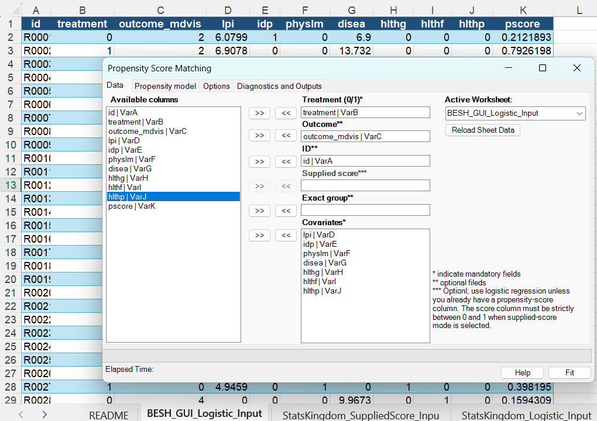
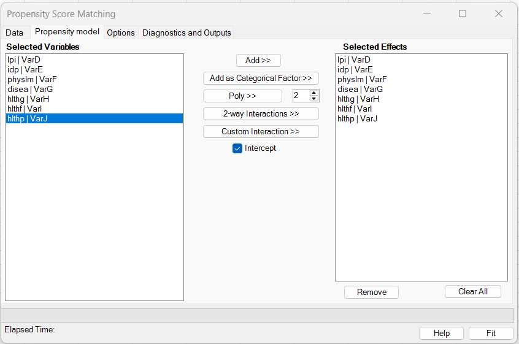
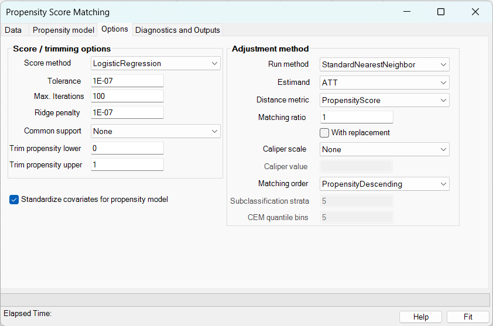
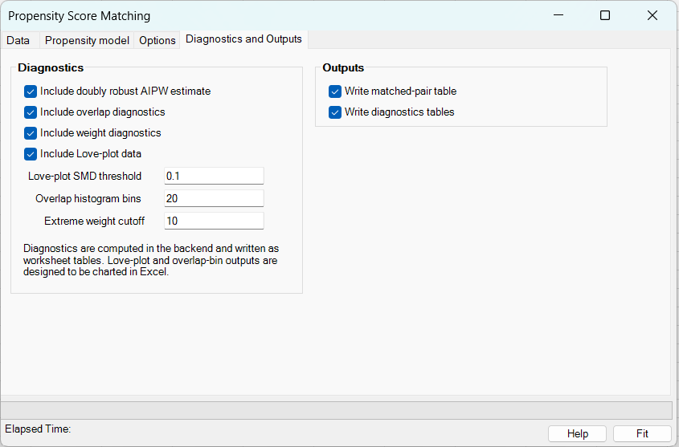
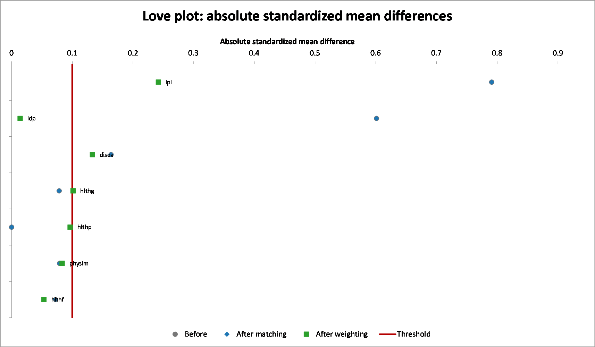

# Propensity Score Matching

**Includes:** Propensity-score estimation by logistic regression or supplied scores; nearest-neighbor matching; optimal pair matching; propensity-score weighting; subclassification; coarsened exact matching; exact matching restrictions; calipers; common-support and propensity-score trimming; ATT, ATC, ATE, and ATO estimands; balance diagnostics; Love plot; overlap and weight diagnostics; AIPW doubly robust estimates; and Rosenbaum-style sensitivity analysis.  
**Purpose:** Estimate treatment effects in observational data by improving balance in measured pre-treatment covariates between treated and control groups.

---

## Overview

Propensity-score methods are used when treatment assignment was not randomized and the treated and control groups differ in measured baseline covariates. The **propensity score** is the conditional probability of receiving treatment given the observed covariates:

$$
e(x) = P(T = 1 \mid X = x),
$$

where \(T\) is the binary treatment indicator and \(X\) is the vector of measured pre-treatment covariates.

BESH Stat NG can use the propensity score in several ways:

- match treated and control subjects with similar scores or similar covariate profiles;
- weight observations so the weighted treated and control groups represent a target population;
- divide observations into score strata and combine stratum-specific effects;
- coarsen covariates into matching strata and compare treated/control observations inside those strata.

The main goal is not to make the propensity-score model itself predictive. The main goal is to produce a comparison where measured pre-treatment covariates are balanced between the treatment groups before estimating the treatment effect.

!!! warning "Measured confounding only"
    Propensity-score methods adjust for measured covariates only. They do not remove bias from unmeasured confounding, post-treatment variables, incorrect treatment timing, poor overlap, or a poorly specified scientific question. Always inspect overlap and balance diagnostics before interpreting treatment-effect estimates.

---

## When to use it

Use Propensity Score Matching when:

- the treatment is binary, such as `0 = control` and `1 = treated`;
- the data are observational rather than randomized;
- you have pre-treatment covariates that may affect both treatment assignment and outcome;
- you want an adjusted treatment effect such as ATT, ATC, ATE, or ATO;
- you need an auditable Excel output showing scores, weights, matched pairs, excluded observations, and balance diagnostics.

Do not use it when:

- treatment has more than two levels;
- treatment is continuous;
- key confounders are unmeasured;
- covariates were measured after treatment started;
- there is no overlap between treated and control subjects;
- treatment timing or outcome timing is ambiguous.

Multi-category and continuous-treatment propensity-score methods are not currently implemented in this dialog.

---

## Data layout

A typical worksheet has one row per subject and one column per variable.

| Column type | Example | Required? | Notes |
|---|---|---:|---|
| ID | `id` | Optional | Used for output labels and audit tables. If omitted, source row identifiers are used. |
| Treatment | `treatment` | Yes | Binary treatment indicator. Usually `0 = control`, `1 = treated`. |
| Outcome | `outcome_mdvis` | Yes | Numeric outcome used for treatment-effect summaries. |
| Covariates | `age`, `baseline`, `site`, `health` | Yes | Pre-treatment variables used for score estimation and balance diagnostics. |
| Supplied score | `pscore` | Conditional | Required only when using an existing propensity-score column. Values must be in `(0, 1)`. |
| Exact groups | `sex`, `site` | Optional | Matching can be restricted to subjects in the same exact-group combination. |

Rows with missing or invalid treatment, outcome, covariate, or supplied-score values cannot be analyzed. The result workbook includes source worksheet row numbers so analyzed and excluded rows can be traced back to the original data.

---

## User interface workflow

In Excel ribbon:

**BESH Stat NG → Analyse → Causal Inference → Propensity Score Matching**

A typical workflow is:

1. Select the worksheet containing the data.
2. Select treatment, outcome, ID, covariate, supplied-score, and exact-group columns as needed.
3. Choose whether the propensity score should be estimated or supplied from an existing column.
4. Select the adjustment method and estimand.
5. Configure matching, weighting, subclassification, or coarsened exact matching options.
6. Select diagnostics and output options.
7. Run the analysis. BESH Stat NG writes a new formatted workbook.

### Data tab



Use the data tab to define the analysis roles. Treatment, outcome, and covariates are required. ID, supplied propensity score, and exact-group variables are optional depending on the selected method.

### Propensity model tab



Use this tab to decide whether the score is estimated from the selected covariates or read from an existing score column.

### Adjustment-method options



The available controls change depending on the selected adjustment method. Unsupported combinations are rejected rather than silently redirected to another analysis.

### Diagnostics and output



Use this tab to set balance thresholds, overlap diagnostics, weight diagnostics, and the Love plot output.

---

## Statistical details

### Propensity-score model

When logistic regression is selected, the treatment model is

$$
\operatorname{logit}\{e(x_i)\}
  = \log\left(\frac{e(x_i)}{1-e(x_i)}\right)
  = \beta_0 + x_i^T\beta.
$$

The fitted score is

$$
\hat e_i = \frac{1}{1 + \exp(-\hat\eta_i)},
\qquad
\hat\eta_i = \hat\beta_0 + x_i^T\hat\beta.
$$

The logistic score model supports the same regression-design style used by other BESH Stat NG regression dialogs. Ridge stabilization can be used when the treatment model is difficult to fit because of near-separation or high collinearity. With a ridge penalty \(\lambda\), the fitted coefficients are estimated by maximizing a penalized log-likelihood, equivalently adding a penalty term such as

$$
\lambda \sum_{j=1}^{p} \beta_j^2,
$$

usually excluding the intercept from the penalty.

!!! tip "Do not judge the score model by prediction alone"
    A high predictive score model is not automatically a good adjustment model. The important question is whether the selected adjustment method improves covariate balance and preserves sufficient overlap.

### Treatment-effect estimands

Let \(Y(1)\) and \(Y(0)\) be the potential outcomes under treatment and control. BESH Stat NG supports the following estimands where the selected method allows them.

| Estimand | Target population | Definition | Recommended use |
|---|---|---|---|
| ATT | Treated subjects | \(E[Y(1)-Y(0)\mid T=1]\) | Use when the question is “what was the effect among those who received treatment?” This is common for matching. |
| ATC | Control subjects | \(E[Y(1)-Y(0)\mid T=0]\) | Use when the question is “what would happen if controls had received treatment?” |
| ATE | Whole eligible sample | \(E[Y(1)-Y(0)]\) | Use when the goal is an effect for the full study population and overlap is adequate. |
| ATO | Overlap population | Weighted effect in subjects with clinical equipoise | Use when overlap is limited and the most reliable target is the region where treated and control subjects both occur. |

Nearest-neighbor and optimal pair matching expose ATT and ATC. Weighting, subclassification, and coarsened exact matching expose ATT, ATC, ATE, and ATO.

### Nearest-neighbor matching

Nearest-neighbor matching selects comparison subjects with the smallest distance from each focal subject. For ATT, treated subjects are focal; for ATC, control subjects are focal.

For propensity-score distance,

$$
d_{ij} = |\hat e_i - \hat e_j|.
$$

For logit-propensity distance,

$$
d_{ij} = |\operatorname{logit}(\hat e_i) - \operatorname{logit}(\hat e_j)|.
$$

A 1:k match selects up to \(k\) closest eligible comparison subjects per focal subject. With replacement, the same comparison subject may be reused. Without replacement, a comparison subject can be used only once.

Recommended starting choice:

- use ATT if the treated subjects are the main scientific target;
- start with 1:1 or 1:2 matching;
- start without replacement for simple auditability;
- inspect balance and unmatched rows;
- add calipers or exact matching only when justified by the design question.

### Calipers

A caliper limits the maximum allowed matching distance. A candidate match is accepted only when

$$
d_{ij} \le c.
$$

BESH Stat NG supports several caliper scales.

| Caliper scale | Meaning | When to use |
|---|---|---|
| None | No maximum distance | Use for initial exploration and examples. |
| Raw propensity score | Maximum absolute difference in \(\hat e\) | Easy to explain, but scale may be uneven near 0 or 1. |
| Standardized propensity score | Raw score distance divided by score standard deviation | Useful when you want a scale-free threshold. |
| Logit propensity score | Maximum absolute difference in logit scores | Often more stable across the score range. |
| Standardized logit propensity score | Logit-score distance divided by logit-score standard deviation | Common practical choice for caliper matching. |

A caliper may improve balance and reduce poor matches, but it can also leave observations unmatched and change the target population.

### Mahalanobis distance

Mahalanobis distance compares multivariate covariate profiles:

$$
d_{ij}^{M} = \sqrt{(x_i-x_j)^T S^{-1}(x_i-x_j)},
$$

where \(S\) is a covariance matrix for the matching covariates. This distance accounts for the scale and correlation of covariates.

Use Mahalanobis distance when matching should be based directly on covariate profiles. Use **Mahalanobis within a propensity-score caliper** when you want to restrict matches to similar propensity scores but choose the best covariate-profile match inside that caliper.

### Exact matching restrictions

Exact matching restricts eligible pairs to the same exact-group combination. For example, exact matching on `sex` and `site` prevents a treated subject in one sex/site combination from being matched to a control subject in another combination.

Use exact matching for variables that should not be crossed in the study design, such as site, country, sex, risk stratum, or calendar period. Be careful: too many exact restrictions can make matching impossible in small datasets.

### Optimal pair matching

Optimal pair matching creates 1:1 pairs without replacement while minimizing the total distance across all selected pairs. This can improve the global matching solution compared with greedy nearest-neighbor matching.

Use optimal pair matching when:

- 1:1 matching is desired;
- replacement should not be used;
- the global distance solution matters more than the sequential order of greedy matching.

### Propensity-score weighting

Weighting keeps all eligible observations but gives them different weights. Let \(e_i=\hat e(x_i)\). Common unstabilized weights are:

| Estimand | Treated weight | Control weight |
|---|---:|---:|
| ATE | \(1/e_i\) | \(1/(1-e_i)\) |
| ATT | \(1\) | \(e_i/(1-e_i)\) |
| ATC | \((1-e_i)/e_i\) | \(1\) |
| ATO | \(1-e_i\) | \(e_i\) |

Weights can be normalized to the sample size for easier interpretation. Large weights indicate that some subjects are standing in for many others and can make estimates unstable. Always check effective sample size and extreme weight diagnostics.

The effective sample size is commonly summarized as

$$
ESS = \frac{\left(\sum_i w_i\right)^2}{\sum_i w_i^2}.
$$

### Subclassification

Subclassification divides subjects into propensity-score strata, often quintiles. Effects are estimated within strata and then combined across strata. Each stratum must contain both treated and control observations.

Use subclassification when:

- you want a simple stratified design;
- you want to retain most observations;
- matching is too restrictive but weighting feels too sensitive to extreme weights.

### Coarsened exact matching

Coarsened exact matching groups subjects by coarsened versions of selected covariates. For example, a continuous baseline measure may be divided into bins. Treated and control subjects are then compared only within the same coarsened stratum.

Use coarsened exact matching when:

- exact balance on coarse categories is preferred;
- covariates have meaningful categories or cut points;
- you want a transparent, design-based adjustment.

### Common support and trimming

Common support means the score range where treated and control groups overlap. Observations outside overlap may be poor candidates for causal comparison.

BESH Stat NG can exclude observations based on common support or user-defined score trimming. If trimming is used, the estimand is interpreted for the remaining eligible population, not the original full dataset.

---

## Diagnostics

### Standardized mean difference

For a continuous covariate, the standardized mean difference is

$$
SMD = \frac{\bar x_1 - \bar x_0}{s_p},
$$

where

$$
s_p = \sqrt{\frac{s_1^2+s_0^2}{2}}.
$$

For binary indicators, the means are proportions. BESH Stat NG reports SMD before and after adjustment.

Common review rules:

- \(|SMD| < 0.10\): often considered good balance;
- \(0.10 \le |SMD| < 0.20\): may be acceptable depending on context;
- \(|SMD| \ge 0.20\): usually deserves review.

These are practical conventions, not formal proof of unbiasedness.

### Variance ratio

For continuous covariates, the variance ratio is

$$
VR = \frac{s_1^2}{s_0^2}.
$$

Values far below 1 or far above 1 indicate unequal spread between groups. A common practical review range is approximately 0.5 to 2.

### eCDF diagnostics

The empirical cumulative distribution function (eCDF) diagnostics compare the full covariate distributions rather than only means or variances. The maximum eCDF difference is closely related to the Kolmogorov-Smirnov distance:

$$
\max_x |F_1(x)-F_0(x)|.
$$

Large eCDF differences indicate distributional imbalance that may not be visible from the SMD alone.

### Love plot

The Love plot displays absolute SMD values before and after adjustment. Points to the right of the vertical threshold line indicate variables that remain imbalanced.



### Weight diagnostics

For weighting methods, review:

- effective sample size;
- maximum weight;
- coefficient of variation of weights;
- number of extreme weights;
- treated/control weight summaries.

Low ESS or extreme weights can indicate poor overlap or an unstable target estimand.

### Rosenbaum-style sensitivity analysis

For matched-pair analyses, BESH Stat NG reports a Rosenbaum-style sensitivity summary. This examines how strong an unmeasured confounder would need to be, expressed through a sensitivity parameter \(\Gamma\), to affect the matched-pair conclusion.

This analysis does not prove that unmeasured confounding is absent. It is a robustness diagnostic.

---

## Output workbook

The analysis writes a new workbook. Depending on the selected method and options, output sheets can include:

| Sheet | Contents |
|---|---|
| Input Data | Analyzed rows, source worksheet row numbers, treatment, outcome, covariates, score, and inclusion flags. |
| Results | Run settings, sample-size summary, propensity model information, effect estimates, and warnings. |
| Diagnostics | Balance diagnostics, overlap diagnostics, weight diagnostics, and Love-plot source table. |
| Love Plot | Excel chart showing absolute standardized mean differences before and after adjustment. |
| Row Audit | Row-level score, weight, support, trimming, subclassification, and matching status. |
| Matched Pairs | Matched treated-control links for matching methods. |
| Matched Data | Analysis-ready matched dataset with outcomes and covariates. |
| CEM | Coarsened exact matching strata and weights, when CEM is selected. |

---

## Example dataset: RAND HIE benchmark

Download the input workbook: [RAND HIE PSM example workbook](../assets/data/205propensityscorematching/205propensityscorematching.xlsx)  
Download the example result workbook: [RAND HIE PSM result workbook](../assets/data/205propensityscorematching/205propensityscorematching_results.xlsx)

The example uses a deterministic subset of RAND Health Insurance Experiment data prepared for GUI and UDF testing. The example worksheet `BESH_GUI_Logistic_Input` has 320 rows, 160 treated subjects, and 160 control subjects.

Use these columns:

| Role | Column |
|---|---|
| ID | `id` |
| Treatment | `treatment` |
| Outcome | `outcome_mdvis` |
| Covariates | `lpi`, `idp`, `physlm`, `disea`, `hlthg`, `hlthf`, `hlthp` |

The saved result workbook was produced with the default GUI settings for the example:

| Option | Value |
|---|---|
| Run method | Standard nearest-neighbor matching |
| Score method | Logistic regression |
| Estimand | ATT |
| Distance metric | Propensity score |
| Matching ratio | 1 |
| Replacement | No |
| Caliper | None |
| Matching order | Propensity descending |
| Common support | None |
| Ridge penalty | \(10^{-7}\) |
| SMD threshold | 0.10 |
| Doubly robust estimate | Enabled |
| Overlap, weight diagnostics, and Love plot | Enabled |

### Main result summary

The Results sheet from the saved example workbook reports:

| Quantity | Value |
|---|---:|
| Total rows | 320 |
| Treated rows | 160 |
| Control rows | 160 |
| Eligible treated rows | 160 |
| Eligible control rows | 160 |
| Matched treated rows | 160 |
| Matched control rows | 160 |
| Matched sets | 160 |
| Unmatched treated rows | 0 |
| Unmatched control rows | 0 |
| Dropped by common support | 0 |
| Dropped by trimming | 0 |

### The Results and Diagnostics sheets report the following effect summaries:

| Method | Estimand | Estimate | Std. Error | Lower 95% | Upper 95% | Treated mean | Control mean |
|---|---|---:|---:|---:|---:|---:|---:|
| Matched mean difference | ATT | -0.5875 | 0.5358 | -1.6376 | 0.4626 | 2.9375 | 3.5250 |
| Propensity-score weighting | ATT | -2.3569 | 0.9893 | -4.2959 | -0.4178 | 2.9375 | 5.2944 |
| Doubly robust AIPW | ATT | -2.0425 | 1.0089 | -4.0199 | -0.0651 | 2.9375 | 3.5250 |

Interpretation: in this example, the matched mean difference is negative but its 95% confidence interval includes zero. The weighting and AIPW summaries are more negative and their intervals do not include zero. This discrepancy is a useful teaching example: different adjustment designs target different weighted comparisons and can behave differently when overlap and balance are not ideal.

### Balance diagnostics from the example

The table below summarizes the absolute SMDs shown in the Love Plot sheet.

| Variable | \(SMD\) before | \(SMD\) after matching | \(SMD\) after weighting | Flag |
|---|---:|---:|---:|---|
| `lpi` | 0.7908 | 0.7908 | 0.2418 | Review |
| `idp` | 0.6011 | 0.6011 | 0.0140 | Review |
| `disea` | 0.1639 | 0.1639 | 0.1331 | Review |
| `hlthg` | 0.0784 | 0.0784 | 0.1013 | Review |
| `hlthp` | 0.0000 | 0.0000 | 0.0965 | OK |
| `physlm` | 0.0789 | 0.0789 | 0.0833 | OK |
| `hlthf` | 0.0724 | 0.0724 | 0.0533 | OK |

Because the default nearest-neighbor run matched every treated subject and every control subject exactly once, the marginal SMDs after matching are the same as before matching. The matched-pair table is still meaningful, but this example shows why users should not assume that matching automatically improves marginal balance. Consider a caliper, replacement, exact matching, Mahalanobis-with-caliper matching, weighting, or subclassification when balance remains poor.

### Weight and overlap diagnostics from the example

The Diagnostics sheet reports a control-group effective sample size of about 65.71 under ATT weighting, compared with 160 control observations. The overlap summary also flags subjects outside support and extreme propensity scores in both groups. This suggests that the treatment groups are not perfectly comparable across the full score range.

---

## R code to replicate the main analysis

The R script below reproduces the main design choices from the example: logistic propensity scores, nearest-neighbor ATT matching, 1:1 matching without replacement, and descending score order. Exact pair identities and a few numeric details may differ because tie handling and matching-order conventions can vary across software. The script is intended for validation of the main workflow, not byte-for-byte reproduction of every Excel table.

```r
# Required packages
# install.packages(c("readxl", "dplyr", "MatchIt", "cobalt", "ggplot2"))

library(readxl)
library(dplyr)
library(MatchIt)
library(cobalt)
library(ggplot2)

# Use the workbook distributed with the documentation.
# Adjust the path if running from another working directory.
dat <- read_excel(
  "docs/assets/data/205propensityscorematching/205propensityscorematching.xlsx",
  sheet = "BESH_GUI_Logistic_Input"
)

# MatchIt will estimate a logistic propensity-score model by default when
# distance = "glm" and link = "logit".
m <- matchit(
  treatment ~ lpi + idp + physlm + disea + hlthg + hlthf + hlthp,
  data = dat,
  method = "nearest",
  distance = "glm",
  link = "logit",
  estimand = "ATT",
  ratio = 1,
  replace = FALSE,
  m.order = "largest"
)

summary(m, standardize = TRUE)

matched <- match.data(m)

# Main matched mean-difference estimate. For ATT nearest-neighbor matching,
# MatchIt returns weights that can be used to form the matched comparison.
matched_effect <- with(
  matched,
  weighted.mean(outcome_mdvis[treatment == 1], weights[treatment == 1]) -
    weighted.mean(outcome_mdvis[treatment == 0], weights[treatment == 0])
)
matched_effect

# Balance table and Love plot.
bal <- bal.tab(m, un = TRUE, m.threshold = 0.10)
bal

love.plot(
  m,
  stats = "mean.diffs",
  abs = TRUE,
  thresholds = c(m = 0.10),
  var.order = "unadjusted"
)

# Optional: estimate ATT propensity-score weights using the same fitted scores.
# This is a simple manual analogue of ATT weights:
ps <- m$distance
dat$att_weight <- ifelse(dat$treatment == 1, 1, ps / (1 - ps))

weighted_att <- with(
  dat,
  weighted.mean(outcome_mdvis[treatment == 1], att_weight[treatment == 1]) -
    weighted.mean(outcome_mdvis[treatment == 0], att_weight[treatment == 0])
)
weighted_att
```

Expected comparison points:

- the fitted score model should use the same treatment and covariates;
- the matched dataset should contain 160 treated and 160 controls if no subjects are discarded;
- the matched ATT should be in the same direction as the BESH Stat NG matched estimate;
- balance diagnostics should identify `lpi` and `idp` as major pre-adjustment imbalances.

---

## Worksheet functions

Propensity-score analyses can also be run with worksheet functions. The typical formula workflow is:

1. Fit once with `BESH.PS.FIT(...)` and return a handle.
2. Use the handle with `BESH.PS.SUMMARY`, `BESH.PS.SCORES`, `BESH.PSM.MATCHES`, `BESH.PS.WEIGHTS`, `BESH.PS.BALANCE`, `BESH.PS.EFFECT`, and `BESH.PS.LOVEPLOT_DATA`.
3. Use `BESH.PS.CLEANUP` to remove cached fits when they are no longer needed.

See [Causal Inference worksheet functions](../udf/causal-inference.md) for the generated UDF reference.

Example:

```excel
=BESH.PS.FIT(A2:A321,B2:B321,C2:C321,D2:J321,D1:J1,
             "matching","ATT","logit",,,
             "lpi + idp + physlm + disea + hlthg + hlthf + hlthp",
             "ratio=1; replacement=false; order=descending; support=none",
             "smd=0.1; lovePlot=true")
```

Then:

```excel
=BESH.PS.SUMMARY(A1)
=BESH.PSM.MATCHES(A1)
=BESH.PS.BALANCE(A1)
=BESH.PS.EFFECT(A1)
=BESH.PS.LOVEPLOT_DATA(A1)
```

---

## Choosing options: practical guidance

| Goal or problem | Recommended option |
|---|---|
| First analysis of a binary treatment dataset | Logistic score + ATT nearest-neighbor matching + Love plot. |
| Need transparent matched pairs | 1:1 nearest-neighbor or optimal pair matching. |
| Too many poor matches | Add a standardized logit-propensity caliper. |
| Important design variable should never be crossed | Add exact matching for that variable. |
| Matching discards too much information | Try weighting or subclassification. |
| Extreme weights appear | Consider ATO overlap weighting, score trimming, or a more focused target population. |
| Covariate profiles matter more than score alone | Use Mahalanobis distance or Mahalanobis within a propensity-score caliper. |
| Balance remains poor after nearest-neighbor matching | Try calipers, replacement, exact matching, Mahalanobis-with-caliper, weighting, or subclassification. |
| Need a robust audit trail | Review Input Data, Row Audit, Matched Pairs, and Diagnostics sheets. |

---

## Limitations

- Only binary treatment is currently supported.
- Propensity-score adjustment addresses measured pre-treatment confounders only.
- Matching and weighting can increase variance or change the target population.
- A small SMD does not prove that the causal effect is unbiased.
- Poor overlap may make some causal questions unsupported by the data.
- The default standard errors are practical summaries; they are not a substitute for a study-specific inferential plan in high-stakes confirmatory analyses.

---

## References

1. Rosenbaum, P. R., & Rubin, D. B. (1983). The central role of the propensity score in observational studies for causal effects. *Biometrika*, 70(1), 41–55.
2. Austin, P. C. (2011). An introduction to propensity score methods for reducing the effects of confounding in observational studies. *Multivariate Behavioral Research*, 46(3), 399–424.
3. Stuart, E. A. (2010). Matching methods for causal inference: A review and a look forward. *Statistical Science*, 25(1), 1–21.
4. Imbens, G. W., & Rubin, D. B. (2015). *Causal Inference for Statistics, Social, and Biomedical Sciences: An Introduction*. Cambridge University Press.

## See also

- [Generalized Linear Models (GLM)](generalized-linear-models-glm.md)
- [Resampling in BESH Stat NG](resampling.md)
- [Causal Inference worksheet functions](../udf/causal-inference.md)
