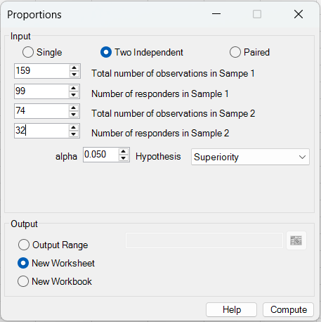
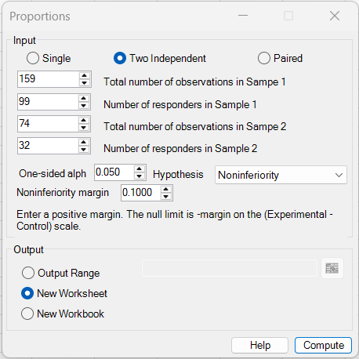
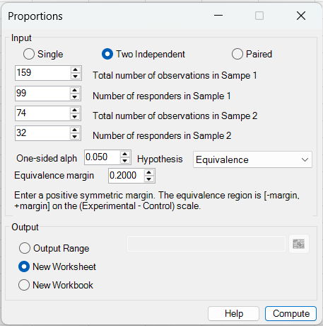
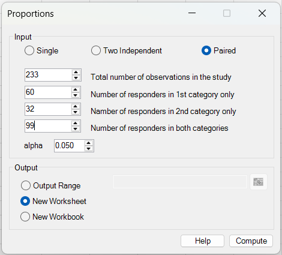
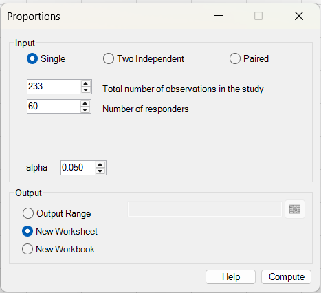
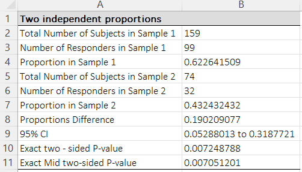
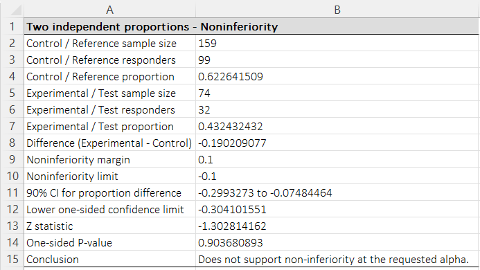
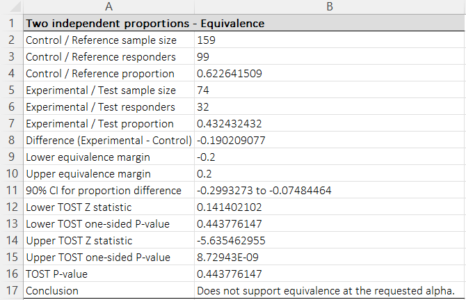
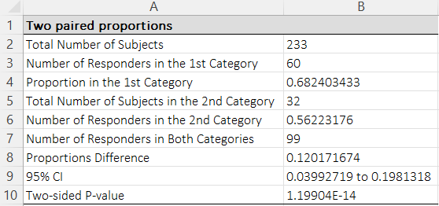
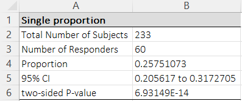

# Proportions

**Includes:** Single proportion, Two independent proportions (**Superiority**, **Noninferiority**, **Equivalence**), and Two paired proportions.  
**Purpose:** Estimate one or more binomial proportions and compare proportions between groups.

---

## Overview

Use **Proportions** when the outcome is binary, for example:

- responder vs non-responder,
- event vs no event,
- yes vs no,
- improved vs not improved.

The dialog accepts **counts**, not raw subject-level data.

The current version supports three analysis families:

- **Single** — estimate one proportion and test it against the built-in null value.
- **Two Independent** — compare proportions from two unrelated groups.
- **Paired** — compare proportions from two matched/paired measurements on the same subjects.

For **Two Independent**, BESHStatNG now supports three hypothesis types:

- **Superiority** — ordinary two-sided comparison of proportions
- **Noninferiority** — test whether the experimental/test proportion is not worse than the control/reference proportion by more than a user-specified margin
- **Equivalence** — TOST-style equivalence test using a symmetric margin around zero on the difference scale

---

## When to use it

### Single proportion

Use when you have one sample of size \(n\) with \(x\) responders and want:

- the estimated proportion,
- a confidence interval,
- an exact two-sided p-value against the built-in null value.

### Two independent proportions

Use when you have **two unrelated groups**, for example treatment vs control, exposed vs unexposed, or experimental vs reference.

BESHStatNG reports the proportion difference on the scale:

\[
\hat\Delta = \hat p_E - \hat p_C
\]

where:

- **Sample 1** is the **control / reference** group,
- **Sample 2** is the **experimental / test** group.

This ordering matters for **Noninferiority** and **Equivalence**.

### Two paired proportions

Use when the same subjects contribute two related binary outcomes, for example:

- before vs after,
- left vs right,
- method A vs method B on the same subjects.

---

## Inputs

This dialog uses **count data**.

> Tip: You can keep the raw data in Excel and manually enter the totals into the numeric fields.

### Single

- **Total number of observations in the study**: \(n\)
- **Number of responders**: \(x\)

### Two Independent

- **Total number of observations in Sample 1**: \(n_C\)
- **Number of responders in Sample 1**: \(x_C\)
- **Total number of observations in Sample 2**: \(n_E\)
- **Number of responders in Sample 2**: \(x_E\)

For **Two Independent**, the **Hypothesis** selector is available:

- **Superiority**
- **Noninferiority**
- **Equivalence**

Depending on the selected hypothesis:

- **Superiority** uses **two-sided alpha**.
- **Noninferiority** uses **one-sided alpha** and a **positive noninferiority margin**.
- **Equivalence** uses **one-sided alpha** and a **positive symmetric equivalence margin**.

### Paired

- **Total number of observations in the study**: \(n\)
- **Number of responders in 1st category only**: \(b\)
- **Number of responders in 2nd category only**: \(c\)
- **Number of responders in both categories**: \(a\)

The implied paired 2×2 table is:

\[
\begin{array}{c|cc}
 & \text{Category 2 = Yes} & \text{Category 2 = No}\\\hline
\text{Category 1 = Yes} & a & b\\
\text{Category 1 = No} & c & d
\end{array}
\qquad d = n-a-b-c.
\]

---

## Using the add-in

1. Ribbon: **BESH Stat NG → Analyse → Contingency Table Analysis → Proportions**
2. Select **Single**, **Two Independent**, or **Paired**
3. Enter the required counts
4. If **Two Independent** is selected, choose the **Hypothesis**:
   - **Superiority**
   - **Noninferiority**
   - **Equivalence**
5. Enter **alpha**
6. If needed, enter the **margin**
7. Choose the output destination:
   - **Output Range**
   - **New Worksheet**
   - **New Workbook**
8. Click **Compute**

---

## Screenshots

### Two independent — Superiority


### Two independent — Noninferiority


### Two independent — Equivalence


### Paired


### Single


### Example output — Two independent (Superiority)


### Example output — Two independent (Noninferiority)


### Example output — Two independent (Equivalence)


### Example output — Paired


### Example output — Single


---

## Statistical methods

## 1) Single proportion

### Estimate

\[
\hat p = \frac{x}{n}
\]

### Confidence interval

BESHStatNG uses the **Wilson score interval** at level \(1-\alpha\). With

\[
z = z_{1-\alpha/2}
\]

and observed proportion \(\hat p=x/n\), the Wilson interval can be written as:

\[
\tilde p = \frac{x + z^2/2}{n + z^2}
\]

\[
h = \frac{z}{n+z^2}\sqrt{\frac{x(n-x)}{n}+\frac{z^2}{4}}
\]

\[
\text{CI}_{1-\alpha} = [\tilde p-h,\ \tilde p+h]
\]

### Two-sided p-value

The current Single-proportion dialog reports an **exact two-sided binomial p-value** for testing:

\[
H_0: p = 0.5
\]

---

## 2) Two independent proportions — Superiority

Let:

- control/reference sample: \(x_C\) responders out of \(n_C\)
- experimental/test sample: \(x_E\) responders out of \(n_E\)

The sample proportions are:

\[
\hat p_C = \frac{x_C}{n_C}, \qquad \hat p_E = \frac{x_E}{n_E}
\]

and the reported difference is:

\[
\hat\Delta = \hat p_E - \hat p_C
\]

### Confidence interval for the difference

BESHStatNG uses the **Newcombe/Wilson** confidence interval for the difference in two independent proportions.

First compute Wilson intervals for the two individual proportions:

\[
[L_C, U_C] \text{ for } p_C, \qquad [L_E, U_E] \text{ for } p_E
\]

Then form the Newcombe interval for

\[
\Delta = p_E - p_C
\]

as:

\[
\Delta_L = \hat\Delta - \sqrt{(\hat p_E-L_E)^2 + (U_C-\hat p_C)^2}
\]

\[
\Delta_U = \hat\Delta + \sqrt{(U_E-\hat p_E)^2 + (\hat p_C-L_C)^2}
\]

### Two-sided p-values

BESHStatNG also reports:

- **Exact two-sided P-value**
- **Exact Mid two-sided P-value**

from **Fisher’s exact test** applied to the corresponding 2×2 table:

\[
\begin{array}{c|cc}
 & \text{Control} & \text{Experimental}\\\hline
\text{Success} & x_C & x_E\\
\text{Failure} & n_C-x_C & n_E-x_E
\end{array}
\]

The mid-p version subtracts half the observed-table probability and is often less conservative than the ordinary exact two-sided value.

---

## 3) Two independent proportions — Noninferiority

For noninferiority, the user enters a **positive margin** \(\Delta_{NI}>0\) on the difference scale.

BESHStatNG defines the effect as:

\[
\Delta = p_E - p_C
\]

and the **noninferiority limit** as:

\[
L_{NI} = -\Delta_{NI}
\]

so the hypotheses are:

\[
H_0: p_E - p_C \le -\Delta_{NI}
\qquad\text{vs}\qquad
H_1: p_E - p_C > -\Delta_{NI}
\]

This is a **one-sided** test.

### Test statistic

BESHStatNG uses the large-sample standard error:

\[
SE = \sqrt{\frac{\hat p_C(1-\hat p_C)}{n_C} + \frac{\hat p_E(1-\hat p_E)}{n_E}}
\]

The test statistic is:

\[
Z_{NI} = \frac{\hat\Delta - L_{NI}}{SE}
\]

and the one-sided p-value is:

\[
p_{NI} = 1 - \Phi(Z_{NI})
\]

where \(\Phi\) is the standard normal cumulative distribution function.

### Confidence interval reporting

BESHStatNG reports:

- the **lower one-sided confidence limit**
- the matching

\[
100(1-2\alpha)\%\text{ two-sided confidence interval}
\]

for the difference in proportions.

For example, if the user enters **one-sided alpha = 0.05**, the reported two-sided CI is **90%**.

Noninferiority is supported when the lower one-sided limit is above the noninferiority limit, equivalently when the one-sided p-value is less than alpha.

---

## 4) Two independent proportions — Equivalence

For equivalence, the user enters a **positive symmetric margin** \(\Delta>0\), so the equivalence region is:

\[
[-\Delta, +\Delta]
\]

on the difference scale \((p_E-p_C)\).

BESHStatNG applies the **TOST (two one-sided tests)** approach.

The two null hypotheses are:

\[
H_{01}: p_E - p_C \le -\Delta
\]

\[
H_{02}: p_E - p_C \ge +\Delta
\]

and both must be rejected to conclude equivalence.

### TOST components

Using the same standard error:

\[
SE = \sqrt{\frac{\hat p_C(1-\hat p_C)}{n_C} + \frac{\hat p_E(1-\hat p_E)}{n_E}}
\]

BESHStatNG computes:

\[
Z_L = \frac{\hat\Delta - (-\Delta)}{SE}
\qquad\text{with}
\qquad
p_L = 1 - \Phi(Z_L)
\]

\[
Z_U = \frac{\hat\Delta - (+\Delta)}{SE}
\qquad\text{with}
\qquad
p_U = \Phi(Z_U)
\]

The reported **TOST P-value** is:

\[
p_{TOST} = \max(p_L, p_U)
\]

Equivalence is concluded only if both one-sided tests are significant at the requested one-sided alpha.

### Equivalent confidence interval

BESHStatNG also reports the matching

\[
100(1-2\alpha)\%\text{ two-sided confidence interval}
\]

for the difference in proportions. Equivalence is supported if that entire interval lies inside the equivalence limits.

For example, **one-sided alpha = 0.05** corresponds to a **90% two-sided confidence interval**.

---

## 5) Two paired proportions

For paired data define:

- \(a\): responders in both categories
- \(b\): responders in the 1st category only
- \(c\): responders in the 2nd category only
- \(d=n-a-b-c\): responders in neither category

The marginal proportions are:

\[
\hat p_1 = \frac{a+b}{n}, \qquad \hat p_2 = \frac{a+c}{n}
\]

and the reported difference is:

\[
\hat\Delta = \hat p_1 - \hat p_2 = \frac{b-c}{n}
\]

### Confidence interval

BESHStatNG uses a **Wilson-based paired-difference interval with correlation adjustment**.

Wilson limits are first computed for the two marginal proportions, then adjusted using the paired table structure.

### Two-sided p-value

To test equality of paired proportions (marginal homogeneity), BESHStatNG uses **Liddell’s exact McNemar test**, which depends only on the discordant pairs \(b\) and \(c\).

Under the null, conditional on \(b+c\):

\[
X \sim \mathrm{Bin}(b+c, 0.5)
\]

and the reported p-value is a two-sided exact test for equality of the discordant probabilities.

---

## Output and interpretation

## Single

The output table contains:

- **Total Number of Subjects**
- **Number of Responders**
- **Proportion**
- **confidence interval** at the chosen level
- **two-sided P-value**

## Two independent — Superiority

The output table contains:

- total subjects and responders in each sample
- **Proportion in Sample 1**
- **Proportion in Sample 2**
- **Proportions Difference**
- **95% CI** (or the selected \(1-\alpha\) CI)
- **Exact two-sided P-value**
- **Exact Mid two-sided P-value**

Interpretation:

- the **difference** is reported as **Sample 2 − Sample 1** in the updated two-independent NI/equivalence output logic, but in the ordinary superiority table the labels remain **Sample 1 / Sample 2**.
- if you are thinking in control-vs-experimental terms, treat:
  - **Sample 1 = Control / Reference**
  - **Sample 2 = Experimental / Test**

## Two independent — Noninferiority

The output table contains:

- control/reference sample size, responders, proportion
- experimental/test sample size, responders, proportion
- **Difference (Experimental - Control)**
- **Noninferiority margin**
- **Noninferiority limit**
- **90% CI for proportion difference** (or more generally \(100(1-2\alpha)\%\))
- **Lower one-sided confidence limit**
- **Z statistic**
- **One-sided P-value**
- **Conclusion**

Interpretation:

- enter a **positive** noninferiority margin
- the null limit is **−margin** on the \((Experimental - Control)\) scale
- noninferiority is supported only if the lower one-sided limit is above that null limit and the one-sided p-value is below alpha

## Two independent — Equivalence

The output table contains:

- control/reference sample size, responders, proportion
- experimental/test sample size, responders, proportion
- **Difference (Experimental - Control)**
- **Lower equivalence margin**
- **Upper equivalence margin**
- **90% CI for proportion difference** (or more generally \(100(1-2\alpha)\%\))
- **Lower TOST Z statistic** and **one-sided P-value**
- **Upper TOST Z statistic** and **one-sided P-value**
- **TOST P-value**
- **Conclusion**

Interpretation:

- enter a **positive symmetric equivalence margin**
- the equivalence region is **[−margin, +margin]** on the \((Experimental - Control)\) scale
- equivalence is supported only if **both** one-sided components are significant and the full equivalent confidence interval lies inside the margins

## Two paired proportions

The output table contains:

- total number of subjects
- counts for 1st category only, 2nd category only, and both categories
- marginal proportions in the 1st and 2nd category
- paired proportion difference
- confidence interval
- exact two-sided p-value

---

## Example data used in the screenshots

### Two independent

- Sample 1 total = 159
- Sample 1 responders = 99
- Sample 2 total = 74
- Sample 2 responders = 32

### Paired

- Total = 233
- 1st category only = 60
- 2nd category only = 32
- both categories = 99

### Single

- Total = 233
- responders = 60

---

## R code (reference)

Below are reference R examples for analogous calculations. Small differences can occur if a different confidence-interval or exact-p-value convention is used.

### Single proportion

```r
x <- 60
n <- 233

p_hat <- x / n

# Wilson score interval
if (!requireNamespace("binom", quietly = TRUE)) install.packages("binom")
binom::binom.confint(x, n, methods = "wilson")[, c("lower", "upper")]

# Exact two-sided binomial test for H0: p = 0.5
binom.test(x, n, p = 0.5, alternative = "two.sided")$p.value
```

### Two independent proportions — Superiority

```r
xC <- 99; nC <- 159
xE <- 32; nE <- 74

pC <- xC / nC
pE <- xE / nE
diff <- pE - pC

# Newcombe / score CI for difference
if (!requireNamespace("DescTools", quietly = TRUE)) install.packages("DescTools")
DescTools::BinomDiffCI(xE, nE, xC, nC, method = "Newcombe")

# Fisher exact p-values
T <- matrix(c(xC, nC - xC, xE, nE - xE), nrow = 2, byrow = TRUE)
fisher.test(T)$p.value

if (!requireNamespace("exact2x2", quietly = TRUE)) install.packages("exact2x2")
exact2x2::fisher.exact(T, tsmethod = "minlike", midp = TRUE)$p.value
```

### Two independent proportions — Noninferiority

```r
xC <- 99; nC <- 159
xE <- 32; nE <- 74
alpha <- 0.05
margin <- 0.10             # positive margin entered by user
limit <- -margin           # null limit on the (E - C) scale

pC <- xC / nC
pE <- xE / nE
diff <- pE - pC
se <- sqrt(pC * (1 - pC) / nC + pE * (1 - pE) / nE)
z <- (diff - limit) / se
p_one_sided <- 1 - pnorm(z)

zcrit <- qnorm(1 - alpha)
lower_one_sided <- diff - zcrit * se

p_one_sided
lower_one_sided
```

### Two independent proportions — Equivalence (TOST)

```r
xC <- 99; nC <- 159
xE <- 32; nE <- 74
alpha <- 0.05
margin <- 0.20

pC <- xC / nC
pE <- xE / nE
diff <- pE - pC
se <- sqrt(pC * (1 - pC) / nC + pE * (1 - pE) / nE)

zL <- (diff - (-margin)) / se
pL <- 1 - pnorm(zL)

zU <- (diff - margin) / se
pU <- pnorm(zU)

pTOST <- max(pL, pU)

c(lower_component_p = pL, upper_component_p = pU, tost_p = pTOST)
```

### Two paired proportions

```r
n <- 233
a <- 99
b <- 60
c <- 32
d <- n - a - b - c

p1 <- (a + b) / n
p2 <- (a + c) / n
delta <- p1 - p2

# Exact McNemar / Liddell-style test via discordant pairs
binom.test(b, b + c, p = 0.5, alternative = "two.sided")$p.value
```

---

## Notes

- The dialog expects **counts**, not a worksheet range of raw binary observations.
- For **Two Independent** noninferiority and equivalence, interpret the samples as:
  - **Sample 1 = Control / Reference**
  - **Sample 2 = Experimental / Test**
- **Alpha** means different things depending on the hypothesis:
  - **Superiority:** two-sided alpha
  - **Noninferiority / Equivalence:** one-sided alpha
- For noninferiority and equivalence, the reported two-sided CI is the matching

\[
100(1-2\alpha)\%\text{ interval}
\]

  so with one-sided \(\alpha=0.05\) the reported CI is **90%**.

- The current two-independent NI/equivalence implementation uses a **large-sample normal approximation** for the formal Z-tests and pairs it with CI-based reporting for interpretation.

---

## References

- Wilson, E. B. (1927). Probable inference, the law of succession, and statistical inference. *Journal of the American Statistical Association*, 22, 209–212.
- McNemar, Q. (1947). Note on the sampling error of the difference between correlated proportions or percentages. *Psychometrika*, 12(2), 153–157.
- Newcombe, R. G. (1998). Interval estimation for the difference between independent proportions: comparison of eleven methods. *Statistics in Medicine*, 17, 873–890.
- Newcombe, R. G. (1998). Improved confidence intervals for the difference between binomial proportions based on paired data. *Statistics in Medicine*, 17, 2635–2650.
- Newcombe, R. G., & Altman, D. G. (2000). Proportions and their differences. In *Statistics with Confidence* (2nd ed., pp. 45–56). BMJ Books.
- Fleiss, J. L., Levin, B., & Paik, M. C. (2003). *Statistical Methods for Rates and Proportions* (3rd ed.). Wiley.
- Wellek, S. (2010). *Testing Statistical Hypotheses of Equivalence and Noninferiority* (2nd ed.). Chapman & Hall/CRC.

---

## See also

- [2×2 Table](2x2-table.md)
- [RxC Table](rxc-table.md)
- [Sample Size – Independent Proportions](sample-size-independent-proportions.md)
- [Sample Size – Single Proportion](sample-size-single-proportion.md)
- [Home](../index.md)
