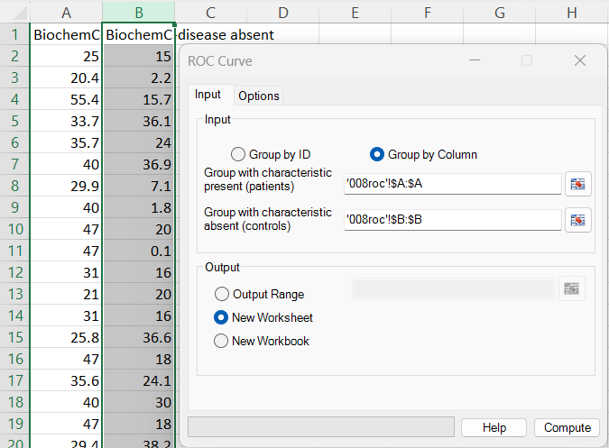
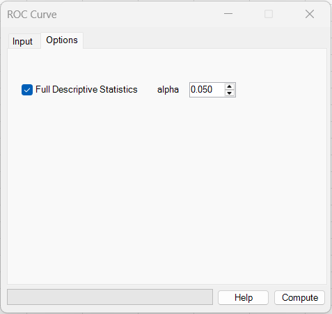
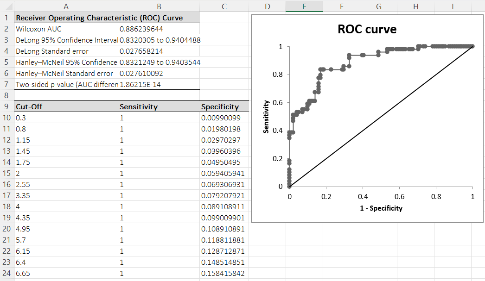

# ROC Curve

**Includes:** ROC curve points, AUC (Wilcoxon), **DeLong** SE / CI, **Hanley–McNeil** SE / CI, p-value, Cutoff table.
**Purpose:** Assess binary classifier performance and explore sensitivity/specificity tradeoffs across thresholds.

---

## Overview

A Receiver Operating Characteristic (ROC) curve summarizes the performance of a **binary classifier** across all possible decision thresholds.

In BESHStatNG, you provide one continuous marker measured in:

- **Characteristic present** (patients / positives)
- **Characteristic absent** (controls / negatives)

BESHStatNG then:

1. Builds a list of cut-offs (thresholds) between unique marker values,
2. Computes **Sensitivity** and **Specificity** for each cut-off,
3. Plots **Sensitivity** versus **1 − Specificity** (false positive rate),
4. Computes **AUC** (area under the ROC curve) using the Wilcoxon/Mann–Whitney definition,
5. Reports **two standard errors / confidence intervals** for AUC:
   - **DeLong** (recommended for the SE of a single AUC; also widely used for ROC comparisons)
   - **Hanley–McNeil** (classic approximation; often reported and used in older literature)
6. Reports a **two-sided p-value** for \(H_0:\,\text{AUC}=0.5\) using the method implemented in `ROC.vb`.

---

## Example dataset

The screenshots use this example dataset (two columns: disease present vs disease absent):

- [008roc.csv](../assets/data/008roc/008roc.csv)

---

## Screenshots

### Input tab


### Options tab


### Results (summary tables + ROC chart)


---

## When to use it

Use ROC analysis when:

- You have a **binary outcome** (disease present/absent, case/control, responder/non-responder),
- You have one **continuous marker** or score you want to evaluate,
- Higher marker values indicate “more likely positive” (see Notes if your direction is reversed).

Typical use cases:

- Diagnostic biomarkers
- Risk scores
- Classifier output scores (probabilities, logits, etc.)

---

## Inputs in Excel

### Group by Column (two input ranges)
Use this when you have **two separate columns**:

- **Group with characteristic present (patients)**  
  Example: `'008roc'!$A:$A`

- **Group with characteristic absent (controls)**  
  Example: `'008roc'!$B:$B`

Only numeric values are used; blank cells are ignored by the data import layer.

### Group by ID (one data column + one group column)
Use this when your data are in **one marker column** and one **group ID** column (with exactly **two** unique IDs).

- **Group ID**: a column identifying the two groups  
- **Data**: the marker column

> BESHStatNG expects exactly **two** unique group IDs for ROC.

### Output destination
- Output Range (current sheet)
- New Worksheet
- New Workbook

---

## Options

### Full Descriptive Statistics
If checked, BESHStatNG appends a descriptive statistics table for each group (see also: **[Descriptive Statistics](descriptive-statistics.md)**).

---

## Steps in the add-in

1. Ribbon: **BESH Stat NG → Analyse → Graphics → ROC Curve**
2. In **Input**:
   - Choose **Group by Column** or **Group by ID**
   - Select the required ranges
3. In **Options**:
   - Optionally enable **Full Descriptive Statistics**
4. Choose output destination
5. Click **Compute**

---

## What it does (math and implementation details)

### A) Classification rule at a cut-off

For a cut-off \(c\), BESHStatNG uses the rule:

- predict **positive** (patient) if marker \( \ge c \)
- predict **negative** (control) if marker \( < c \)

Let:

- \(n_1\) = number of patients (positives)
- \(n_2\) = number of controls (negatives)

At cut-off \(c\):

- \(TP\) = # patients with marker \( \ge c \)
- \(FN\) = # patients with marker \( < c \)
- \(TN\) = # controls with marker \( < c \)
- \(FP\) = # controls with marker \( \ge c \)

Then:

\[
\text{Sensitivity}(c) = \frac{TP}{TP+FN} = P(\text{marker}\ge c \mid \text{patient})
\]

\[
\text{Specificity}(c) = \frac{TN}{TN+FP} = P(\text{marker}< c \mid \text{control})
\]

The ROC curve is plotted with:

\[
x = 1-\text{Specificity}(c)\quad(\text{false positive rate}),\qquad
y = \text{Sensitivity}(c)
\]

---

### B) How cut-offs are chosen (as implemented)

BESHStatNG collects all distinct marker values across both groups and sorts them:

\[
v_1 < v_2 < \dots < v_m
\]

Cut-offs are defined as midpoints between adjacent unique values:

\[
c_i = \frac{v_i + v_{i+1}}{2},\quad i=1,\dots,m-1
\]

and the last cut-off is set above the maximum:

\[
c_m = v_m + 1
\]

This ensures all observations fall on one side of at least one cut-off.

---

### C) AUC (Wilcoxon / Mann–Whitney)

BESHStatNG reports **Wilcoxon AUC**, which is equivalent to the Mann–Whitney \(U\) statistic:

\[
\widehat{\text{AUC}}
=
\frac{1}{n_1 n_2}
\sum_{i=1}^{n_1}\sum_{j=1}^{n_2}
\left[
\mathbf{1}(x_i > y_j) + \frac{1}{2}\mathbf{1}(x_i = y_j)
\right]
\]

Interpretation:

- \(\text{AUC}=0.5\): no discrimination (random)
- \(\text{AUC}=1\): perfect separation
- \(\text{AUC}<0.5\): “wrong direction” (controls tend to have higher values than patients)

---

### D) DeLong standard error and confidence interval

BESHStatNG computes the DeLong standard error using a nonparametric U-statistic approach (tie-safe via midranks).

Define the kernel:

\[
\phi(x,y)=
\begin{cases}
1, & x>y \\\\
1/2, & x=y \\\\
0, & x<y
\end{cases}
\]

For each patient \(i\) and control \(j\), define “influence” (placement) values:

\[
V_i=\frac{1}{n_2}\sum_{j=1}^{n_2}\phi(x_i,y_j),\qquad
W_j=\frac{1}{n_1}\sum_{i=1}^{n_1}\phi(x_i,y_j)
\]

Then:

\[
\widehat{\text{AUC}}=\frac{1}{n_1}\sum_{i=1}^{n_1}V_i=\frac{1}{n_2}\sum_{j=1}^{n_2}W_j
\]

DeLong’s variance estimate for independent groups is:

\[
\widehat{\mathrm{Var}}(\widehat{\text{AUC}})=\frac{\mathrm{Var}(V)}{n_1}+\frac{\mathrm{Var}(W)}{n_2}
\]

and the standard error is:

\[
SE_{\text{DeLong}}(\widehat{\text{AUC}})=\sqrt{\widehat{\mathrm{Var}}(\widehat{\text{AUC}})}
\]

**DeLong CI in BESHStatNG** is the normal CI using this SE:

\[
\widehat{\text{AUC}} \pm z_{1-\alpha/2}\,SE_{\text{DeLong}}(\widehat{\text{AUC}})
\]

---

### E) Hanley–McNeil standard error and confidence interval

BESHStatNG also reports a Hanley–McNeil–style variance form:

\[
\mathrm{Var}_{HM}(\widehat{\text{AUC}})
=
\frac{
\widehat{\text{AUC}}(1-\widehat{\text{AUC}})
+
(n_1-1)\left(Q_1-\widehat{\text{AUC}}^2\right)
+
(n_2-1)\left(Q_2-\widehat{\text{AUC}}^2\right)
}{
n_1 n_2
}
\]

and reports:

\[
SE_{HM}(\widehat{\text{AUC}})=\sqrt{\mathrm{Var}_{HM}(\widehat{\text{AUC}})}
\]

A \((1-\alpha)\) CI is computed as:

\[
\widehat{\text{AUC}} \pm z_{1-\alpha/2}\,SE_{HM}(\widehat{\text{AUC}})
\]

\(Q_1\) and \(Q_2\) are computed internally (tie-aware) in `ROC.vb`.

---

### E) p-value for \(H_0:\,\text{AUC}=0.5\)

BESHStatNG uses a normal approximation:

\[
z = \frac{\widehat{\text{AUC}} - 0.5}{SE_p}
\]

with a separate finite-sample standard error derived from the mathematical relationship between the Area Under the ROC Curve (AUC) and the Wilcoxon-Mann-Whitney U statistic:

\[
SE_p=\sqrt{\frac{0.25 + (n_1+n_2-2)\cdot (\frac{1}{12})}{n_1 n_2}}
\]

Two-sided p-value:

\[
p = 2\,\Phi\left(-|z|\right)
\]

where \(\Phi\) is the standard normal CDF.

> Note: this p-value is *not* computed using DeLong or Hanley–McNeil SE in the current implementation.

---

### G) Which SE/CI should you use?

For a **single AUC**, **DeLong** is generally the preferred method for standard error estimation because it is a nonparametric U-statistic approach and is widely recommended in ROC analysis workflows.

**Hanley–McNeil** is a classic approximation and is still seen in older ROC literature; it is often used (historically) for inference and is commonly referenced when comparing **independent** ROC curves.

In BESHStatNG both are reported so you can compare sensitivity of inference to the SE choice.

---

## Outputs written to Excel

### 1) Summary table
BESHStatNG writes a small summary block:

- **Wilcoxon AUC**
- **DeLong confidence interval** at the selected \(1-\alpha\) level
- **DeLong Standard error**
- **Hanley–McNeil confidence interval** at the selected \(1-\alpha\) level
- **Hanley–McNeil Standard error**
- **Two-sided p-value (AUC different from 0.5)**

### 2) Cut-off table
A table with columns:

- **Cut-Off**
- **Sensitivity**
- **Specificity**

This table is useful for picking a threshold (e.g., maximize Youden’s \(J = \text{Sensitivity} + \text{Specificity} - 1\)).

### 3) ROC plot
A scatter-line ROC plot is created on the same output sheet:

- \(y\): Sensitivity
- \(x\): \(1-\)Specificity
- plus a diagonal reference line.

### 4) Optional descriptive statistics
If **Full Descriptive Statistics** is checked, BESHStatNG appends descriptive stats by group.

---

## How to interpret (quick guide)

- **AUC** is a single-number summary of discrimination:
  - 0.7–0.8: acceptable (context-dependent)
  - 0.8–0.9: good
  - >0.9: excellent
- The ROC curve closer to the **top-left** indicates better performance.
- Choose a cut-off based on your goal:
  - maximize sensitivity (screening),
  - maximize specificity (confirmatory testing),
  - or balance via Youden’s \(J\).

---

## Relationship to R (how to reproduce)

The add-in uses specific formulas for SE, p-value, and CI. To reproduce **the same numbers** as BESHStatNG (including p-value), use the reference code below.

### R code (matches `ROC.vb`, including DeLong SE/CI)

```r
# Reference ROC implementation matching BESHStatNG (ROC.vb)
#
# - Cut-offs: midpoints between sorted unique values, last = max + 1
# - Sensitivity: P(marker >= cutoff | patient)
# - Specificity: P(marker  < cutoff | control)
# - AUC: Wilcoxon / Mann–Whitney with 0.5 credit for ties
# - SE_HM / CI_HM: Hanley–McNeil style variance as implemented in ROC.vb
# - SE_DeLong / CI_DeLong: DeLong SE with midranks, CI = AUC ± z * SE_DeLong
# - p-value: uses ROC.vb's SE_p formula (not SE_HM nor SE_DeLong)

midranks <- function(x) {
  o <- order(x)
  r <- numeric(length(x))
  i <- 1L
  while (i <= length(x)) {
    j <- i
    while (j < length(x) && x[o[j + 1]] == x[o[i]]) j <- j + 1L
    r[o[i:j]] <- (i + j) / 2
    i <- j + 1L
  }
  r
}

delong_se <- function(patients, controls) {
  m <- length(patients); n <- length(controls)
  scores <- c(patients, controls)
  r_all <- midranks(scores)

  # Within-group midranks (original order)
  r_x <- midranks(patients)
  r_y <- midranks(controls)

  # Combined ranks in original order
  r_x_all <- r_all[1:m]
  r_y_all <- r_all[(m + 1):(m + n)]

  # AUC from ranks (same Wilcoxon AUC)
  U <- sum(r_x_all) - m * (m + 1) / 2
  auc <- U / (m * n)

  v <- (r_x_all - r_x) / n
  w <- (r_y_all - r_y) / m

  var_auc <- var(v) / m + var(w) / n
  se <- sqrt(var_auc)

  list(auc = auc, var = var_auc, se = se)
}

roc_besh <- function(patients, controls, alpha = 0.05) {
  n1 <- length(patients)
  n2 <- length(controls)
  n  <- n1 + n2

  data12 <- c(patients, controls)
  arIDs  <- c(rep(1L, n1), rep(2L, n2))  # 1=patients, 2=controls
  o <- order(data12)
  data12 <- data12[o]
  arIDs  <- arIDs[o]

  arUnique <- sort(unique(data12))
  m <- length(arUnique)

  # Cutoffs (m values)
  cutoffs <- numeric(m)
  if (m >= 2) cutoffs[1:(m - 1)] <- (arUnique[1:(m - 1)] + arUnique[2:m]) / 2
  cutoffs[m] <- arUnique[m] + 1

  # Arrays (match ROC.vb)
  sensitivity <- numeric(m + 1)  # includes endpoints for plotting
  fpr         <- numeric(m + 1)  # 1 - specificity, includes endpoints
  specificity <- numeric(m)

  patientsGroup <- numeric(m)
  controlsGroup <- numeric(m)
  patientsCum   <- numeric(m)
  controlsCum   <- numeric(m)

  # a,b,c,d counters (see ROC.vb)
  c_cnt <- 0L
  d_cnt <- 0L
  j <- 1L
  patientsCum[1] <- n1

  # AUC + Hanley–McNeil SE intermediates
  auc_sum <- 0
  q1_sum  <- 0
  q2_sum  <- 0

  for (i in 1:m) {
    while (j <= n && data12[j] < cutoffs[i]) {
      if (arIDs[j] == 1L) {
        c_cnt <- c_cnt + 1L
        patientsGroup[i] <- patientsGroup[i] + 1
      } else {
        d_cnt <- d_cnt + 1L
        controlsGroup[i] <- controlsGroup[i] + 1
      }
      j <- j + 1L
    }

    a <- n1 - c_cnt
    b <- n2 - d_cnt

    # ROC points
    sensitivity[i + 1] <- a / (a + c_cnt)
    specificity[i]     <- d_cnt / (b + d_cnt)
    fpr[i + 1]          <- 1 - specificity[i]

    # Wilcoxon AUC and SE components
    if (i == 1) {
      patientsCum[i] <- patientsCum[i] - patientsGroup[i]
    } else {
      patientsCum[i] <- patientsCum[i - 1] - patientsGroup[i]
      controlsCum[i] <- controlsCum[i - 1] + controlsGroup[i - 1]
    }

    auc_sum <- auc_sum + (controlsGroup[i] * patientsCum[i] +
                          0.5 * controlsGroup[i] * patientsGroup[i])

    q2_sum <- q2_sum + (patientsGroup[i] *
                        (controlsCum[i]^2 +
                         controlsCum[i] * controlsGroup[i] +
                         (1/3) * controlsGroup[i]^2))

    q1_sum <- q1_sum + (controlsGroup[i] *
                        (patientsCum[i]^2 +
                         patientsCum[i] * patientsGroup[i] +
                         (1/3) * patientsGroup[i]^2))
  }

  # Endpoints for plotting (exactly as ROC.vb)
  sensitivity[1] <- 1
  fpr[1] <- 1
  sensitivity[m + 1] <- 0
  fpr[m + 1] <- 0

  auc <- auc_sum / (n1 * n2)

  # Hanley–McNeil SE (as implemented)
  q2 <- q2_sum / (n1 * (n2^2))
  q1 <- q1_sum / (n2 * (n1^2))
  se_hm <- sqrt((auc * (1 - auc) +
                 (n1 - 1) * (q1 - auc^2) +
                 (n2 - 1) * (q2 - auc^2)) / (n1 * n2))

  z <- qnorm(1 - alpha / 2)
  ci_hm <- c(lower = auc - z * se_hm, upper = auc + z * se_hm)

  # DeLong SE/CI (as implemented)
  del <- delong_se(patients, controls)
  se_delong <- del$se
  ci_delong <- c(lower = auc - z * se_delong, upper = auc + z * se_delong)

  # p-value uses ROC.vb's special SE_p
  se_p <- sqrt((0.25 + (n1 + n2 - 2) * 0.083333) / (n1 * n2))
  p_value <- 2 * pnorm(-abs(auc - 0.5) / se_p)

  list(
    auc = auc,
    se_delong = se_delong,
    ci_delong = ci_delong,
    se_hm = se_hm,
    ci_hm = ci_hm,
    p_value = p_value,
    cutoff_table = data.frame(
      CutOff = cutoffs,
      Sensitivity = sensitivity[1:m],   # matches wrapResults() indexing
      Specificity = specificity
    ),
    # Plotting arrays (include endpoints):
    sensitivity_plot = sensitivity,
    fpr_plot = fpr
  )
}

# --- Reproduce the example from 008roc.csv ---
dat <- read.csv("008roc.csv")
patients <- dat[[1]]
controls <- dat[[2]]

# drop NAs (in case columns are uneven)
patients <- patients[!is.na(patients)]
controls <- controls[!is.na(controls)]

res <- roc_besh(patients, controls)
res

# Plot (reverse order so it draws from (0,0) to (1,1))
plot(rev(res$fpr_plot), rev(res$sensitivity_plot),
     type = "b",
     xlab = "1 - Specificity",
     ylab = "Sensitivity",
     main = "ROC curve (BESHStatNG-compatible)")
abline(a = 0, b = 1)
```

### Quick cross-check with `pROC` (DeLong CI)

If you want a package implementation of **DeLong CI**:

```r
# install.packages("pROC")
library(pROC)

dat <- read.csv("008roc.csv")
patients <- dat[[1]][!is.na(dat[[1]])]
controls <- dat[[2]][!is.na(dat[[2]])]

marker <- c(patients, controls)
group  <- c(rep(1, length(patients)), rep(0, length(controls))) # 1=patient, 0=control

roc_obj <- roc(response = group, predictor = marker, direction = ">")

auc(roc_obj)
ci.auc(roc_obj, method = "delong")
```

> Note: pROC’s DeLong CI is typically based on DeLong variance; small numerical differences can occur due to implementation choices and tie handling.

---

## Notes and limitations

- **Direction matters:** the implementation assumes higher marker values indicate “more likely patient/positive”.
  If your marker is reversed, you can swap the groups or use \(-\text{marker}\).
- p-value and CIs use **normal approximations**; in small samples, exact/permutation methods may differ.
- CIs are not forced into \([0,1]\) (they are straight normal CIs).
- ROC is implemented for **two groups** and **one marker** at a time.

---

## See also

- [Descriptive Statistics](descriptive-statistics.md)
- [2×2 Table](2x2-table.md)
- [Home](../index.md)

