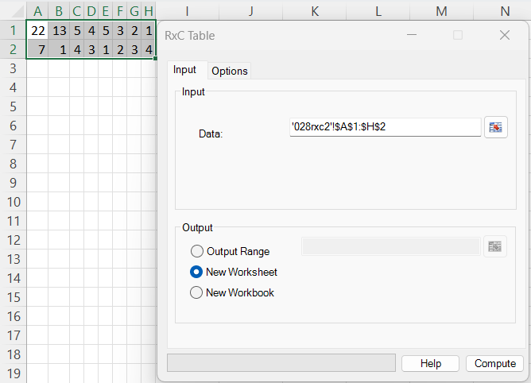
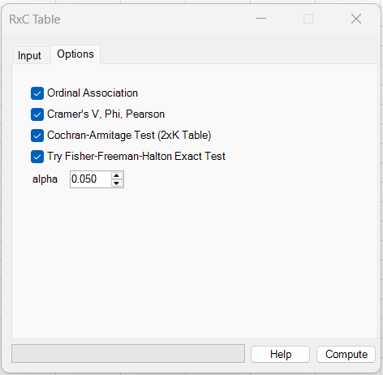
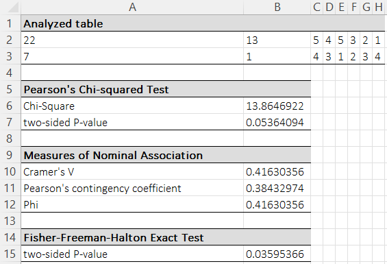
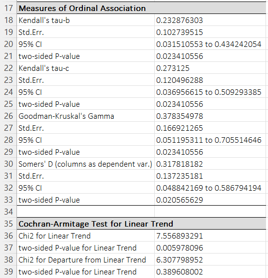

# RxC Table

**Includes:** Pearson chi-square test of independence, Nominal association (Cramer's V, Phi, contingency coefficient), Fisher–Freeman–Halton exact test (optional), Ordinal association (tau-b/tau-c, gamma, Somers’ D), Cochran–Armitage trend test (when applicable).  
**Purpose:** Analyze general contingency tables and report association measures and exact/trend tests where applicable.

---

## Overview

This tool analyzes a contingency table where each cell contains a **count** (frequency). It can:

- test **independence** of rows and columns (Pearson chi-squared),
- report **nominal association** effect sizes (Cramér’s V, Phi, contingency coefficient),
- optionally compute the **Fisher–Freeman–Halton exact test** (an \(r\times c\) generalization of Fisher’s exact test),
- when categories are **ordered**, report **ordinal association** measures (tau-b, tau-c, gamma, Somers’ D),
- for **2×K** tables with ordered columns, optionally run the **Cochran–Armitage** test for linear trend and a test for **departure from linear trend**.

---

## Example dataset

The example used in the screenshots is a 2×8 table of counts.

Download:

- [028rxc2.csv](../assets/data/028rxc/028rxc2.csv)

CSV (counts only, no labels):

```
22,13,5,4,5,3,2,1
7,1,4,3,1,2,3,4
```

---

## Screenshots (BESHStatNG)

### Input tab


### Options tab


### Results (chi-squared, nominal association, exact test)


### Results (ordinal association, trend test)


---

## When to use it

Use RxC Table when you have **categorical** data summarized as a frequency table:

- rows = levels of a categorical variable \(R\),
- columns = levels of a categorical variable \(C\),
- each cell \(n_{ij}\) is the number of observations in row \(i\), column \(j\).

Typical uses:

- treatment group × outcome category tables
- survey response tables
- cross-tabulations of two categorical variables

Requirements / notes:

- The selected range should contain **counts** (non-negative numbers).
- Pearson’s chi-squared test uses a large-sample approximation; if expected counts are small, the exact test may be preferred (when feasible).
- Ordinal measures assume the **row and/or column categories are ordered** in the way they appear in the table.
- Cochran–Armitage requires a **2×K** table and ordered columns.

---

## Inputs in Excel

### Data range

- **Data:** an \(r\times c\) block of **counts** (no row/column totals).
- The example selects cells `A1:H2` (2 rows, 8 columns).

### Missing / non-numeric cells

Cells that are missing or non-numeric are not valid for this analysis. Ensure the range contains only numeric counts.

### Output destination

- Output range (current sheet)
- New worksheet
- New workbook

---

## Options

The **Options** tab lets you include additional analyses:

- **Ordinal Association**  
  Adds Kendall’s tau-b / tau-c, Goodman–Kruskal’s Gamma, Somers’ D (columns as dependent variable).
- **Cramer's V, Phi, Pearson**  
  Adds nominal association measures derived from Pearson’s chi-squared statistic.
- **Cochran–Armitage Test (2×K Table)**  
  Adds the Cochran–Armitage linear trend test (only meaningful for 2×K tables with ordered columns).
- **Try Fisher–Freeman–Halton Exact Test**  
  Attempts an exact test for general \(r\times c\) tables (can be slow for large margins).
- **Alpha**  
  Two-sided significance level used for the ordinal-association confidence intervals.  
  Default: **0.05** (95% confidence interval).

---

## Steps in the add-in

1. Ribbon: **BESH Stat NG → Analyse → Contingency Table Analysis → RxC Table**
2. On the **Input** tab, select the **Data** range (counts).
3. On the **Options** tab, choose the additional analyses you want.
4. Choose output destination and click **Compute**.

---

## Output (how to read it)

### Analyzed table
The output repeats the selected table of counts.

### Pearson’s Chi-squared Test
- **Chi-Square:** Pearson’s \(\chi^2\) statistic for testing independence.
- **two-sided P-value:** upper-tail p-value from the \(\chi^2\) distribution with \((r-1)(c-1)\) degrees of freedom.

### Measures of Nominal Association
- **Cramer’s V:** effect size in \([0,1]\) (0 = no association).
- **Pearson’s contingency coefficient:** effect size in \([0,1)\) (upper bound depends on table size).
- **Phi:** \(\sqrt{\chi^2/n}\). For \(r\times c\) with \(r>2\) or \(c>2\), Phi can exceed 1, so prefer Cramer’s V.

### Fisher–Freeman–Halton Exact Test (optional)
- **two-sided P-value:** an exact p-value conditional on the observed margins (when the computation is feasible).

### Measures of Ordinal Association (optional)
For ordered categories, the output reports:
- Kendall’s tau-b and tau-c
- Goodman–Kruskal’s Gamma
- Somers’ D (columns as dependent variable)

Each includes:

- estimate
- standard error (asymptotic)
- confidence interval at the selected \(1-\alpha\) level (normal approximation)
- two-sided p-value

### Cochran–Armitage Test for Linear Trend (optional, 2×K only)
Reports:

- **Chi2 for Linear Trend** (df = 1)
- **two-sided p-value for Linear Trend**
- **Chi2 for Departure from Linear Trend** (df = \(K-2\))
- corresponding p-value for departure

A significant departure test suggests the association is not well described by a single linear trend across ordered columns.

---

## What it does (math and implementation details)

Let \(n_{ij}\) be the observed count in row \(i\), column \(j\), with:

- row totals: \(n_{i+}=\sum_{j=1}^{c} n_{ij}\)
- column totals: \(n_{+j}=\sum_{i=1}^{r} n_{ij}\)
- grand total: \(n=\sum_{i=1}^{r}\sum_{j=1}^{c} n_{ij}\)

### 1) Pearson chi-squared test of independence

Expected counts under independence:

$$
e_{ij} = \frac{n_{i+}\,n_{+j}}{n}
$$

Pearson statistic:

$$
\chi^2 = \sum_{i=1}^{r}\sum_{j=1}^{c}\frac{(n_{ij}-e_{ij})^2}{e_{ij}}
$$

Degrees of freedom:

$$
\mathrm{df}=(r-1)(c-1)
$$

p-value:

$$
p = \Pr\!\left(\chi^2_{\mathrm{df}} \ge \chi^2_{\mathrm{obs}}\right)
$$

### 2) Nominal association measures (from \(\chi^2\))

- **Phi:**

$$
\phi = \sqrt{\frac{\chi^2}{n}}
$$

- **Cramér’s V:**

$$
V = \sqrt{\frac{\chi^2}{n\,\min(r-1,\;c-1)}}
$$

- **Pearson’s contingency coefficient:**

$$
C = \sqrt{\frac{\chi^2}{\chi^2+n}}
$$

### 3) Fisher–Freeman–Halton exact test (optional)

This is the exact test of independence for an \(r\times c\) table, conditional on the observed margins.
Under \(H_0\), the probability of a particular table \(\{n_{ij}\}\) given the margins is:

$$
\Pr(\{n_{ij}\}\mid \{n_{i+}\},\{n_{+j}\}) =
\frac{\prod_{i=1}^{r} n_{i+}!\;\prod_{j=1}^{c} n_{+j}!}{n!\;\prod_{i=1}^{r}\prod_{j=1}^{c} n_{ij}!}
$$

The FFH p-value is obtained by summing the probabilities of all tables that are **at least as extreme** as the observed table (a common and widely used definition is *probability ordering*: include all tables with probability \(P(\text{table}) \le P(\text{observed})\)). In practice, a good implementation avoids brute-force enumeration by using a **network / dynamic-programming recursion** (Mehta–Patel style)to efficiently traverse feasible tables with fixed margins and accumulate their probabilities (typically using log-factorials to maintain numerical stability). This approach is valuable because it yields a **true exact p-value** (no large-sample \(\chi^2\) approximation), remains valid for **small counts or sparse tables**, and the network/DP recursion is usually **much faster and more stable** than naïve enumeration for moderate \(r \times c\) tables.

> Practical note: Exact enumeration can be expensive when margins are large. The add-in option says “Try … Exact Test” because the computation may not finish quickly for large problems.

### 4) Ordinal association measures (optional)

Assume the categories are ordered as they appear.

Define the number of **concordant** and **discordant** pairs:

$$
P = \sum_{i<k}\sum_{j<\ell} n_{ij}\,n_{k\ell},
\qquad
Q = \sum_{i<k}\sum_{j>\ell} n_{ij}\,n_{k\ell}.
$$

Define tie counts:

- ties on rows (same row, different columns):

$$
T_r = \sum_{i=1}^{r}\sum_{j<\ell} n_{ij}\,n_{i\ell}
$$

- ties on columns (same column, different rows):

$$
T_c = \sum_{j=1}^{c}\sum_{i<k} n_{ij}\,n_{kj}
$$

Then:

- **Kendall’s tau-b:**

$$
\tau_b = \frac{P-Q}{\sqrt{(P+Q+T_r)(P+Q+T_c)}}
$$

- **Kendall’s tau-c** (Stuart’s tau-c), with \(m=\min(r,c)\):

$$
\tau_c = \frac{2m\,(P-Q)}{n^2\,(m-1)}
$$

- **Goodman–Kruskal’s Gamma:**

$$
\gamma = \frac{P-Q}{P+Q}
$$

- **Somers’ D (columns as dependent variable):**

$$
D_{C\mid R} = \frac{P-Q}{P+Q+T_c}
$$

BESHStatNG reports asymptotic standard errors and uses a normal approximation for tests and confidence intervals:

### Asymptotic standard errors (normal approximation)

For the ordinal association measures (Kendall’s \(\tau_b\), Kendall’s \(\tau_c\), Goodman–Kruskal’s \(\gamma\), and Somers’ \(D\)), BESHStatNG reports **asymptotic standard errors** and uses a **normal approximation** for two-sided tests and confidence intervals:

- Test statistic: \(Z = \dfrac{\widehat{\theta}}{\mathrm{SE}(\widehat{\theta})}\)
- Two-sided p-value: \(p = 2\{1-\Phi(|Z|)\}\)
- \(100(1-\alpha)\%\) CI: \(\widehat{\theta} \pm z_{1-\alpha/2}\,\mathrm{SE}(\widehat{\theta})\)

where \(\Phi(\cdot)\) is the standard normal CDF and \(z_{1-\alpha/2}\) is the standard normal quantile.

#### Definitions used by the add-in

Let \(n_{ij}\) be the observed count in row \(i\) and column \(j\), for an \(r \times c\) table. Let

\[
N = \sum_{i=1}^{r}\sum_{j=1}^{c} n_{ij}, \qquad m=\min(r,c).
\]

Define the total number of **concordant** and **discordant** pairs (computed by summing over all pairs of cells, weighted by products of their counts):

- A pair of cells \((i,j)\) and \((k,\ell)\) is **concordant** if \((i-k)(j-\ell) > 0\)
- **discordant** if \((i-k)(j-\ell) < 0\)

Let \(P\) = total concordant pairs and \(Q\) = total discordant pairs.

For Kendall’s \(\tau_b\), the add-in also computes tie-adjusted pair totals:
- \(E_1\): number of pairs **not tied on rows**
- \(E_2\): number of pairs **not tied on columns**

(These are accumulated during the same cell-pair loop; pairs tied on rows contribute to \(E_2\) only, pairs tied on columns contribute to \(E_1\) only.)

#### Quadrant sums \(C_{ij}\) and \(D_{ij}\)

For each cell \((i,j)\), define:

\[
C_{ij} = \sum_{k<i}\sum_{\ell<j} n_{k\ell} \;+\; \sum_{k>i}\sum_{\ell>j} n_{k\ell},
\qquad
D_{ij} = \sum_{k<i}\sum_{\ell>j} n_{k\ell} \;+\; \sum_{k>i}\sum_{\ell<j} n_{k\ell}.
\]

That is, \(C_{ij}\) is the total count in the **NW + SE** quadrants relative to \((i,j)\) (concordant directions), and \(D_{ij}\) is the total count in the **NE + SW** quadrants (discordant directions).

The add-in then computes the key quantity:

\[
S_0 \;=\; \sum_{i=1}^{r}\sum_{j=1}^{c} n_{ij}\,\big(C_{ij}-D_{ij}\big)^2.
\]

#### Standard errors used by the add-in

**Goodman–Kruskal’s \(\gamma\)**

\[
\widehat{\gamma} = \frac{P-Q}{P+Q},
\qquad
\mathrm{SE}(\widehat{\gamma}) \;=\;
\frac{2}{2P+2Q}\,
\sqrt{\,S_0 - \frac{(2P-2Q)^2}{N}\,}.
\]

**Kendall’s \(\tau_b\)**

\[
\widehat{\tau}_b = \frac{P-Q}{\sqrt{E_1E_2}},
\qquad
\mathrm{SE}(\widehat{\tau}_b) \;=\;
\sqrt{\frac{\,S_0 - \dfrac{(2P-2Q)^2}{N}\,}{E_1E_2}}.
\]

**Kendall’s \(\tau_c\)**

\[
\widehat{\tau}_c = \frac{m\,(2P-2Q)}{N^2\,(m-1)},
\qquad
\mathrm{SE}(\widehat{\tau}_c) \;=\;
\frac{2m}{(m-1)\,N^2}\,
\sqrt{\,S_0 - \frac{(2P-2Q)^2}{N}\,}.
\]

**Somers’ \(D\)** (columns treated as dependent, rows as independent)

Let row totals be \(n_{i\cdot}=\sum_{j=1}^{c} n_{ij}\). Define

\[
D_m = \sum_{i=1}^{r} n_{i\cdot}^2,
\qquad
W = N^2 - D_m.
\]

Then

\[
\widehat{D} = \frac{2(P-Q)}{W}.
\]

The add-in computes

\[
V = \sum_{i=1}^{r}\sum_{j=1}^{c}
n_{ij}\,\Big(W(C_{ij}-D_{ij}) - 2(P-Q)(N-n_{i\cdot})\Big)^2,
\]

and reports

\[
\mathrm{SE}(\widehat{D}) \;=\; \frac{2}{W^2}\,\sqrt{V}.
\]

> Note: Different software may report slightly different standard errors for ordinal association measures because multiple asymptotic variance formulas exist (and some packages use alternative tie-handling or variance estimators).

### 5) Cochran–Armitage test for linear trend (2×K only)

For a \(2\times K\) table with ordered columns, assign column scores \(w_j\) (BESHStatNG uses \(w_j=j\)).

Let \(n_{1j}\) be the count in row 1, column \(j\),
\(n_{+j}\) the column total, \(n_{1+}\) and \(n_{2+}\) the row totals, and \(n\) the grand total.

Define:

$$
S = \sum_{j=1}^{K} w_j\left(n_{1j} - \frac{n_{1+}\,n_{+j}}{n}\right)
$$

BESHStatNG uses the variance:

$$
\mathrm{Var}(S) =
\frac{n_{1+}\,n_{2+}}{n^2}
\left[
\sum_{j=1}^{K} w_j^2\,n_{+j} -
\frac{\left(\sum_{j=1}^{K} w_j\,n_{+j}\right)^2}{n}
\right]
$$

Then:

$$
Z = \frac{S}{\sqrt{\mathrm{Var}(S)}},
\qquad
\chi^2_{\mathrm{trend}} = Z^2 \sim \chi^2_{1}
$$

The add-in also reports a **departure from linear trend** test by decomposing the Pearson chi-squared statistic:

$$
\chi^2_{\mathrm{departure}} = \chi^2_{\mathrm{Pearson}} - \chi^2_{\mathrm{trend}}
\sim \chi^2_{K-2}
$$

---

## Example results (from the included dataset)

For the example 2×8 table (total \(n=80\)) the output should match the screenshots approximately:

- Pearson chi-squared: \(\chi^2=13.86469224\), df \(=7\), p \(=0.053640936\)
- Cramér’s V: \(0.416303559\)
- Pearson’s contingency coefficient: \(0.384329735\)
- Phi: \(0.416303559\)
- Fisher–Freeman–Halton exact test (two-sided): p \(=0.035953659\)
- Ordinal measures (selected):
  - \(\tau_b=0.232876303\) (p \(=0.023410556\))
  - \(\gamma=0.378354978\) (p \(=0.023410556\))
  - Somers’ \(D_{C\mid R}=0.317818182\) (p \(=0.020565629\))
- Cochran–Armitage trend: \(\chi^2=7.556893291\), p \(=0.005978096\)
- Departure from trend: \(\chi^2=6.307798952\), df \(=6\), p \(=0.389608002\)

---

## R code (to reproduce the analysis)

### Read the table

```r
tbl <- as.matrix(read.csv("028rxc2.csv", header = FALSE))
n <- sum(tbl)
tbl
```

### Pearson chi-squared test

```r
chisq <- chisq.test(tbl, correct = FALSE)
chisq$statistic
chisq$parameter  # df
chisq$p.value
```

### Nominal association measures

```r
chi2 <- as.numeric(chisq$statistic)

phi <- sqrt(chi2 / n)
cramers_v <- sqrt(chi2 / (n * min(nrow(tbl) - 1, ncol(tbl) - 1)))
cont_coeff <- sqrt(chi2 / (chi2 + n))

c(phi = phi, cramers_v = cramers_v, contingency = cont_coeff)
```

> You can also use packages such as **DescTools** or **vcd** (e.g., `DescTools::CramerV(tbl)` or `vcd::assocstats(tbl)`) for convenience.

### Fisher–Freeman–Halton exact test (RxC Fisher exact)

```r
fisher.test(tbl)$p.value
```

Notes:
- For larger tables, exact computation may be slow. In R you can use Monte Carlo simulation with `fisher.test(tbl, simulate.p.value = TRUE, B = 1e5)`.

### Ordinal association measures

Many R packages provide these measures for ordered tables. One convenient option is **DescTools**:

```r
# install.packages("DescTools")
library(DescTools)

KendallTauB(tbl)
KendallTauC(tbl)
GoodmanKruskalGamma(tbl)
SomersDelta(tbl, direction = "column")  # columns as dependent variable
```

If your R setup uses different function names or returns slightly different standard errors/CI,
it is usually due to different large-sample variance formulas or CI methods.

### Cochran–Armitage trend test (match the add-in)

To match BESHStatNG’s trend chi-square exactly, compute it from the same formulas used above:

```r
w <- seq_len(ncol(tbl))        # column scores 1..K
n1j <- tbl[1, ]
nj  <- colSums(tbl)
n1  <- sum(n1j)
n2  <- sum(tbl[2, ])
n   <- sum(tbl)

S <- sum(w * (n1j - n1 * nj / n))
A <- sum(w^2 * nj) - (sum(w * nj)^2) / n
VarS <- (n1 * n2 / n^2) * A

Z <- S / sqrt(VarS)
chi2_trend <- Z^2
p_trend <- pchisq(chi2_trend, df = 1, lower.tail = FALSE)

c(chi2_trend = chi2_trend, p_trend = p_trend)
```

Departure from linear trend (decomposition):

```r
chi2_pearson <- as.numeric(chisq$statistic)
chi2_depart <- chi2_pearson - chi2_trend
df_depart <- ncol(tbl) - 2
p_depart <- pchisq(chi2_depart, df = df_depart, lower.tail = FALSE)

c(chi2_depart = chi2_depart, df_depart = df_depart, p_depart = p_depart)
```

Expected differences vs. R:

- Some R functions for trend testing use an alternative variance with an \((n-1)\) factor; that yields a slightly different \(\chi^2\) value. The manual code above matches the add-in’s output.
- Exact-test p-values can differ across implementations because “two-sided” exact p-values are not uniquely defined for \(r\times c\) tables; `fisher.test()` uses a common probability-ordering definition that typically matches spreadsheet outputs.

---

## See also

- [2x2 Table](2x2-table.md)
- [Mantel-Haenszel Test](mantel-haenszel-test.md)
- [Home](../index.md)
