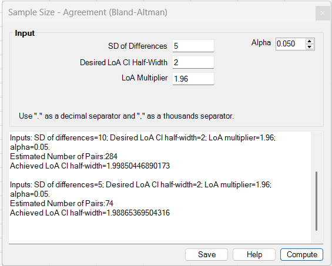
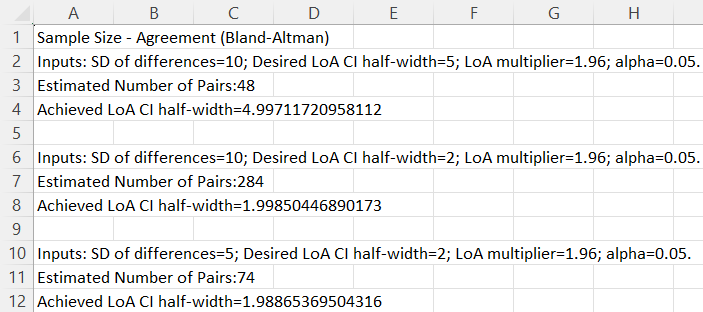

# Sample Size – Agreement (Bland-Altman)

**Includes:** Sample size planning for a **Bland-Altman agreement study** when the goal is to control the **confidence-interval half-width around a limit of agreement (LoA)**.  
**Purpose:** Estimate the required **number of paired measurements** so that the confidence interval around either LoA is sufficiently precise on the original measurement scale.

---

## Overview

This tool is used when the main design objective is **precision of the Bland-Altman limits of agreement**, not a hypothesis test on a mean difference or correlation.

The dialog plans the required number of **pairs** from:

- the expected **SD of the paired differences**,
- the desired **LoA CI half-width**,
- a two-sided **alpha**, and
- the **LoA multiplier**.

The default LoA multiplier is **1.96**, which corresponds to the conventional 95% limits of agreement:

\[
\text{LoA} = \bar d \pm 1.96\, s_d
\]

where:

- \(\bar d\) is the mean paired difference,
- \(s_d\) is the standard deviation of the paired differences.

The add-in then searches for the **smallest integer number of pairs** whose approximate confidence interval around a LoA is no wider than the requested target.

This planner is useful when you want to answer questions such as:

- “How many paired measurements do I need so that the upper and lower limits of agreement are estimated precisely enough?”
- “How many method-comparison pairs are required for a reliability/agreement substudy?”
- “How large should an assay/device comparison study be if the LoA must be reported with a narrow confidence interval?”

---

## Screenshots (BESHStatNG)

### Input

### Results (and Save to sheet)

---

## When to use it

Use this tool when:

- the study collects **paired measurements** on the same subject, sample, or item,
- the primary agreement summary is a **Bland-Altman limit of agreement**,
- the main planning objective is the **precision** of the reported LoA,
- you can specify an expected **SD of differences** on the chosen measurement scale,
- you have a practical target for the acceptable **half-width** of the LoA confidence interval.

Typical examples include:

- method-comparison studies,
- device-comparison studies,
- assay validation work,
- clinical chemistry agreement studies,
- pilot planning for paired agreement experiments.

This planner is most appropriate when:

- each unit contributes **one complete pair** of measurements,
- the main reporting target is the LoA rather than a hypothesis test,
- the expected SD of paired differences is available from prior data, literature, or a pilot study,
- the desired precision can be expressed in the **same units** as the measurement differences.

If your main objective is a **reliability hypothesis test on ICC**, use **Sample Size – Intraclass Correlation (ICC)** instead.

---

## Dialog inputs

All inputs are typed directly into the dialog. No worksheet range selection is needed.

- **SD of Differences**  
  Expected standard deviation of the paired differences. This must be strictly positive.

- **Desired LoA CI Half-Width**  
  Target half-width of the confidence interval around either limit of agreement, expressed on the original measurement scale. Smaller values require larger samples.

- **LoA Multiplier**  
  Multiplier used to define the limits of agreement. The usual value is **1.96** for 95% LoA. Other positive values can be used if a different LoA definition is required.

- **Alpha**  
  Two-sided alpha used for the confidence interval around each limit of agreement.

### Input constraints

- SD of Differences must be **> 0**.
- Desired LoA CI Half-Width must be **> 0**.
- LoA Multiplier must be **> 0**.
- Alpha must satisfy **\(0 < \alpha < 1\)**.
- At least **3 pairs** are required by the approximation used in the add-in.

> Note: there is **no Beta / power input** for this planner because this is a **precision-based** design, not a hypothesis-test power calculation.

---

## Steps in the add-in

1. In Excel ribbon, go to **BESH Stat NG → Analyse → Sample Size → Agreement (Bland-Altman)**.
2. Enter the expected **SD of Differences**.
3. Enter the desired **LoA CI Half-Width**.
4. Leave **LoA Multiplier = 1.96** unless a different LoA definition is required.
5. Set **Alpha**.
6. Click **Compute**.
7. Review the estimated number of pairs and the achieved half-width.
8. Optionally click **Save** to write the results to a new worksheet.

> Tip: each click on **Compute** appends a new output block to the results box, which makes it easy to compare multiple planning scenarios.

---

## Output (how to read it)

The results box reports:

- the entered planning values,
- **Estimated Number of Pairs**, and
- **Achieved LoA CI half-width**.

Interpretation:

- **Estimated Number of Pairs** is the smallest integer number of complete pairs found by the add-in that reaches the requested precision target.
- **Achieved LoA CI half-width** is the approximate half-width at that final rounded sample size.
- Because the output must be an integer number of pairs, the achieved half-width will usually be **slightly smaller than or equal to** the requested target.

The result is the number of **paired observations**, not the number of single measurements.

---

## Planning target

This method does **not** plan sample size for a hypothesis test.

Instead, it solves the following design problem:

> Find the smallest number of paired observations \(n\) such that the confidence interval around either Bland-Altman limit of agreement has a half-width no larger than a pre-specified target.

So the quantity being controlled is:

\[
\text{Half-width of CI around a LoA} \le H
\]

where \(H\) is the user-entered **Desired LoA CI Half-Width**.

---

## What the add-in does

Let:

- \(n\) = number of paired observations,
- \(s_d\) = expected SD of the paired differences,
- \(\alpha\) = two-sided alpha,
- \(L\) = LoA multiplier (usually 1.96),
- \(H\) = desired half-width of the confidence interval around a LoA.

### 1) Limits of agreement

The Bland-Altman limits of agreement are defined as:

\[
\bar d - L s_d
\qquad\text{and}\qquad
\bar d + L s_d
\]

where \(\bar d\) is the mean difference.

### 2) Approximate standard error of a LoA

The add-in uses the same approximate LoA standard error as the main agreement backend:

\[
SE_{LoA}(n) = s_d \sqrt{\frac{1}{n} + \frac{L^2}{2(n-1)}}
\]

This combines uncertainty from estimating both:

- the mean difference, and
- the spread of the paired differences.

### 3) Confidence-interval half-width around a LoA

For a candidate sample size \(n\), the add-in uses the t distribution with \(n-1\) degrees of freedom:

\[
t_{1-\alpha/2,\,n-1}
\]

and computes the approximate CI half-width:

\[
HW(n) = t_{1-\alpha/2,\,n-1} \times SE_{LoA}(n)
\]

That is:

\[
HW(n) = t_{1-\alpha/2,\,n-1}
\times
s_d \sqrt{\frac{1}{n} + \frac{L^2}{2(n-1)}}
\]

### 4) Search for the required number of pairs

The add-in does not use a single closed-form sample-size formula. Instead it:

1. starts from a small number of pairs,
2. expands the search range until the target half-width is bracketed,
3. performs a binary search,
4. returns the **smallest integer** \(n \ge 3\) such that:

\[
HW(n) \le H
\]

where \(H\) is the user-entered desired half-width.

---

## Practical interpretation

Suppose you expect:

- SD of differences = 5,
- desired LoA CI half-width = 2,
- LoA multiplier = 1.96,
- alpha = 0.05.

If the add-in reports:

- **Estimated Number of Pairs = 74**
- **Achieved LoA CI half-width \(\approx 1.99\)**

then the interpretation is:

- about **74 paired observations** are required,
- at that sample size, the confidence interval around either LoA is expected to extend about **1.99 units** on either side of the estimated LoA,
- this slightly improves on the requested target of 2 units because the final answer must be an integer.

If you tighten the target half-width, the required sample size increases quickly.

---

## Notes and assumptions

- The tool is designed for **paired** Bland-Altman agreement studies.
- The calculation is based on an **approximate LoA standard error** and a **t critical value**.
- The result depends strongly on the assumed **SD of differences**. Use the best available prior information.
- The planner targets **precision of LoA**, not power for a null-hypothesis test.
- The output is the number of **complete pairs** required.
- If repeated measurements per subject are planned and the repeated structure is central to the design, interpret the result cautiously and consider whether a more specialized repeated-measures planning strategy is needed.

---

## Common planning tips

- Use the same measurement scale that will be used in the final Bland-Altman analysis.
- Base the SD of differences on pilot data whenever possible.
- Choose the desired half-width from a **clinical or technical acceptability perspective**, not only from convenience.
- Keep the default LoA multiplier of **1.96** unless your reporting standard requires a different multiplier.
- Compare several plausible SD scenarios, because underestimating the SD of differences will underestimate the required sample size.

---

## See also

- [Bland-Altman Analysis](bland-altman.md)
- [Sample Size – Intraclass Correlation (ICC)](sample-size-icc.md)
- [Sample Size UDFs](../udf/sample-size.md)
- [Home](../index.md)
