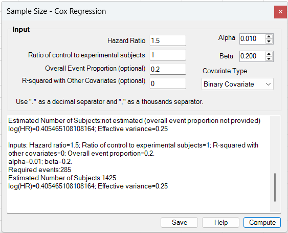
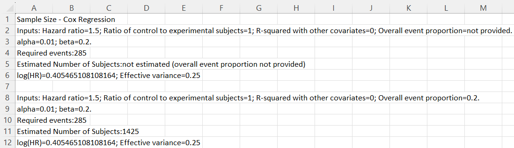

# Sample Size – Cox Regression

**Includes:** Event-count and subject-count planning for a **Cox proportional hazards model** with either a **binary covariate** or a **continuous covariate**.  
**Purpose:** Estimate the required **number of events**, and when an overall event proportion is supplied, the corresponding **number of subjects**.

---

## Overview

This tool is used during study planning for a time-to-event analysis based on a **Cox proportional hazards regression model**.

The dialog includes a **Covariate Type** selector:

- **Binary Covariate**
- **Continuous Covariate**

The selected mode changes the meanings of the input fields.

In both modes, the add-in first estimates how many **events** are required to detect the planned hazard ratio with the requested significance level and power. If you also provide an **overall event proportion**, the add-in inflates the event count to an estimated **number of subjects**.

In the current dialog, the calculation is run as a **two-sided** design.

---

## Screenshots (BESHStatNG)

### Input

### Results (and Save to sheet)

---

## When to use it

Use this tool when:

- the outcome is **time to event**,
- the planned primary analysis is a **Cox proportional hazards model**,
- the effect of interest can be summarized by a **hazard ratio**, and
- you want to power the study on the basis of the required **number of events**.

Typical examples include:

- treatment effect planning in a two-arm survival study,
- planning for a binary exposure or risk-factor effect,
- planning for a continuous biomarker or score,
- event-driven study design with optional conversion from events to subjects.

This planning tool is most appropriate when:

- the proportional hazards assumption is a reasonable design approximation,
- the target effect size can be expressed as a hazard ratio,
- the covariate variance or allocation ratio is known or can be assumed,
- an overall study-window event proportion is available if you also want an estimated number of subjects.

---

## Dialog inputs

All inputs are typed directly into the dialog. No worksheet range selection is needed.

### Common inputs

- **Alpha**: Type I error rate for the current **two-sided** design.
- **Beta**: Type II error rate. Statistical power is \(1-\beta\).
- **Overall Event Proportion (optional)**: expected event proportion across all enrolled subjects during follow-up. If omitted, the add-in reports the required **events** only.
- **R-squared with Other Covariates (optional)**: fraction of variance in the covariate of interest explained by the remaining model covariates. Use `0` when no adjustment penalty is assumed.

### Binary Covariate mode

- **Hazard Ratio**: anticipated hazard ratio for the binary covariate of interest.
- **Ratio of control to experimental subjects**: allocation ratio

\[
\kappa = \frac{n_C}{n_E}
\]

Use:

- `1` for equal allocation,
- `2` for twice as many controls as experimental subjects,
- `0.5` for twice as many experimental subjects as controls.

### Continuous Covariate mode

- **Hazard Ratio per Unit**: anticipated hazard ratio for a one-unit increase in the covariate.
- **Covariate Standard Deviation**: standard deviation of the covariate in the target population.

### Input constraints

For both modes:

- hazard ratio must be **strictly positive** and must differ from 1,
- alpha and beta must satisfy \(0 < p < 1\),
- if supplied, the overall event proportion must satisfy \(0 < p < 1\),
- if supplied, \(R^2\) with other covariates must satisfy \(0 \le R^2 < 1\).

Additional requirements:

- in **Binary Covariate** mode, the allocation ratio must be **greater than 0**,
- in **Continuous Covariate** mode, the covariate SD must be **greater than 0**.

---

## Steps in the add-in

1. In Excel ribbon, go to **BESH Stat NG → Analyse → Sample Size → Cox Regression**.
2. Choose the **Covariate Type**.
3. Enter the planning values.
4. Click **Compute**.
5. Review the required event count and, if available, the estimated number of subjects.
6. Optionally click **Save** to write the results to a new worksheet.

> Tip: if you leave **Overall Event Proportion** blank, you can compare designs on the event-count scale first and add subject inflation later.

---

## Output (how to read it)

The results box reports:

- the entered planning values,
- **Required events**,
- **Estimated Number of Subjects**, when overall event proportion is supplied,
- **log(HR)**,
- **Effective variance**.

Interpretation:

- **Required events** is the core power target for the Cox design.
- **Estimated Number of Subjects** is reported only when the overall event proportion is supplied.
- **log(HR)** is the effect size used internally in the event-count formula.
- **Effective variance** is the variance term contributed by the covariate of interest before the \((1-R^2)\) attenuation factor is applied.

If no overall event proportion is given, the add-in reports that the subject count is **not estimated**.

---

## Hypotheses

For the covariate of interest, the Cox planning calculation targets the null hypothesis of no association:

\[
H_0: HR = 1
\]

versus the alternative:

\[
H_1: HR \ne 1
\]

for the current two-sided implementation.

Equivalently, on the log-hazard scale:

\[
H_0: \log(HR) = 0
\qquad \text{vs} \qquad
H_1: \log(HR) \ne 0
\]

---

## What the add-in does

Let:

- \(\alpha\) = Type I error rate,
- \(\beta\) = Type II error rate,
- \(z_{1-\alpha/2}\) = two-sided critical normal value,
- \(z_{1-\beta}\) = power quantile,
- \(HR\) = anticipated hazard ratio,
- \(R^2\) = proportion of variance explained by the remaining covariates.

The current dialog uses a **two-sided** design, so the critical value is based on \(\alpha/2\).

### General event-count form

In both modes, the required number of events is computed from the form:

\[
D = \frac{\left(z_{1-\alpha/2} + z_{1-\beta}\right)^2}
{(1-R^2)\,V\,[\log(HR)]^2}
\]

where:

- \(D\) = required number of events,
- \(V\) = effective variance term for the covariate of interest.

The add-in rounds \(D\) **up** to the next integer.

### 1) Binary Covariate mode

For a binary covariate such as treatment group, the allocation ratio is:

\[
\kappa = \frac{n_C}{n_E}
\]

From this, the add-in computes allocation proportions:

\[
\pi_E = \frac{1}{1+\kappa},
\qquad
\pi_C = \frac{\kappa}{1+\kappa}
\]

The effective variance term is:

\[
V = \pi_C\pi_E
\]

So the event-count formula becomes:

\[
D = \frac{\left(z_{1-\alpha/2} + z_{1-\beta}\right)^2}
{(1-R^2)\,\pi_C\pi_E\,[\log(HR)]^2}
\]

This is why unequal allocation increases the required number of events: the product \(\pi_C\pi_E\) is largest at equal allocation and gets smaller as the design becomes more imbalanced.

### 2) Continuous Covariate mode

For a continuous covariate, let \(\sigma_X\) be the assumed SD of the covariate in the target population.

The effective variance term is:

\[
V = \sigma_X^2
\]

So the event-count formula becomes:

\[
D = \frac{\left(z_{1-\alpha/2} + z_{1-\beta}\right)^2}
{(1-R^2)\,\sigma_X^2\,[\log(HR)]^2}
\]

Larger covariate variation generally makes the effect easier to detect for a fixed hazard ratio per unit and therefore reduces the required number of events.

### 3) From events to subjects

If the **Overall Event Proportion** \(q\) is supplied, the add-in estimates the number of subjects as:

\[
N = \left\lceil \frac{D}{q} \right\rceil
\]

where:

- \(D\) = required number of events,
- \(q\) = expected overall event proportion during the study window.

If \(q\) is omitted, the add-in reports the event count only.

---

## Practical interpretation

- A smaller effect size, meaning \(|\log(HR)|\) closer to 0, increases the required number of events.
- Stronger correlation with other model covariates, reflected by larger \(R^2\), increases the required number of events.
- In binary-covariate planning, equal allocation is usually most efficient when operationally feasible.
- In continuous-covariate planning, realistic assumptions about the covariate SD are important; underestimating the SD can overstate the required number of events.
- The optional subject-count calculation is only as good as the assumed overall event proportion.

---

## Notes and limitations

- The current dialog is implemented as a **two-sided** design.
- The planning calculation is based on the anticipated hazard ratio and the covariate variance structure, not on a full accrual/follow-up simulation.
- The optional subject-count calculation uses a **single overall event proportion**, not separate accrual and censoring assumptions.
- The binary-covariate mode is especially useful for treatment-group planning; the continuous-covariate mode is useful for biomarkers, scores, and other quantitative predictors.

---

## Related pages

- [Cox Regression](cox-regression.md)
- [Logrank Test](logrank-test.md)
- [Sample Size – Log-rank Test](sample-size-log-rank.md)
