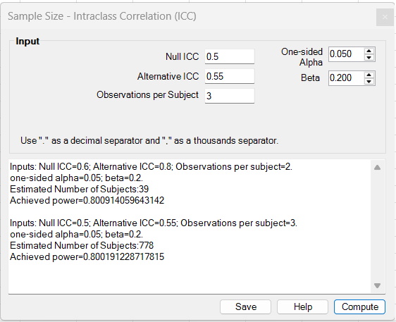
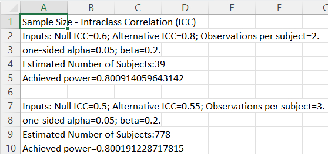

# Sample Size – Intraclass Correlation (ICC)

**Includes:** Sample size planning for a **one-sided hypothesis test on an intraclass correlation coefficient (ICC)**.  
**Purpose:** Estimate the required **number of subjects** for a study in which each subject is measured repeatedly or rated multiple times.

---

## Overview

This tool is used during study planning when the main reliability objective is to show that the ICC exceeds a **minimum acceptable value**.

The dialog plans sample size for a **one-way random-effects ICC hypothesis test** using:

- a **Null ICC**,
- an **Alternative ICC**,
- the number of **Observations per Subject**,
- a **one-sided alpha**, and
- **beta**.

The add-in then searches for the smallest number of subjects that achieves the requested power.

This planner is intended for studies such as:

- repeated measurements on the same subject,
- repeatability studies,
- inter-rater or intra-rater reliability studies,
- agreement-focused pilot planning where the ICC is the main reliability summary.

---

## Screenshots (BESHStatNG)

### Input

### Results (and Save to sheet)

---

## When to use it

Use this tool when:

- the endpoint of interest is an **ICC**,
- each subject has **two or more** repeated observations or ratings,
- the design question is whether reliability is **better than a minimum acceptable ICC**, and
- you want to choose the number of **subjects** needed to achieve a target power.

Typical examples include:

- planning a repeatability study with repeated measurements per subject,
- planning an inter-rater reliability study,
- planning an intra-rater reliability study,
- planning an imaging or laboratory reliability substudy.

This planner is most appropriate when:

- the reliability target can be summarized by a **single ICC threshold**,
- the same number of observations per subject is planned for all subjects,
- the design can be approximated by a **one-way random-effects ICC test**,
- the planning objective is a formal **hypothesis test**, not precision of a confidence interval.

If your main objective is precision around a limit of agreement rather than ICC testing, use the **Agreement (Bland-Altman)** sample-size tool instead.

---

## Dialog inputs

All inputs are typed directly into the dialog. No worksheet range selection is needed.

- **Null ICC**  
  Minimum acceptable ICC under the null hypothesis. This is the benchmark the study is trying to exceed.

- **Alternative ICC**  
  Target ICC under the alternative hypothesis. This must be **greater than** the Null ICC.

- **Observations per Subject**  
  Number of repeated measurements or ratings planned for each subject. This must be an integer greater than or equal to 2.

- **One-sided Alpha**  
  One-sided type I error rate for the hypothesis test.

- **Beta**  
  Type II error rate. Statistical power is \(1-\beta\).

### Input constraints

- Null ICC must satisfy \(0 \le ICC < 1\).
- Alternative ICC must satisfy \(0 < ICC < 1\).
- Alternative ICC must be **greater than** Null ICC.
- Observations per subject must be an integer \(\ge 2\).
- Alpha and beta must satisfy \(0 < p < 1\).

---

## Steps in the add-in

1. In Excel ribbon, go to **BESH Stat NG → Analyse → Sample Size → Intraclass Correlation (ICC)**.
2. Enter the **Null ICC**.
3. Enter the **Alternative ICC**.
4. Enter the number of **Observations per Subject**.
5. Set **One-sided Alpha** and **Beta**.
6. Click **Compute**.
7. Review the estimated number of subjects and the achieved power.
8. Optionally click **Save** to write the results to a new worksheet.

> Tip: each click on **Compute** appends a new output block to the results box, which makes it easy to compare design scenarios.

---

## Output (how to read it)

The results box reports:

- the entered planning values,
- **Estimated Number of Subjects**, and
- **Achieved power**.

Interpretation:

- **Estimated Number of Subjects** is the smallest number of subjects found by the add-in’s search procedure that reaches or exceeds the requested power.
- **Achieved power** is the power at that final integer sample size. Because the result is rounded to an integer number of subjects, the achieved power will usually be slightly above the target power.

The output does **not** estimate the number of raters separately. The field **Observations per Subject** is treated as fixed by design.

---

## Hypotheses

Let \(\rho\) denote the ICC.

The planning problem is framed as a **one-sided** hypothesis test:

\[
H_0: \rho \le \rho_0
\qquad\text{vs}\qquad
H_1: \rho > \rho_0
\]

where:

- \(\rho_0\) is the **Null ICC**, and
- power is evaluated at a target alternative value \(\rho_1\) where \(\rho_1 > \rho_0\).

In other words, the study is designed to have power \(1-\beta\) when the true ICC is the **Alternative ICC**.

---

## What the add-in does

Let:

- \(n\) = number of subjects,
- \(k\) = observations per subject,
- \(\rho_0\) = Null ICC,
- \(\rho_1\) = Alternative ICC,
- \(\alpha\) = one-sided type I error rate,
- \(\beta\) = type II error rate.

The current implementation uses a **one-way random-effects F-test framework**.

### 1) Degrees of freedom

For a given number of subjects \(n\) and observations per subject \(k\), the add-in uses:

\[
df_1 = n - 1
\]

\[
df_2 = n(k - 1)
\]

### 2) ICC-to-scale transformation

For a candidate ICC value \(\rho\), the add-in computes the scaling term:

\[
c(\rho) = 1 + \frac{k\rho}{1-\rho}
\]

It then evaluates this at the null and alternative values:

\[
c_0 = 1 + \frac{k\rho_0}{1-\rho_0}
\qquad\text{and}\qquad
c_1 = 1 + \frac{k\rho_1}{1-\rho_1}
\]

### 3) Critical value and power

The one-sided critical value is based on the F distribution:

\[
F_{crit} = F^{-1}(1-\alpha; df_1, df_2)
\]

The add-in then rescales that cutoff by:

\[
\text{threshold} = \frac{c_0}{c_1} F_{crit}
\]

and computes power as:

\[
\text{Power}(n) = 1 - F_{CDF}(\text{threshold}; df_1, df_2)
\]

where \(F_{CDF}(\cdot; df_1, df_2)\) is the cumulative F distribution function with \(df_1\) and \(df_2\) degrees of freedom.

### 4) Search for the required number of subjects

The add-in does not use a single closed-form sample-size formula. Instead it:

1. starts from a small candidate subject count,
2. increases the upper bound until the target power is bracketed,
3. performs a binary search,
4. returns the **smallest integer** \(n\) such that:

\[
\text{Power}(n) \ge 1 - \beta
\]

This ensures that the reported sample size is the minimum integer number of subjects meeting the requested design target.

---

## Practical interpretation

- A **larger gap** between Alternative ICC and Null ICC reduces the required sample size.
- More **observations per subject** generally reduce the number of subjects needed.
- Smaller **alpha** or smaller **beta** increase the required sample size.
- If the Alternative ICC is only slightly higher than the Null ICC, the required subject count can become large.

---

## Notes and limitations

- The current planner is for a **one-way random-effects ICC test**.
- It is a **hypothesis-test** planning tool, not a confidence-interval precision tool.
- The design assumes a fixed number of observations per subject.
- The required sample size refers to the number of **subjects**, not the total number of measurements.
- If your reliability design requires a different ICC model or a precision-based target, additional planning methods may be more appropriate.

---

## Related pages

- [Intraclass Correlation Coefficients](intraclass-correlation-coefficients.md)
- [Agreement (Bland-Altman)](bland-altman.md)
- [Sample Size – Agreement (Bland-Altman)](sample-size-bland-altman.md)
- [Home](../index.md)