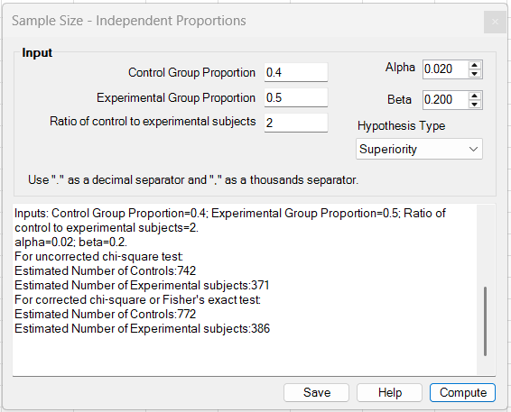
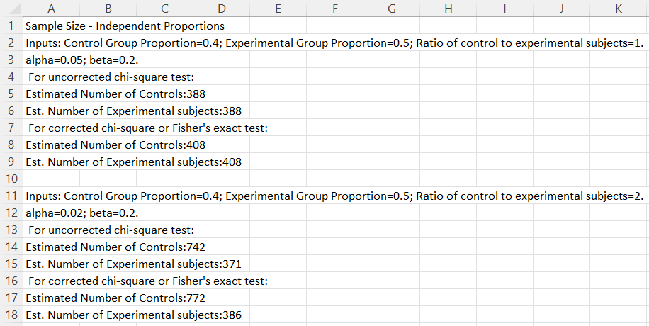

# Sample Size – Independent Proportions

**Includes:** Sample size for two independent proportions with **Superiority**, **Noninferiority**, and **Equivalence** modes.  
**Purpose:** Estimate required sample sizes for comparing two independent event proportions, with optional unequal allocation between control and experimental groups.

---

## Overview

This tool estimates sample size for comparing **two independent proportions** (control vs experimental).

The dialog now includes a **Hypothesis Type** selector:

- **Superiority**
- **Noninferiority**
- **Equivalence**

The selected hypothesis type changes:

- the required inputs,
- the meaning of **Alpha**,
- the formulas used internally, and
- the structure of the reported output.

All values are entered directly into the dialog controls; no worksheet ranges are required.

---

## Screenshots (BESHStatNG)

### Input


### Results (written to the sheet)


---

## When to use it

Use this tool when you are planning a study with:

- **two independent groups**,
- a **binary outcome**,
- expected control and experimental event proportions, and
- a desired hypothesis framework:
  - superiority,
  - noninferiority, or
  - equivalence.

Typical examples include response rates, adverse-event rates, cure rates, conversion rates, or any other binary endpoint.

---

## Steps in the add-in

1. In Excel ribbon: **BESH Stat NG → Analyse → Sample Size → Independent Proportions**
2. Choose the **Hypothesis Type**.
3. Enter the planning inputs.
4. Click **Compute**.
5. Optionally click **Save** to write the results to a new worksheet.

> Tip: The result text is appended, so repeated clicks on **Compute** let you compare multiple scenarios in one session.

---

## Inputs

### Inputs used in all modes

- **Control Group Proportion** \(p_C\)
- **Experimental Group Proportion** \(p_E\)
- **Beta** \(\beta\), where power is \(1-\beta\)

### Additional inputs by hypothesis type

#### Superiority

- **Ratio of control to experimental subjects** \(\kappa = n_C / n_E\)
- **Alpha** \(\alpha\), interpreted as **two-sided**

#### Noninferiority

- **Noninferiority Margin** \(\Delta\), entered in the UI as a **positive absolute value**
- **Ratio of control to experimental subjects** \(\kappa = n_C / n_E\)
- **One-sided Alpha** \(\alpha\)

Implementation detail: in the backend, the margin is passed on the difference scale \((p_E - p_C)\) as a **negative** margin, i.e. \(-|\Delta|\).

#### Equivalence

- **Equivalence Margin** \(\Delta\), entered in the UI as a **single positive symmetric margin**
- **Ratio of control to experimental subjects** \(\kappa = n_C / n_E\)
- **One-sided Alpha** \(\alpha\)

Implementation detail: the current UI uses a **symmetric equivalence interval**:

\[
[-\Delta, +\Delta]
\]

on the difference scale \((p_E - p_C)\).

The backend supports lower and upper bounds separately, but the current dialog uses one absolute margin and maps it to symmetric bounds.

---

## Hypotheses

Let:

- \(p_C\) = control-group proportion
- \(p_E\) = experimental-group proportion
- \(d = p_E - p_C\) = expected planning difference

### Superiority

\[
H_0: p_C = p_E
\qquad\text{vs}\qquad
H_1: p_C \ne p_E
\]

The current implementation uses a **two-sided** superiority calculation.

### Noninferiority

Let \(\Delta > 0\) be the absolute noninferiority margin entered by the user. The backend uses the null margin \(-\Delta\) on the \((p_E-p_C)\) scale.

\[
H_0: p_E - p_C \le -\Delta
\qquad\text{vs}\qquad
H_1: p_E - p_C > -\Delta
\]

### Equivalence

With symmetric equivalence bounds \([-\Delta, +\Delta]\):

\[
H_0: p_E - p_C \le -\Delta \;\text{or}\; p_E - p_C \ge +\Delta
\]

\[
H_1: -\Delta < p_E - p_C < +\Delta
\]

The add-in implements this using a **TOST-style** approach and reports which bound is driving the final sample size.

---

## Method used by the add-in

## Notation

Let:

- \(\kappa = n_C / n_E\) = control-to-experimental allocation ratio
- \(z_q = \Phi^{-1}(q)\) = standard normal quantile

For all modes, the tool first computes the required number of **experimental subjects** and then maps controls as:

\[
n_C = \left\lceil \kappa n_E \right\rceil
\]

So both control and experimental sample sizes are rounded **up** to integers in the current backend implementation.

### 1) Superiority

This is the original two-sided independent-proportions calculation.

Define the weighted planning proportion:

\[
\bar p = \frac{\kappa p_C + p_E}{\kappa + 1}
\]

and the normal quantiles:

\[
z_{1-\alpha/2}, \qquad z_{1-\beta}
\]

Then the uncorrected experimental-group size is:

\[
n_E^{(unc)}=
\left\lceil
\frac{
\left[
 z_{1-\alpha/2}\sqrt{(1+\kappa)\bar p(1-\bar p)}
 +
 z_{1-\beta}\sqrt{p_C(1-p_C)+\kappa p_E(1-p_E)}
\right]^2
}{
\kappa (p_E-p_C)^2
}
\right\rceil
\]

A more conservative corrected value is then computed as:

\[
n_E^{(cor)}=
\left\lceil
\frac{n_E^{(unc)}}{4}
\left(
 1+
 \sqrt{1+
 \frac{2(\kappa+1)}{n_E^{(unc)}\kappa\lvert p_C-p_E\rvert}}
\right)^2
\right\rceil
\]

This corrected line is intended as a more conservative approximation when continuity-corrected or exact-test planning would be preferred.

### 2) Noninferiority

The noninferiority implementation reuses a **margin-based independent-proportions** calculation with a **one-sided** alpha.

Let the null margin on the \((p_E-p_C)\) scale be \(M\). In the current UI, the user enters \(\Delta > 0\), and the backend sets:

\[
M = -\Delta
\]

Define the effective distance from the null boundary:

\[
\text{effectDistance} = (p_E - p_C) - M
\]

The expected planning difference must be on the favorable side of the margin, so:

\[
\text{effectDistance} > 0
\]

The null-boundary experimental proportion is:

\[
p_{E,0} = p_C + M
\]

and the pooled proportion under the null boundary is:

\[
\bar p_0 = \frac{p_C + p_{E,0}/\kappa}{1 + 1/\kappa}
\]

Then the uncorrected experimental-group size is:

\[
n_E^{(unc)}=
\left\lceil
\frac{
\left[
 z_{1-\alpha}\sqrt{(1+\kappa)\bar p_0(1-\bar p_0)}
 +
 z_{1-\beta}\sqrt{p_C(1-p_C)+\kappa p_E(1-p_E)}
\right]^2
}{
\kappa\,\text{effectDistance}^2
}
\right\rceil
\]

The corrected/Fisher-style conservative line uses the same inflation pattern as in superiority, replacing \(|p_E-p_C|\) by \(|\text{effectDistance}|\).

### 3) Equivalence

Equivalence is implemented as a **two one-sided tests (TOST)** design.

With symmetric UI bounds \([-\Delta, +\Delta]\), the backend computes:

- a **lower-bound** requirement using margin \(-\Delta\)
- an **upper-bound** requirement by swapping groups and using the mirrored upper-bound condition

The final sample size is the maximum of the two bound-specific requirements.

The output therefore includes:

- lower-bound requirement,
- upper-bound requirement,
- final requirement,
- and the **driving bound**.

---

## Output

### Superiority output

The results box reports:

- input values used,
- **uncorrected chi-square test** sample sizes,
- **corrected chi-square / Fisher** sample sizes.

### Noninferiority output

The results box reports:

- input values used,
- the margin as applied on the \((p_E-p_C)\) scale,
- one-sided alpha,
- uncorrected sample sizes,
- corrected/Fisher-style sample sizes.

### Equivalence output

The results box reports:

- input values used,
- the symmetric equivalence bounds,
- one-sided alpha,
- lower-bound requirement,
- upper-bound requirement,
- driving bound,
- final uncorrected requirement,
- final corrected/Fisher requirement.

Click **Save** to write the text output to a worksheet.

---

## Notes and limitations

- The tool assumes **independent Bernoulli outcomes** in two groups.
- Superiority uses a **two-sided** alpha; noninferiority and equivalence use **one-sided** alpha.
- The noninferiority / equivalence calculations are implemented with a **Wald-style approximation** plus the same conservative corrected-size inflation pattern used for the superiority calculation.
- The current UI uses a **single symmetric equivalence margin**. Asymmetric lower/upper margins are not supported yet.
- The corrected line is a conservative planning aid; it is not a full exact power calculation for Fisher’s exact test.
- As usual, practical sample-size plans should also account for attrition, missing data, protocol deviations, or other design-specific losses.

---

## Reproducing the logic in R

The following functions reproduce the same planning logic used by the add-in.

```r
ss_indep_prop_superiority <- function(pC, pE, kappa, alpha, beta) {
  pbar <- (kappa * pC + pE) / (kappa + 1)
  z_a  <- qnorm(1 - alpha / 2)
  z_b  <- qnorm(1 - beta)

  nE_unc <- (
    z_a * sqrt((1 + kappa) * pbar * (1 - pbar)) +
    z_b * sqrt(pC * (1 - pC) + kappa * pE * (1 - pE))
  )^2 / (kappa * (pE - pC)^2)

  nE_unc <- ceiling(nE_unc)
  nC_unc <- ceiling(kappa * nE_unc)

  nE_cor <- (nE_unc / 4) *
    (1 + sqrt(1 + (2 * (kappa + 1)) / (nE_unc * kappa * abs(pC - pE))))^2
  nE_cor <- ceiling(nE_cor)
  nC_cor <- ceiling(kappa * nE_cor)

  list(
    uncorrected = c(nC = nC_unc, nE = nE_unc),
    corrected   = c(nC = nC_cor, nE = nE_cor)
  )
}

ss_indep_prop_margin_based <- function(pC, pE, margin, kappa, alpha_one_sided, beta) {
  effect_distance <- (pE - pC) - margin
  pE0 <- pC + margin
  pbar0 <- (pC + pE0 / kappa) / (1 + 1 / kappa)

  z_a <- qnorm(1 - alpha_one_sided)
  z_b <- qnorm(1 - beta)

  nE_unc <- (
    z_a * sqrt((1 + kappa) * pbar0 * (1 - pbar0)) +
    z_b * sqrt(pC * (1 - pC) + kappa * pE * (1 - pE))
  )^2 / (kappa * effect_distance^2)

  nE_unc <- ceiling(nE_unc)
  nC_unc <- ceiling(kappa * nE_unc)

  nE_cor <- (nE_unc / 4) *
    (1 + sqrt(1 + (2 * (kappa + 1)) / (nE_unc * kappa * abs(effect_distance))))^2
  nE_cor <- ceiling(nE_cor)
  nC_cor <- ceiling(kappa * nE_cor)

  list(
    uncorrected = c(nC = nC_unc, nE = nE_unc),
    corrected   = c(nC = nC_cor, nE = nE_cor)
  )
}

# Superiority example
ss_indep_prop_superiority(0.4, 0.5, kappa = 1, alpha = 0.05, beta = 0.2)

# Noninferiority example with a 10 percentage-point margin
ss_indep_prop_margin_based(0.4, 0.4, margin = -0.10,
                           kappa = 1, alpha_one_sided = 0.025, beta = 0.2)
```

For equivalence with symmetric bounds \([-\Delta, +\Delta]\), compute both bound-specific requirements and take the larger result.

---

## References

- Fleiss, J. L., Levin, B., & Paik, M. C. (2013). *Statistical Methods for Rates and Proportions*. Wiley.
- Chow, S.-C., Shao, J., & Wang, H. (2008). *Sample Size Calculations in Clinical Research*. Chapman & Hall/CRC.
- Agresti, A. (2019). *An Introduction to Categorical Data Analysis*. Wiley.
- Julious, S. A. (2009). *Sample Sizes for Clinical Trials*. Chapman & Hall/CRC.

## See also

- [Proportions](proportions.md)
- [Sample Size – Single Proportion](sample-size-single-proportion.md)
- [Sample Size – Unpaired T-test](sample-size-unpaired-t-test.md)
- [Home](../index.md)
