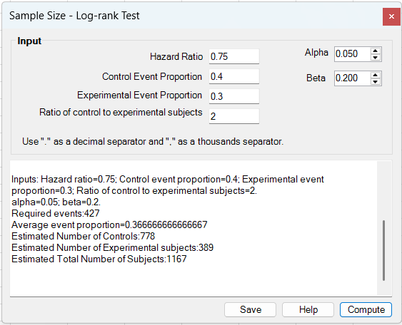
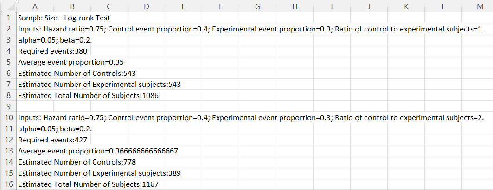

# Sample Size – Log-rank Test

**Includes:** Sample size planning for a **two-group log-rank test**.  
**Purpose:** Estimate the required **number of events**, plus the corresponding **numbers of controls**, **experimental subjects**, and **total subjects** for a study with a time-to-event endpoint.

---

## Overview

This tool is used during study planning for a **two-arm survival comparison** analyzed with the **log-rank test**.

Instead of selecting worksheet ranges, you enter planning values directly into the dialog:

- anticipated **hazard ratio**,
- expected **event proportion in the control arm**,
- expected **event proportion in the experimental arm**,
- **ratio of control to experimental subjects**,
- **alpha**, and
- **beta**.

The add-in first estimates how many **events** are required to achieve the requested significance level and power. It then inflates that event count to a total sample size using the expected event proportions in the two study arms.

In the current dialog, the calculation is run as a **two-sided** design.

---

## Screenshots (BESHStatNG)

### Input


### Results (written to the sheet)


---

## When to use it

Use this tool when:

- the primary endpoint is **time to event**,
- you plan to compare **two groups**,
- the planned primary analysis is a **log-rank test**, and
- you can specify expected event proportions over the study window.

Typical examples include:

- time to death,
- time to relapse,
- time to progression,
- time to device failure, or
- any other right-censored time-to-event endpoint.

This planning tool is most appropriate when:

- the trial design can be summarized by an anticipated **hazard ratio**,
- event proportions are available or can be estimated from pilot data, published studies, or design assumptions,
- the study will ultimately be powered by the **number of events** rather than by the number of enrolled subjects alone.

---

## Inputs (entered in the dialog)

- **Hazard Ratio**  
  Anticipated hazard ratio for the experimental group relative to the control group:

\[
HR = \frac{h_E(t)}{h_C(t)}
\]

  Values below 1 indicate a lower event rate in the experimental group.  
  Values above 1 indicate a higher event rate in the experimental group.  
  The value must be **strictly positive** and must differ from 1.

- **Control Event Proportion**  
  Expected cumulative event proportion in the control group during the study window.

- **Experimental Event Proportion**  
  Expected cumulative event proportion in the experimental group during the study window.

- **Ratio of control to experimental subjects**  
  Allocation ratio:

\[
\kappa = \frac{n_C}{n_E}
\]

  Use:

  - `1` for equal allocation,
  - `2` for twice as many controls as experimental subjects,
  - `0.5` for twice as many experimental subjects as controls.

- **Alpha**  
  Type I error rate for the current **two-sided** design.

- **Beta**  
  Type II error rate.  
  Statistical power is:

\[
1 - \beta
\]

All proportions and error rates must satisfy:

\[
0 < p < 1
\]

---

## Steps in the add-in

1. In Excel ribbon, go to **BESH Stat NG → Analyse → Sample Size → Log-rank Test**.
2. Enter the planning values.
3. Click **Compute**.
4. Review the required number of events and the estimated subject counts.
5. Optionally click **Save** to write the output to a new worksheet.

> Tip: each click on **Compute** appends another result block, which makes it easy to compare several scenarios.

---

## Output (how to read it)

The results box reports:

- the entered planning values,
- **Required events**,
- **Average event proportion**,
- **Estimated Number of Controls**,
- **Estimated Number of Experimental subjects**, and
- **Estimated Total Number of Subjects**.

Interpretation:

- **Required events** is the core power target for the log-rank design.
- **Average event proportion** is the allocation-weighted event proportion used to inflate events to subjects.
- The subject counts are rounded to integers and are intended as the enrolled sample sizes needed to achieve the required number of events, given the assumed study-window event proportions.

---

## Hypotheses

For two groups, the log-rank design targets the null hypothesis of equal hazards:

\[
H_0: HR = 1
\]

versus the alternative:

\[
H_1: HR \ne 1
\]

for the current two-sided implementation.

Equivalently, on the log-hazard scale:

\[
H_0: \log(HR) = 0
\qquad \text{vs} \qquad
H_1: \log(HR) \ne 0
\]

---

## Method (what BESHStatNG computes)

## Notation

Let:

- \(\kappa = n_C / n_E\) = control-to-experimental allocation ratio,
- \(\pi_C\) = allocation proportion for controls,
- \(\pi_E\) = allocation proportion for experimental subjects,
- \(q_C\) = expected control-group event proportion during follow-up,
- \(q_E\) = expected experimental-group event proportion during follow-up,
- \(HR\) = anticipated hazard ratio (experimental / control).

From the allocation ratio, the add-in computes:

\[
\pi_E = \frac{1}{1 + \kappa},
\qquad
\pi_C = \frac{\kappa}{1 + \kappa}
\]

### 1) Required number of events

The event-count calculation follows the standard **Schoenfeld / Freedman-style** log-rank planning form:

\[
D = \frac{\left(z_{1-\alpha/2} + z_{1-\beta}\right)^2}
{\pi_C\,\pi_E\,[\log(HR)]^2}
\]

where:

- \(D\) = required number of events,
- \(z_{1-\alpha/2}\) is the two-sided normal critical value,
- \(z_{1-\beta}\) is the power quantile.

The add-in rounds this value **up** to the next integer event count.

### 2) Average event proportion

The event count is then converted to a subject count using the allocation-weighted average event proportion:

\[
\bar q = \pi_C q_C + \pi_E q_E
\]

This quantity represents the expected average probability of observing the event across all enrolled subjects over the study window.

### 3) Estimated total number of subjects

The total sample size is obtained as:

\[
N = \left\lceil \frac{D}{\bar q} \right\rceil
\]

### 4) Estimated group sizes

The add-in then converts the total to group sizes using the planned allocation ratio:

\[
n_E = \left\lceil \frac{N}{1 + \kappa} \right\rceil
\]

\[
n_C = \left\lceil \kappa n_E \right\rceil
\]

Because of integer rounding, the final reported total may be slightly larger than the intermediate \(N\) computed before splitting into groups.

---

## Worked examples (from the screenshots)

### Example 1: equal allocation

Inputs:

- Hazard Ratio = 0.75
- Control event proportion = 0.40
- Experimental event proportion = 0.30
- Ratio of control to experimental subjects = 1
- alpha = 0.05
- beta = 0.20

Results:

- **Required events = 380**
- **Average event proportion = 0.35**
- **Estimated Number of Controls = 543**
- **Estimated Number of Experimental subjects = 543**
- **Estimated Total Number of Subjects = 1086**

### Example 2: 2:1 control-to-experimental allocation

Inputs:

- Hazard Ratio = 0.75
- Control event proportion = 0.40
- Experimental event proportion = 0.30
- Ratio of control to experimental subjects = 2
- alpha = 0.05
- beta = 0.20

Results:

- **Required events = 427**
- **Average event proportion = 0.366666666666667**
- **Estimated Number of Controls = 778**
- **Estimated Number of Experimental subjects = 389**
- **Estimated Total Number of Subjects = 1167**

Compared with equal allocation, the 2:1 design requires more events and more total subjects because the information per event is reduced when the allocation becomes less balanced.

---

## Practical notes

- The event proportions should correspond to the **same study horizon** in both groups.
- These event proportions should already reflect the expected follow-up, censoring, and accrual context of the planned study.
- If you expect losses to follow-up, protocol deviations, or non-evaluable subjects beyond what is reflected in the event proportions, inflate the reported sample size further.
- The planning calculation is based on the anticipated hazard ratio and does not model time-varying hazards or non-proportional hazards.
- Extremely unequal allocation increases the required event count because the allocation term \(\pi_C\pi_E\) becomes smaller.

---

## Relationship to R

The event-count formula corresponds to the standard large-sample log-rank planning expression commonly used in survival-study design. In R, closely related calculations can be reproduced with survival-design utilities such as `powerSurvEpi`, `gsDesign`, `Hmisc`, or manual implementation of the Schoenfeld / Freedman formula.

For example, the required event count can be reproduced manually from:

```r
alpha <- 0.05
beta  <- 0.20
HR    <- 0.75
kappa <- 1

piE <- 1 / (1 + kappa)
piC <- kappa / (1 + kappa)

zAlpha <- qnorm(1 - alpha/2)
zBeta  <- qnorm(1 - beta)

D <- ceiling((zAlpha + zBeta)^2 / (piC * piE * log(HR)^2))
D
```

To convert events to subjects, use the allocation-weighted average event proportion:

```r
qC <- 0.40
qE <- 0.30
qBar <- piC * qC + piE * qE
N <- ceiling(D / qBar)

nE <- ceiling(N / (1 + kappa))
nC <- ceiling(kappa * nE)

c(D = D, qBar = qBar, nC = nC, nE = nE, N = nC + nE)
```

---

## References

- Schoenfeld, D. A. (1981). The asymptotic properties of nonparametric tests for comparing survival distributions. *Biometrika*, 68(1), 316–319.
- Freedman, L. S. (1982). Tables of the number of patients required in clinical trials using the logrank test. *Statistics in Medicine*, 1(2), 121–129.
- Machin, D., Cheung, Y. B., & Parmar, M. K. B. (2006). *Survival Analysis: A Practical Approach* (2nd ed.). Wiley.
- Chow, S.-C., Shao, J., & Wang, H. (2008). *Sample Size Calculations in Clinical Research* (2nd ed.). Chapman & Hall/CRC.

## See also

- [Logrank Test](logrank-test.md)
- [Kaplan-Meier Plot](kaplan-meier-plot.md)
- [Cox Regression](cox-regression.md)
- [Home](../index.md)
