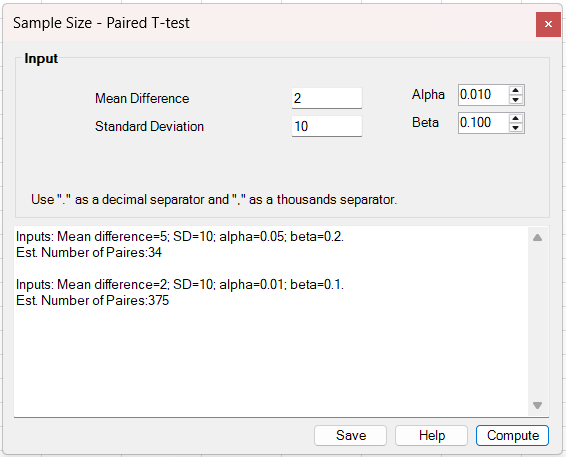
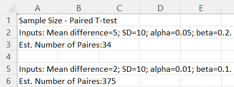

# Sample Size – Paired T-test

**Includes:** Sample size for paired t-test (iterative t critical values).  
**Purpose:** Estimate the required **number of pairs** for a two-sided paired t-test given an expected mean difference, the SD of the paired differences, significance level α, and power (1 − β).

---

## Overview
This tool is used during study planning to answer the question:

> “How many paired observations do I need to reliably detect a mean change of δ?”

Instead of analyzing worksheet data, you enter planning values (δ, SD, α, β) directly into the dialog.

## Screenshots

### Input


### Example output saved to worksheet


---

## When to use it
Use this tool when:

- You will measure a **continuous** outcome twice on the same subject (before/after) or on matched pairs.
- Your primary analysis is a **paired t-test** on within-pair differences.
- You can specify:
  - the mean difference you want to detect (δ), and
  - the SD of the within-pair differences (σd).

Main assumptions (for the planned analysis):

- Pairs are independent of each other.
- The within-pair differences are approximately normal (especially for small n).
- The SD of differences used for planning is realistic for your target population.

If you expect strong non-normality or heavy outliers in differences, consider planning with a robust or nonparametric method instead of a t-test.

---

## Inputs (entered in the dialog)

- **Mean Difference (δ)**  
  The expected true mean of the paired differences you want to detect (magnitude matters; sign does not).

- **Standard Deviation (σd)**  
  The standard deviation of the paired differences.

  If you have pilot data with paired values (x, y), compute differences d = x − y, then use `sd(d)`.
  If you only know SDs of x and y and their correlation ρ, you can approximate:

  $$
  σd = √(σx² + σy² − 2 ρ σx σy)
  $$

- **Alpha (α)**  
  Type I error rate for a **two-sided** test (the tool uses α/2 in each tail).

- **Beta (β)**  
  Type II error rate (so **power = 1 − β**).

---

## Steps in the add-in
1. In Excel ribbon: **BESH Stat NG → Analyse → Sample Size → Paired T-test**
2. Enter **Mean Difference**, **Standard Deviation**, **Alpha**, and **Beta**.
3. Click **Compute**.
4. (Optional) Click **Save** to write the output lines to a **new worksheet**.

> Tip: Each click of **Compute** appends a new “Inputs … / Estimated …” block in the output box.

---

## Output (how to read it)
The tool reports:

- **Inputs:** the values you entered (δ, σd, α, β)
- **Est. Number of Pairs:** the required number of complete pairs (n)

This n is the planned number of paired observations that should achieve the requested power for detecting δ using a two-sided paired t-test.

---

## Notation
Let di be the within-pair differences for n pairs.

$$
di = xi − yi,  i = 1,…,n
$$

The paired t-test tests:

$$
H0: μd = 0 
$$

$$
H1: μd ≠ 0
$$

with test statistic:

$$
t = d̄ / (sd / √n),   df = n − 1
$$

where d̄ is the sample mean of differences and sd is the sample SD of differences.

---

## Method (what BESHStatNG computes)

### 1) Initial normal-approximation estimate
The tool first computes a starting estimate using standard normal quantiles:

$$
n0 = ( (z1−α/2 + z1−β) σd / δ )²
$$

and rounds up to the next integer.

### 2) Iterative t-quantile refinement
Because the paired t-test uses a t distribution with df = n − 1, the tool then increases n until the following implicit t-based criterion is satisfied:

$$
n > ( (t1−α/2, n−1 + t1−β, n−1) σd / δ )²
$$

It returns the smallest integer n that meets the criterion.

Equivalently, using a standardized effect size (Cohen’s dz) for paired differences:

$$
dz = δ / σd
$$

the required n grows like 1/dz².

---

## Worked examples (from the screenshots)

1) δ = 5, σd = 10, α = 0.05, β = 0.20 → **Est. Number of Pairs = 34**

2) δ = 2, σd = 10, α = 0.01, β = 0.10 → **Est. Number of Pairs = 375**

---

## Relationship to R (how to reproduce)

### Using base R `power.t.test()` (exact noncentral t)
R’s `power.t.test(type = "paired")` computes power using the **noncentral t** distribution and solves for n. This is a slightly different method than the add-in’s t-quantile iteration, so results can differ by 0–1 pair (occasionally more for extreme settings).

```r
# Example 1
ceiling(power.t.test(delta = 5, sd = 10,
                     sig.level = 0.05, power = 0.80,
                     type = "paired", alternative = "two.sided")$n)

# Example 2
ceiling(power.t.test(delta = 2, sd = 10,
                     sig.level = 0.01, power = 0.90,
                     type = "paired", alternative = "two.sided")$n)
```

Expected difference vs the add-in:

- In many practical cases it matches exactly.
- For stricter α / higher power, `power.t.test()` may be **1 pair higher** because it uses a more exact noncentral t power calculation.

### Using the `pwr` package
The `pwr` package uses effect size d (for paired: dz) and also solves using a noncentral t approach.

```r
library(pwr)

dz1 <- 5/10
pwr.t.test(d = dz1, sig.level = 0.05, power = 0.80, type = "paired")

dz2 <- 2/10
pwr.t.test(d = dz2, sig.level = 0.01, power = 0.90, type = "paired")
```

---

## Notes and limitations
- The SD input must be the SD of **paired differences**, not the SD of one column alone.
- The calculation assumes **complete pairs**; if you expect dropouts or missing follow-up values, inflate n accordingly.
- This tool plans for a **two-sided** test. (If you need a one-sided design, the critical values would change.)

---

## References

- Chow, S.-C., Shao, J., & Wang, H. (2008). *Sample Size Calculations in Clinical Research* (2nd ed.). Chapman & Hall/CRC.
- Julious, S. A. (2009). *Sample Sizes for Clinical Trials*. Chapman & Hall/CRC.
- Cohen, J. (1988). *Statistical Power Analysis for the Behavioral Sciences* (2nd ed.). Lawrence Erlbaum.
- Fleiss, J. L., Levin, B., & Paik, M. C. (2003). *Statistical Methods for Rates and Proportions* (3rd ed.). Wiley.
- Hedges, L. V., & Olkin, I. (1985). *Statistical Methods for Meta-Analysis*. Academic Press. (Effect size conventions)

## See also
- [Paired T tests](paired-t-tests.md)
- [Unpaired (two sample) T tests](unpaired-two-sample-t-tests.md)
- [Normality Tests](normality-tests.md)
- [Home](../index.md)
