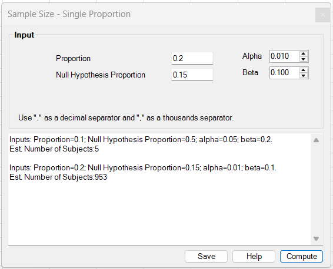
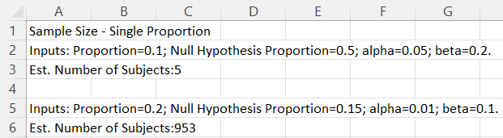

# Sample Size – Single Proportion

**Includes:** Sample size for a single proportion test.  
**Purpose:** Estimate required sample size for testing a single proportion against a null value.

---

## Overview

The **Sample Size – Single Proportion** procedure estimates the minimum number of subjects required to detect a difference between an anticipated population proportion and a null hypothesis proportion with a specified significance level and power.

This method is commonly used in prevalence studies, quality control, and single-arm clinical or epidemiological studies where the outcome is binary.

---

## When to Use

Use this procedure when:

- The outcome is binary (success/failure, yes/no)
- You want to test  
  \\[
  H_0: p = p_0
  \\]
  against  
  \\[
  H_1: p \neq p_0
  \\]
- You have an anticipated true proportion \\(p\\)
- You want to plan a study with specified type-I error (\\(\alpha\\)) and power (\\(1-\beta\\))

---

## Input



All inputs are entered **directly in the dialog controls**.

### Required Parameters

- **Proportion**  
  Anticipated true proportion \\(p\\) under the alternative hypothesis.

- **Null Hypothesis Proportion**  
  Proportion \\(p_0\\) specified under the null hypothesis.

- **Alpha**  
  Type-I error rate \\(\alpha\\) (two-sided).

- **Beta**  
  Type-II error rate \\(\beta\\), where power is \\(1-\beta\\).

---

## Method

The add-in uses a **normal approximation (Wald-type) sample size formula** for a one-sample proportion test.

The required sample size is computed as:

\\[
n
=
p(1-p)
\left(
\frac{z_{1-\alpha/2} + z_{1-\beta}}{p - p_0}
\right)^2
\\]

where:

- \\(p\\) is the anticipated true proportion  
- \\(p_0\\) is the null hypothesis proportion  
- \\(z_{1-\alpha/2}\\) is the standard normal quantile for a two-sided test  
- \\(z_{1-\beta}\\) is the standard normal quantile corresponding to the desired power  

The final sample size is **rounded up to the next integer**.

---

## Output



The results window reports:

- The input parameters used in the calculation
- **Estimated Number of Subjects**, which is the minimum total sample size required

### Example Results

- \\(p = 0.10\\), \\(p_0 = 0.50\\), \\(\alpha = 0.05\\), \\(\beta = 0.20\\)  
  → Estimated Number of Subjects = **5**

- \\(p = 0.20\\), \\(p_0 = 0.15\\), \\(\alpha = 0.01\\), \\(\beta = 0.10\\)  
  → Estimated Number of Subjects = **953**

---

## Interpretation

- Smaller differences \\(|p - p_0|\\) require **larger sample sizes**
- More stringent significance levels (smaller \\(\alpha\\)) increase sample size
- Higher desired power (smaller \\(\beta\\)) increases sample size
- For very small or extreme proportions, the normal approximation may be less accurate

This method assumes independent observations and relies on large-sample normal theory.

---

## R Code (Reproducing the Add-in Results)

The following R code reproduces the **exact same calculation** used by the Excel add-in:

```r
n_single_prop_addin <- function(p, p0, alpha, beta) {
  z_alpha <- qnorm(1 - alpha / 2)
  z_beta  <- qnorm(1 - beta)
  n <- p * (1 - p) * ((z_alpha + z_beta) / (p - p0))^2
  ceiling(n)
}

# Examples from the help file
n_single_prop_addin(p = 0.1, p0 = 0.5, alpha = 0.05, beta = 0.2)
n_single_prop_addin(p = 0.2, p0 = 0.15, alpha = 0.01, beta = 0.1)
```

## Notes on Differences from Other Software

- `pwr::pwr.p.test()` in R uses Cohen’s h (arcsine transformation), which can produce different sample sizes.
- Some software uses variance based on \(p_0\) rather than \(p\).
- Exact binomial power methods (when available) may differ, especially for small sample sizes.
- The Excel add-in uses a simple normal-approximation formula, which is widely used for planning and provides results consistent with many textbook formulas.

## References

- Fleiss, J. L., Levin, B., & Paik, M. C. (2013). Statistical Methods for Rates and Proportions. Wiley.
- Chow, S.-C., Shao, J., & Wang, H. (2008). Sample Size Calculations in Clinical Research. Chapman & Hall/CRC.
- Agresti, A. (2019). An Introduction to Categorical Data Analysis. Wiley.

## See also
- [Sample Size – Independent Proportions](sample-size-independent-proportions.md)
- [Sample Size – Paired T-test](sample-size-paired-t-test.md)
- [Proportions](proportions.md)
- [Home](../index.md)
