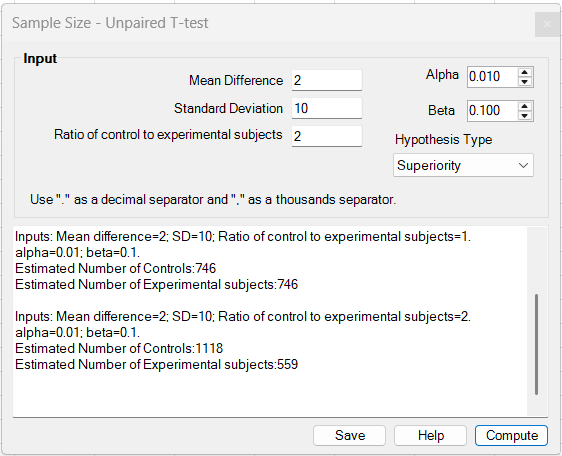
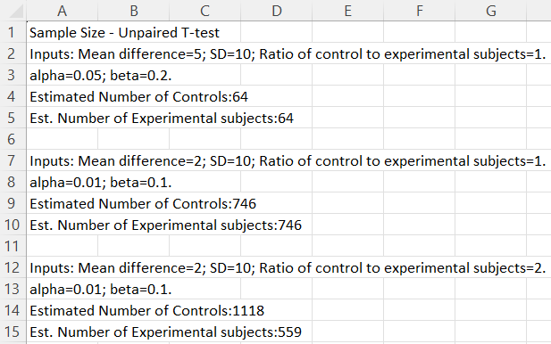

# Sample Size – Unpaired T-test

**Includes:** Sample size planning for an unpaired two-sample t-test in **Superiority**, **Noninferiority**, and **Equivalence** modes.  
**Purpose:** Estimate the required numbers of **controls** and **experimental subjects** for a study with two independent groups and a continuous outcome.

---

## Overview

This tool plans sample size for comparing **two independent group means** with a pooled-variance two-sample t-test.

The dialog now includes a **Hypothesis Type** selector:

- **Superiority**
- **Noninferiority**
- **Equivalence**

The selected mode changes the labels, visible inputs, and the meaning of **Alpha**:

- **Superiority** uses a **two-sided** alpha.
- **Noninferiority** uses a **one-sided** alpha.
- **Equivalence** uses a **one-sided** alpha for each TOST component.

The add-in reports the estimated numbers of **controls** and **experimental subjects**. In equivalence mode it also reports the lower-bound and upper-bound requirements and identifies the **driving bound**.

---

## Screenshots (BESHStatNG)

### Input


### Results (and Save to sheet)


---

## When to use it

Use this tool when you are planning a study with:

- **two independent groups** (different subjects in each group),
- a **continuous outcome**,
- an assumed **common SD**, and
- one of these goals:
  - show a difference (**superiority**),
  - show the experimental arm is not unacceptably worse (**noninferiority**), or
  - show the treatments are sufficiently similar within a pre-defined margin (**equivalence**).

Key assumptions / considerations:

- The calculation targets the **pooled-variance** two-sample t-test.
- The outcome is assumed to be approximately normal within groups.
- A **common SD** is assumed across groups.
- Allocation may be unequal, using the ratio \\(\kappa = n_C / n_E\\).
- If you expect unequal variances or strongly non-normal data, plan conservatively.

---

## Dialog inputs

All inputs are typed directly into the dialog. No worksheet range selection is needed.

### Superiority mode

- **Mean Difference**: target mean difference to detect.
- **Standard Deviation**: assumed common SD.
- **Ratio of control to experimental subjects**: \\(\kappa = n_C / n_E\\).
- **Alpha**: two-sided significance level.
- **Beta**: Type II error; power is \\(1-\beta\\).

### Noninferiority mode

- **Expected Mean Difference**: expected value of \\(\mu_E - \mu_C\\).
- **Noninferiority Margin**: entered as a **positive absolute margin** in the UI.
- **Standard Deviation**: assumed common SD.
- **Ratio of control to experimental subjects**: \\(\kappa = n_C / n_E\\).
- **One-sided Alpha**: one-sided type I error rate.
- **Beta**: Type II error; power is \\(1-\beta\\).

### Equivalence mode

- **Expected Mean Difference**: expected value of \\(\mu_E - \mu_C\\).
- **Equivalence Margin**: entered as a **positive symmetric margin** \\(M\\), interpreted internally as \\([-M, +M]\\).
- **Standard Deviation**: assumed common SD.
- **Ratio of control to experimental subjects**: \\(\kappa = n_C / n_E\\).
- **One-sided Alpha**: one-sided alpha for each TOST component.
- **Beta**: Type II error; power is \\(1-\beta\\).

---

## Steps in the add-in

1. In Excel ribbon, go to **BESH Stat NG → Analyse → Sample Size → Unpaired T-test**.
2. Choose the **Hypothesis Type**.
3. Enter the planning values.
4. Click **Compute**.
5. Optionally click **Save** to write the results to a new worksheet.

> Tip: each click on **Compute** appends another output block to the results box.

---

## Hypotheses

Let \\(\Delta = \mu_E - \mu_C\\).

### Superiority

\\[
H_0: \Delta = 0
\qquad\text{vs}\qquad
H_1: \Delta \ne 0
\\]

This is treated as a **two-sided** design.

### Noninferiority

Let \\(M > 0\\) be the margin entered in the UI. Internally the add-in uses the lower noninferiority bound \\(-M\\) on the \\(\mu_E - \mu_C\\) scale.

\\[
H_0: \Delta \le -M
\qquad\text{vs}\qquad
H_1: \Delta > -M
\\]

This is treated as a **one-sided** design.

### Equivalence

Let \\(M > 0\\) be the symmetric equivalence margin entered in the UI.

\\[
H_0: \Delta \le -M \;\text{or}\; \Delta \ge M
\qquad\text{vs}\qquad
H_1: -M < \Delta < M
\\]

The add-in uses a **TOST-style** approach with one-sided alpha for each bound.

---

## What the add-in does

Let:

- \\(\sigma\\) = assumed common SD
- \\(\kappa = n_C / n_E\\) = ratio of controls to experimental subjects
- \\(\beta\\) = Type II error
- \\(n_E\\) = experimental sample size
- \\(n_C = \lfloor \kappa n_E \rfloor\\) = control sample size

### 1) Core superiority calculation

For superiority mode, the add-in uses the pooled two-sample t-test planning formula with an iterative t-based refinement.

If the target difference is \\(d\\), the standard error is:

\\[
SE(\bar x_C - \bar x_E) = \sigma \sqrt{\frac{1}{n_C} + \frac{1}{n_E}}
= \sigma \sqrt{\frac{1 + 1/\kappa}{n_E}}
\\]

The add-in first computes a normal-approximation starting value:

\\[
\hat n_{E,0} = \left\lceil (1+1/\kappa)
\left(\frac{\sigma\,(z_{1-\alpha/2}+z_{1-\beta})}{d}\right)^2 \right\rceil
\\]

It then refines this with t critical values using the implied pooled degrees of freedom:

- \\(df = n_C + n_E - 2\\)
- \\(t_{1-\alpha/2, df}\\)
- \\(t_{1-\beta, df}\\)

and increases \\(n_E\\) until:

\\[
 n_E > (1+1/\kappa)
\left(\frac{\sigma\,(t_{1-\alpha/2,df}+t_{1-\beta,df})}{d}\right)^2
\\]

The reported control size is:

\\[
 n_C = \lfloor \kappa n_E \rfloor
\\]

### 2) Noninferiority calculation

For noninferiority mode, the add-in converts the UI margin to the lower bound \\(-M\\) on the \\(\mu_E-\mu_C\\) scale and computes the distance from the expected effect to that boundary:

\\[
 d_{NI} = \Delta_{exp} - (-M) = \Delta_{exp} + M
\\]

It then reuses the same unpaired t-test engine as above, with:

- target difference \\(d_{NI}\\)
- common SD \\(\sigma\\)
- allocation ratio \\(\kappa\\)
- a **two-sided equivalent alpha** of \\(2\alpha_{one-sided}\\)

So the numerical engine is the same as superiority planning, but it is driven by the distance to the noninferiority bound rather than by a difference from zero.

### 3) Equivalence calculation

For equivalence mode, the add-in uses a symmetric margin \\([-M, +M]\\) and computes two one-sided requirements:

Lower-bound distance:

\\[
 d_L = \Delta_{exp} - (-M) = \Delta_{exp} + M
\\]

Upper-bound distance:

\\[
 d_U = M - \Delta_{exp}
\\]

It then runs the unpaired t-test planner twice:

- once for the lower bound,
- once for the upper bound,

using the same SD, allocation ratio, beta, and a two-sided equivalent alpha of \\(2\alpha_{one-sided}\\).

The final reported sample size is the **larger** of the two requirements. The add-in also reports:

- **Lower-bound requirement**
- **Upper-bound requirement**
- **Driving bound**

---

## Output

### Superiority mode

The results box reports:

- the input values,
- **Estimated Number of Controls**, and
- **Estimated Number of Experimental subjects**.

### Noninferiority mode

The results box reports:

- the expected mean difference,
- the noninferiority margin on the \\(\mu_E - \mu_C\\) scale,
- the SD,
- the ratio \\(\kappa\\),
- one-sided alpha and beta,
- **Estimated Number of Controls**, and
- **Estimated Number of Experimental subjects**.

### Equivalence mode

The results box reports:

- the expected mean difference,
- the symmetric equivalence bounds,
- the SD,
- the ratio \\(\kappa\\),
- one-sided alpha and beta,
- lower-bound and upper-bound requirements,
- the **Driving bound**, and
- final estimated numbers of controls and experimental subjects.

Click **Save** to write the result lines to a new worksheet.

---

## Reproducing the calculations in R

### A) Superiority (equal allocation) using `power.t.test`

For equal group sizes, base R can solve directly for the per-group sample size:

```r
alpha <- 0.05
beta  <- 0.20
power <- 1 - beta

delta <- 5
sd    <- 10

res <- power.t.test(delta = delta, sd = sd,
                    sig.level = alpha, power = power,
                    type = "two.sample", alternative = "two.sided")
res
ceiling(res$n)
```

`power.t.test()` uses the noncentral t distribution, while the add-in uses a t-quantile iteration. Results are often identical or differ by at most a small amount.

### B) Noninferiority

If the expected difference is `dexp` and the UI margin is `M > 0`, the add-in uses the distance `dNI = dexp + M` and a two-sided equivalent significance level of `2 * alpha_one_sided`.

```r
alpha_one_sided <- 0.025
beta <- 0.20
power <- 1 - beta

dexp <- 0
M    <- 5
sd   <- 10

dNI <- dexp + M

res <- power.t.test(delta = dNI, sd = sd,
                    sig.level = 2 * alpha_one_sided,
                    power = power,
                    type = "two.sample", alternative = "two.sided")
ceiling(res$n)
```

### C) Equivalence (symmetric TOST-style planning)

For a symmetric margin `M`, compute both distances:

- `dL = dexp + M`
- `dU = M - dexp`

Then solve each component separately and take the larger result:

```r
alpha_one_sided <- 0.05
beta <- 0.20
power <- 1 - beta

dexp <- 0
M    <- 5
sd   <- 10

dL <- dexp + M
dU <- M - dexp

nL <- ceiling(power.t.test(delta = dL, sd = sd,
                           sig.level = 2 * alpha_one_sided,
                           power = power,
                           type = "two.sample", alternative = "two.sided")$n)

nU <- ceiling(power.t.test(delta = dU, sd = sd,
                           sig.level = 2 * alpha_one_sided,
                           power = power,
                           type = "two.sample", alternative = "two.sided")$n)

max(nL, nU)
```

For unequal allocation, use the same logic but replace `power.t.test()` with a custom unequal-allocation search using the noncentral t distribution.

---

## Notes and limitations

- The add-in assumes a **common SD** across groups.
- Superiority mode is **two-sided**.
- Noninferiority and equivalence modes use **one-sided alpha** in the UI, then convert it internally to the equivalent two-sided level used by the shared t-test planner.
- In equivalence mode, the current UI supports a **single symmetric margin** \\(M\\), not separate lower and upper margins.
- The final control count is computed from the experimental count as \\(\lfloor \kappa n_E \rfloor\\).
- If you expect attrition, inflate the final required sample sizes accordingly.

---

## References

- Chow, S.-C., Shao, J., & Wang, H. (2008). *Sample Size Calculations in Clinical Research* (2nd ed.). Chapman & Hall/CRC.
- Julious, S. A. (2009). *Sample Sizes for Clinical Trials*. Chapman & Hall/CRC.
- Chow, S.-C., & Liu, J. P. (2013). *Design and Analysis of Bioavailability and Bioequivalence Studies* (3rd ed.). Chapman & Hall/CRC.
- Schuirmann, D. J. (1987). A comparison of the two one-sided tests procedure and the power approach for assessing the equivalence of average bioavailability. *Journal of Pharmacokinetics and Biopharmaceutics*, 15(6), 657–680.

## See also

- [Sample Size – Paired T-test](sample-size-paired-t-test.md)
- [Unpaired (two sample) T tests](unpaired-two-sample-t-tests.md)
- [Sample Size – Independent Proportions](sample-size-independent-proportions.md)
- [Home](../index.md)
