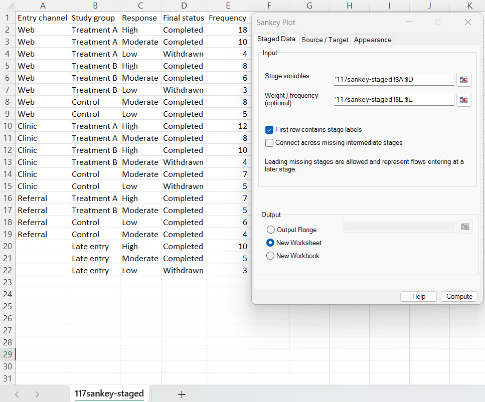
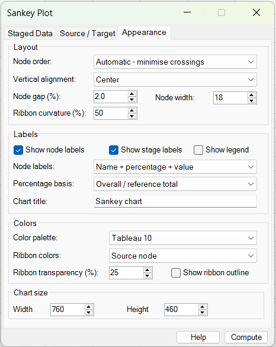
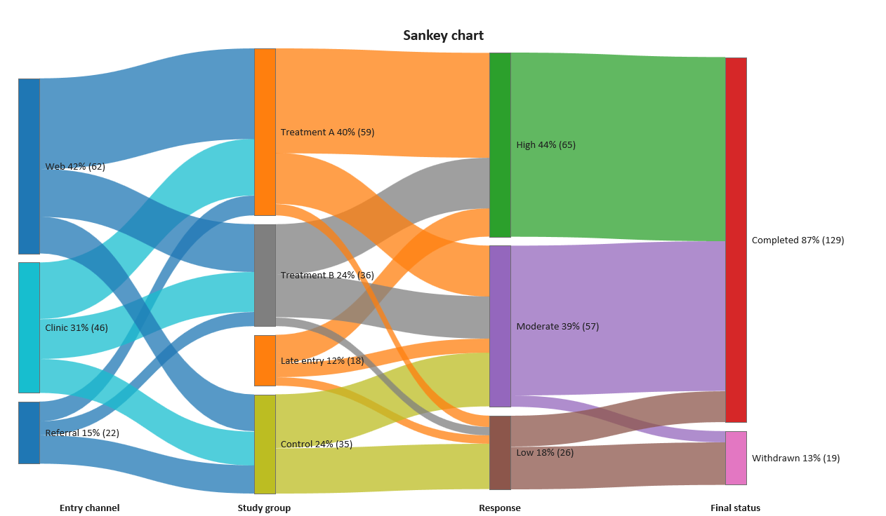
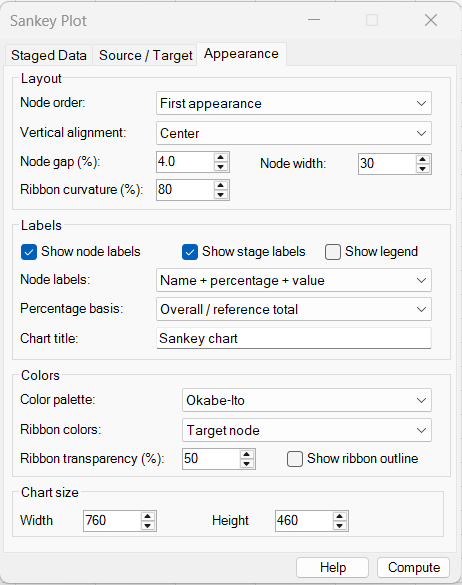
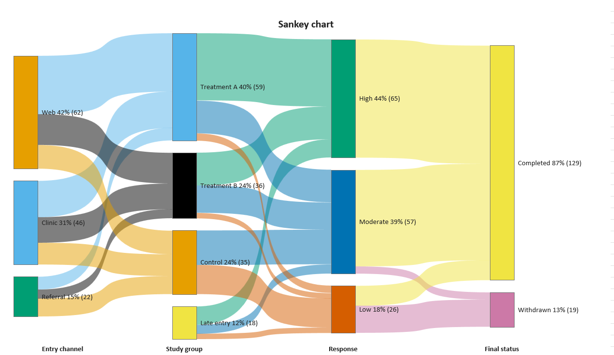
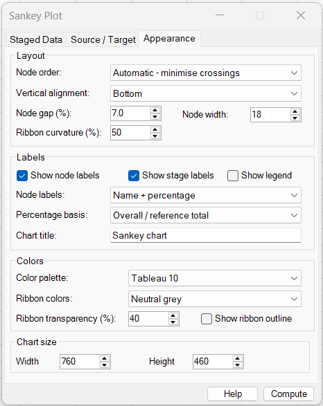
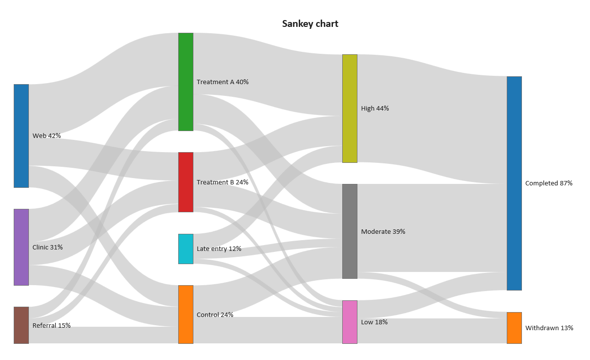
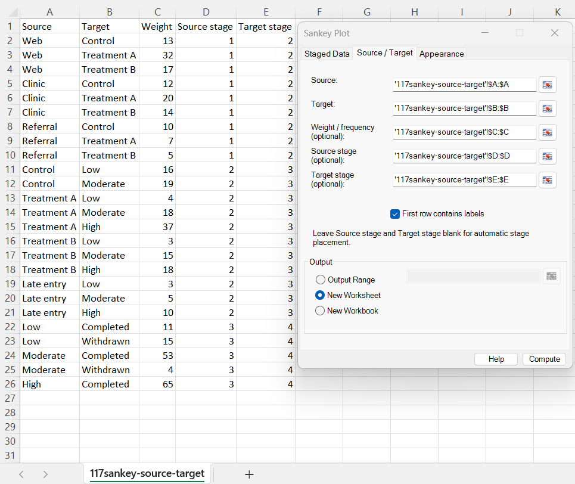

# Sankey Plot

**Includes:** Weighted Sankey/alluvial diagrams, staged row-by-row pathways, Source/Target link tables, optional frequency or continuous positive weights, automatic or explicit stage placement, later-stage entry, optional bridging across missing intermediate stages, automatic crossing reduction, configurable node ordering and alignment, node/value/percentage labels, multiple colour palettes, source/target/neutral ribbon colouring, transparency, ribbon curvature, and configurable chart size.  
**Purpose:** Visualize how counts, frequencies, or other non-negative quantities flow between categorical states across two or more stages.

---

## Overview

A **Sankey plot** displays a network of weighted flows. Categories are shown as vertical **nodes**, and connections between categories are shown as curved **ribbons**.

The visual encoding is simple:

- the **height of a node** represents the amount associated with that category;
- the **thickness of a ribbon** represents the amount flowing from one category to another;
- nodes are arranged from left to right in **stages**;
- ribbon colour can follow the source node, target node, or use a common neutral grey;
- optional labels can show category names, values, percentages, or both values and percentages.

BESHStatNG supports two input layouts:

1. **Staged Data** — each worksheet row describes one complete or partial path across several stage columns.
2. **Source / Target** — each worksheet row describes one directed link from a source category to a target category.

These two modes cover both common statistical datasets and more general flow-network tables.

!!! note
    The Sankey Plot is a descriptive visualization. It does not test whether flows differ statistically, estimate transition probabilities, or fit a Markov or other transition model.

---

## When to use it

Use a Sankey plot when the main question is **where observations or quantities move between categories**, for example:

- participant disposition across study stages;
- recruitment channel → treatment group → response → final status;
- customer journey or conversion paths;
- movement between diagnostic or risk categories;
- education or employment pathways;
- product category → item → brand flows;
- process routing and outcomes;
- classification changes between repeated assessments;
- any directed acyclic flow where ribbon width should represent count, frequency, or another weight.

A Sankey plot is especially useful when a contingency table would show the totals but would not clearly communicate the **paths connecting several successive categorical variables**.

Avoid it when:

- exact numerical comparison is more important than flow structure;
- there are very many categories or links, making ribbons too dense to follow;
- the relationship contains directed cycles that must be displayed as cycles;
- the left-to-right order has no meaningful interpretation.

---

## Example datasets

Two sample files are included so both input modes can be reproduced:

- [117sankey-staged.csv](../assets/data/117sankey/117sankey-staged.csv)
- [117sankey-source-target.csv](../assets/data/117sankey/117sankey-source-target.csv)

They describe the same underlying flow:

**Entry channel → Study group → Response → Final status**

The weighted total is 148. Of these, 130 observations enter through the first stage and 18 are **Late entry** observations that begin directly at the second stage.

This deliberate late-entry branch demonstrates an important feature of the Sankey Plot: **a flow does not have to start in the left-most stage**.

---

## Example 1: Staged Data input

### Input data

The staged file stores one pathway per row:

| Entry channel | Study group | Response | Final status | Frequency |
|---|---|---|---|---:|
| Web | Treatment A | High | Completed | 18 |
| Web | Treatment A | Moderate | Completed | 10 |
| Clinic | Treatment B | High | Completed | 10 |
| Referral | Control | Low | Completed | 6 |
| *(blank)* | Late entry | High | Completed | 10 |
| *(blank)* | Late entry | Moderate | Completed | 5 |
| *(blank)* | Late entry | Low | Withdrawn | 3 |

The first four columns are the successive stages. **Frequency** supplies the weight for each path.

### Dialog settings



Use:

| Setting | Value |
|---|---|
| Stage variables | `A:D` |
| Weight / frequency | `E:E` |
| First row contains stage labels | Selected |
| Connect across missing intermediate stages | Cleared |
| Output | New Worksheet |

The blank Entry channel cells for the three Late entry rows are **leading missing stages**. They do not remove those observations. Instead, the corresponding paths begin at **Study group**, the second stage.

### Default appearance



The default appearance uses automatic crossing reduction, centred stages, a 2% node gap, 18-point nodes, 50% ribbon curvature, Tableau 10 colours, source-node ribbon colours, 25% ribbon transparency, and labels containing name, percentage, and value.

### Output



The diagram shows, for example:

- **Web 42% (62)** at the first stage;
- **Treatment A 40% (59)** at the second stage;
- **High 44% (65)** at the response stage;
- **Completed 87% (129)** at the final stage.

The Late entry node appears in the second stage without an incoming ribbon from the first stage, correctly representing observations entering the flow later.

The percentages above use the **Overall / reference total** of 148. Thus, for example,

$$
\frac{62}{148}\times100\%\approx 42\%.
$$

---

## Example 2: alternative node order and target-coloured ribbons

The same staged dataset can be presented with a different layout and colour strategy.

### Appearance settings



The example changes:

| Setting | Value |
|---|---|
| Node order | First appearance |
| Vertical alignment | Center |
| Node gap | 4% |
| Node width | 30 |
| Ribbon curvature | 80% |
| Color palette | Okabe-Ito |
| Ribbon colors | Target node |
| Ribbon transparency | 50% |
| Node labels | Name + percentage + value |

### Output



With **Target node** colouring, every ribbon adopts the colour of the category it enters. This can make it easier to visually collect all flows converging on the same destination.

The wider nodes, larger gaps, stronger curvature, and greater transparency also show how layout controls can be used to reduce visual crowding.

---

## Example 3: neutral ribbons and percentage-only labels

A more restrained style can be useful when node identity is more important than individual ribbon colours.

### Appearance settings



This example uses:

| Setting | Value |
|---|---|
| Node order | Automatic - minimise crossings |
| Vertical alignment | Bottom |
| Node gap | 7% |
| Node width | 18 |
| Ribbon curvature | 50% |
| Color palette | Tableau 10 |
| Ribbon colors | Neutral grey |
| Ribbon transparency | 40% |
| Node labels | Name + percentage |

### Output



Neutral ribbons make the coloured nodes the primary category cues and can work well when there are many crossing links. The percentage-only labels also reduce text density.

---

## Example 4: Source / Target input

The second sample file stores the same flow as an explicit link table rather than complete pathways.

Its first rows are:

| Source | Target | Weight | Source stage | Target stage |
|---|---|---:|---:|---:|
| Web | Control | 13 | 1 | 2 |
| Web | Treatment A | 32 | 1 | 2 |
| Web | Treatment B | 17 | 1 | 2 |
| Clinic | Control | 12 | 1 | 2 |
| Late entry | High | 10 | 2 | 3 |
| High | Completed | 65 | 3 | 4 |

### Dialog settings



Use:

| Setting | Value |
|---|---|
| Source | `A:A` |
| Target | `B:B` |
| Weight / frequency | `C:C` |
| Source stage | `D:D` |
| Target stage | `E:E` |
| First row contains labels | Selected |
| Output | New Worksheet |

The explicit stage columns place **Late entry** at stage 2 even though it has no incoming link from stage 1.

The Source / Target table is useful when your data are already aggregated into flows or when the network cannot be conveniently represented as one row per complete path.

!!! note "Stage headings in Source / Target mode"
    The current Source / Target dialog accepts stage numbers but not separate stage-name fields. Consequently, semantic stage headings such as *Entry channel* or *Response* are obtained automatically from column headings only in **Staged Data** mode. The three output screenshots on this page therefore use the staged sample so the named stage headings are visible.

---

## Choosing between the two input modes

| Input mode | Best suited to | One row represents |
|---|---|---|
| **Staged Data** | Subject-level or pathway-level datasets with successive categorical variables | One complete or partial path |
| **Source / Target** | Pre-aggregated flows or general directed networks | One directed link |

Use **Staged Data** when you already have columns such as Visit 1, Visit 2, Visit 3, or Channel, Group, Response, Outcome.

Use **Source / Target** when you already have a table such as A → B = 25, B → C = 18, and X → C = 7, or when flows begin at different stages and explicit stage placement is convenient.

Both modes support optional weights. When the weight field is left blank, every usable row has weight 1.

---

## Required data layout

### Staged Data

Select one continuous multi-column range containing at least **two successive categorical stages**.

Example:

| Stage 1 | Stage 2 | Stage 3 | Stage 4 | Weight |
|---|---|---|---|---:|
| A | C | F | X | 5 |
| A | D | G | X | 3 |
| B | E | H | Y | 7 |
| *(blank)* | J | H | Y | 2 |

Requirements:

- at least two stage columns are required;
- stage categories may be text or finite numeric values;
- the stage columns must form one continuous worksheet range;
- an optional weight/frequency range must be a single column aligned with the staged data;
- when **First row contains stage labels** is selected, the first row is used as the displayed stage names and is not treated as data;
- if a stage heading is blank, a generic stage name is substituted;
- leading missing stages are allowed;
- intermediate missing stages either break the path or can be bridged using **Connect across missing intermediate stages**.

### Leading versus intermediate missing stages

These cases are treated differently.

A leading blank allows later entry:

| Stage 1 | Stage 2 | Stage 3 |
|---|---|---|
| *(blank)* | X | F |

This creates the link:

**X → F**

with X beginning in Stage 2.

An intermediate blank:

| Stage 1 | Stage 2 | Stage 3 |
|---|---|---|
| A | *(blank)* | F |

behaves according to **Connect across missing intermediate stages**:

- **Cleared** — the missing stage breaks the path, so no A → F ribbon is created.
- **Selected** — a direct A → F ribbon is created across the skipped stage.

!!! important
    Selecting **Connect across missing intermediate stages** can create ribbons that span more than one stage. Use it only when a blank genuinely means “stage not observed / skipped” and it is appropriate to connect the surrounding known states.

---

## Source / Target data

The Source / Target mode requires two aligned single-column ranges:

| Input | Meaning | Required |
|---|---|---:|
| **Source** | Category where the link begins | Yes |
| **Target** | Category where the link ends | Yes |
| **Weight / frequency** | Amount carried by the link | No |
| **Source stage** | Horizontal stage of the source node | No |
| **Target stage** | Horizontal stage of the target node | No |

Source and Target may contain text or finite numeric categories.

### Automatic stage placement

Leave **Source stage** and **Target stage** blank to let BESHStatNG determine the left-to-right stage structure from the directed links.

Automatic placement:

- requires an acyclic flow network;
- always places a target to the right of its source;
- attempts to place later-starting sources as far right as possible when their downstream structure permits it.

For example, if

```text
A → C → F
X → F
```

then X can be placed at the same intermediate level as C rather than being forced into the left-most stage.

### Explicit stage placement

Supply both **Source stage** and **Target stage** when exact horizontal placement is required.

Stage values must:

- be whole numbers;
- be non-negative;
- be present for every usable Source / Target row;
- have Target stage greater than Source stage on every link.

The stage numbers may start at 0 or 1; only their relative positions are important. Gaps are preserved, so a link can intentionally span more than one stage.

Explicit stages are also useful if the **same category label must represent distinct nodes at different stages**. For example, the label `Low` can appear as one node at stage 2 and another node at stage 4 when explicit stages distinguish them.

!!! important "Use explicit stages for repeated category names at different levels"
    Without explicit stage columns, equal Source/Target category values are treated as the same network node. If the same text or numeric value has a different meaning at different stages, provide explicit stage columns.

---

## Weight / frequency values

Weights control both ribbon thickness and node size.

- If no weight range is selected, every usable row has weight 1.
- Positive integer frequencies are supported.
- Positive fractional weights are also supported.
- Duplicate Source → Target links are combined by summing their weights.
- A missing weight causes the corresponding row to be omitted.
- A zero weight contributes no flow and is omitted.
- Negative or infinite weights are rejected.

The weight variable does not have to be a literal count, but its units should be meaningful for addition. For example, counts, frequencies, volumes, or amounts can be appropriate; arbitrary scores that should not be summed usually are not.

---

## Dialog: inputs and options

### Staged Data tab

#### Stage variables

Select the adjacent categorical columns defining the left-to-right sequence of stages.

#### Weight / frequency (optional)

Select a row-aligned numeric column when different pathways represent different counts or amounts. Leave it blank to count every usable row once.

#### First row contains stage labels

When selected, the first row of the staged range is used for stage headings and excluded from the flow data.

#### Connect across missing intermediate stages

Controls whether known values on either side of an intermediate blank are directly connected. This setting does not affect leading blanks: later-stage entry is allowed regardless.

### Source / Target tab

#### Source and Target

Select aligned single-column ranges describing each directed link.

#### Weight / frequency (optional)

Select an aligned numeric column containing the amount carried by each link. Leave blank for weight 1 per row.

#### Source stage and Target stage (optional)

Leave both blank for automatic stage placement, or supply both for explicit horizontal positioning. Supplying only one stage column is not allowed.

#### First row contains labels

When selected, the first row of each selected input range is treated as a heading and removed before the flow is calculated.

### Output

Both input tabs use the same output choices:

- **Output Range** — place the chart with its upper-left corner at the selected worksheet cell;
- **New Worksheet** — create a new worksheet in the input workbook and place the chart at its upper-left corner;
- **New Workbook** — create a new workbook and place the chart on its first worksheet.

The default is **New Worksheet**.

---

## Appearance tab

### Layout

#### Node order

Controls the vertical ordering of nodes within each stage.

| Option | Behaviour |
|---|---|
| **Automatic - minimise crossings** | Starts from source order and repeatedly reorders stages using the positions and weights of connected neighbours to reduce ribbon crossings |
| **First appearance** | Preserves the order in which categories first occur in the input |
| **Alphabetical** | Orders category labels alphabetically within each stage |
| **Weight descending** | Places the largest nodes first within each stage |

Automatic ordering is usually the best choice for a dense flow diagram, but a meaningful pre-existing category order may be better represented by **First appearance**.

#### Vertical alignment

Controls where a stage is placed when its nodes do not use the full available chart height:

- **Center**;
- **Top**;
- **Bottom**.

This does not change node values or ribbon weights; it changes only vertical placement.

#### Node gap (%)

Sets the vertical separation between neighbouring nodes as a percentage of the available Sankey plot height.

A larger value makes categories easier to distinguish but leaves less height available for weighted nodes. Very large gaps can make a stage impossible to fit.

#### Node width

Sets the horizontal width of the vertical node rectangles in chart points. It changes appearance only; it does not represent data magnitude.

#### Ribbon curvature (%)

Controls the horizontal curvature of the ribbon edges.

- lower values keep more of the bend near the target/source transition;
- higher values create broader, more gradual curves.

The current dialog accepts values from 5% to 95%.

### Labels

#### Show node labels

Displays category labels beside or within the nodes. Clearing this option disables the node-label mode controls.

#### Node labels

Choose one of:

- **Name only**;
- **Name + value**;
- **Name + percentage**;
- **Name + percentage + value**.

The default is **Name + percentage + value**.

#### Percentage basis

When a percentage label is selected, choose:

- **Overall / reference total** — divide the node value by the largest total represented in any stage;
- **Stage total** — divide the node value by the sum of node values in that node's stage.

The overall/reference denominator is useful when new flow enters at a later stage or when flow terminates early, because stage totals need not all be identical.

In the example data, the first stage totals 130 because 18 observations enter later, whereas the largest stage total is 148. Therefore Web is displayed as 62 / 148 ≈ 42% with the overall/reference basis.

#### Show stage labels

Displays the staged-data column headings below the diagram. Stage labels are available automatically from **Staged Data** input when the first row contains labels.

#### Show legend

Displays a legend containing the category colours. It is cleared by default because the node labels already identify categories in most Sankey plots.

#### Chart title

Sets the title drawn at the top of the Sankey diagram. The default is **Sankey chart**. Leave the box blank to omit the title.

### Colors

#### Color palette

Choose from:

- **Tableau 10**;
- **Okabe-Ito**;
- **ColorBrewer Set1**;
- **Grayscale**.

A category keeps the same palette colour when the same category identity is reused in several explicitly distinguished stages.

#### Ribbon colors

- **Source node** — each ribbon uses the colour of the node it leaves;
- **Target node** — each ribbon uses the colour of the node it enters;
- **Neutral grey** — all ribbons use a common grey colour.

#### Ribbon transparency (%)

Controls ribbon opacity from fully opaque to increasingly transparent. Higher transparency can make overlapping ribbons easier to follow.

#### Show ribbon outline

Adds a thin border around each ribbon. This can help distinguish adjacent flows when colours are similar, but may make a dense plot look busier.

### Chart size

- **Width** — chart width in points; default 760.
- **Height** — chart height in points; default 460.

The current dialog permits widths from 200 to 3000 and heights from 200 to 2000 points.

---

## Initial dialog selections

The current dialog opens with:

| Setting | Default |
|---|---|
| Input mode | Staged Data |
| First row contains stage labels | Selected |
| Connect across missing intermediate stages | Cleared |
| Output | New Worksheet |
| Node order | Automatic - minimise crossings |
| Vertical alignment | Center |
| Node gap | 2.0% |
| Node width | 18 |
| Ribbon curvature | 50% |
| Show node labels | Selected |
| Node label mode | Name + percentage + value |
| Percentage basis | Overall / reference total |
| Show stage labels | Selected |
| Show legend | Cleared |
| Chart title | Sankey chart |
| Color palette | Tableau 10 |
| Ribbon colors | Source node |
| Ribbon transparency | 25% |
| Show ribbon outline | Cleared |
| Width | 760 |
| Height | 460 |

---

## Steps in the add-in

### Staged Data workflow

1. In the Excel ribbon, select **BESH Stat NG → Analyse → Graphics → Sankey Plot**.
2. Open the **Staged Data** tab.
3. Select at least two adjacent **Stage variables** columns.
4. Optionally select **Weight / frequency**.
5. Indicate whether the first row contains stage labels.
6. Choose whether to connect across missing intermediate stages.
7. Select the output destination.
8. Open the **Appearance** tab and adjust layout, labels, colours, and chart size as required.
9. Click **Compute**.

### Source / Target workflow

1. Open **Sankey Plot** from the Graphics menu.
2. Open the **Source / Target** tab.
3. Select **Source** and **Target**.
4. Optionally select **Weight / frequency**.
5. Leave the stage fields blank for automatic placement, or select both **Source stage** and **Target stage** for explicit placement.
6. Indicate whether the first row contains labels.
7. Select the output destination.
8. Choose the required Appearance settings.
9. Click **Compute**.

---

## Output

BESHStatNG creates an embedded Excel chart containing:

- one vertical rectangle for every Sankey node;
- one smooth weighted ribbon for every aggregated directed connection;
- optional node labels;
- optional staged-data headings;
- optional legend;
- the requested chart title.

The output is graphical; it does not write helper calculations into worksheet cells.

The chart can be moved, resized, copied, and exported like other BESHStatNG charts. Its Sankey elements are redrawn when the chart is resized so that ribbons, nodes, and labels remain aligned with the chart dimensions.

See [Export Chart](../export-chart.md) for image export.

---

## What the Sankey calculation does

### 1. Convert the selected data to directed weighted links

For Staged Data, adjacent nonmissing stages generate links along each row.

For example,

```text
A | C | F | X
```

generates:

```text
A → C
C → F
F → X
```

using the same row weight for each transition.

If intermediate missing stages are bridged, a row such as

```text
A | blank | F
```

can generate a direct A → F link.

For Source / Target data, each usable row already represents one directed link.

### 2. Aggregate repeated links

If the same directed Source → Target pair occurs more than once at the same resolved stages, its weights are summed into one ribbon.

Thus three rows such as:

| Source | Target | Weight |
|---|---|---:|
| A | B | 5 |
| A | B | 3 |
| A | B | 2 |

produce one A → B ribbon with weight 10.

### 3. Determine the stages

Staged Data already supplies stage positions through the selected columns.

For Source / Target data:

- explicit stage columns are used when supplied;
- otherwise the graph is layered automatically so every link moves from left to right;
- later-starting sources are shifted right when the downstream structure allows it;
- directed cycles are rejected because a layered left-to-right Sankey diagram cannot represent them consistently.

### 4. Calculate node values

For each node, BESHStatNG totals its incoming and outgoing weights.

The displayed node value is

$$
V_i=\max(I_i,O_i),
$$

where:

- \(I_i\) is total incoming weight;
- \(O_i\) is total outgoing weight.

Using the larger of the two allows the diagram to represent:

- new flow entering at an intermediate stage;
- attrition or termination before the final stage;
- source-only nodes;
- terminal nodes.

Therefore a Sankey node does **not** require incoming weight to equal outgoing weight.

### 5. Order nodes within stages

The selected **Node order** determines the top-to-bottom order.

With **Automatic - minimise crossings**, BESHStatNG repeatedly examines the weighted positions of connected nodes from left to right and right to left. This reduces many unnecessary crossings while preserving a deterministic layout.

Crossing minimisation is heuristic: for a complex graph, it may reduce but not eliminate every crossing.

### 6. Apply one common weight scale

A single chart-wide scale converts weights to vertical thickness. This ensures that a ribbon has the **same thickness at its source and target**, and that equal weights are visually comparable across the whole chart.

The most crowded stage determines how much vertical space can be assigned per unit of weight after allowing for the requested node gaps.

### 7. Position ribbons within nodes

Outgoing ribbons are stacked within their source nodes according to target position. Incoming ribbons are stacked within their target nodes according to source position. This helps related ribbons leave and enter nodes in an orderly way and further reduces avoidable crossings.

The upper and lower ribbon edges are drawn as smooth curves. **Ribbon curvature** controls the location of the curve control points but does not alter ribbon weight.

---

## Percentages and changing stage totals

Sankey flows do not have to conserve the same total at every stage.

A later stage may receive new flow, and some flow may terminate before later stages. Consequently:

$$
T_1,T_2,\ldots,T_k
$$

need not be equal, where \(T_j\) is the sum of node values at stage \(j\).

With **Overall / reference total**, the denominator is

$$
T_{\mathrm{ref}}=\max_j(T_j).
$$

The percentage for node \(i\) is therefore

$$
100\frac{V_i}{T_{\mathrm{ref}}}.
$$

With **Stage total**, the denominator is the total of the node's own stage:

$$
100\frac{V_i}{T_j}.
$$

Use the overall/reference basis when you want percentages to remain comparable across stages. Use stage totals when each stage should be interpreted as its own composition.

---

## Missing, zero, and invalid values

### Staged Data

- Missing category cells are allowed.
- Leading missing stages permit later-stage entry.
- Intermediate missing stages break a path unless bridging is enabled.
- A missing weight omits the whole row.
- A zero weight omits the whole row.
- Negative or infinite weights are rejected.
- At least one usable positive-weight transition is required.

### Source / Target

- A row with missing Source or Target is omitted.
- A missing weight omits the row.
- A zero weight omits the row.
- Negative or infinite weights are rejected.
- If explicit stages are used, missing stage values are not allowed on otherwise usable rows.
- Stage values must be non-negative whole numbers.
- Every Target stage must be later than its Source stage.
- A self-link is not permitted.
- Directed cycles are not permitted in automatic stage mode.

For both modes, selected ranges must remain row-aligned and on the expected worksheet. Whole-column selections are supported; the effective used range is resolved across the selected Sankey variables so later rows are retained even when an earlier stage is blank.

---

## How to interpret a Sankey plot

Read the diagram from left to right.

### Nodes

A node represents a category at a particular stage. Its vertical size represents its weighted amount.

A node with no incoming ribbon is a **source** at that stage. This can occur in the first stage or, as the Late entry example shows, at an intermediate stage.

A node with no outgoing ribbon is a **terminal** category.

### Ribbons

A ribbon represents a directed flow between two nodes. Its thickness is proportional to the weight of that flow.

A thick ribbon therefore represents a larger amount than a thin ribbon. Ribbon curvature, transparency, and colour are formatting choices and do not change the underlying value.

### Branches and convergence

- one node connecting to several targets shows **branching**;
- several sources connecting to one target show **convergence**;
- a node whose outgoing total is smaller than its incoming total indicates that part of the flow terminates there or is otherwise not represented downstream;
- a node whose outgoing total exceeds incoming flow indicates new flow entering at that node.

### Percentages

Always check the selected percentage basis before comparing labels. A 40% node under **Overall / reference total** and a 40% node under **Stage total** do not necessarily use the same denominator.

!!! tip
    Follow the ribbon widths first, then use node labels for exact totals. Sankey diagrams are best at communicating flow structure and dominant paths rather than small numerical differences.

---

## Sankey plot versus related displays

| Display | Main visual encoding | Typical purpose |
|---|---|---|
| **Sankey plot** | Weighted ribbons between categorical nodes | Show how quantities flow through a sequence or directed network |
| **Alluvial plot** | Flows across repeated categorical axes | Show how observations change category across stages or time |
| **Stacked bar chart** | Segment height/length within bars | Compare stage composition without tracing individual flows |
| **Contingency table** | Numeric cell counts | Inspect exact two-way category counts |
| **Mosaic plot** | Rectangle areas proportional to counts | Visualize association in contingency tables |
| **Network diagram** | Nodes and edges, often without weighted stage geometry | Show general connectivity, including structures not naturally layered |

BESHStatNG's Sankey Plot supports both classic Source → Target links and alluvial-style staged pathways. Use it when preserving **connections between categories** is more important than showing only marginal totals.

---

## Practical guidance for readable plots

Sankey diagrams can become crowded quickly. For clearer output:

- use meaningful category labels but keep them reasonably short;
- prefer **Automatic - minimise crossings** when many ribbons overlap;
- increase **Node gap** when nodes are visually cramped;
- increase chart height when a stage contains many categories;
- increase chart width when there are many stages;
- use ribbon transparency when links overlap substantially;
- use **Neutral grey** ribbons when category-coloured ribbons become visually noisy;
- use **Target node** colouring when convergence is the main message;
- use **Source node** colouring when following the origins of flow is most important;
- omit the legend when labels already make category identity obvious;
- switch to Name + percentage or Name only when labels become crowded.

---

## Implementation details and limitations

- Sankey geometry is calculated before the Excel drawing is created; no worksheet helper columns are required.
- Nodes and ribbons are drawn as vector objects inside an embedded Excel chart.
- The chart is redrawn after resizing so node and ribbon geometry remains aligned.
- The layout is left-to-right and requires every link to move to a later stage.
- Automatic stage placement supports directed acyclic graphs but not directed cycles.
- Automatic crossing reduction is heuristic and cannot guarantee the mathematically smallest possible number of crossings.
- Equal category labels in Source / Target mode without explicit stages represent the same node. Use explicit stage columns when the same label must occur as separate nodes at different stages.
- Stage names are obtained from the selected Staged Data column headings. Source / Target mode currently does not provide separate fields for custom stage headings.
- Node height is based on the larger of incoming and outgoing flow, so diagrams can represent later entry and attrition without requiring conservation at each node.
- Ribbons may span more than one stage when explicit Source/Target stages contain gaps or when missing intermediate staged values are bridged.
- Very large numbers of nodes, ribbons, labels, or legend entries can become difficult to read and may also make Excel drawing slower.
- The dialog does not currently expose manual per-category colours, per-ribbon colours, gradient ribbons, interactive filtering, logarithmic weights, or cyclic-flow layouts.
- The tool creates a chart through the ribbon; it is not a worksheet formula.

---

## Common mistakes

- Selecting only one staged variable; at least two stage columns are required.
- Including the Frequency column inside **Stage variables** instead of selecting it separately as Weight / frequency.
- Selecting weight or Source/Target ranges that do not begin on the same worksheet row as the corresponding categorical data.
- Forgetting to select **First row contains stage labels** or **First row contains labels** when headings are included.
- Treating a leading blank as a missing observation; leading blanks intentionally allow later-stage entry.
- Enabling **Connect across missing intermediate stages** when an intermediate blank should actually terminate the path.
- Providing only Source stage or only Target stage; both must be supplied together.
- Using decimal or negative values for explicit stage numbers.
- Setting Target stage equal to or earlier than Source stage.
- Using automatic stages for a network containing a directed cycle.
- Reusing the same category label at several intended stages in Source / Target mode without explicit stage columns.
- Assuming node percentages always use the first-stage total; **Overall / reference total** uses the largest stage total.
- Assuming node width represents magnitude; magnitude is encoded by vertical node height, not horizontal width.
- Using too many categories in a small chart and then interpreting overlapping labels or ribbons as distinct values.

---

## See also

- [Categorical Histogram](categorical-histogram.md)
- [Violin Plot](violin-plot.md)
- [Kite Chart](kite-chart.md)
- [Export Chart](../export-chart.md)
- [Home](../index.md)
