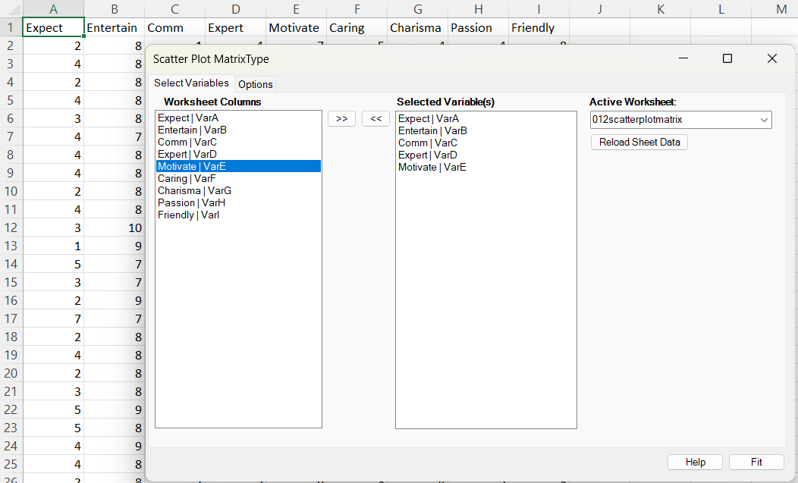
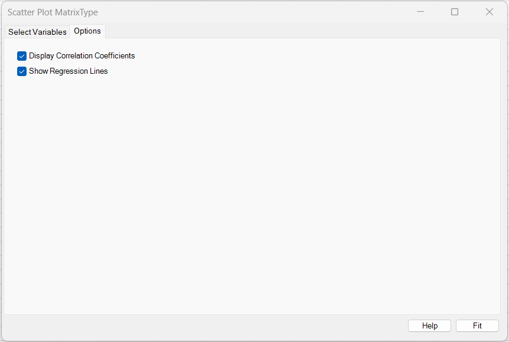
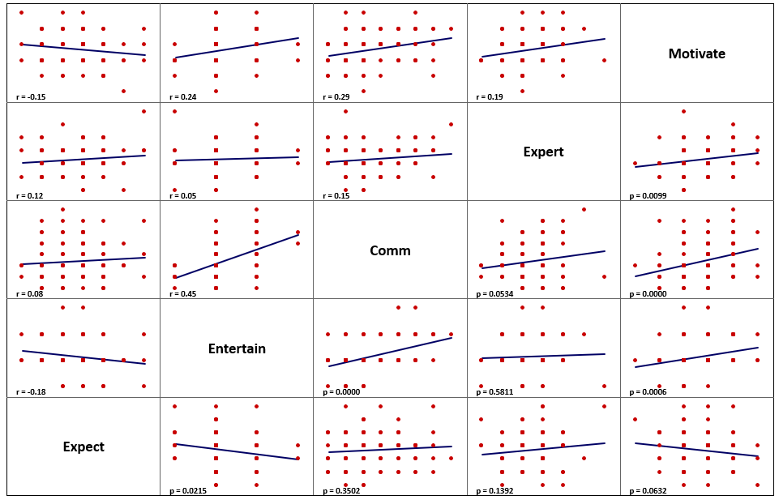

# Scatter Plot Matrix

**Includes:** Scatter plot matrix, Optional correlation coefficients, Optional regression lines.  
**Purpose:** Quickly explore pairwise relationships among many variables.

---

## Overview

A **scatter plot matrix** (also called *SPLOM*) shows all pairwise scatter plots between selected variables in a single grid.

In BESHStatNG:

- each off-diagonal cell shows a scatter plot for one variable pair,
- the diagonal shows variable names,
- optional labels show **Pearson r** (upper triangle) and **p-values** (lower triangle),
- optional **least-squares regression lines** are drawn in each scatter panel.

---

## Example dataset (reproduce the screenshots)

Download the dataset used in the screenshots:

- [012scatterplotmatrix.csv](../assets/data/012scatterplotmatrix/012scatterplotmatrix.csv)

In the screenshots, only the first **five** variables were selected:

- Expect
- Entertain
- Comm
- Expert
- Motivate

---

## Dialog screenshots

### Select Variables tab

### Options tab

### Example output

---

## When to use it

Use Scatter Plot Matrix when you want to:

- spot linear/nonlinear relationships quickly,
- identify clusters, outliers, or strong collinearity before regression/PCA,
- compare the strength and direction of associations across many variables.

Requirements / assumptions:

- Variables must be **numeric**.
- Rows with missing/non-numeric values are removed as **complete cases** (see Notes).

---

## Inputs in Excel

### Selecting variables
This tool uses the “multivariate selection” UI (listboxes):

- **Worksheet Columns** lists numeric columns from the selected worksheet (based on the header row).
- Move columns to **Selected Variable(s)** using `>>` and `<<`.
- Use **Active Worksheet** and **Reload Sheet Data** if you want to switch sheets.

> Tip: Put variable names in row 1. The add-in uses row 1 as labels.

---

## Options

- **Display Correlation Coefficients**  
  Shows:
  - upper triangle: `r = ...` (Pearson correlation coefficient)
  - lower triangle: `p = ...` (two-sided p-value for correlation)

- **Show Regression Lines**  
  Adds a least-squares regression line in each off-diagonal scatter panel.

---

## What it does (math and implementation details)

### A) Panel layout and scaling (important!)

BESHStatNG draws a single Excel XY chart and maps every scatterplot panel into the unit square \([0,1]\times[0,1]\) divided into a \(p\times p\) grid (where \(p\) is the number of selected variables).

Each variable is min–max scaled into the horizontal/vertical interval of its panel, with a fixed margin.

Let:

- \(x_{ij}\) be the raw value for observation \(i\) and variable \(j\)
- \(\min_j = \min_i(x_{ij})\), \(\max_j = \max_i(x_{ij})\)
- \(p\) be the number of selected variables
- margin \(m = 0.1\)

Define the panel bounds:

$$
\mathrm{panelMin} = \frac{m}{p},
\qquad
\mathrm{panelMax} = \frac{1-m}{p},
\qquad
\mathrm{panelRange} = \mathrm{panelMax} - \mathrm{panelMin}
= \frac{1-2m}{p}.
$$

Then the scaled coordinate used for plotting variable \(j\) is:

$$
x'_{ij}
=
\frac{j}{p}
+
\mathrm{panelMin}
+
(x_{ij}-\min_j)\cdot
\frac{\mathrm{panelRange}}{\max_j-\min_j}.
$$

**Consequence:** axes are not shared across panels; each variable uses its own min/max scaling so panels are comparable in shape, not original measurement units.

---

### B) Pearson correlation coefficient (upper triangle)

For each variable pair \((X,Y)\), Pearson correlation is computed (equivalent to Excel `CORREL`):

$$
r = \frac{\sum_{i=1}^{n}(x_i-\bar{x})(y_i-\bar{y})}
{\sqrt{\sum_{i=1}^{n}(x_i-\bar{x})^2}\sqrt{\sum_{i=1}^{n}(y_i-\bar{y})^2}}.
$$

In the matrix:
- if column index \(i < j\) (upper triangle), the label is shown as `r = 0.xx`.

---

### C) Correlation p-value (lower triangle)

For the same pair, the add-in also computes a **two-sided p-value** for testing \(H_0: r=0\).  
In the matrix:

- if \(i > j\) (lower triangle), the label is shown as `p = 0.xxxx`.

**Implementation detail:**

- the code converts \(r\) into a t-like statistic and evaluates a **two-tailed Student-t probability** using `T.DIST.2T`-equivalent logic.
- the degrees of freedom passed in the current implementation is \(df = n\).

(So the lower triangle is a p-value matrix corresponding to the upper-triangle r matrix.)

---

### D) Regression lines (optional)

If **Show Regression Lines** is enabled, the add-in fits a simple least-squares line for each variable pair \((X,Y)\):

$$
y = a + b x
$$

where the slope and intercept are:

$$
b =
\frac{\sum_{i=1}^{n}(x_i-\bar{x})(y_i-\bar{y})}
{\sum_{i=1}^{n}(x_i-\bar{x})^2},
\qquad
a = \bar{y} - b\bar{x}.
$$

**Important:** the regression is computed on the **panel-scaled coordinates** (the \(x'_{ij}\) / \(y'_{ij}\) values used for plotting), so the line indicates **direction and linear trend**, not an original-units slope.

---

## Steps in the add-in (match screenshots)

1. In Excel ribbon: **BESH Stat NG → Analyse → Graphics → Scatter Plot Matrix**
2. In **Select Variables**:
   - choose the worksheet (if needed),
   - select columns in **Worksheet Columns**,
   - move them to **Selected Variable(s)** using `>>`
3. In **Options**:
   - (optional) enable **Display Correlation Coefficients**
   - (optional) enable **Show Regression Lines**
4. Click **Calculate**

---

## Output

The output is an Excel **chart sheet** containing the \(p\times p\) scatter plot matrix:

- diagonal panels show variable names
- off-diagonal panels show red scatter points
- optional blue regression lines show linear trends
- optional text labels show:
  - upper triangle: `r = ...`
  - lower triangle: `p = ...`

---

## How to interpret (mini-example)

In the example (first five variables selected), you can quickly see which pairs move together (upward trend with positive slope) versus move oppositely (downward trend). The **upper-triangle r labels** summarize strength/direction (e.g., small \(|r|\) ≈ weak linear relationship; larger \(|r|\) ≈ stronger). The **lower-triangle p labels** help flag which correlations are unlikely under \(H_0: r=0\) for the current sample size—useful as a quick screen before deeper modeling. Always confirm visually: a near-zero r can still hide nonlinear structure, and discrete/ordinal data may show banding.

---

## Notes and limitations

- **Complete-case filtering:** rows containing missing/non-numeric values in *any selected variable* are removed before plotting.
- **Scaling:** each variable is min–max scaled per panel (not z-scored), so slopes are not in original units.
- **Many variables:** large \(p\) can make the matrix hard to read; consider selecting a subset or using PCA as a next step.
- **Overplotting:** jitter is not applied; discrete scales may create stacked points.

---

## References

- https://simplexct.com/how-to-create-a-scatterplot-matrix-in-excel

## See also
- [Principal Component Analysis](principal-component-analysis.md)
- [Normal Plot (Q–Q plot)](normal-plot.md)
- [Descriptive Statistics](descriptive-statistics.md)
- [Home](../index.md)
