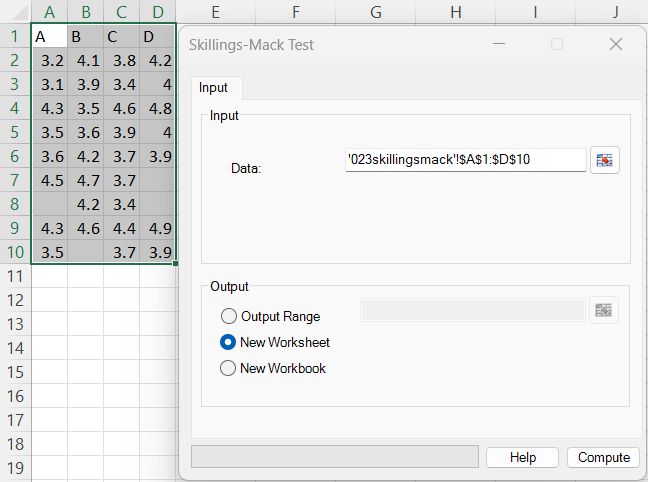
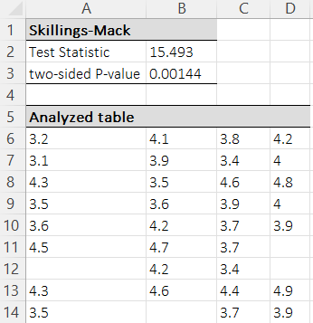

# Skillings-Mack Test

**Includes:** Skillings–Mack test (handles missing values).  
**Purpose:** A rank-based test for **repeated-measures / block designs** (like the Friedman test), but it **allows missing observations** within blocks.

---

## Overview

The Skillings–Mack test can be seen as a generalization of the Friedman test to **incomplete block designs** (not every block needs to contain every treatment/condition).

---

## When to use it

Use the Skillings–Mack test when:

- The same subjects/blocks are measured under **3 or more conditions** (treatments in columns).
- Some blocks have **missing measurements** for one or more conditions.
- You want a **nonparametric** alternative to repeated-measures ANOVA.

**Null hypothesis:** all treatments have the same distribution (equivalently: no systematic treatment effect in ranks).  
**Alternative:** at least one treatment tends to have systematically higher/lower ranks.

---

## Example dataset

Example data: [`023skillingsmack.csv`](../assets/data/023skillingsmack/023skillingsmack.csv)

- **Columns** = treatments/conditions (A–D)  
- **Rows** = blocks/subjects  
- Missing values are allowed (empty cells / `NaN`).

---

## Input dialog



- **Data:** Select the full rectangular range (treatments in columns, blocks in rows).

---

## Options

The Skillings–Mack dialog has no additional options (the method is defined by the selected data range).

---

## Output



BESHStatNG writes the results to a new worksheet (default) or to the selected output location.

### Skillings–Mack section

- **Test Statistic** — the Skillings–Mack statistic \(T\).
- **two-sided P-value** — asymptotic p-value from a chi-square distribution with \(k-1\) degrees of freedom (\(k\) = number of treatments/columns).

### Analyzed table

The output includes an **Analyzed table** showing the data actually used by the test:

- Blocks with fewer than **two** valid observations are omitted.
- Missing values within retained blocks are kept as blanks.

---

## Mathematical details

Let \(k\) be the number of treatments (columns) and \(b\) the number of blocks (rows).  
Within block \(i\), let \(k_i\) be the number of **non-missing** observations (\(k_i \ge 2\) for the block to contribute).

### 1) Ranks within each block (ties averaged)

For each block \(i\), compute ranks \(r_{ij}\) among the **observed** values only (average ranks for ties).  
Missing observations are treated as having the block mid-rank, so they contribute 0 after centering.

### 2) Standardized centered rank scores

BESHStatNG forms standardized scores

$$
s_{ij}=\sqrt{\frac{12}{k_i+1}}\left(r_{ij}-\frac{k_i+1}{2}\right).
$$

For a missing value in block \(i\), the add-in sets \(r_{ij}=(k_i+1)/2\), so \(s_{ij}=0\).

Then the treatment score totals are

$$
S_j = \sum_{i=1}^{b} s_{ij}.
$$

### 3) Covariance matrix for incomplete blocks

Let \(c_{j\ell}\) be based on co-occurrence of treatments within blocks:

- If treatments \(j\) and \(\ell\) are both observed in a block, it contributes +1 to the diagonal and −1 to the corresponding off-diagonal (Laplacian-style structure).
- Summed over blocks, this yields a \(k\times k\) matrix \(\mathbf{C}\).

### 4) Test statistic and p-value

BESHStatNG computes the quadratic form (using a \((k-1)\times(k-1)\) invertible submatrix of \(\mathbf{C}\)):

$$
T = \mathbf{S}_{1:(k-1)}^{\mathsf{T}}\,\mathbf{C}_{1:(k-1),1:(k-1)}^{-1}\,\mathbf{S}_{1:(k-1)}.
$$

Under \(H_0\), \(T\) is approximately chi-square distributed:

$$
T \;\overset{\cdot}{\sim}\; \chi^2_{k-1}.
$$

> **Relation to Friedman:** If there are **no missing values** (all \(k_i=k\)), Skillings–Mack is closely related to the Friedman test; with missing data, Skillings–Mack remains applicable while Friedman requires complete blocks.

---

## R reference code

In R, the Skillings–Mack test is available in the **Skillings.Mack** package.

```r
# install.packages("Skillings.Mack")
library(Skillings.Mack)

dat <- read.csv("023skillingsmack.csv")

# Ensure the data are treated as a numeric matrix with NA for missing values
x <- as.matrix(dat)

res <- Skillings.Mack(x)
res
```

### Why results may differ slightly

Different implementations can differ slightly due to:

- **Tie handling** (average ranks is standard, but corner cases can differ),
- how missing values are represented/filtered (e.g., blocks with too few observations),
- numerical details of the matrix inversion / generalized inverse used for the covariance structure.

For this dataset, the R package result should match the add-in very closely (same \(T\) and p-value up to rounding).

---

## See also

- [Friedman Test](friedman-test.md)
- [Kruskal–Wallis Test](kruskal-wallis-test.md)
- [Home](../index.md)
