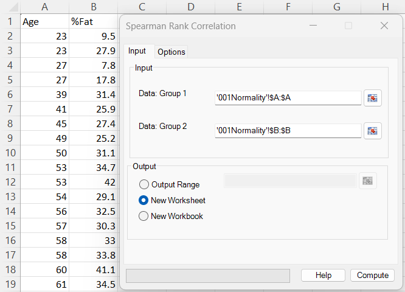
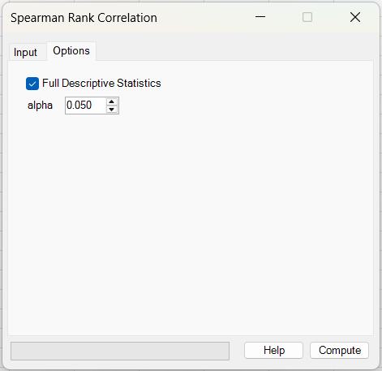
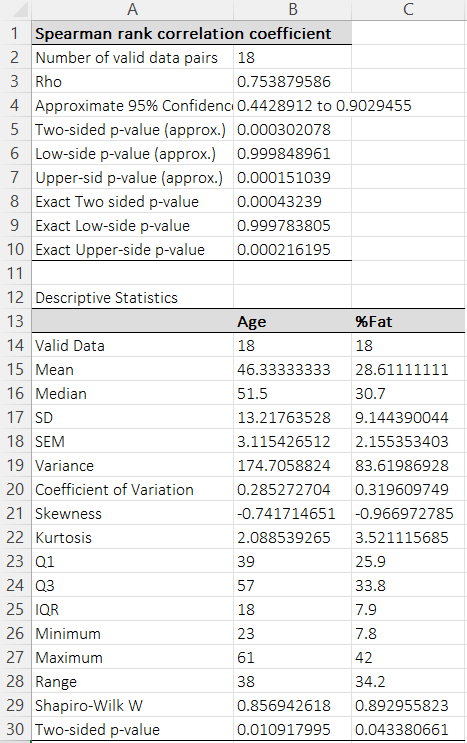

# Spearman Rank Correlation

**Includes:** Spearman’s \(\rho\) (rank correlation), p-value / CI where applicable.  
**Purpose:** Measure monotonic association between two variables using ranks (robust to non-normality and outliers).

---

## Overview

Spearman’s rank correlation (\(\rho\)) measures the strength and direction of a **monotonic** relationship between two variables. It is computed as the Pearson correlation of the **ranked** values, so it is less sensitive to outliers and non-normality than Pearson’s correlation.

Typical questions it answers:

- “Do larger values of \(X\) tend to come with larger (or smaller) values of \(Y\), even if the relationship is not linear?”
- “Is there evidence of a monotonic trend between two variables?”

---

## Example dataset

In the screenshots, the full dataset below was used (two columns):

- **Age**
- **%Fat**

Download:

- [001Normality.csv](../assets/data/001normality/001Normality.csv)

---

## Screenshots

### Input tab


### Options tab


### Results


---

## When to use it

Use Spearman rank correlation when:

- you want an association measure that is robust to outliers,
- the relationship may be **non-linear but monotonic**,
- data are ordinal, or continuous but not well-approximated by a normal distribution.

Notes:

- Spearman tests monotonic association, not strictly linear association.
- Missing values are handled by **pairwise deletion** (rows with missing \(X\) or \(Y\) are excluded).

---

## Inputs in Excel

- **Data: Group 1** – first variable (single column).
- **Data: Group 2** – second variable (single column).

Output destination:

- Output range (current sheet)
- New worksheet
- New workbook

Options:

- **Full Descriptive Statistics** – adds a descriptive table for each variable (mean, median, SD, quartiles, Shapiro–Wilk, etc.).
- **Alpha** – two-sided significance level used for the approximate confidence interval.  
  Default: **0.05** (95% confidence interval)

---

## Steps in the add-in

1. Ribbon: **BESH Stat NG → Analyse → Nonparametric → Spearman Rank Correlation**
2. In **Input**:
   - Select **Group 1** and **Group 2** data ranges.
   - Choose output destination.
3. In **Options** (optional):
   - Enable **Full Descriptive Statistics**
   - Set **Alpha** for the approximate confidence interval
4. Click **Compute**.

---

## Output

The results sheet reports:

- **Number of valid data pairs** (\(n\))
- **Rho** (Spearman’s \(\rho\))
- **Approximate CI at the selected level** (default \(\alpha=0.05\), i.e. 95%)
- **Approximate p-values** (two-sided, lower-side, upper-side)
- **Exact p-values** (two-sided, lower-side, upper-side) when available

Interpretation:

- \(\rho\) close to **+1**: strong increasing monotonic association
- \(\rho\) close to **−1**: strong decreasing monotonic association
- p-value assesses evidence against \(H_0: \rho = 0\)

---

## What it does (math and implementation details)

### A) Rank transformation

BESHStatNG computes **average ranks** (midranks) when ties occur.

Let \(R(X_i)\) be the rank of \(X_i\) among \(X\) values, and \(R(Y_i)\) the rank of \(Y_i\) among \(Y\) values.

### B) Spearman’s \(\rho\)

Spearman’s \(\rho\) is the Pearson correlation of the ranked values:

$$
\rho = \mathrm{cor}\big(R(X),\, R(Y)\big)
$$

When there are **no ties**, the classical shortcut formula is:

$$
\rho = 1 - \frac{6\sum_{i=1}^n d_i^2}{n(n^2-1)}
\quad\text{where}\quad d_i = R(X_i)-R(Y_i)
$$

### C) Approximate p-values (t approximation)

BESHStatNG reports approximate p-values using a t approximation:

$$
t = \rho\,\sqrt{\frac{n-2}{1-\rho^2}}
$$

Two-sided p-value:

$$
p = 2\,\big(1 - F_t(|t|;\, n-2)\big)
$$

### D) Exact p-value (permutation exact; when available)

BESHStatNG can also report an additional p-value in the “Exact … p-value” rows:

- for **\(n \le 10\)**, it enumerates permutations to obtain a permutation p-value;
- for **moderate \(n\)** without ties in the permuted variable, it uses the Best & Roberts (1975) / Algorithm AS 89 style approximation (software implementations may differ slightly due to conventions for ties and tail definitions).

If the exact/AS89 computation is not available for the input (e.g., due to ties), the table shows **NE**.
> For Spearman’s correlation, exact p-values are unambiguous only when there are no ties; with ties, different software uses different valid conventions, so exact values may not match across tools.

### E) Approximate confidence interval at level \(1-\alpha\) (Fisher z transform)

BESHStatNG reports an approximate CI using a Fisher z transform:

$$
z = \operatorname{atanh}(\rho),\qquad \mathrm{SE}(z)=\sqrt{\frac{1}{n-3}}
$$

$$
\rho_{L,U} = \tanh\big(z \pm z_{1-\alpha/2}\,\mathrm{SE}(z)\big)
$$

In the current dialog, **Alpha** is user-selectable. The default is \(\alpha=0.05\), so the reported interval is an **approximate 95% CI** unless changed.

---

## Relation to Kendall’s \(\tau\) and Theil–Sen regression

Spearman’s \(\rho\) and Kendall’s \(\tau\) are both **rank-based** association measures:

- **Spearman (\(\rho\))** is the Pearson correlation of ranks and is often slightly more sensitive to strong monotonic trends.
- **Kendall (\(\tau\))** is based on concordant/discordant pairs and has a natural probabilistic interpretation (difference between probabilities of concordance and discordance).

If you also want a **robust slope estimate** (effect size in original units), consider **Theil–Sen simple regression**, which estimates the slope as the median of pairwise slopes.

Links:

- [Kendall's Rank Correlation](kendalls-rank-correlation.md)
- [Theil-Sen Simple Regression](theil-sen-simple-regression.md)

---

## R reference code

```r
# Spearman rank correlation (R)

d <- read.csv("001Normality.csv")

x <- d$Age
y <- d$`%Fat`

# Spearman rho with p-value
# NOTE: with ties, R may not compute an exact p-value even if exact=TRUE.
cor.test(x, y, method = "spearman", exact = TRUE)

# If R warns about ties, use the asymptotic test explicitly:
cor.test(x, y, method = "spearman", exact = FALSE)

# Approximate CI similar to BESHStatNG (Fisher z transform)
alpha <- 0.05   # current dialog default; use 0.10 for a 90% CI
rho <- suppressWarnings(cor(x, y, method = "spearman"))
n <- sum(complete.cases(x, y))
se <- sqrt(1/(n - 3))
zcrit <- qnorm(1 - alpha/2)
ci <- tanh(atanh(rho) + c(-1, 1) * zcrit * se)
ci
```

### Why R may differ slightly from BESHStatNG

- R’s exact p-values for Spearman are limited by the presence of ties; it may fall back to an asymptotic p-value.
- BESHStatNG reports a separate “Exact … p-value” line when its exact/permutation or AS89-style computation is available.
- Confidence intervals may differ if you use a different CI method in R (many packages use alternative approaches, especially for tied data).

---

## Notes

- If either variable has zero variance (all equal), \(\rho\) is reported as 0.
- The descriptive statistics table follows the same conventions as [Descriptive Statistics](descriptive-statistics.md) (quartiles follow the project’s standard percentile definition).

---

## See also

- [Kendall's Rank Correlation](kendalls-rank-correlation.md)
- [Theil-Sen Simple Regression](theil-sen-simple-regression.md)
- [Home](../index.md)

