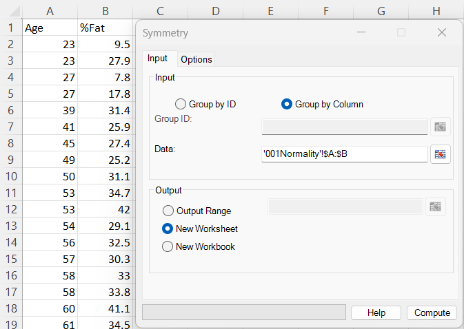
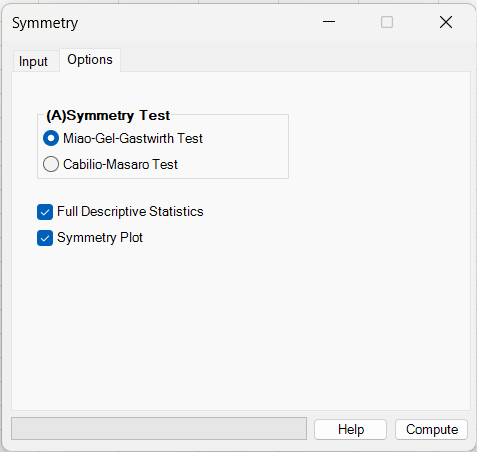
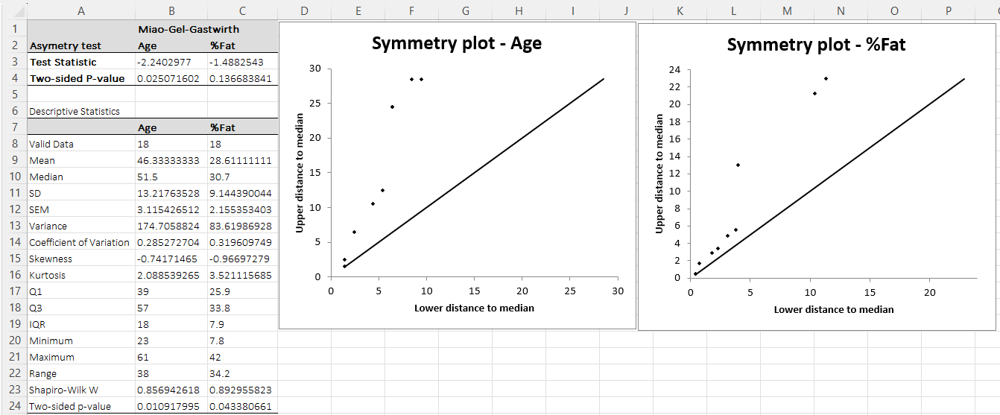

# Symmetry

**Includes:** Miao–Gel–Gastwirth test, Cabilio–Masaro test, Asymmetry plot (optional).  
**Purpose:** Evaluate whether a distribution is symmetric about its (unknown) median, and visualize asymmetry.

---

## Overview

The Symmetry dialog tests (per selected variable / group) the null hypothesis:

**H₀:** the data are symmetric about the population median.

Both implemented tests are based on the **difference between the sample mean and sample median**. Under symmetry, the mean and median coincide (asymptotically), so a large standardized difference indicates asymmetry.

BESHStatNG can optionally generate a **symmetry plot** (also called a Lovie symmetry plot) to visualize how upper and lower tails differ around the median.

---

## Dialog: inputs and options

### Input tab

You can define datasets in two ways:

#### A) Group by Column (most common)
- Select a **rectangular range** where **each column is one variable**.
- The **first row is treated as a column name** (e.g., `Age`, `%Fat`).
- Each column is imported and cleaned **independently** (missing / non-numeric cells are ignored for that column).

This mode is used in the screenshot above.

#### B) Group by ID (grouping column + data column)
Use this when your data are stored as:

| GroupID | Value |
|---|---|
| A | 12.3 |
| A | 11.7 |
| B | 9.8 |
| ... | ... |

- **Group ID:** the range containing group labels (text or numbers).
- **Data:** the numeric values.
- The test is run separately per group.

---

### Options tab

Choose one symmetry test:

- **Miao–Gel–Gastwirth test** (default in the UI)  
  More robust because it uses a robust scale estimate based on absolute deviations from the median.
- **Cabilio–Masaro test**  
  Uses the usual sample standard deviation; can be more sensitive to outliers.

Optional outputs:

- **Full Descriptive Statistics** — adds a descriptive statistics table.  
  See: [Descriptive Statistics](descriptive-statistics.md)
- **Symmetry Plot** — adds a symmetry plot per variable.  
  See details below.

---

## What it does (math and implementation details)

**Implementation in BESHStatNG:** `SymmetryTest(data() As Double, strType As String)` in `src/StatTests/Assumptions.vb`.  
P-values are computed using the internal standard normal CDF `PNorm`.

Let a sample be \(x_1,\dots,x_n\). Define:

- sample mean \( \bar x \)
- sample median \( m \)

Both tests form a standardized statistic of the general form:

\[
Z = \frac{\bar x - m}{\widehat{\mathrm{SE}}(\bar x - m)}\cdot \frac{1}{\sqrt{\frac{\pi}{2} - 1}},
\]

and report a **two-sided** p-value using a normal approximation:

\[
p = 2\Bigl(1 - \Phi(\lvert Z \rvert)\Bigr),
\]

where \(\Phi(\cdot)\) is the standard normal CDF.

---

### 1) Miao–Gel–Gastwirth test (robust)

This test uses a robust dispersion estimate based on **mean absolute deviation about the median**, scaled to estimate \(\sigma\) under normality and then converted to a standard error.

Compute:

\[
\mathrm{MAD}_{m} = \frac{1}{n}\sum_{i=1}^n \lvert x_i - m \rvert,
\qquad
\hat\sigma_{\mathrm{rob}} = \sqrt{\frac{\pi}{2}}\,\mathrm{MAD}_{m}.
\]

BESHStatNG then uses the standard-error form implemented in code:

\[
\widehat{\mathrm{SE}}_{\mathrm{MGG}}(\bar x - m) = \frac{\hat\sigma_{\mathrm{rob}}}{\sqrt{n}}
= \sqrt{\frac{\pi}{2}}\cdot \frac{1}{n\sqrt{n}}\sum_{i=1}^n \lvert x_i - m \rvert.
\]

Finally, the test statistic is:

\[
Z_{\mathrm{MGG}} = \frac{\bar x - m}{\widehat{\mathrm{SE}}_{\mathrm{MGG}}(\bar x - m)}\cdot \frac{1}{\sqrt{\frac{\pi}{2} - 1}}.
\]

**Interpretation**

- \(Z_{\mathrm{MGG}} \approx 0\): consistent with symmetry.
- **Negative** \(Z_{\mathrm{MGG}}\): \(\bar x < m\) → suggests **left-skewness**.
- **Positive** \(Z_{\mathrm{MGG}}\): \(\bar x > m\) → suggests **right-skewness**.

If the robust scale estimate is zero (all values equal), BESHStatNG returns statistic 0 and p-value 1.

---

### 2) Cabilio–Masaro test

This test uses the usual sample standard deviation \(s\) (with \(n-1\) in the denominator, as in BESHStatNG `stDev`) to form a standard error:

\[
\widehat{\mathrm{SE}}_{\mathrm{CM}}(\bar x - m) = \frac{s}{\sqrt{n}}.
\]

The reported statistic is:

\[
Z_{\mathrm{CM}} = \frac{\bar x - m}{\widehat{\mathrm{SE}}_{\mathrm{CM}}(\bar x - m)}\cdot \frac{1}{\sqrt{\frac{\pi}{2} - 1}},
\qquad
p = 2\Bigl(1 - \Phi(\lvert Z_{\mathrm{CM}} \rvert)\Bigr).
\]

**Practical note:** because \(s\) is sensitive to outliers and heavy tails, CM can be less robust than MGG when data contain outliers.

---

### 3) Symmetry plot (Lovie symmetry plot)

**Implementation in BESHStatNG:** `SymetryPlot.AsymmetryPlot(...)` in `src/Graphics/SymetryPlot.vb`.

Let \(y_{(1)} \le \dots \le y_{(n)}\) be the sorted sample and \(m\) its median. For \(i = 1,\dots,\lfloor n/2 \rfloor\), define:

\[
\text{Lower}_i = m - y_{(i)}, \qquad \text{Upper}_i = y_{(n-i+1)} - m.
\]

The plot places points \((\text{Lower}_i,\text{Upper}_i)\) and overlays a 45° reference line \(y=x\).

**Interpretation**

- Points close to the 45° line → data are close to symmetric.
- Systematic deviation from the line indicates asymmetry; the direction is consistent with the sign of \(\bar x - m\) (and the test statistic).

---

## Steps in the add-in

1. Excel ribbon: **BESH Stat NG → Analyse → Assumptions → Symmetry**
2. On **Input**, choose:
   - **Group by Column** (typical), then select a rectangular data range, or
   - **Group by ID** (ID + value column)
3. Choose output destination:
   - **Output Range**
   - **New Worksheet** (recommended)
   - **New Workbook**
4. On **Options**, pick the symmetry test and optional outputs.
5. Click **Compute**.

---

## Output

The output includes:

- A symmetry-test table (one column per variable/group):
  - **Test Statistic**
  - **Two-sided P-value**
- Optional **Descriptive statistics** table
- Optional **Symmetry plot** per variable

---

## Mini-example (001Normality.csv)

Download the example dataset: [001Normality.csv](../assets/data/001normality/001Normality.csv)

In the screenshots above, the input is **Group by Column** with two variables (`Age`, `%Fat`) and the **MGG** test selected.

Example interpretation from the output:

- **Age**: \(Z_{\mathrm{MGG}} \approx -2.24\), \(p \approx 0.025\)  
  → evidence of **asymmetry** at the 0.05 level. The statistic is negative (\(\bar x < m\)), suggesting **left-skewness**.
- **%Fat**: \(Z_{\mathrm{MGG}} \approx -1.49\), \(p \approx 0.137\)  
  → no strong evidence of asymmetry at 0.05 (data are **consistent** with symmetry at this sample size).

Use the **Symmetry plot** as a visual confirmation: for symmetric data, points should lie close to the 45° line.

---

## Comparison to R

In R, comparable tests are available via `lawstat::symmetry.test()`:

- MGG: `lawstat::symmetry.test(x, option = "MGG")`
- CM:  `lawstat::symmetry.test(x, option = "CM")`

BESHStatNG reports the **asymptotic normal-approximation** p-value (two-sided), which corresponds to the asymptotic mode in R’s implementation.

---

## Notes and practical guidance

- These tests are most meaningful when you have at least a moderate sample size per group (very small \(n\) can be unstable).
- Symmetry is not the same as normality: a distribution can be symmetric but heavy-tailed or multimodal.
- If symmetry is strongly violated, consider robust or nonparametric methods, or apply a transformation where appropriate.

---

## References

- Miao W., Gel Y.R., Gastwirth J.L. A new test of symmetry about an unknown median. In Random Walk, Sequential Analysis and Related Topics a Festschrift in Honor of Yuan-Shih Chow. By Yuan Shih Chow, Agnes Chao. Hsiung, Zhiliang Ying, and Cun-Hui Zhang. Singapore: World Scientific Pub., 2006. 199-214.
- Cabilio P., Masaro J. (1996) A simple test of symmetry about an unknown median. The Canadian Journal of Statistics, 24, 349-361.
- Lovie S. Symmetry Plot. In Encyclopedia of Statistics in Behavioral Science, John Wiley & Sons, 2005, Vol 4, 1989–1990

## See also

- [Normality Tests](normality-tests.md)
- [Descriptive Statistics](descriptive-statistics.md)
- [Box and Whiskers](box-and-whiskers.md)
