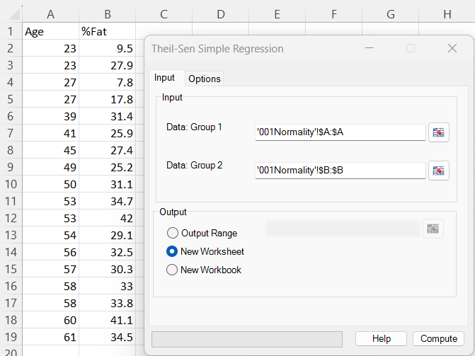
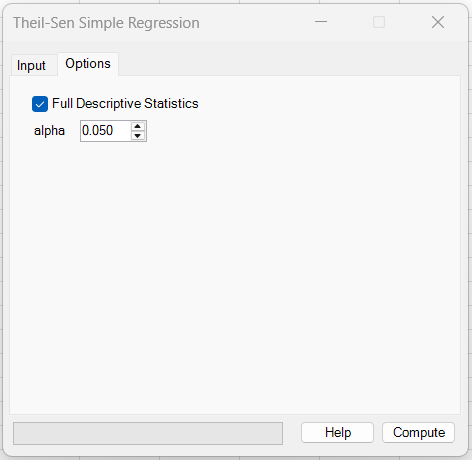
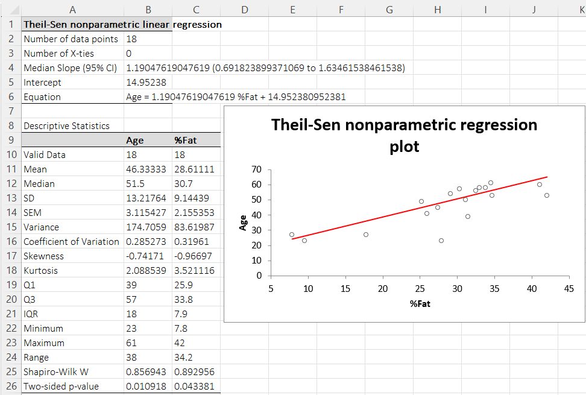

# Theil-Sen Simple Regression

**Includes:** Median slope (Theil–Sen), confidence interval at the selected \(1-\alpha\) level (Sen/large-sample approx.), Robust intercept.  
**Purpose:** Robust simple linear regression resistant to outliers, based on median pairwise slopes.

---

## Overview

Theil–Sen (also called Sen–Theil) simple regression estimates a linear relationship

$$
y = \beta x + \alpha
$$

using **medians** rather than least squares. It is especially useful when the data contain outliers or when the relationship is monotonic but not well modeled by ordinary least squares (OLS).

BESHStatNG reports:

- **Median Slope (\(1-\alpha\) CI)** — Theil–Sen slope estimate and confidence interval
- A robust **intercept**
- The fitted **equation**
- Number of **X-ties** (important for slope CI computation)
- Optional descriptive statistics and a regression plot

---

## Example dataset

In the screenshots, the dataset below was used:

- **Age** (response, \(y\))
- **%Fat** (predictor, \(x\))

Download:

- [001Normality.csv](../assets/data/001normality/001Normality.csv)

---

## Screenshots

### Input tab


### Options tab


### Results


---

## When to use it

Use Theil–Sen regression when:

- you want a **robust slope estimate** (effect size in original units),
- the data may contain **outliers** or heavy tails,
- you prefer a method that does not rely on normality of residuals,
- you expect an approximately linear trend but want a slope estimator that is resistant to influential points.

Notes:

- The method estimates a **linear** trend (slope + intercept). If the relationship is strongly curved (nonlinear), consider transformations or other models.
- Missing values are handled by **pairwise deletion** (rows with missing \(x\) or \(y\) are excluded).

---

## Inputs in Excel

- **Data: Group 1** – response variable \(y\) (e.g., Age).
- **Data: Group 2** – predictor variable \(x\) (e.g., %Fat).

Output destination:

- Output range (current sheet)
- New worksheet
- New workbook

Options:

- **Alpha** – two-sided significance level used for the Theil–Sen slope confidence interval.  
  Default: **0.05** (95% confidence interval).
- **Full Descriptive Statistics** – adds a descriptive table for each variable (mean, median, SD, quartiles, Shapiro–Wilk, etc.).

---

## Steps in the add-in

1. Ribbon: **BESH Stat NG → Analyse → Nonparametric → Theil–Sen Simple Regression**
2. In **Input**:
   - Select **Group 1** (response \(y\)) and **Group 2** (predictor \(x\)) ranges.
   - Choose output destination.
3. In **Options** (optional):
   - Set **Alpha** for the slope confidence interval.
   - Enable **Full Descriptive Statistics** if wanted.
4. Click **Compute**.

---

## Output

The results sheet reports:

- **Number of data points** (\(n\))
- **Number of X-ties** (ties in the predictor, which affect the slope CI)
- **Median slope** (Theil–Sen slope) with a confidence interval at the selected \(1-\alpha\) level
- **Intercept** — robust intercept estimate
- **Equation** — fitted relationship \( \hat{y} = \hat{\beta}x + \hat{\alpha}\)

Interpretation:

- A positive slope indicates \(y\) tends to increase as \(x\) increases (robust to outliers).
- The reported CI provides an uncertainty range for the slope at the selected \(1-\alpha\) level. If the CI excludes 0, it supports a non-zero trend.

---

## Mathematical details

### A) Theil–Sen slope (median of pairwise slopes)

For all pairs \(i < j\) with \(x_i \ne x_j\), compute pairwise slopes:

$$
m_{ij} = \frac{y_j - y_i}{x_j - x_i}.
$$

Let these slopes be sorted as \(m_{(1)} \le \dots \le m_{(N)}\), where \(N\) is the number of valid pairs (excluding \(x\)-ties).

The Theil–Sen slope is the median:

$$
\hat{\beta} = \operatorname{median}\{m_{ij}\}.
$$

### B) Intercept used by BESHStatNG

BESHStatNG uses a robust intercept based on medians:

$$
\hat{\alpha} = \operatorname{median}(y) - \hat{\beta}\,\operatorname{median}(x).
$$

(Other software sometimes uses \(\operatorname{median}(y_i - \hat{\beta}x_i)\); both are robust and typically very close.)

### C) Sen’s confidence interval for the slope

A commonly used large-sample CI for the Sen slope is obtained from the ordered slopes \(m_{(1)},\dots,m_{(N)}\).

Compute

$$
C_\alpha = z_{1-\alpha/2}\,\sqrt{\operatorname{Var}(S)},
$$

where \(S\) is Kendall’s \(S\) statistic for monotone trend and \(\operatorname{Var}(S)\) is its variance.  
When there are **no ties in \(x\)**,

$$
\operatorname{Var}(S) = \frac{n(n-1)(2n+5)}{18}.
$$

With ties in \(x\), BESHStatNG applies a standard tie adjustment based on the sizes of tie groups in \(x\) (this is why the output reports the number of X-ties).

Let

$$
L = \left\lceil \frac{N - C_\alpha}{2} \right\rceil,\qquad
U = \left\lfloor \frac{N + C_\alpha}{2} \right\rfloor.
$$

Then the confidence interval at the selected \(1-\alpha\) level is reported as:

$$
\big[m_{(L)},\, m_{(U)}\big].
$$

---

## Relation to Spearman’s \(\rho\), Kendall’s \(\tau_b\), and monotone trend

- **Spearman’s \(\rho\)** and **Kendall’s \(\tau_b\)** measure **monotonic association** using ranks.
- **Theil–Sen** provides a **robust slope** (effect size in the original units) for an approximately linear trend.

In many datasets, the sign of \(\hat{\beta}\) matches the sign of \(\rho\) and \(\tau_b\):  
positive monotone association \(\Rightarrow\) positive slope.

Links:

- [Spearman Rank Correlation](spearman-rank-correlation.md)
- [Kendall's Rank Correlation](kendalls-rank-correlation.md)

---

## R reference code

The code below reproduces the same analysis in R. Differences in the CI can occur because some packages use bootstrap or slightly different index conventions.

```r
d <- read.csv("001Normality.csv")

y <- d$Age
x <- d$`%Fat`

# 1) Theil–Sen regression (package implementation)
# Option A: mblm (median-based linear model)
# install.packages("mblm")
library(mblm)
fit <- mblm(y ~ x, repeated = FALSE)
fit

# Option B: DescTools (if available)
# install.packages("DescTools")
# library(DescTools)
# TheilSen(x, y, conf.level = 0.95)

# 2) Manual reproduction matching BESHStatNG’s reported intercept:
# median slope of all pairwise slopes
slopes <- c()
n <- length(x)
for (i in 1:(n-1)) for (j in (i+1):n) if (x[j] != x[i]) slopes <- c(slopes, (y[j]-y[i])/(x[j]-x[i]))
b <- median(slopes)

# BESHStatNG-style intercept
a <- median(y) - b * median(x)

c(slope = b, intercept = a)
```

### Why R may differ slightly from BESHStatNG

- Some R functions compute the **intercept** as \(\operatorname{median}(y_i - \hat{\beta}x_i)\), while BESHStatNG uses \(\operatorname{median}(y) - \hat{\beta}\operatorname{median}(x)\). Both are robust; values are usually close.
- Confidence intervals for the slope may differ depending on whether a package uses **Sen’s ordering method**, a **normal approximation**, or **bootstrap** intervals.

---

## Notes

- If many **X-ties** exist, the number of usable pairwise slopes decreases and the slope CI may widen.
- The descriptive statistics table follows the same conventions as [Descriptive Statistics](descriptive-statistics.md).

---

## References

- Altman D.G. Practical Statistics for medical research. Chapman & Hall, 1991.
- Conover W.J. Practical Nonparametric Statistics (3rd ed.). Wiley 1999.
- Sen P.K. 1(968) Estimates of the regression coefficient based on Kendall’s tau: Journal of the American Statistical Association, vol. 63, 1379–1389.
- Theil H. (1950) A rank-invariant method of linear and polynomial regression analysis, I, II, and III: Nederl. Akad. Wetensch. Proc., 53 (1950), 386-92, 521-5 and 1397-412.

## See also

- [Kendall's Rank Correlation](kendalls-rank-correlation.md)
- [Spearman Rank Correlation](spearman-rank-correlation.md)
- [Home](../index.md)
