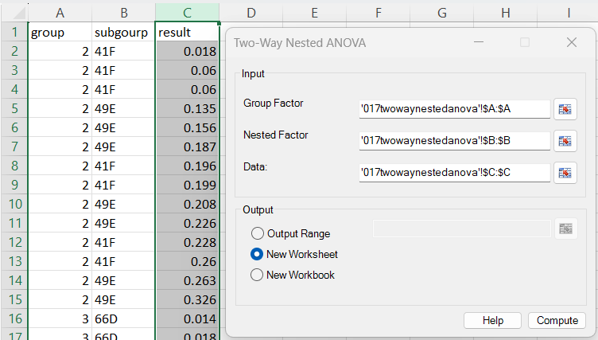
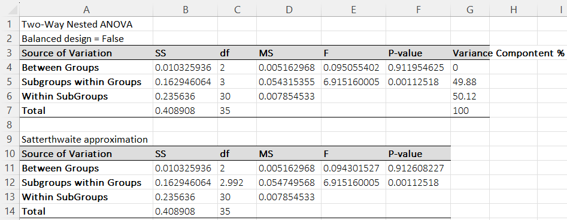

# Two-Way Nested ANOVA

**Includes:** Two-way nested ANOVA, Balanced design check, Satterthwaite approximation (unbalanced designs).  
**Purpose:** Analyze hierarchical (nested) designs such as subjects nested within centers, with appropriate variance decomposition.

---

## Overview

A **two-way nested ANOVA** is used when one factor is **nested** inside another factor (the nested levels exist **only within** a parent level).

Example:

- **Group factor** \(A\): Laboratory (Lab 1, Lab 2, Lab 3)
- **Nested factor** \(B(A)\): Technician *within* laboratory (Tech 1 in Lab 1, Tech 2 in Lab 1, …)
- **Response** \(Y\): numeric outcome (e.g., yield, measurement error)

BESHStatNG reports:

- An ANOVA table with sources:
  - **Between Groups** (factor \(A\))
  - **Subgroups within Groups** (factor \(B(A)\))
  - **Within Subgroups** (residual error)
- A **balanced design** indicator
- **Variance component estimates** (method-of-moments) and their percentage contributions
- A **Satterthwaite approximation table** for the *Between Groups* test when the design is unbalanced and the approximation is applicable

---

## Example dataset

The screenshots use this long-format dataset (three columns):

- `group` – Group factor \(A\)
- `subgourp` – Nested factor \(B(A)\) (note: spelling follows the CSV)
- `result` – Numeric response

Download:

- [017twowaynestedanova.csv](../assets/data/017twowaynestedanova/017twowaynestedanova.csv)

---

## Screenshots

### Input tab


### Results


---

## When to use it

Use Two-Way Nested ANOVA when:

- The response is **continuous**.
- You have a **hierarchical structure** where a “subgroup” factor is only meaningful **within** a parent group.
- Observations are independent **within** each subgroup (conditional on the subgroup mean), and errors are approximately normal with constant variance.

### Nesting requirement (important)

The **nested factor must be truly nested**:

- Each nested level (e.g., subgroup code) must appear in **only one** group level.

If the same nested label appears under multiple groups, the design is **not nested** and the add-in will stop with an error.

---

## Inputs in Excel

This test uses **long format** inputs (three ranges of equal length):

- **Group Factor**: categorical values for \(A\)
- **Nested Factor**: categorical values for \(B(A)\)
- **Data**: numeric response values

### Output
Choose one:
- **Output Range**
- **New Worksheet**
- **New Workbook**

---

## Output and interpretation

### Main ANOVA table

BESHStatNG reports:

- **SS** – sum of squares
- **df** – degrees of freedom
- **MS** – mean square
- **F** – test statistic
- **P-value** – right-tail F p-value
- **Variance Component %** – estimated percentage contribution of each random component (method-of-moments)

**F-tests (nested design):**

**Between Groups (A)** is tested using:

$$
F_A = \frac{MS_A}{MS_{B(A)}}
$$

**Subgroups within Groups (B(A))** is tested using:

$$
F_{B(A)} = \frac{MS_{B(A)}}{MS_E}
$$

## Satterthwaite approximation (unbalanced designs)

For a nested design with **Group** \(A\) and **Subgroup** \(B(A)\), the classical fixed-effects nested ANOVA uses:

Test for **Groups** \(A\):

$$
F_A = \frac{MS_A}{MS_{B(A)}}, \qquad \text{df} = (a-1,\; df_{B(A)})
$$

Test for **Subgroups within Groups** \(B(A)\):

$$
F_{B(A)} = \frac{MS_{B(A)}}{MS_E}, \qquad \text{df} = (df_{B(A)},\; df_E)
$$

When the design is **unbalanced**, \(MS_{B(A)}\) can be a noisy denominator for testing \(A\).  
BESHStatNG optionally computes a **Satterthwaite-adjusted denominator** as a *linear combination* of \(MS_E\) and \(MS_{B(A)}\) (Gaylor & Hopper, 1969) and assigns it an **effective (fractional) degrees of freedom** using Satterthwaite’s formula.

### Design constants \(n_0\) and \(n_0'\)

Let \(n_{ij}\) be the number of observations in subgroup \(j\) nested in group \(i\).  
Let \(n_i = \sum_j n_{ij}\) be the total in group \(i\), and \(N=\sum_i n_i\) the grand total.
Define:

$$
A = \sum_i \frac{\sum_j n_{ij}^2}{n_i},
\qquad
B = \frac{\sum_{i,j} n_{ij}^2}{N}.
$$

Let

$$
df_A = a-1,\qquad df_{B(A)} = \left(\sum_i b_i\right) - a
$$

(where \(a\) is the number of groups and \(b_i\) the number of subgroups in group \(i\)).

BESHStatNG computes:

$$
n_0' = \frac{A - B}{df_A},
\qquad
n_0 = \frac{N - A}{df_{B(A)}}.
$$

### Weights and Satterthwaite denominator

Weights are:

$$
w_2 = \frac{n_0'}{n_0},
\qquad
w_1 = 1 - w_2.
$$

The adjusted denominator mean square is:

$$
MS_{SW} = w_1\,MS_E + w_2\,MS_{B(A)}.
$$

The associated Satterthwaite degrees of freedom are computed using the standard linear-combination formula:

$$
df_{SW} =
\frac{MS_{SW}^2}
{\frac{(w_1 MS_E)^2}{df_E}+\frac{(w_2 MS_{B(A)})^2}{df_{B(A)}} }.
$$

The adjusted test for Groups is then:

$$
F_{SW}=\frac{MS_A}{MS_{SW}}, \qquad \text{df}=(df_A,\; df_{SW}).
$$

### Gaylor–Hopper “safe region” check (definitions of \(r\) and \(c\))

BESHStatNG applies the adjustment only if a conservative “safe region” criterion is satisfied.  
First compute the usual variance-ratio:

$$
F = \frac{MS_{B(A)}}{MS_E}.
$$

Then define:

$$
r = \frac{n_0'}{(n_0' - n_0)}\,F,
$$

and the threshold:

$$
c = F^{-1}(0.025;\; df_E,\; df_{B(A)}) \times F^{-1}(0.5;\; df_E,\; df_{B(A)}),
$$

where \(F^{-1}(p;\nu_1,\nu_2)\) is the \(p\)-quantile of an \(F(\nu_1,\nu_2)\) distribution.

**Condition:** the add-in uses the Satterthwaite adjustment only when:

$$
r > c.
$$

**Why this check is used:** in highly unbalanced cases the weighted denominator (and its df) can become unstable or overly optimistic.  
The Gaylor–Hopper criterion is a practical guardrail intended to apply the approximation only in a region where it is expected to behave well.

!!! note "When the Satterthwaite table is shown"
    BESHStatNG shows the Satterthwaite-adjusted table only under a set of conservative conditions intended for certain unbalanced nested designs:

    - \(df_{B(A)} \le 100\) and \(df_{B(A)} < 2\,df_E\)
    - the Gaylor–Hopper “safe region” check is satisfied (\(r>c\))
    - and the design constants used for the weighted denominator are non-degenerate (\(n_0' \ne n_0\))

    These checks help avoid unstable or anti-conservative results that can occur when the residual degrees of freedom are too small, the design is highly unbalanced, or the weighting becomes extreme. If the conditions are not met, BESHStatNG reports the standard nested ANOVA table without the Satterthwaite adjustment.

### Variance Component %

BESHStatNG estimates variance components by method-of-moments and reports their relative contributions (in %). Negative estimates are truncated to 0 before computing percentages.

---

## Statistical details

### Model

A common nested model is:

$$
Y_{ijk} = \mu + A_i + B_{j(i)} + \varepsilon_{ijk}
$$

where:

- \(i = 1,\dots,a\) indexes **groups**
- \(j = 1,\dots,b_i\) indexes **subgroups within group \(i\)**
- \(k = 1,\dots,n_{ij}\) indexes **replicates** within subgroup \(j(i)\)

### Sums of squares

Let \(\bar{Y}\) be the grand mean, \(\bar{Y}_{i\cdot\cdot}\) the mean in group \(i\), and \(\bar{Y}_{ij\cdot}\) the mean in subgroup \(j(i)\).

$$
SS_T = \sum_{i}\sum_{j}\sum_{k} (Y_{ijk}-\bar{Y})^2
$$

$$
SS_A = \sum_{i} n_{i\cdot}(\bar{Y}_{i\cdot\cdot}-\bar{Y})^2
$$

$$
SS_{B(A)} = \sum_{i}\sum_{j} n_{ij}(\bar{Y}_{ij\cdot}-\bar{Y}_{i\cdot\cdot})^2
$$

$$
SS_E = \sum_{i}\sum_{j}\sum_{k} (Y_{ijk}-\bar{Y}_{ij\cdot})^2
$$

with:

$$
SS_T = SS_A + SS_{B(A)} + SS_E
$$

### Degrees of freedom

Let \(N\) be the total number of observations and \(m\) the total number of subgroups.

$$
df_A = a-1,\quad df_{B(A)} = m-a,\quad df_E = N-m,\quad df_T = N-1
$$

### Mean squares and tests

$$
MS_A = \frac{SS_A}{df_A},\quad MS_{B(A)} = \frac{SS_{B(A)}}{df_{B(A)}},\quad MS_E = \frac{SS_E}{df_E}
$$

$$
F_A = \frac{MS_A}{MS_{B(A)}} \sim F(df_A, df_{B(A)})
$$

$$
F_{B(A)} = \frac{MS_{B(A)}}{MS_E} \sim F(df_{B(A)}, df_E)
$$

### Satterthwaite approximation (unbalanced designs)

For some unbalanced designs, BESHStatNG computes a modified denominator for the **Between Groups** test using a weighted combination of \(MS_E\) and \(MS_{B(A)}\):

$$
MS^* = w_1 MS_E + w_2 MS_{B(A)}
$$

and an approximate denominator df:

$$
\nu^* = \frac{(MS^*)^2}{\frac{(w_1 MS_E)^2}{df_E} + \frac{(w_2 MS_{B(A)})^2}{df_{B(A)}}}
$$

The adjusted F-statistic is:

$$
F_A^* = \frac{MS_A}{MS^*} \sim F(df_A, \nu^*)
$$

> Note: This is intended as a practical adjustment for certain unbalanced nested designs; it is not always applicable, and BESHStatNG may omit it when conditions are not met.

### Variance components (method-of-moments)

BESHStatNG reports method-of-moments variance components for a nested random-effects decomposition:

- \(\sigma^2_A\): between groups
- \(\sigma^2_{B(A)}\): between subgroups within groups
- \(\sigma^2_E\): residual (within subgroup)

The residual component is:

$$
\hat\sigma^2_E = MS_E
$$

For unbalanced designs, effective sample-size quantities are used (computed from the subgroup cell counts \(n_{ij}\)):

$$
n_0 = \frac{N - \sum_i \frac{\sum_j n_{ij}^2}{n_{i\cdot}}}{df_{B(A)}}
$$

Then:

$$
\hat\sigma^2_{B(A)} = \frac{MS_{B(A)} - MS_E}{n_0}
$$

An estimate for \(\sigma^2_A\) is also computed; negative estimates are truncated to 0 before computing the **Variance Component %** totals.

---

## R code (reference)

### 1) Reproduce the same ANOVA mean-square tests (base R)

```r
dat <- read.csv("017twowaynestedanova.csv")
dat$group <- factor(dat$group)
dat$subgourp <- factor(dat$subgourp)

# Nested ANOVA: subgroup nested within group
fit <- aov(result ~ group + Error(group:subgourp), data = dat)
summary(fit)
```

This approach reproduces the **nested mean-square F-tests** (Between Groups tested against Subgroups-within-Groups) using base R.

### 2) Mixed-model alternative (lme4 / lmerTest)

```r
# install.packages(c("lme4", "lmerTest"))
library(lme4)
library(lmerTest)

dat <- read.csv("017twowaynestedanova.csv")
dat$group <- factor(dat$group)
dat$subgourp <- factor(dat$subgourp)

# Random subgroups nested within groups; group as fixed
m <- lmer(result ~ group + (1 | group:subgourp), data = dat, REML = TRUE)
anova(m)          # lmerTest provides Satterthwaite-style df for fixed effects
VarCorr(m)        # variance components (REML), may differ from method-of-moments
```

### Why R may differ slightly from BESHStatNG

- BESHStatNG’s main table uses **classical ANOVA mean-square** calculations for SS/MS/F and method-of-moments variance components.
- Mixed-model functions (e.g., `lmer`) estimate variance components using **(RE)ML**, which can produce different component estimates and therefore different percentages.
- `lmerTest` computes Satterthwaite degrees of freedom for **fixed-effect tests in a fitted mixed-effects model** (typically fit by REML/ML via `lme4::lmer()`), using the estimated covariance of fixed effects and the uncertainty in variance-component estimates. BESHStatNG’s Satterthwaite table, in contrast, is an **ANOVA mean-squares adjustment** for certain unbalanced nested designs: it forms a weighted denominator mean square (a linear combination of \(MS_{B(A)}\) and \(MS_E\)) and applies a Satterthwaite df to that constructed denominator. Because these approaches use **different underlying models and variance estimators**, the reported degrees of freedom and p-values may not match exactly.

---

## Notes

- **Missing values:** rows containing missing entries in any of the three input columns should be removed (or will be treated as invalid).
- **Balanced design:** BESHStatNG flags the design as balanced only when group counts, subgroup counts, and all subgroup-within-group cell counts are equal.

---

## References

1. Satterthwaite, F. E. (1946). An approximate distribution of estimates of variance components. Biometrics Bulletin, 2(6), 110–114.
2. Gaylor, D. W., & Hopper, F. N. (1969). Estimating the Degrees of Freedom for Linear Combinations of Mean Squares by Satterthwaite’s Formula. Technometrics, 11(4), 691–706.

---

## See also

- [One-Way ANOVA](one-way-anova.md)
- [One-Way Repeated Measures ANOVA](one-way-repeated-measures-anova.md)
- [Friedman Test (nonparametric repeated measures)](friedman-test.md)
- [Kruskal–Wallis Test (nonparametric one-way)](kruskal-wallis-test.md)
- [Home](../index.md)

