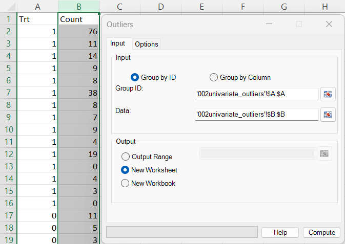
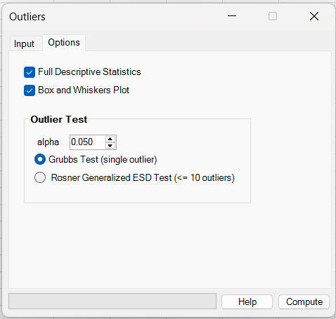
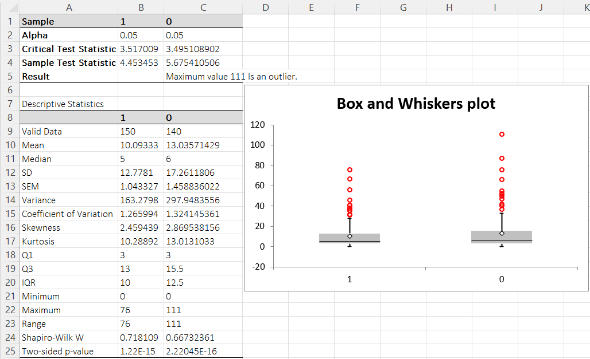

# Univariate Outliers

**Includes:** Grubbs’ test (single outlier), Rosner / generalized ESD (multiple outliers).  
**Purpose:** Detect unusually extreme observations in a single variable (per selected dataset/column), either as a **single outlier** (Grubbs) or **up to 10 outliers** (Rosner/ESD).

---

## Overview

The **Univariate Outliers** dialog runs an outlier test for each selected dataset (each **column** / **group**).  
For each dataset, the null hypothesis is:

**H₀:** there are no outliers in the data (under an approximately normal model).

Small p-values (commonly < 0.05) indicate evidence that one or more values are unusually extreme **relative to the rest of the sample**.

> Outlier ≠ mistake. Use the result as a signal to investigate (data entry, measurement error, rare but valid observation, mixture of populations, …).

---

## Dialog: inputs and options

### Input tab

You can define datasets in two ways:

#### A) Group by Column (most common)

- Select a **rectangular range** where **each column is one variable** (group).
- The **first row is treated as a column name**. If the header cell is empty, a default name is used.
- Each column is imported and cleaned **independently**, so columns can end up with different sample sizes after removing missing/non-numeric cells.

#### B) Group by ID (grouping column + data column)

Use this when your data are stored like:

| GroupID | Value |
|---|---|
| A | 12.3 |
| A | 11.7 |
| B | 9.8 |
| ... | ... |

- **Group ID:** the range containing group labels (text or numbers).
- **Data:** the numeric values.
- Groups are formed from unique IDs and the test is run separately per group.

> Tip: in both modes, you can type a range (e.g. `Sheet1!A1:C50`) or use the range picker button.

---

### Options tab

Options:

- **Alpha** — significance level (default **0.05**).  
  Smaller alpha = more conservative outlier detection.
- **Outlier Test**
  - **Grubbs Test (single outlier)** — detects at most one outlier per dataset.
  - **Rosner Generalized ESD Test (≤ 10 outliers)** — detects multiple outliers (up to 10), using an iterative extreme-deviate procedure.

Optional outputs:

- **Full Descriptive Statistics** — produces an additional descriptive table.  
  See: [Descriptive Statistics](descriptive-statistics.md)
- **Box and Whiskers Plot** — produces a boxplot output for the same groups/variables.  
  See: [Box and Whiskers](box-and-whiskers.md)

---

## What it does (math and implementation details)

BESHStatNG computes one of the following procedures per dataset, depending on the **Outlier Test** option.

### 1) Grubbs’ test (single outlier)

**Purpose:** detect whether the *most extreme* value (either the minimum or maximum) is an outlier under approximate normality.

Let:
- sample size `n`
- mean `x̄`
- standard deviation `s`

The Grubbs statistic is:

\(G = \max_i \frac{|x_i - \bar{x}|}{s}\)

The critical value is derived from Student’s t distribution:

- \(t = t_{\alpha/(2n),\, df=n-2}\) (two-sided adjustment)
- \(G_{\mathrm{crit}} = \frac{n-1}{\sqrt{n}}\sqrt{\frac{t^2}{n-2+t^2}}\)

**Decision rule**
- If \(G > G_{\mathrm{crit}}\), the dataset contains a single outlier (the add-in reports whether it is the **minimum** or **maximum** value).
- Otherwise: “No outlier present in the data.”

**Reference (background)**
- NIST/SEMATECH e-Handbook: Grubbs’ Test for Outliers  
  https://www.itl.nist.gov/div898/handbook/eda/section3/eda35h1.htm

---

### 2) Rosner / generalized ESD (multiple outliers, up to 10)

**Purpose:** detect multiple outliers by iteratively removing the currently most extreme observation and comparing an “extreme Studentized deviate” statistic to a sequence of critical values.

BESHStatNG follows the standard generalized ESD structure:

1. Start with the full sample (`n` points).
2. For iteration \(i = 1,\dots,k\) (where \(k \le 10\) in the current UI):
   - compute mean and sd of the remaining points
   - find the observation with largest absolute deviation from the mean
   - record the statistic \(R_i = \max \frac{|x-\bar{x}|}{s}\)
   - temporarily remove that observation
3. Compute critical values \(\lambda_i\) using a t-quantile approximation (as in Rosner’s paper).
4. Determine the number of outliers as the **largest** `i` such that \(R_i > \lambda_i\).

**Sample size limits in the add-in**
- If \(n < 15\), the routine returns **no result** (test not performed).
- If \(15 \le n < 25\), the add-in logs a warning that inference may be unreliable.
- Maximum detected outliers is **10** (per UI option).

**Reference (paper)**
- Rosner, B. (1983). *Percentage Points for a Generalized ESD Many-Outlier Procedure*. **Technometrics**, 25(2), 165–172.  
  PDF: https://www.stat.cmu.edu/technometrics/80-89/VOL-25-02/v2502165.pdf

---

## Steps in the add-in

1. Excel ribbon: **BESH Stat NG → Analyse → Assumptions → Univariate Outliers**
2. Choose **Group by Column** (or **Group by ID**) on the **Input** tab.
3. Select your data using the range picker.
4. Choose the output destination:
   - **Output Range** (write into a specific area)
   - **New Worksheet** (recommended)
   - **New Workbook**
5. (Optional) In **Options**, check:
   - **Full Descriptive Statistics**
   - **Box and Whiskers Plot**
6. Choose **Grubbs** or **Rosner/ESD**, set **Alpha**, then click **Compute**.

---

## Output

### Grubbs output (single outlier)

For each dataset/group the table reports:

- **Alpha**
- **Critical Test Statistic** (`G_crit`)
- **Sample Test Statistic** (`G`)
- **Result**:  
  - “Maximum value (…) is an outlier.”, or  
  - “Minimum value (…) is an outlier.”, or  
  - “No outlier present in the data.”

### Rosner / ESD output (multiple outliers)

For each dataset/group the table reports:

- **Alpha**
- **Number of Outliers**
- A section “**List of Outliers:**” followed by the detected outlier values (up to 10).

### How to interpret (mini-example)

In the example output shown above, the result line indicates that the **maximum value** of the Trt column group labeled `0` from the source dataset is flagged as an outlier at `α = 0.05`. The optional **descriptive statistics** table and **box plot** provide immediate context (quartiles/IQR, skewness/kurtosis, and a visual view of extreme points).

---

## Notes and practical guidance

- **Visual checks matter.** A boxplot is often the quickest sanity check:
  - [Box and Whiskers](box-and-whiskers.md)
- **Normality assumption matters.** Both procedures assume approximate normality of the non-outlier data. If the distribution is strongly non-normal, consider robust summaries, transformations, or nonparametric approaches.
- **Multiple testing.** If you run outlier tests across many variables/groups, expect some “significant” findings by chance.

Download the example dataset used here: [002univariate_outliers.csv](../assets/data/002univariate_outliers/002univariate_outliers.csv)

---

## References

- Grubbs F. (1969). Procedures for Detecting Outlying Observations in Samples. Technometrics, 11(1), 1-21.
- Rosner B. (1983) Percentage Points for a Generalized ESD Many-Outlier Procedure, Technometrics 25 165-172.

## See also

- [Normality Tests](normality-tests.md)
- [Descriptive Statistics](descriptive-statistics.md)
- [Box and Whiskers](box-and-whiskers.md)
- [Home](../index.md)
