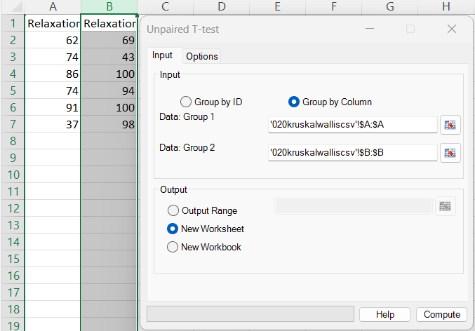
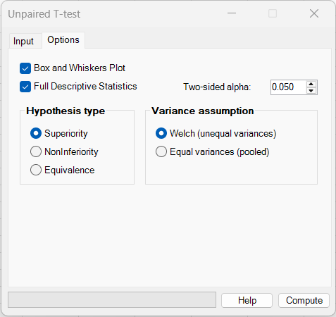
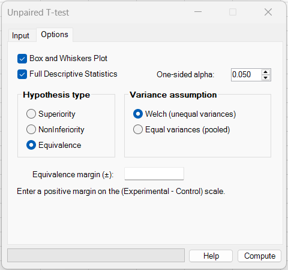
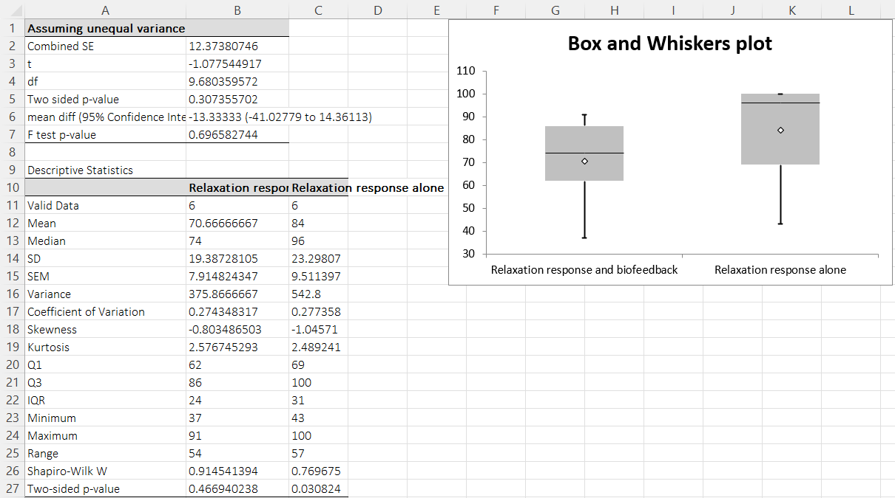

# Unpaired (two sample) T tests

**Includes:** two-sample t-test for superiority, noninferiority, and equivalence (TOST) for two independent means; choice of **Welch unequal variances** or **equal variances (pooled)**; optional descriptive statistics and box-and-whiskers plot.  
**Purpose:** compare the means of **two independent groups**.

---

## Overview

This analysis compares **two independent samples** (Group 1 vs Group 2).

In the current version, the add-in supports three hypothesis types for the **unpaired t-test**:

- **Superiority** — ordinary two-sided comparison of means
- **Noninferiority** — test whether the experimental/test group is not worse than the control/reference group by more than a prespecified margin
- **Equivalence (TOST)** — test whether the mean difference lies inside prespecified equivalence limits

For all three variants you can choose the variance model:

- **Welch (unequal variances)** — recommended default when group variances may differ or sample sizes are unequal
- **Equal variances (pooled)** — classical Student two-sample t-test

When requested, BESHStatNG also appends:

- **Full Descriptive Statistics** for each group
- **Box and Whiskers plot** comparing the distributions

---

## Example dataset

In the example below the **first two columns** of the dataset are used as the two groups:

- Column 1: *Relaxation response and biofeedback*
- Column 2: *Relaxation response alone*

Download:

- [020kruskalwalliscsv.csv](../assets/data/020kruskalwallis/020kruskalwalliscsv.csv)

> Only the first two columns are used for this unpaired t-test example. (The third column is ignored here.)

---

## Screenshots (BESHStatNG)

### Input tab


### Options tab


Option tab when "Superiority" hypothesis test type is selected.



Option tab when "Equivalence" hypothesis test type is selected.

### Results (tables + optional box plot)


---

## When to use it

Use an unpaired (two-sample) t-test when:

- you have **two independent groups** (different subjects in each group),
- the outcome is **numeric/continuous**,
- you want to compare **group means**.

### Superiority

Use the ordinary two-sided unpaired t-test when the question is whether the means differ:

\[
H_0:\ \mu_E-\mu_C=0 \qquad\text{vs}\qquad H_1:\ \mu_E-\mu_C\ne 0
\]

### Noninferiority

Use noninferiority when you wish to show that the experimental/test group is **not worse** than the control/reference group by more than a prespecified margin \(\Delta_{NI}>0\).

BESHStatNG uses the **difference scale**:

\[
\mu_E-\mu_C
\]

and a **positive** noninferiority margin entered by the user. The null and alternative are:

\[
H_0:\ \mu_E-\mu_C\le -\Delta_{NI}
\qquad\text{vs}\qquad
H_1:\ \mu_E-\mu_C > -\Delta_{NI}
\]

This is a **one-sided** test.

### Equivalence (TOST)

Use equivalence when you wish to show that the difference between group means is **small enough to be clinically / scientifically negligible**.

In the current UI you enter a **single positive symmetric equivalence margin** \(\Delta>0\), so the equivalence limits are:

\[
-\Delta \le \mu_E-\mu_C \le \Delta
\]

BESHStatNG uses the **TOST (two one-sided tests)** framework and tests both:

\[
H_{01}:\ \mu_E-\mu_C\le -\Delta
\qquad\text{and}\qquad
H_{02}:\ \mu_E-\mu_C\ge \Delta
\]

against the alternatives

\[
H_{11}:\ \mu_E-\mu_C > -\Delta
\qquad\text{and}\qquad
H_{12}:\ \mu_E-\mu_C < \Delta
\]

Equivalence is concluded only if **both** one-sided tests are significant at the chosen one-sided \(\alpha\).

---

## Inputs in Excel

BESHStatNG uses the shared “**Group by ID / Group by Column**” dialog.

### Option A: Group by Column (two ranges)

- **Control / Reference group:** a single-column range for Group 1 values
- **Experimental / Test group:** a single-column range for Group 2 values

This is the recommended mode for all analyses.

> For **noninferiority** and **equivalence**, BESHStatNG requires **Group by Column** so the direction of the effect is explicit:
> 
> \[
> \text{difference} = \bar{x}_E-\bar{x}_C
> \]

### Option B: Group by ID (group column + values column)

- **Group ID**: a column containing exactly two group labels (e.g. 1/2 or A/B)
- **Data**: a column containing the numeric measurement

BESHStatNG splits the values by the unique group IDs and runs the test.

> **Restriction:** in the current version, **Group by ID** is allowed only for **superiority**. It is not allowed for **noninferiority** or **equivalence**, because the control/reference and experimental/test ordering must be explicit.

### Output destination

- Output range (current sheet)
- New worksheet
- New workbook

---

## Options

The **Options** tab contains:

- **Box and Whiskers Plot** — append a box plot to the output
- **Full Descriptive Statistics** — append descriptive statistics for each group
- **Hypothesis type**
  - **Superiority**
  - **Noninferiority**
  - **Equivalence**
- **Variance assumption**
  - **Welch (unequal variances)**
  - **Equal variances (pooled)**
- **Alpha**
  - **Two-sided alpha** for superiority (default 0.05)
  - **One-sided alpha** for noninferiority and equivalence (default 0.05)
- **NI margin** or **Equivalence margin (±)** — visible for noninferiority / equivalence only and entered as a **positive** value on the \((\mu_E-\mu_C)\) scale

---

## Steps in the add-in

1. Ribbon: **BESH Stat NG → Analyse → Parametric → Unpaired T-test**
2. On the **Input** tab choose:
   - **Group by Column** (Control / Reference group; Experimental / Test group), or
   - **Group by ID** (for superiority only)
3. Choose the output destination
4. Open the **Options** tab and select:
   - **Hypothesis type**
   - **Variance assumption**
   - **Alpha**
   - (if required) **NI margin** or **Equivalence margin (±)**
   - optional **Full Descriptive Statistics** and/or **Box and Whiskers Plot**
5. Click **Compute**

---

## What it does (math and implementation details)

Let:

- control/reference sample: \(x_{C1},\dots,x_{Cn_C}\)
- experimental/test sample: \(x_{E1},\dots,x_{En_E}\)

with sample means

\[
\bar{x}_C=\frac{1}{n_C}\sum_{i=1}^{n_C}x_{Ci},
\qquad
\bar{x}_E=\frac{1}{n_E}\sum_{i=1}^{n_E}x_{Ei}
\]

and sample variances

\[
s_C^2=\frac{1}{n_C-1}\sum_{i=1}^{n_C}(x_{Ci}-\bar{x}_C)^2,
\qquad
s_E^2=\frac{1}{n_E-1}\sum_{i=1}^{n_E}(x_{Ei}-\bar{x}_E)^2
\]

BESHStatNG reports the mean difference as:

\[
\Delta=\bar{x}_E-\bar{x}_C
\]

### A) Welch (unequal variances)

Standard error:

\[
SE_{Welch}=\sqrt{\frac{s_C^2}{n_C}+\frac{s_E^2}{n_E}}
\]

Welch–Satterthwaite degrees of freedom:

\[
df_{Welch}=
\frac{\left(\frac{s_C^2}{n_C}+\frac{s_E^2}{n_E}\right)^2}
{\frac{\left(\frac{s_C^2}{n_C}\right)^2}{n_C-1}+\frac{\left(\frac{s_E^2}{n_E}\right)^2}{n_E-1}}
\]

### B) Equal variances (pooled)

Pooled variance:

\[
s_p^2=\frac{(n_C-1)s_C^2+(n_E-1)s_E^2}{n_C+n_E-2}
\]

Standard error:

\[
SE_{pooled}=\sqrt{s_p^2\left(\frac{1}{n_C}+\frac{1}{n_E}\right)}
\]

Degrees of freedom:

\[
df_{pooled}=n_C+n_E-2
\]

### C) Superiority (two-sided)

Test statistic:

\[
t=\frac{\Delta}{SE}
\]

where \(SE\) is either \(SE_{Welch}\) or \(SE_{pooled}\).

The two-sided p-value is

\[
p=2P(T_{df}\ge |t|)
\]

and the \((1-\alpha)\) two-sided confidence interval is

\[
\Delta\pm t_{1-\alpha/2,df}SE
\]

### D) Noninferiority

For a positive user-specified margin \(\Delta_{NI}>0\), the null is

\[
H_0:\ \mu_E-\mu_C\le -\Delta_{NI}
\]

The noninferiority limit is therefore \(-\Delta_{NI}\).

The test statistic is

\[
t_{NI}=\frac{\Delta-(-\Delta_{NI})}{SE}=\frac{\Delta+\Delta_{NI}}{SE}
\]

with one-sided p-value

\[
p_{NI}=P(T_{df}\ge t_{NI})
\]

BESHStatNG also reports the **lower one-sided confidence limit**

\[
L=\Delta-t_{1-\alpha,df}SE
\]

and the two-sided confidence interval corresponding to the same one-sided \(\alpha\), namely a

\[
100(1-2\alpha)\% \text{ two-sided interval}
\]

For example, if one-sided \(\alpha=0.05\), this is a **90%** two-sided confidence interval.

Noninferiority is concluded if either of the equivalent criteria is satisfied:

\[
p_{NI}<\alpha
\qquad\text{or equivalently}\qquad
L>-\Delta_{NI}
\]

### E) Equivalence (TOST)

For symmetric equivalence limits \(-\Delta\) and \(+\Delta\), BESHStatNG performs two one-sided tests.

Lower-component test:

\[
t_L=\frac{\Delta-(-\Delta)}{SE}=\frac{\Delta+\Delta}{SE}
\]

with one-sided p-value

\[
p_L=P(T_{df}\ge t_L)
\]

Upper-component test:

\[
t_U=\frac{\Delta-(+\Delta)}{SE}
\]

with one-sided p-value

\[
p_U=P(T_{df}\le t_U)
\]

The TOST p-value is taken as the larger of the two component p-values:

\[
p_{TOST}=\max(p_L,p_U)
\]

BESHStatNG also reports the **equivalent confidence interval**, which is the

\[
100(1-2\alpha)\% \text{ two-sided confidence interval}
\]

For one-sided \(\alpha=0.05\), this is a **90%** two-sided interval.

Equivalence is concluded if both one-sided tests are significant, equivalently if the entire equivalent confidence interval lies inside the equivalence limits:

\[
-\Delta<\text{CI lower and CI upper}<\Delta
\]

### F) F test for equality of variances

For **superiority**, BESHStatNG additionally reports an **F test p-value** for equality of variances:

\[
F=\frac{s_C^2}{s_E^2}
\]

with degrees of freedom \(df_1=n_C-1\) and \(df_2=n_E-1\).

A common two-sided p-value is

\[
p=2\min\{P(F_{df_1,df_2}\le F),\;P(F_{df_1,df_2}\ge F)\}
\]

> The F-test is sensitive to non-normality. When variances may differ, the **Welch** approach is usually preferred.

---

## Output

### Superiority

BESHStatNG writes either the **equal-variance** or **Welch** result table (depending on the selected variance assumption).

The output includes:

- **Combined SE**
- **t**
- **df**
- **Two sided p-value**
- **mean diff (confidence interval)**
- **F test p-value**

If selected, it appends:

- **Descriptive statistics** for each group
- **Box and Whiskers plot**

### Noninferiority

BESHStatNG writes a **Noninferiority** table containing:

- control / reference group name
- experimental / test group name
- variance assumption
- mean difference \((\bar{x}_E-\bar{x}_C)\)
- **SE**
- **df**
- **One-sided alpha**
- **NI margin**
- **NI limit** \((=-\Delta_{NI})\)
- **t**
- **One-sided p-value**
- **Lower one-sided confidence limit**
- **Two-sided confidence interval** corresponding to the same one-sided \(\alpha\)
- **Conclusion**

If selected, it appends descriptive statistics and a box plot.

### Equivalence (TOST)

BESHStatNG writes an **Equivalence (TOST)** table containing:

- control / reference group name
- experimental / test group name
- variance assumption
- mean difference \((\bar{x}_E-\bar{x}_C)\)
- **SE**
- **df**
- **One-sided alpha**
- **Lower margin** and **Upper margin**
- **Lower-component t** and **p-value**
- **Upper-component t** and **p-value**
- **TOST p-value**
- **Equivalent confidence interval** corresponding to the same one-sided \(\alpha\)
- **Conclusion**

If selected, it appends descriptive statistics and a box plot.

---

## How to interpret (quick guide)

### Superiority

- Use **Welch** when variances may differ or sample sizes are unbalanced.
- Report the **mean difference**, confidence interval, chosen test statistic, degrees of freedom, and p-value.

### Noninferiority

- Ensure the **direction** is correct: in BESHStatNG the difference is

\[
\bar{x}_E-\bar{x}_C
\]

  so a positive mean difference favors the experimental/test group.

- Enter a **positive NI margin** representing the largest acceptable loss.
- Noninferiority is supported when the **lower one-sided confidence limit** is above the NI limit \((=-\Delta_{NI})\), or equivalently the one-sided p-value is below \(\alpha\).
- A **90% two-sided confidence interval** corresponds to one-sided \(\alpha=0.05\).

### Equivalence

- Enter a **positive symmetric equivalence margin** \(\pm\Delta\).
- Equivalence is supported only if the **entire equivalent confidence interval** lies inside \((-\Delta,+\Delta)\), or equivalently both one-sided tests are significant.
- With one-sided \(\alpha=0.05\), the equivalent two-sided confidence interval is **90%**.

---

## Relationship to R (how to reproduce)

### Superiority

R’s `t.test()` uses **Welch** by default. Use `var.equal = TRUE` for the pooled test.

```r
# Example: unpaired t-tests for first two columns of 020kruskalwalliscsv.csv

df <- read.csv("020kruskalwalliscsv.csv", check.names = FALSE)

control <- na.omit(df[[1]])
experimental <- na.omit(df[[2]])

# Welch (default in R)
welch <- t.test(experimental, control, var.equal = FALSE, conf.level = 0.95)

# Pooled-variance (equal variances)
pooled <- t.test(experimental, control, var.equal = TRUE, conf.level = 0.95)

# Classical F-test for equality of variances
ftest <- var.test(experimental, control)

welch
pooled
ftest
```

### Noninferiority (example using one-sided t-test / CI logic)

For a lower-bound noninferiority margin \(-\Delta_{NI}\), the one-sided alternative is that the difference is **greater** than the noninferiority limit.

```r
# Experimental - Control difference

control <- na.omit(df[[1]])
experimental <- na.omit(df[[2]])
margin <- 5              # positive NI margin entered by user
ni_limit <- -margin      # lower bound on the (E - C) scale
alpha <- 0.05            # one-sided alpha

# Welch version
res <- t.test(experimental, control,
              alternative = "greater",
              mu = ni_limit,
              var.equal = FALSE,
              conf.level = 1 - 2 * alpha)  # e.g. 90% CI when alpha = 0.05

res
# Noninferiority if p < alpha
# Equivalent CI criterion: lower confidence limit > ni_limit
```

### Equivalence (TOST)

In R, TOST is commonly implemented with dedicated packages such as `TOSTER`.

```r
# install.packages("TOSTER")
library(TOSTER)

control <- na.omit(df[[1]])
experimental <- na.omit(df[[2]])
margin <- 5    # symmetric equivalence margin (±5)
alpha <- 0.05  # one-sided alpha

# Welch / unequal variances (var.equal = FALSE)
TOSTtwo.raw(m1 = mean(experimental), m2 = mean(control),
            sd1 = sd(experimental), sd2 = sd(control),
            n1 = length(experimental), n2 = length(control),
            low_eqbound = -margin, high_eqbound = margin,
            alpha = alpha, var.equal = FALSE)
```

---

## Notes

- **Minimum sample size:** at least **2 observations per group** are required.
- **Missing cells / non-numeric cells:** ignored during import.
- **Direction of effect:** for noninferiority and equivalence, the difference is

\[
\bar{x}_E-\bar{x}_C
\]

  so it is important to place the **control / reference group in Input 1** and the **experimental / test group in Input 2**.

- **Group by ID restriction:** in the current version, **Group by ID** is supported for **superiority**, but **not** for noninferiority or equivalence.
- **Alpha interpretation:**
  - superiority uses **two-sided alpha** (e.g. 0.05 gives a 95% confidence interval)
  - noninferiority and equivalence use **one-sided alpha** (e.g. 0.05 corresponds to a 90% two-sided confidence interval)

---

## References

### General and classical unpaired t-test

- Student. (1908). The probable error of a mean. *Biometrika*, 6(1), 1–25.
- Welch, B. L. (1947). The generalization of “Student's” problem when several different population variances are involved. *Biometrika*, 34(1–2), 28–35.
- Ruxton, G. D. (2006). The unequal variance t-test is an underused alternative to Student's t-test and the Mann–Whitney U test. *Behavioral Ecology*, 17(4), 688–690.
- Altman, D. G. (1991). *Practical Statistics for Medical Research*. Chapman & Hall.

### Noninferiority and equivalence

- Schuirmann, D. J. (1987). A comparison of the two one-sided tests procedure and the power approach for assessing the equivalence of average bioavailability. *Journal of Pharmacokinetics and Biopharmaceutics*, 15(6), 657–680.
- Westlake, W. J. (1976). Symmetrical confidence intervals for bioequivalence trials. *Biometrics*, 32(4), 741–744.
- Chow, S.-C., & Liu, J. P. (2014). *Design and Analysis of Bioavailability and Bioequivalence Studies* (3rd ed.). CRC Press.
- Wellek, S. (2010). *Testing Statistical Hypotheses of Equivalence and Noninferiority* (2nd ed.). Chapman & Hall/CRC.
- Piaggio, G., Elbourne, D. R., Altman, D. G., Pocock, S. J., & Evans, S. J. W. (2006). Reporting of noninferiority and equivalence randomized trials: extension of the CONSORT 2010 statement. *JAMA*, 295(10), 1152–1160.

---

## See also

- [Paired (single sample) T tests](paired-t-tests.md)
- [Independent Proportions](proportions.md)
- [Mann–Whitney Test](mann-whitney-test.md)
- [Sample Size – Unpaired T-test](sample-size-unpaired-t-test.md)
- [Home](../index.md)
