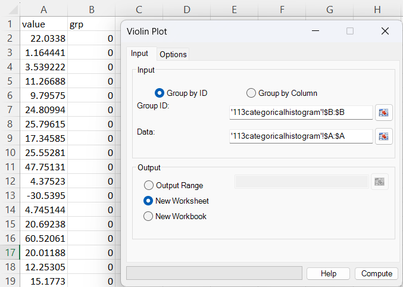
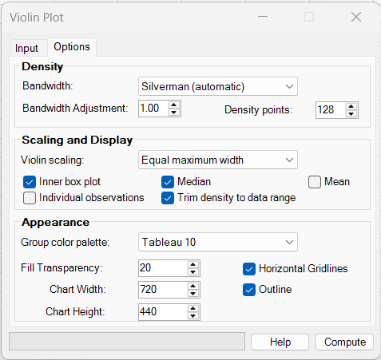
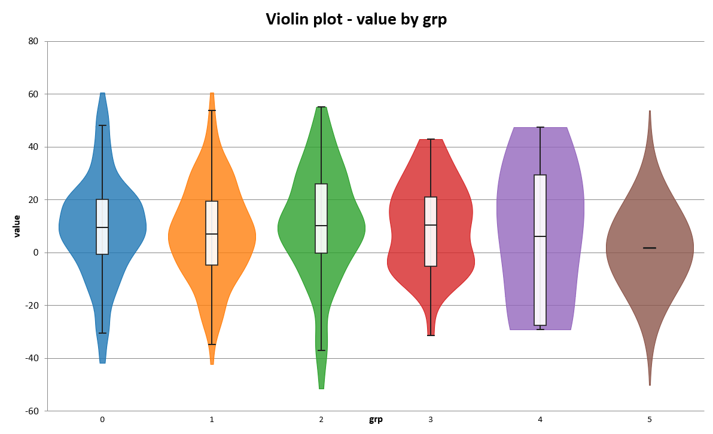
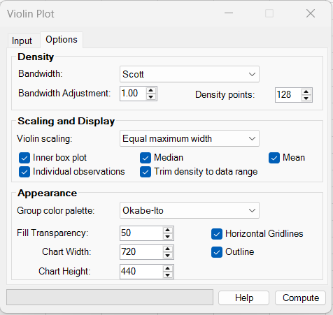
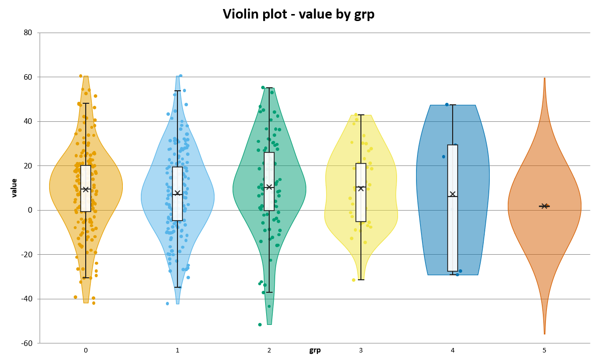
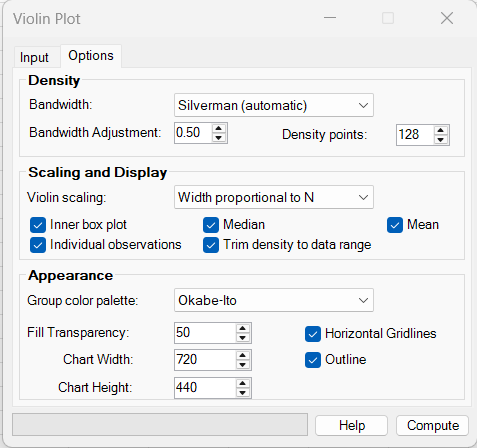
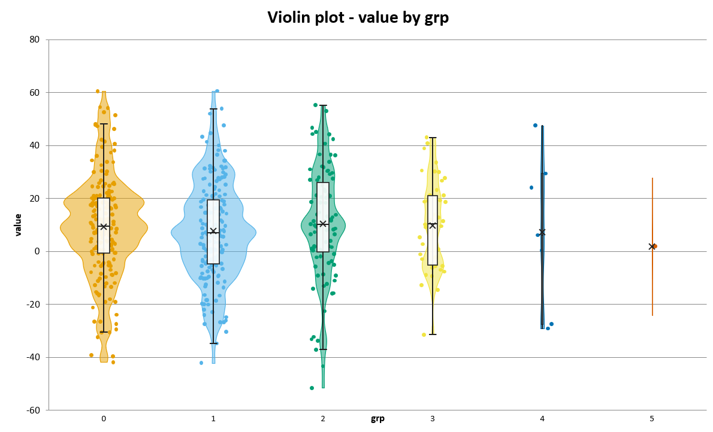

# Violin Plot

**Includes:** Multi-group categorical violin plots, Gaussian kernel-density estimation, Silverman/Scott/manual bandwidths, bandwidth adjustment, configurable density resolution, equal-width/equal-area/sample-size scaling, long-format **Group by ID** and wide-format **Group by Column** input, optional inner box plots, median and mean markers, jittered individual observations, density trimming, selectable colour palettes, transparency, outlines, horizontal gridlines, configurable chart width and height, and selectable chart destination.  
**Purpose:** Compare the shape, location, spread, and other distributional features of one continuous variable across categorical groups.

---

## Overview

A **violin plot** shows the distribution of a continuous variable by combining a smoothed density estimate with a symmetric graphical shape. For each group, BESHStatNG calculates a **Gaussian kernel-density estimate (KDE)** and mirrors that density around the group's horizontal centre position.

The resulting width has a distributional meaning:

- **wide sections** indicate ranges where observations are relatively concentrated;
- **narrow sections** indicate ranges with lower estimated density;
- multiple wide sections can reveal **multimodality** or clusters;
- long narrow ends indicate sparse values toward the tails.

Unlike a box-and-whisker plot, which summarizes a distribution using quartiles and whiskers, a violin plot displays a smoothed representation of the complete distribution. BESHStatNG can also draw an **inner box plot**, median, mean, and the individual observations so that density shape and familiar descriptive summaries can be read together.

The chart supports two worksheet layouts:

- **Group by ID** — long format, with one categorical group column and one continuous data column;
- **Group by Column** — wide format, with each selected numeric column representing one group.

BESHStatNG calculates the KDE and violin geometry internally. No helper formulas or worksheet calculation columns are required.

!!! note
    A violin plot is descriptive. It does not test whether groups differ statistically. Apparent differences in shape, location, or spread should be followed by an appropriate inferential method when statistical comparison is required.

---

## When to use it

Use a violin plot when you want to compare the **distribution** of a quantitative measurement between groups, for example:

- laboratory measurements by treatment group;
- biomarker values by diagnosis or study arm;
- examination scores by class or teaching method;
- process measurements by batch, machine, site, or operator;
- response times by experimental condition;
- environmental measurements by habitat or sampling location;
- repeated measurements shown separately by visit when the observations are being explored descriptively;
- any grouped continuous data where distribution shape matters in addition to the median or mean.

A violin plot is particularly useful for identifying:

- shifts in the centre of distributions;
- differences in spread;
- skewness;
- heavy or asymmetric tails;
- multiple modes or subpopulations;
- isolated extreme observations;
- differences that may be hidden by a box plot alone;
- strong differences in sample size when **Width proportional to N** is selected.

!!! warning "Density shape depends on smoothing"
    A violin is an estimated density, not a direct outline of the observations. Too small a bandwidth can create spurious bumps; too large a bandwidth can hide genuine structure. Inspect the raw observations and try sensible alternative bandwidths when fine distributional features are important.

---

## Example dataset

The examples use the same dataset as the [categorical histogram](categorical-histogram.md):

- [113categoricalhistogram.csv](../assets/data/113categoricalhistogram/113categoricalhistogram.csv)

The file contains **500 observations** in long format:

| Column | Contents | Use with Group by ID |
|---|---|---|
| **value** | Continuous measurement | **Data** |
| **grp** | Numeric categorical level from 0 to 5 | **Group ID** |

The sample sizes are deliberately very unequal:

| Group | n | Percentage of all observations |
|---:|---:|---:|
| 0 | 181 | 36.2% |
| 1 | 175 | 35.0% |
| 2 | 92 | 18.4% |
| 3 | 44 | 8.8% |
| 4 | 7 | 1.4% |
| 5 | 1 | 0.2% |
| **Total** | **500** | **100.0%** |

Selected descriptive statistics are:

| Group | n | Mean | Q1 | Median | Q3 | Minimum | Maximum |
|---:|---:|---:|---:|---:|---:|---:|---:|
| 0 | 181 | 9.37 | -0.69 | 9.50 | 20.11 | -41.85 | 60.52 |
| 1 | 175 | 7.81 | -4.63 | 7.14 | 19.53 | -42.12 | 60.63 |
| 2 | 92 | 10.51 | -0.24 | 10.19 | 25.98 | -51.58 | 55.23 |
| 3 | 44 | 9.84 | -5.11 | 10.53 | 21.11 | -31.43 | 43.07 |
| 4 | 7 | 7.29 | -27.47 | 6.15 | 29.38 | -29.09 | 47.57 |
| 5 | 1 | 1.92 | 1.92 | 1.92 | 1.92 | 1.92 | 1.92 |

Groups 0 and 1 contain most of the observations, whereas group 5 contains only one value. This makes the dataset useful for demonstrating both density smoothing and the different violin scaling modes.

---

## Worked examples

### Input

Open `113categoricalhistogram.csv` in Excel. Select the `grp` column as **Group ID** and the `value` column as **Data**.

Use these input settings for the examples below:

| Setting | Value |
|---|---|
| Group by | **Group by ID** |
| Group ID | `B:B` (`grp`) |
| Data | `A:A` (`value`) |
| Output | **New Worksheet** |

The two ranges are interpreted row by row: each value in column A belongs to the group in column B on the same worksheet row.

---

### Example 1: default Silverman violin with inner box plots

Use:

| Setting | Value |
|---|---|
| Bandwidth | **Silverman (automatic)** |
| Bandwidth Adjustment | `1.00` |
| Density points | `128` |
| Violin scaling | **Equal maximum width** |
| Inner box plot | Selected |
| Median | Selected |
| Mean | Cleared |
| Individual observations | Cleared |
| Trim density to data range | Selected |
| Group color palette | **Tableau 10** |
| Fill Transparency | `20` |
| Outline | Selected |
| Horizontal Gridlines | Selected |
| Chart Width | `720` points |
| Chart Height | `440` points |

Click **Compute**.

With **Equal maximum width**, every group is independently scaled so that the largest density within that group can reach the same maximum violin width. The width therefore emphasizes **distribution shape**, not sample size.

For this dataset:

- groups 0 and 1 show relatively similar broad central distributions;
- groups 2 and 3 also have centres close to 10 but differ in spread and local shape;
- group 4 has only seven observations, so its smooth outline should be interpreted cautiously;
- group 5 contains one observation at about 1.92, so the displayed violin is determined almost entirely by the kernel and fallback bandwidth rather than by an empirical distribution shape.

The inner white boxes show Q1 to Q3, the horizontal line shows the median, and the whiskers use Tukey's 1.5-IQR rule.

!!! important "A wide violin does not imply a large sample"
    Under **Equal maximum width**, a group with very few observations can be as wide as a group with hundreds of observations. Width represents normalized density shape within that group. Use the optional raw observations or **Width proportional to N** when sample size should be visually apparent.

---

### Example 2: Scott bandwidth with observations and mean

Use:

| Setting | Value |
|---|---|
| Bandwidth | **Scott** |
| Bandwidth Adjustment | `1.00` |
| Density points | `128` |
| Violin scaling | **Equal maximum width** |
| Inner box plot | Selected |
| Median | Selected |
| Mean | Selected |
| Individual observations | Selected |
| Trim density to data range | Selected |
| Group color palette | **Okabe-Ito** |
| Fill Transparency | `50` |
| Outline | Selected |
| Horizontal Gridlines | Selected |
| Chart Width | `720` points |
| Chart Height | `440` points |

Scott's rule produces a somewhat larger bandwidth than Silverman's rule for the larger groups in this example, so the main density features are smoother. The individual observations make the very different sample sizes immediately visible.

The **×** marker represents the group mean. For groups 0–3, mean and median are fairly close. Groups 4 and 5 illustrate why raw observations are valuable: with only seven and one observations respectively, the density outline alone could suggest more distributional detail than the data can support.

The observations are given a small deterministic horizontal jitter so overlapping values can be seen more easily. Their vertical position remains the original measured value; the horizontal displacement has no quantitative meaning.

---

### Example 3: narrower bandwidth and width proportional to sample size

Use:

| Setting | Value |
|---|---|
| Bandwidth | **Silverman (automatic)** |
| Bandwidth Adjustment | `0.50` |
| Density points | `128` |
| Violin scaling | **Width proportional to N** |
| Inner box plot | Selected |
| Median | Selected |
| Mean | Selected |
| Individual observations | Selected |
| Trim density to data range | Selected |
| Group color palette | **Okabe-Ito** |
| Fill Transparency | `50` |
| Outline | Selected |
| Horizontal Gridlines | Selected |
| Chart Width | `720` points |
| Chart Height | `440` points |

Reducing the bandwidth adjustment from 1.00 to 0.50 makes the KDE more responsive to local concentrations of observations. Groups 0 and 1 therefore show more small-scale undulations than in the smoother previous examples.

At the same time, **Width proportional to N** multiplies each group's normalized width by

$$
\frac{n_g}{\max(n)}.
$$

For the example data, group 0 has the largest sample size, \(n=181\), and therefore receives the full available width. The approximate maximum full widths relative to the full width of group 0 are:

| Group | n | Relative maximum width |
|---:|---:|---:|
| 0 | 181 | 1.000 |
| 1 | 175 | 0.967 |
| 2 | 92 | 0.508 |
| 3 | 44 | 0.243 |
| 4 | 7 | 0.039 |
| 5 | 1 | 0.006 |

Groups 4 and 5 consequently become almost line-like. This is intentional: the chart now encodes both **distribution shape** and **relative sample size**.

!!! tip
    Use **Width proportional to N** when unequal sample sizes are themselves important information. Use **Equal maximum width** when the main purpose is to compare shapes without allowing group size to dominate the display.

---

## Required data layout

Violin Plot supports both **long-format** and **wide-format** grouped data.

### Group by ID: long format

Use one grouping column and one continuous data column:

| Group | Value |
|---|---:|
| Control | 8.1 |
| Control | 10.4 |
| Treatment A | 12.7 |
| Control | 7.9 |
| Treatment A | 18.2 |
| Treatment B | 15.3 |

Select:

- the categorical column as **Group ID**;
- the numeric measurement column as **Data**.

The group variable may contain **text or numeric levels**.

The two selected ranges must:

- be on the same worksheet;
- each be one continuous column range;
- start on the same worksheet row;
- contain the same number of selected rows.

The observations are paired row by row. Rows without a usable group/value pair are omitted by the data import layer.

When column headings are included, BESHStatNG uses them in the automatic chart title and axis titles. For example, selecting columns headed `grp` and `value` produces:

- chart title **Violin plot - value by grp**;
- X-axis title **grp**;
- Y-axis title **value**.

### Group by Column: wide format

Select two or more numeric worksheet columns in **Data columns**. Each selected column is interpreted as one group:

| Control | Treatment A | Treatment B |
|---:|---:|---:|
| 8.1 | 12.7 | 15.3 |
| 10.4 | 18.2 | 13.8 |
| 7.9 | 14.1 | 17.0 |
| 9.2 |  | 16.2 |

Important rules are:

- each selected worksheet column becomes a separate violin;
- missing values are handled independently within each column;
- columns do **not** need the same number of usable observations;
- a non-blank **text value in the first selected row** is used as that group's label and is not plotted as an observation;
- numeric-looking text such as `"0"` is also treated as a text group label;
- if the first selected cell is genuinely numeric, it remains an observation and the Excel column identifier (`A`, `B`, `C`, ...) is used as the group name;
- duplicate text headings are made unique automatically, for example `Control`, `Control (2)`;
- completely empty or nonnumeric selected columns are omitted.

In **Group by Column** mode the chart uses generic titles **Group** and **Value**, because the selected columns themselves represent the groups.

!!! tip "Include headings in wide-format selections"
    For meaningful group labels, include the text heading row in the selected columns. If you select numeric data only, BESHStatNG falls back to Excel column letters as the group labels.

---

## Dialog: inputs and output

### Input tab

#### Group by ID

Select this option for long-format data consisting of one grouping variable and one continuous measurement variable.

##### Group ID

Select one categorical column. Text and numeric group levels are accepted.

##### Data

Select the corresponding continuous numeric column. The selected rows must align with the **Group ID** range.

#### Group by Column

Select this option for wide-format data where each worksheet column represents one group.

The **Group ID** selector is disabled and the second RefEdit becomes **Data columns**. Select the set of columns to compare. The first selected text row, when present, supplies the group labels.

### Output Range

Creates the chart on the worksheet containing the selected output cell. The chart's upper-left corner is anchored at the first cell of the selected output range.

The output RefEdit is available only when **Output Range** is selected.

### New Worksheet

Creates a new worksheet in the source workbook and places the chart at cell `A1`. This is the default output option.

### New Workbook

Creates a new workbook and places the chart at cell `A1` on its active worksheet.

---

## Dialog: options

### Density

#### Bandwidth

The bandwidth controls the amount of smoothing in the Gaussian KDE.

Available choices are:

| Option | Description |
|---|---|
| **Silverman (automatic)** | Robust normal-reference rule using the smaller of the sample standard deviation and scaled IQR when possible; default |
| **Scott** | Normal-reference rule based on sample standard deviation |
| **Manual** | Uses the entered bandwidth directly |

The bandwidth is calculated separately for each group when an automatic method is selected.

#### Bandwidth Adjustment

For **Silverman** and **Scott**, the automatically selected bandwidth is multiplied by the entered adjustment:

$$
h_{\text{used}}=h_{\text{automatic}}\times a.
$$

Typical interpretation:

- `1.00` — use the automatic bandwidth unchanged;
- values below `1.00` — less smoothing and more local detail;
- values above `1.00` — more smoothing.

When **Manual** is selected, this control changes to **Manual bandwidth** and the entered positive value is used directly rather than as a multiplier.

!!! warning
    A very small bandwidth can produce many narrow peaks that reflect individual observations rather than stable distributional structure. A very large bandwidth can merge genuine modes and hide skewness.

#### Density points

Sets the number of vertical positions at which the KDE is evaluated. The default is **128**.

More density points produce a more finely sampled outline but increase the amount of geometry that Excel must draw. The computational backend accepts 32 to 1024 points; the current dialog allows 32 to 1000.

For normal use, **128** provides a good balance between smooth appearance and chart complexity.

---

### Scaling and Display

#### Violin scaling

BESHStatNG offers three ways to convert estimated density into violin width.

##### Equal maximum width

Each violin is independently normalized to the same maximum half-width:

$$
w_g(y)=w_{\max}\frac{\hat f_g(y)}{\max_y \hat f_g(y)}.
$$

This is the **default** and is usually the best choice for comparing distribution shapes. Maximum width does not encode group sample size.

##### Equal area

The displayed KDE is first normalized by its displayed numerical area, and one common density-to-width factor is used across groups. This makes displayed violin areas comparable while still allowing maximum widths to differ according to density concentration.

Use **Equal area** when you want the amount of filled area to be comparable between groups rather than forcing all violins to the same peak width.

##### Width proportional to N

Each violin is first shape-normalized as for **Equal maximum width** and then multiplied by the group's sample size relative to the largest group:

$$
w_g(y)=w_{\max}
\frac{n_g}{n_{\max}}
\frac{\hat f_g(y)}{\max_y \hat f_g(y)}.
$$

Use this option when relative sample size should be visible in the chart.

#### Inner box plot

Draws a compact box-and-whisker summary inside each violin:

- box: Q1 to Q3;
- whiskers: most extreme observations within 1.5 IQR of the quartiles;
- values beyond the whiskers are not given separate outlier symbols unless **Individual observations** is also selected.

This option is selected by default.

#### Median

Draws a horizontal line at the group median. It is selected by default and can be displayed with or without the inner box plot.

#### Mean

Draws an **×** at the arithmetic mean. It is cleared by default.

Comparing mean and median can be useful when looking for skewness, but the KDE and raw data should also be considered.

#### Individual observations

Displays each original continuous value as a small point with deterministic horizontal jitter around the group's centre.

The jitter:

- reduces overplotting;
- does not alter the Y value;
- is not random between redraws;
- has no quantitative meaning on the horizontal axis.

This option is cleared by default.

For small or moderate samples, showing observations is strongly recommended because it reveals how much raw information supports the smoothed violin shape.

#### Trim density to data range

When selected, the density for a non-constant group is drawn only from that group's observed minimum to maximum.

When cleared, the evaluation grid extends approximately **three bandwidths** below the minimum and above the maximum, allowing the Gaussian kernel tails to taper naturally beyond the observed range.

This option is selected by default.

For a constant group, including a group containing only one unique value, BESHStatNG must create a non-zero evaluation range; the density therefore extends around the observed value even when trimming is selected.

---

### Appearance

#### Group color palette

Available palettes are:

- **Tableau 10** — default;
- **Okabe-Ito**;
- **ColorBrewer Set1**;
- **Grayscale**.

Colours repeat cyclically if the number of groups exceeds the number of colours in the selected palette.

#### Fill Transparency

Controls violin fill transparency as a percentage:

- `0` — opaque;
- larger values — increasingly transparent.

The default is **20**.

Transparency is especially useful when individual observations and inner summaries are displayed over the violin body.

#### Outline

Draws a coloured border around the violin body. Selected by default.

#### Horizontal Gridlines

Displays major horizontal gridlines aligned with the continuous Y axis. Selected by default.

#### Chart Width

Sets the initial width of the embedded Excel chart in **points**. The default is **720 points**.

A larger width gives more horizontal space between groups and can improve readability when many violins are displayed. A smaller width produces a more compact chart. The setting controls the chart size when it is created; the chart can still be resized manually in Excel afterwards.

#### Chart Height

Sets the initial height of the embedded Excel chart in **points**. The default is **440 points**.

Increasing the height provides more vertical plotting space for the continuous axis and may make dense annotations easier to read. As with chart width, the chart can be resized manually after creation.

!!! note "Chart dimensions use Excel points"
    **Chart Width** and **Chart Height** are passed directly to Excel's embedded-chart dimensions. One point is 1/72 inch. These settings affect only the initial physical size of the chart; they do not change the data, density estimate, bandwidth, scaling, or axis values.

---

## Initial dialog settings

When Violin Plot is opened, the current defaults are:

| Setting | Default |
|---|---|
| Grouping mode | **Group by ID** |
| Bandwidth | **Silverman (automatic)** |
| Bandwidth Adjustment | `1.00` |
| Density points | `128` |
| Violin scaling | **Equal maximum width** |
| Inner box plot | Selected |
| Median | Selected |
| Mean | Cleared |
| Individual observations | Cleared |
| Trim density to data range | Selected |
| Group color palette | **Tableau 10** |
| Fill Transparency | `20` |
| Outline | Selected |
| Horizontal Gridlines | Selected |
| Chart Width | `720` points |
| Chart Height | `440` points |
| Output | **New Worksheet** |

---

## Steps in the add-in

### Long-format data

1. In the Excel ribbon, select **BESH Stat NG → Analyse → Graphics → Violin Plot**.
2. Select **Group by ID**.
3. Select the categorical **Group ID** column.
4. Select the continuous **Data** column.
5. Open the **Options** tab and choose the bandwidth, scaling, display, appearance, and initial chart dimensions.
6. Choose **Output Range**, **New Worksheet**, or **New Workbook**.
7. Click **Compute**.

### Wide-format data

1. Open **Violin Plot** from the Graphics menu.
2. Select **Group by Column**.
3. Select the numeric **Data columns**, preferably including a first-row text heading for each group.
4. Choose the desired options, including the initial chart width and height, and select the output destination.
5. Click **Compute**.

---

## Output

BESHStatNG creates an embedded Excel chart containing:

- one mirrored filled KDE violin for each group;
- categorical group labels along the horizontal axis;
- one shared continuous Y axis;
- optional Q1-Q3 boxes and Tukey whiskers;
- optional median lines;
- optional mean crosses;
- optional jittered individual observations;
- optional violin outlines;
- optional horizontal gridlines;
- automatic group colours from the selected palette.

For **Group by ID**, the chart title is automatically constructed from the imported column names, for example:

**Violin plot - value by grp**

The legend is not required because the group identity is displayed directly on the horizontal axis.

The chart is created at the **Chart Width** and **Chart Height** selected in the Options tab (720 × 440 points by default). It can then be moved, resized, copied, formatted, and exported in Excel. The violin bodies, box/whisker summaries, and optional individual-observation points are drawn as chart-contained shapes using the same plot-area coordinate system, so they remain aligned when the chart is resized. See [Export Chart](../export-chart.md) for high-resolution image export.

---

## What it does: calculation details

### 1. Pair observations and form groups

In **Group by ID** mode, each usable row provides a pair

$$
(g_i,x_i),
$$

where \(g_i\) is the categorical group and \(x_i\) is the continuous observation.

Blank/missing group values and missing numeric observations are excluded. Text and numeric group values are supported.

Groups remain in their **first-appearance order** in the usable input data.

In **Group by Column** mode, every selected numeric column becomes one group and missing values are handled independently within that column.

### 2. Calculate descriptive statistics

For each group BESHStatNG calculates:

- sample size \(n\);
- minimum and maximum;
- arithmetic mean;
- Q1, median, and Q3;
- Tukey lower and upper whiskers.

Quartiles use BESHStatNG's CDF/SAS Method 5 convention. Tukey fences are

$$
Q_1-1.5\,IQR
\qquad\text{and}\qquad
Q_3+1.5\,IQR,
$$

where

$$
IQR=Q_3-Q_1.
$$

The plotted whisker ends are the most extreme observed values still inside those fences.

### 3. Select the bandwidth

For a group with \(n\) observations and sample standard deviation \(s\), BESHStatNG calculates an automatic bandwidth separately for each group.

#### Silverman

The default rule is

$$
h=0.9\,A\,n^{-1/5},
$$

with

$$
A=\min\left(s,\frac{IQR}{1.34}\right)
$$

when both scales are usable.

The bandwidth adjustment is then applied:

$$
h_{\text{used}}=a\,h.
$$

The IQR term makes this rule less sensitive to some extreme values than a rule based only on the standard deviation.

#### Scott

Scott's rule is

$$
h=s\,n^{-1/5},
$$

again multiplied by the selected bandwidth adjustment.

#### Constant or single-observation groups

A within-group standard deviation of zero cannot define an automatic KDE bandwidth. BESHStatNG therefore uses a fallback scale derived from the pooled usable continuous observations. This allows a constant or one-observation group to be displayed rather than failing with zero bandwidth.

The resulting violin should nevertheless be interpreted cautiously because very little within-group information is available.

### 4. Evaluate the Gaussian KDE

At each density-grid position \(y\), the group KDE is

$$
\hat f_h(y)=
\frac{1}{nh\sqrt{2\pi}}
\sum_{i=1}^{n}
\exp\left[
-\frac{1}{2}
\left(\frac{y-x_i}{h}\right)^2
\right].
$$

The dialog uses 128 evaluation points by default.

When **Trim density to data range** is selected, a non-constant group's grid spans its observed minimum to maximum. Otherwise the grid extends three bandwidths beyond both observed ends.

### 5. Convert density to violin width

The group centre positions are equally spaced on an internal X coordinate:

$$
1,2,3,\ldots,G.
$$

The backend permits a maximum half-width smaller than 0.5 category units; the current implementation uses

$$
w_{\max}=0.4.
$$

Thus two adjacent violins can each reach a maximum full width of 0.8 while retaining separation between group centres.

The selected scaling mode determines how \(\hat f_g(y)\) becomes a half-width. See [Violin scaling](#violin-scaling) above.

The left and right violin boundaries are then

$$
x_{g,L}(y)=g-w_g(y),
\qquad
x_{g,R}(y)=g+w_g(y).
$$

### 6. Draw the Excel chart

BESHStatNG creates an XY-scatter chart to supply the continuous axes and category positions. The visible violin bodies are closed freeform polygons drawn inside the chart.

The optional individual observations, inner boxes, whiskers, median lines, and mean markers are also chart-contained shapes positioned from the same plot-area coordinate transformation. This keeps the custom layers aligned when the chart is resized or stretched.

No helper tables are written to worksheet cells.

---

## How to choose a bandwidth

The bandwidth often has a larger visual effect than the number of density evaluation points.

| Situation | Suggested approach |
|---|---|
| General first look | Start with **Silverman, adjustment 1.00** |
| Approximately smooth/unimodal data | Silverman or Scott is usually reasonable |
| Suspected multiple modes | Compare the default with a moderately smaller adjustment, such as 0.5–0.8 |
| Very noisy small sample | Avoid very small bandwidths; show individual observations |
| Strongly skewed or irregular data | Compare more than one automatic rule and inspect the raw points |
| Need exact externally specified smoothing | Use **Manual** bandwidth |

A bump that appears only with an extremely small bandwidth should not automatically be interpreted as a separate population mode.

!!! important
    There is no universally optimal bandwidth for every scientific purpose. Automatic rules are useful starting points, not substitutes for examining whether the smoothing level is appropriate for the data and the question.

---

## How to choose the scaling mode

| Scaling | What is held comparable | Best use |
|---|---|---|
| **Equal maximum width** | Peak width of every violin | Compare distribution shapes without emphasizing unequal sample sizes |
| **Equal area** | Displayed violin area | Compare density concentration while maintaining comparable filled area |
| **Width proportional to N** | Width also reflects \(n_g/n_{\max}\) | Show both distribution shape and relative sample size |

For most exploratory comparisons, start with **Equal maximum width** and show the individual observations when practical.

---

## How to interpret the chart

Read the violin together with its summaries and, when shown, the raw observations.

- **Vertical position** is the measured continuous value.
- **Horizontal width** is based on estimated density, modified by the selected scaling mode.
- **Wide regions** contain a high estimated concentration of observations.
- **Narrow regions** contain a lower estimated concentration.
- **Multiple bulges** may indicate multimodality, but may also arise from a small bandwidth or small sample.
- The **box** spans Q1 to Q3.
- The **median line** marks the median.
- The **whiskers** use the Tukey 1.5-IQR convention.
- The **×** marks the mean when enabled.
- **Individual points** are the original observations; their small horizontal jitter is visual only.

Compare groups using several features rather than only the widest part of each violin:

- location of the median and mean;
- interquartile range;
- total observed range;
- symmetry or skewness;
- number and position of density modes;
- isolated observations;
- sample size.

!!! note
    KDE density can be visually smooth even when the sample is very small. The raw points and sample size provide essential context. A smooth shape should not be mistaken for strong evidence about the underlying population distribution.

---

## Missing, invalid, and special values

### Group by ID

- Group and value ranges must align row by row.
- Missing continuous values or blank/missing group IDs are omitted.
- Text and numeric group IDs are supported.
- Infinite continuous observations are rejected by the violin backend.
- Negative, zero, and positive continuous values are all valid.
- Group order follows first appearance in the usable data.

### Group by Column

- Missing values are handled separately in each selected column.
- Columns may contain different numbers of usable observations.
- Completely empty/nonnumeric selected columns are omitted.
- A first-row non-blank text value is interpreted as a group label.
- A genuinely numeric first-row value remains data.
- Duplicate headings are automatically made unique.

### Small and constant groups

- A group with one observation is supported.
- A group in which all observations are identical is supported.
- Such groups use a fallback scale for automatic bandwidth selection so the KDE remains drawable.
- Their violin shape contains little or no empirical information about distribution form and should therefore be interpreted very cautiously.

---

## Violin plot versus related graphics

| Graphic | Main display | Typical purpose |
|---|---|---|
| **Violin plot** | Mirrored KDE plus optional summaries/raw data | Compare complete distribution shapes across groups |
| **Box-and-whisker plot** | Quartiles, median, whiskers, outliers | Compact robust comparison of centre and spread |
| **Histogram - Categorical** | Grouped or stacked binned frequencies/densities | Compare distributions using explicit common bins |
| **Histogram** | Binned distribution of one variable | Examine a single continuous distribution |
| **Kite chart** | Symmetric width representing source values over ordered positions | Compare several profiles along an ordered sequence; no KDE is estimated |
| **Scatter/strip-style raw points** | Individual observations | Show the data directly without density smoothing |

A violin plot and categorical histogram both show distributions, but they make different choices:

- a histogram depends on **bin boundaries and bin width**;
- a violin depends on **kernel bandwidth**;
- a histogram shows piecewise bars;
- a violin shows a continuous smoothed density estimate.

When the sample is small, a box plot or raw observations may communicate the available information more honestly than a strongly smoothed violin alone.

---

## Implementation details and limitations

- KDE calculations and violin-width scaling are implemented independently of Excel chart creation.
- The kernel is Gaussian.
- Automatic bandwidth is calculated separately for each group.
- Silverman, Scott, and manual bandwidth modes are available in the dialog.
- Automatic bandwidths support a multiplicative adjustment.
- The default density grid contains 128 points per group.
- The backend accepts 32–1024 grid points; the current Windows dialog exposes 32–1000.
- Group centres are equally spaced categories; their horizontal position is not a numeric measurement.
- The default maximum half-width is 0.4 category units.
- **Equal maximum width** is the default scaling.
- **Equal area** uses numerically integrated displayed KDE area via the trapezoidal rule.
- **Width proportional to N** scales maximum group width by \(n_g/n_{\max}\).
- Quartiles are calculated using BESHStatNG's CDF/SAS Method 5 convention.
- Inner whiskers follow Tukey's 1.5-IQR rule.
- The raw-point jitter is deterministic rather than random.
- Violin bodies, inner summaries, means, and raw observations are chart-contained shapes.
- The chart uses one common Y axis for every group.
- No worksheet helper data are created.
- The current dialog does not expose manual Y-axis limits, maximum violin width, point size/jitter width, outline weight, or per-series appearance overrides, although the rendering backend contains additional appearance properties.
- Very many groups can crowd the horizontal category labels.
- Large datasets with **Individual observations** enabled create one chart-contained marker shape for each plotted observation and therefore increase Excel chart complexity.
- KDE evaluation cost grows with the number of observations and density points because each evaluation point sums contributions from the observations in its group.
- Density outside the observed range is not displayed when trimming is selected, except where a non-zero grid is required for constant groups.
- The chart is intended for exploratory/descriptive visualization and does not calculate confidence bands for the density estimate.

---

## Common mistakes

### Interpreting width as sample size under the default scaling

With **Equal maximum width**, every group can reach the same peak width regardless of \(n\). Use **Width proportional to N** or show individual observations if sample size must be visible.

### Treating every bump as a real mode

A small bandwidth can produce visually attractive but unstable local peaks. Compare alternative bandwidths and inspect the raw data.

### Ignoring very small groups

A violin can still be drawn for a group containing only a few observations, or even one observation. The smooth outline does not mean the underlying distribution has been estimated precisely.

### Comparing widths from different scaling modes as if they meant the same thing

**Equal maximum width**, **Equal area**, and **Width proportional to N** intentionally encode density differently. Record the selected scaling mode when exporting or reporting the figure.

### Confusing jitter with a second quantitative axis

The horizontal position of an individual observation within its violin is only jitter used to avoid overlap. Only the group category and vertical value are meaningful.

### Using a manual bandwidth without considering measurement units

Manual bandwidth is expressed in the same units as the continuous variable. A value appropriate for measurements in millimetres may be inappropriate after the data are converted to metres.

### Using wide-format input without including headings

When **Group by Column** is selected and the first selected cell is numeric, BESHStatNG uses the Excel column letter as the group name. Include text headers in the selected range when descriptive group names are wanted.

---

## See also

- [Histogram - Categorical](categorical-histogram.md)
- [Box and Whiskers](box-and-whiskers.md)
- [Histogram](histogram.md)
- [Kite Chart](kite-chart.md)
- [Descriptive Statistics](descriptive-statistics.md)
- [Data Selection](../data-selection.md)
- [Export Chart](../export-chart.md)
