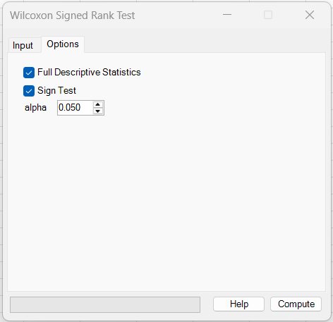
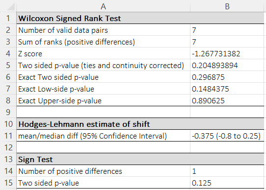
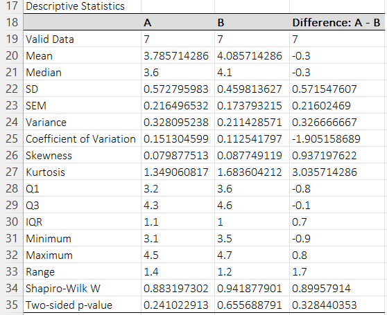

# Wilcoxon Signed Rank Test

**Includes:** Exact p-values (when available), Normal approximation (ties + continuity correction), Hodges–Lehmann shift estimate, Sign test (optional).  
**Purpose:** Nonparametric paired comparison test for matched samples or before/after measurements.

---

## Overview

This analysis compares **two paired measurements** (Group 1 vs Group 2) taken on the same subjects (or otherwise matched pairs).
It tests whether the typical within-pair change is 0, without requiring normality of the differences.

In many textbooks, the Wilcoxon signed-rank test ranks the **absolute** paired differences and sums the ranks with the observed sign.
BESHStatNG reports the usual signed-rank outputs (rank sum, normal approximation with continuity + tie correction, optional exact p-values) and also reports a Hodges–Lehmann shift estimate and confidence interval.

---

## Example dataset

The screenshots use the first two columns (**A** and **B**) from:

[`023skillingsmack.csv`](../assets/data/023skillingsmack/023skillingsmack.csv)

Only the first two columns are used for this Wilcoxon example.

---

## Screenshots (BESHStatNG)

### Input tab


### Options tab


### Results (test + exact p-values + HL shift + optional sign test)


### Descriptive statistics (optional)


---

## When to use it

Use a Wilcoxon signed-rank test when:

- you have **paired/matched data** (each row is one pair),
- the outcome is numeric or ordinal,
- you want a robust alternative to the **paired t-test**.

Common assumptions / considerations:

- **Independence of pairs:** pairs are independent of each other.
- **Symmetry (classical signed-rank):** the signed-rank test is commonly described as testing whether the distribution of differences is symmetric around 0 (often phrased as “median difference = 0”).

If your goal is strictly a test of median difference without symmetry assumptions, consider the **Sign test** (available as an option here), noting it is typically less powerful.

---

## Inputs in Excel

- **Data: Group 1:** first measurement (e.g., baseline).
- **Data: Group 2:** second measurement (e.g., follow-up).

**Pairing is by row order:** row *i* in Group 1 is paired with row *i* in Group 2.

### Missing values
Rows with missing / non-numeric values in either group are excluded (only complete pairs are used).
The output reports the **Number of valid data pairs**.

---

## Steps in the add-in

1. In Excel ribbon: **BESH Stat NG → Analyse → Nonparametric → Wilcoxon Signed Rank Test**
2. Select the range for **Data: Group 1** and **Data: Group 2**.
3. (Optional) on the **Options** tab:
   - check **Full Descriptive Statistics**
   - check **Sign Test**
   - set **Alpha** for the Hodges–Lehmann confidence interval
4. Choose an output location (new worksheet / workbook / range).
5. Click **Compute**.

---

## What it does (math and implementation details)

Let the valid (complete) paired observations be \((X_i, Y_i)\), \(i=1,\dots,n\).
The add-in computes paired differences:

\[
d_i = X_i - Y_i
\]

Zero differences are removed from the signed-rank calculation. Let \(n^{*} \le n\) be the number of **non-zero** differences.

### Ranking and test statistic

BESHStatNG assigns **average ranks** to tied values (midranks) using the observed differences \(d_i\) (after removing zeros).  
Let \(R_i\) be the rank of \(d_i\) among the non-zero differences.

The reported rank-sum statistic is:

\[
W^+ = \sum_{i: d_i > 0} R_i
\]

> **Note on conventions:** Many references define the signed-rank test by ranking \(|d_i|\) and summing ranks by sign.  
> If you reproduce results in other software (e.g., R `wilcox.test`), you may see different \(W\) and p-values when the ordering of \(d_i\) differs from the ordering of \(|d_i|\). See the **R** section below.

### Normal approximation (ties + continuity correction)

The mean under \(H_0\) is:

\[
\mu_W = \frac{n^{*}(n^{*}+1)}{4}
\]

The add-in applies a tie correction based on the midranks. If tie groups of size \(t_k\) occur in the ranked values, define:

\[
S_{\text{ties}} = \sum_k (t_k^3 - t_k)
\]

The signed-rank test’s normal approximation uses a **tie-adjusted variance** (a standard approach also used by many statistical packages).  
Small differences between software can still occur due to different conventions for handling zero differences, continuity correction, and two-sided p-value calculation. The add-in uses:

\[
\sigma_W = \sqrt{\frac{n^{*}(n^{*}+1)(2n^{*}+1) - \tfrac{1}{2} S_{\text{ties}}}{24}}
\]

With a continuity correction of \(-0.5\), the z-score is:

\[
Z = \frac{W^+ - 0.5 - \mu_W}{\sigma_W}
\]

The two-sided normal-approximation p-value is:

\[
p = 2\,\Phi(-|Z|)
\]

where \(\Phi(\cdot)\) is the standard normal CDF.

### Exact p-values (dynamic programming; tie-aware)

When \(n^{*} \le 60\), the add-in computes exact p-values using a **dynamic programming** distribution of attainable rank sums:

- ranks are scaled by 2 to represent half-ranks as integers (tie-safe),
- a distribution array counts how many sign assignments produce each possible rank sum,
- exact two-sided and one-sided p-values are obtained by counting outcomes at least as extreme as observed.

This makes exact p-values available even when ties are present (within the \(n^{*}\le 60\) limit).

### Optional Sign test

If **Sign Test** is enabled, the add-in counts:

\[
N_+ = \#\{d_i>0\},\quad N_- = \#\{d_i<0\},\quad N = N_+ + N_-
\]

Under \(H_0\), \(N_+ \sim \text{Binomial}(N, 0.5)\).

The two-sided p-value is computed as:

\[
p = 2\,P\big(\text{Bin}(N,0.5) \le \min(N_+,N_-)\big)
\]

---

## Hodges–Lehmann estimate of shift

For paired differences, the Hodges–Lehmann (HL) shift estimate is the median of all **Walsh averages**:

$$
w_{ij} = \frac{d_i + d_j}{2},\qquad 1 \le i \le j \le n^{*}
$$

$$
\widehat{\Delta}_{HL} = \operatorname{median}\left\{ w_{ij} \right\}
$$

### Confidence interval for the shift

BESHStatNG forms a confidence interval from the ordered Walsh averages.

- For \(4 \le n \le 50\), it uses **exact** index cutoffs from a lookup table (labeled `W25` in the code) **when \(\alpha = 0.05\)**.
- For other confidence levels, or for larger samples, it uses a **normal approximation** based on \(z_{1-\alpha/2}\) to compute cutoff indices, then reads the corresponding ordered Walsh averages.

Because CI endpoints depend on an indexing / inversion method, other software may produce slightly different CI limits even when the HL point estimate matches.

---

## Output (what BESHStatNG writes)

### Wilcoxon Signed Rank Test table
- **Number of valid data pairs:** \(n^{*}\) (non-zero differences used in the rank calculation)
- **Sum of ranks (positive differences):** \(W^+\)
- **Z score:** normal approximation z-statistic (ties + continuity corrected)
- **Two sided p-value (ties and continuity corrected):** normal-approximation p-value
- **Exact p-values (if available):** exact two-sided and one-sided p-values (when \(n^{*}\le 60\))

### Hodges–Lehmann estimate of shift
- **mean/median diff (CI at selected level):** HL estimate and confidence interval from Walsh averages at the selected level

The screenshots use the default `alpha = 0.05`, so the example output shows a 95% CI.

### Sign Test (optional)
- **Number of positive differences:** \(N_+\)
- **Two sided p-value:** binomial two-sided sign-test p-value

### Descriptive statistics (optional)
When **Full Descriptive Statistics** is enabled, the add-in outputs descriptive statistics for:
- Group 1 (A)
- Group 2 (B)
- Differences (A − B)

This includes common summaries (mean, median, SD, SEM, quartiles, etc.) and Shapiro–Wilk normality tests.

---

## How to interpret (quick guide)

- **p-value:** evidence against \(H_0\) (no typical paired shift). Small p-values suggest a systematic shift between measurements.
- **HL estimate:** a robust estimate of the typical within-pair shift; its sign depends on column order (A − B).
- **Sign test:** a simple direction-only check; it is usually less powerful than the signed-rank test.

---

## Relationship to R (how to reproduce)

### Using standard R functions (closest “textbook” Wilcoxon signed-rank)

```r
# Example: Wilcoxon signed-rank test using the first two columns of 023skillingsmack.csv
dat <- read.csv("023skillingsmack.csv")

x <- dat[[1]]  # Group 1 (column A)
y <- dat[[2]]  # Group 2 (column B)

# Keep complete pairs only (matches add-in behavior)
ok <- is.finite(x) & is.finite(y)
x <- x[ok]; y <- y[ok]

# Standard Wilcoxon signed-rank test in R
# NOTE: with ties, R may not compute an exact p-value and will fall back to an asymptotic p-value
wilcox.test(x, y, paired = TRUE, exact = TRUE, conf.int = TRUE)

# Force the normal approximation explicitly (with continuity correction by default)
wilcox.test(x, y, paired = TRUE, exact = FALSE, conf.int = TRUE)

# Sign test (base R)
d <- x - y
d <- d[d != 0]
binom.test(sum(d > 0), length(d), p = 0.5, alternative = "two.sided")
```

!!! note "Why R may differ slightly from BESHStatNG"
    - R and BESHStatNG implement the **Wilcoxon signed-rank test**; small output differences are typically due to different reporting conventions (\(W^+\) vs \(V\)) and tie/zero/continuity-correction defaults.
    - With **ties**, R commonly does **not** return an exact p-value even if `exact = TRUE` (it warns and uses an asymptotic p-value).
    - Confidence intervals can differ slightly because different software uses different (valid) inversion/indexing conventions.


### Matching BESHStatNG’s reported W and normal-approximation p-value (implementation-style)

If you want to reproduce the *reported* \(W^+\), z-score, and asymptotic p-value from the add-in:

```r
dat <- read.csv("023skillingsmack.csv")
x <- dat[[1]]; y <- dat[[2]]
ok <- is.finite(x) & is.finite(y)
d <- x[ok] - y[ok]
d <- d[d != 0]     # remove zeros (n*)

# ranks of d (average ranks for ties)
R <- rank(d, ties.method = "average")

Wpos <- sum(R[d > 0])

n <- length(d)
mu <- n*(n+1)/4

# tie correction term: sum(t^3 - t) over tie groups in R
tab <- table(R)
Sties <- sum(tab^3 - tab)

sigma <- sqrt((n*(n+1)*(2*n+1) - 0.5*Sties)/24)

z <- (Wpos - 0.5 - mu)/sigma
p_two <- 2*pnorm(-abs(z))

c(Wpos = Wpos, z = z, p_two_sided = p_two)
```

---

## Notes and limitations

- Pairing is by row order—make sure Group 1 and Group 2 ranges align correctly.
- If many differences are exactly zero, the effective sample size \(n^{*}\) can be small.
- Exact p-values are provided when \(n^{*} \le 60\); for larger \(n^{*}\), only the normal approximation is reported.

---

## References

- Altman D.G. Practical Statistics for medical research. Chapman & Hall, 1991.
- Conover W.J. Practical Nonparametric Statistics (3rd ed.). Wiley 1999.
- Rosenkranz G.K. A note on the Hodges–Lehmann estimator. Pharmaceut. Statist., 2010, 9: 162–167.

## See also
- [Paired (single sample) T tests](paired-t-tests.md)
- [Mann–Whitney test](mann-whitney-test.md)
- [Descriptive statistics](descriptive-statistics.md)
- [Home](../index.md)

