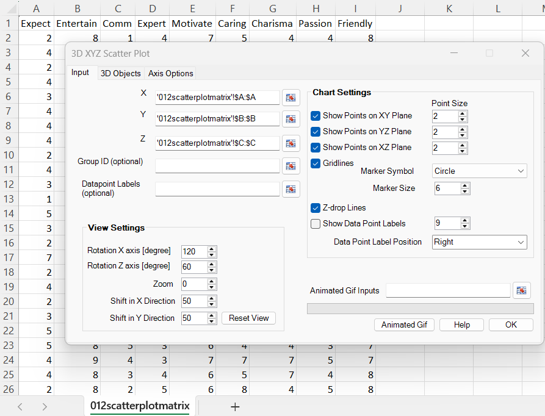
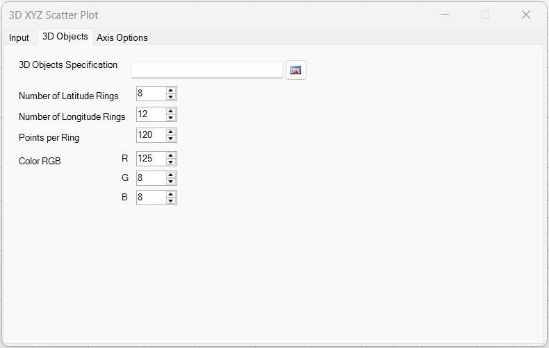
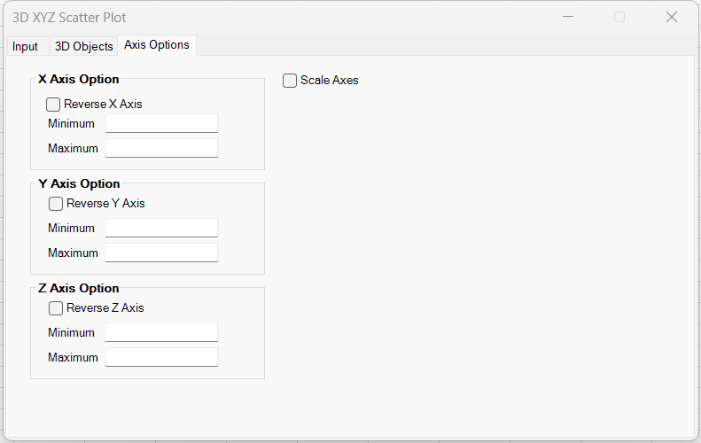
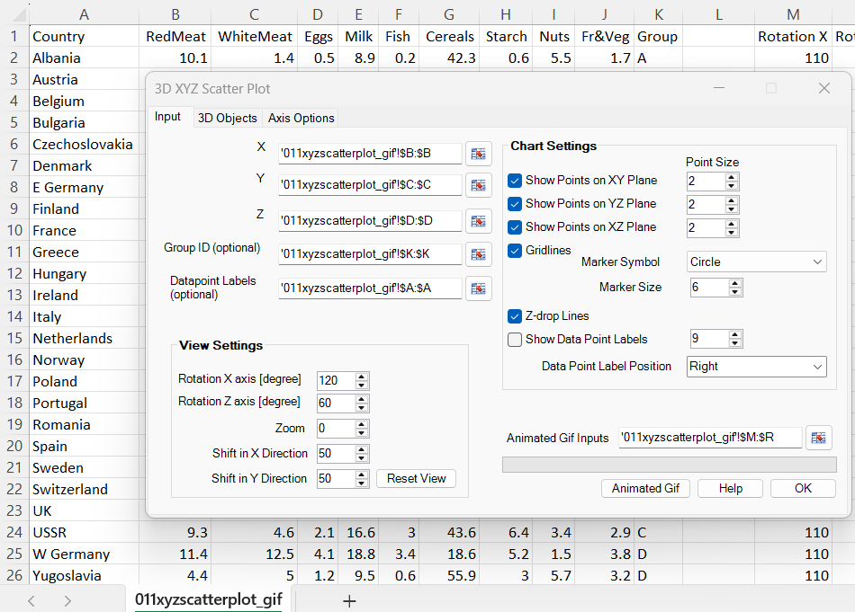
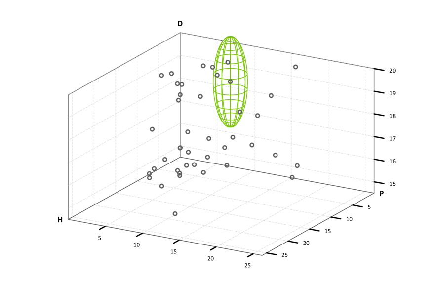

# XYZ 3D Scatterplot

**Includes:** 3D scatter plot (X,Y,Z), optional group coloring, optional point labels, rotation/zoom + plane projections, optional wireframe 3D objects (sphere / ellipsoid), axis reversal, manual axis limits, marker-symbol selection, and animated GIF export.  
**Purpose:** Visualize three-dimensional relationships with interactive view controls, optional wireframe geometry overlays, and optional animation output.

---

## Overview
The **XYZ 3D Scatter Plot** tool creates an interactive 3D-looking scatter plot in Excel by projecting 3D points \((x,y,z)\) onto a 2D chart canvas, then drawing a bounding “cage”, tick marks, optional gridlines, optional plane projections, and optional *Z-drop* lines.

> **Important**
> 
> This is **not** Excel’s native 3D chart type. BESH Stat NG builds an *XY scatter chart* and draws a 3D effect using a deterministic 3D→2D projection.

---

## When to use

Use XYZ 3D Scatter Plot when you want to:

- visually assess relationships among **three** continuous variables;
- see clusters or separation across groups (via **Group ID**);
- add point identifiers (via **Datapoint labels**);
- enhance depth perception with plane projections and Z-drop lines.

---

## Example dataset

This example uses the first three variables from the scatter plot matrix example dataset:

- **X** = `Expect`
- **Y** = `Entertain`
- **Z** = `Comm`

Dataset: [`012scatterplotmatrix.csv`](../assets/data/012scatterplotmatrix/012scatterplotmatrix.csv)
Dataset for animated GIF: [`011xyzscatterplot_gif.csv`](../assets/data/011xyzscatterplot/011xyzscatterplot_gif.csv)

---

## User interface

The dialog is organized into three tabs:

- **Input**
- **3D Objects**
- **Axis Options**

### Input tab

#### Data inputs

- **X, Y, Z (required):** numeric ranges of equal length.
- **Group ID (optional):** a categorical variable (text or numeric) used to color points and create a legend.
- **Datapoint labels (optional):** labels shown next to points when *Show Data Point Labels* is enabled.
- **Animated Gif Inputs (optional):** a 6-column numeric table defining one animation frame per row.

**Missing values:** rows with missing values in any selected input range (X, Y, Z, and optional Group ID / labels) are removed listwise.

#### View settings

- **Rotation X axis [degree]** (default 120): rotates the view about the X axis.
- **Rotation Z axis [degree]** (default 60): rotates the view about the Z axis.
- **Zoom** (default 0): increases/decreases magnification (see mapping below).
- **Shift in X Direction** (default 50): pans left/right.
- **Shift in Y Direction** (default 50): pans up/down.
- **Reset View:** restores the default rotation/zoom/shift.

#### Chart settings

- **Show Points on XY Plane**: draws projected “shadow” points on the XY plane.
- **Show Points on YZ Plane**: draws projected “shadow” points on the YZ plane.
- **Show Points on XZ Plane**: draws projected “shadow” points on the XZ plane.
- **Point Size** (for each plane): marker size for projected plane points.
- **Gridlines**: toggles gridlines on the three coordinate planes.
- **Marker Symbol**: marker shape for the main data points. Supported symbols are: Circle, Square, Diamond, Triangle, X, Plus, Star
- **Marker Size**: marker size for the main data points.
- **Z-drop Lines**: draws dashed drop lines from each data point to the XY plane.
- **Show Data Point Labels**: toggles display of labels from *Datapoint labels*.
- **Label font size**: font size for data labels.
- **Data Point Label Position**: Right / Left / Above / Below.

> Note  
> The **Marker Symbol** setting applies to the main XYZ data series. Plane-projection points are rendered as circular markers.

### 3D Objects tab

The **3D Objects** tab allows you to overlay wireframe objects on the XYZ scatter plot. The current implementation supports:

- **Sphere**
- **Ellipsoid**

Additional controls on this tab apply to all objects created from the current table:

- **Number of Latitude Rings**
- **Number of Longitude Rings**
- **Points per Ring**
- **Color RGB**

### Axis Options tab

The **Axis Options** tab controls axis direction and axis scaling.

#### Axis direction

For each axis (X, Y, Z), the user can enable:

- **Reverse X Axis**
- **Reverse Y Axis**
- **Reverse Z Axis**

This reverses the direction in which values increase along the selected axis.

#### Manual axis limits

For each axis (X, Y, Z), optional manual bounds can be provided:

- **Minimum**
- **Maximum**

Rules:

- both **Minimum** and **Maximum** must be provided together;
- values must be numeric and finite;
- **Minimum < Maximum**.

If left blank, the axis uses automatically computed bounds.

#### Scale Axes

- **Scale Axes** rescales X/Y/Z visually so that relative raw-axis ranges are preserved in the projection.
- The scaling uses the final axis ranges after automatic bounds expansion and any manual minimum/maximum overrides.

---

## What the tool does

### 1) Data preparation and axis bounds

Let \(x_i, y_i, z_i\) be the selected values for row \(i=1,\dots,n\).

Rows with any missing value are dropped listwise.

The tool then computes axis bounds in three stages:

#### Stage A: automatic bounds from data

For each axis \(k\in\{x,y,z\}\), BESH Stat NG first computes:

- minimum \(m_k = \min_i k_i\)
- range \(r_k = \max_i k_i - \min_i k_i\)

using the selected XYZ data.

#### Stage B: expand bounds to include 3D objects

If wireframe 3D objects are attached, the automatic bounds are expanded so the full object geometry is included in the plot.

For example:

For a sphere with center \((c_x,c_y,c_z)\) and radius \(r\), the contributed bounds are:

\[
[c_x-r,\; c_x+r],\quad [c_y-r,\; c_y+r],\quad [c_z-r,\; c_z+r]
\]

For an ellipsoid with semi-axes \((a,b,c)\), the contributed bounds are:

\[
[c_x-a,\; c_x+a],\quad [c_y-b,\; c_y+b],\quad [c_z-c,\; c_z+c]
\]

The final automatic bounds are the union of the data bounds and all attached object bounds.

#### Stage C: optional manual axis limits

If the user provides manual **Minimum** and **Maximum** values on the **Axis Options** tab, those values override the automatically computed bounds for the selected axis.

This means the final bounds used by the renderer are:

- automatic data bounds,
- expanded to include 3D objects,
- then overridden by any manual min/max supplied by the user.

### 2) Normalization to a unit cube

Using the final bounds, each axis is normalized to \([-0.5,\,0.5]\):

\[
\tilde x_i = \frac{x_i - m_x}{r_x} - 0.5,\qquad
\tilde y_i = \frac{y_i - m_y}{r_y} - 0.5,\qquad
\tilde z_i = \frac{z_i - m_z}{r_z} - 0.5.
\]

If an axis is reversed, the normalized coordinate is multiplied by \(-1\):

\[
\tilde x_i \leftarrow d_x \tilde x_i,\qquad
\tilde y_i \leftarrow d_y \tilde y_i,\qquad
\tilde z_i \leftarrow d_z \tilde z_i,
\]

where each direction coefficient \(d_k \in \{+1,-1\}\).

This normalization makes the plot scale-invariant, while still allowing manual axis limits and axis reversal.

### 3) Optional axis scaling (Scale Axes)

If **Scale Axes** is enabled, the tool reduces visual distortion when the final raw axis ranges differ substantially.

Let \(r_{\max} = \max(r_x, r_y, r_z)\) and define scale ratios

\[
 s_x = \frac{r_x}{r_{\max}},\qquad s_y = \frac{r_y}{r_{\max}},\qquad s_z = \frac{r_z}{r_{\max}}.
\]

These scale ratios are computed from the final bounds actually used by the plot:

- after including 3D object bounds;
- after applying any manual axis min/max overrides.

The scaling is then applied inside the projection step (equivalent to scaling \((\tilde x_i,\tilde y_i,\tilde z_i)\) by \((s_x,s_y,s_z)\)).

If **Scale Axes** is disabled, each axis is normalized independently into \([-0.5,0.5]\), which can visually exaggerate variation on short-range axes.

### 4) 3D rotation + 2D projection

The tool uses two user-controlled rotation angles:

- \(\alpha\): X-axis rotation (Rotation X)
- \(\gamma\): Z-axis rotation (Rotation Z)

Internally, the Y-axis rotation is fixed at \(180^\circ\).

Rather than forming a full 3×3 rotation matrix and then selecting two coordinates, BESH Stat NG precomputes two projection vectors \(\mathbf{r}_1,\mathbf{r}_2\in\mathbb{R}^3\). For each point, the 2D coordinates are:

\[
 u_i = \mathbf{r}_1^\top \begin{pmatrix}\tilde x_i\\\tilde y_i\\\tilde z_i\end{pmatrix},
 \qquad
 v_i = \mathbf{r}_2^\top \begin{pmatrix}\tilde x_i\\\tilde y_i\\\tilde z_i\end{pmatrix}.
\]

With \(\sin\) and \(\cos\) computed at the chosen angles (in radians), the implemented projection vectors are:

\[
\mathbf{r}_1=
\begin{pmatrix}
 s_x\,\cos(\beta)\cos(\gamma)\\
 -s_y\,\cos(\beta)\sin(\gamma)\\
 s_z\,\sin(\beta)
\end{pmatrix},\qquad
\mathbf{r}_2=
\begin{pmatrix}
 s_x\,[\cos(\gamma)\sin(\beta)\sin(\alpha)+\sin(\gamma)\cos(\alpha)]\\
 s_y\,[-\sin(\gamma)\sin(\beta)\sin(\alpha)+\cos(\gamma)\cos(\alpha)]\\
 -s_z\,\sin(\alpha)\cos(\beta)
\end{pmatrix},
\]

where \(\alpha\) is Rotation X, \(\gamma\) is Rotation Z, and \(\beta\) is the fixed Y rotation (\(\beta=180^\circ\)).

Because \(\beta=180^\circ\) is fixed, the above simplifies to:

\[
\mathbf{r}_1=
\begin{pmatrix}
 -s_x\,\cos(\gamma)\\
 s_y\,\sin(\gamma)\\
 0
\end{pmatrix},\qquad
\mathbf{r}_2=
\begin{pmatrix}
 s_x\,\sin(\gamma)\cos(\alpha)\\
 s_y\,\cos(\gamma)\cos(\alpha)\\
 s_z\,\sin(\alpha)
\end{pmatrix}.
\]

### 5) Zoom and pan (shift)

The final chart coordinates apply a zoom multiplier and constant shifts:

$$
u_i^{\ast} = (u_i + \delta_x)\,z_{\text{int}},\qquad
v_i^{\ast} = (v_i + \delta_y)\,z_{\text{int}}.
$$

The internal mapping from the UI controls is:

- **Zoom** \(z\) → \(z_{\text{int}} = \bigl(1 + z/50\bigr)^2\)
- **Shift X** \(s\) → \(\delta_x = s/100 - 0.5\)
- **Shift Y** \(t\) → \(\delta_y = t/100 + 0.5\)

These transforms are also applied to the cage, tick marks, gridlines, and plane projections so the entire scene moves consistently.

---

## Plane projections (shadow points)

When enabled, “shadow points” are created by replacing one coordinate with the minimum face of the cube (normalized value \(-0.5\)) and projecting the result.

For example, XY-plane projections use \((\tilde x_i,\tilde y_i, -0.5)\). Likewise:

- **XZ plane:** \((\tilde x_i, -0.5, \tilde z_i)\)
- **YZ plane:** \((-0.5, \tilde y_i, \tilde z_i)\)

Each plane’s points are drawn as a separate Excel series with the chosen **Point Size**.

---

## Z-drop lines

When **Z-drop Lines** is enabled, the tool draws a dashed line from each data point down to its XY-plane projection.

Implementation detail: Excel **custom minus error bars** are used to create these lines.

Let \(v_i^{*}\) be the projected Y coordinate of the full 3D point, and \(v_{i,\text{XY}}^{*}\) the projected Y coordinate of its XY-plane shadow point. The error-bar magnitude is:

\[
 e_i = v_i^{*} - v_{i,\text{XY}}^{*}.
\]

Excel draws a vertical (screen-space) dashed segment of length \(e_i\) from each marker, producing a consistent “drop” effect.

---

## Tick marks and gridlines

### Tick values

For each axis, the tool chooses a “nice” tick step based on one-fifth of the raw range.

Let

\[
f_k=\frac{r_k}{5}.
\]

It then sets the number of decimal digits to

\[
n_{\text{digits}} = 1 - \left\lfloor \log_{10}(|f_k|) + 1 \right\rfloor
\]

and computes

\[
\text{step}_k = \operatorname{round}(f_k,\; n_{\text{digits}}).
\]

The first tick is the first multiple of \(\text{step}_k\) above the minimum:

\[
\text{first}_k = \text{step}_k\,\Bigl(\lfloor m_k/\text{step}_k\rfloor + 1\Bigr).
\]

Tick labels are then placed along each axis in the drawn cage.

### Gridlines

If **Gridlines** is enabled, the tool draws dashed gridlines on the XY, XZ, and YZ planes using the same normalized coordinate system and the current projection.

---

## Output

The tool creates an Excel **Chart sheet** named **XYZ 3D** (Excel may append a suffix if a sheet of that name already exists). The chart contains:

- the 3D bounding cage and axis labels;
- tick marks and numeric tick labels;
- optional plane-projected points;
- main 3D-projected data points (colored by Group ID if provided);
- optional wireframe 3D objects (sphere / ellipsoid);
- optional point labels;
- optional Z-drop lines.
---

## Notes and tips

- If you provide a **Group ID**, each group is drawn as a separate Excel series and appears in the legend as `Group_<value>`.
- If **Show Data Point Labels** is enabled but no label range is supplied, no labels are shown.
- For large \(n\), plotting may be slow because each feature (cage, ticks, gridlines, planes, groups) adds Excel series and formatting.

---

## Animated GIF workflow

The **Animated Gif** feature creates an animated 3D scatter plot by redrawing the chart from a sequence of view settings defined in an input table.

The current implementation does **both** steps:

1. exports individual frame GIFs;
2. combines those frames into a final animated GIF.

### UI location

The workflow is controlled from:

- **Animated Gif Inputs**
- **Animated Gif** button

on the main **Input** tab.

## Animated Gif Inputs format

The **Animated Gif Inputs** range must be a rectangular range with **6 numeric columns** and one row per frame.

### Column definitions (left → right)

1. **Rotation X [degree]**  
   Rotation angle about the X axis.  
   Valid range: \([0, 360]\)

2. **Rotation Z [degree]**  
   Rotation angle about the Z axis.  
   Valid range: \([0, 360]\)

3. **Zoom**  
   Zoom control value.  
   Must be **>= 0**.

4. **Shift in X Direction**  
   Horizontal pan value.  
   Valid range: \([0, 100]\)

5. **Shift in Y Direction**  
   Vertical pan value.  
   Valid range: \([0, 100]\)

6. **Delay [ms]**  
   Per-frame delay in milliseconds.  
   Must be **>= 0**.

### Notes

- **One row = one frame**.
- Frame indices start at `0`.
- If you want a constant view, repeat the same row for multiple frames.
- Smooth animations are typically created by changing one parameter gradually across rows.

## Output path and frame folder

When you click **Animated Gif**, the tool prompts you for the final output `.gif` file path.

If you choose:

- `C:\Plots\xyz_spin.gif`

the tool creates a working folder:

- `C:\Plots\xyz_spin_frames\`

and stores intermediate frames there as:

- `0.gif`, `1.gif`, `2.gif`, …, `n-1.gif`

where `n` is the number of rows in **Animated Gif Inputs**.

After all frames are exported, the tool combines them into the final animated GIF at the selected output path.

### Example

A simple rotation-only animation can be created by keeping Zoom and Shift fixed while changing Rotation X or Rotation Z over rows.

For example:

- Rotation X: 110, 120, 130, …
- Rotation Z: 60 (constant)
- Zoom: 0 (constant)
- Shift in X Direction: 50 (constant)
- Shift in Y Direction: 50 (constant)
- Delay: 110 ms (constant)

### Example output

## Tips for smooth animations

- Prefer smaller rotation steps (e.g. 2–5 degrees per frame) for smoother motion.
- Keep **Zoom** and **Shift** fixed while you debug rotation.
- If you see clipping or a jump in the view, reduce the step size or increase the number of frames.
- Use a constant **Delay [ms]** (e.g. 80–150 ms) during testing and adjust later for the desired playback speed.

---

### 3D Objects (wireframe shapes)

The **3D Objects** tab allows you to overlay one or more wireframe shapes (e.g., spheres and ellipsoids) on top of the XYZ 3D scatter plot.

#### 3D Objects Specification (range)

**3D Objects Specification** must be a rectangular table (Excel range) where each row defines **one object**.

- **Column 1 (Type):** object type (text)
- **Column 2–4:** center coordinates **X, Y, Z** (numeric; same units as your plotted data)
- **Remaining columns:** parameters depend on the object type

Supported types (case-insensitive), including convenience aliases:

- **Sphere:** `sphere`, `s`, `wire_sphere`, `wiresphere`
- **Ellipsoid:** `ellipsoid`, `e`, `wire_ellipsoid`, `wireellipsoid`

#### Mixed table format (recommended)

Because one Excel range must have a single fixed width, the recommended mixed-format table uses **7 columns** so it can contain both spheres and ellipsoids:

| Col | Name | Used by |
|---:|---|---|
| 1 | `type` | sphere / ellipsoid |
| 2 | `X` | sphere / ellipsoid |
| 3 | `Y` | sphere / ellipsoid |
| 4 | `Z` | sphere / ellipsoid |
| 5 | `diameter` or `diameterX` | sphere / ellipsoid |
| 6 | `diameterY` | ellipsoid (ignored for sphere rows) |
| 7 | `diameterZ` | ellipsoid (ignored for sphere rows) |

**Sphere rows** use column 5 as **diameter** and may leave columns 6–7 blank.  
**Ellipsoid rows** use columns 5–7 as **diameterX, diameterY, diameterZ**.

Example (mixed objects in one range):

| type | X | Y | Z | d / dx | dy | dz |
|---|---:|---:|---:|---:|---:|---:|
| sphere | 10 | 5 | 3 | 8 |  |  |
| ellipsoid | 0 | 0 | 0 | 10 | 6 | 4 |

#### Validation rules

The tool validates the specification range before creating objects:

- Type must be one of the supported values (see above).
- **X, Y, Z** must be numeric and finite.
- Diameters must be numeric, finite, and **>= 0**.
- Objects with **diameter = 0** (or ellipsoid with any diameterX/Y/Z = 0) are treated as degenerate and are skipped.

#### Interaction with axis bounds

By default, the plot automatically expands X/Y/Z bounds to include the full extent of attached 3D objects, so wire spheres and ellipsoids are fully visible even when they extend beyond the raw data cloud.

If manual axis **Minimum/Maximum** values are supplied on the **Axis Options** tab, those manual bounds override the automatic object-expanded bounds for the affected axis.

#### Wireframe density and appearance

The following settings apply to the wireframe rendering:

- **Number of Latitude Rings:** number of “horizontal” rings (more = denser wireframe).
- **Number of Longitude Rings:** number of “vertical” meridians (more = denser wireframe).
- **Points per Ring:** number of points used to approximate each ring (more = smoother curves).
- **Color RGB:** wireframe line color (applies to objects drawn with the current settings).

> Tip  
> Higher ring counts and points-per-ring can look better but may slow down rendering because each object is drawn as line series data in Excel.

#### How the inputs are used (math)

All 3D objects are defined in the same coordinate system as your plotted data.  
Let the object center be:

\[
\mathbf{c} = (c_x, c_y, c_z)
\]

##### Sphere

For a sphere, the input **diameter** \(d\) is converted to the radius:

\[
r=\frac{d}{2}
\]

A sphere is the set of points \((x,y,z)\) satisfying:

\[
(x-c_x)^2 + (y-c_y)^2 + (z-c_z)^2 = r^2
\]

For rendering a **wireframe**, the sphere is parameterized using latitude/longitude angles:

- latitude \(\varphi \in \left[-\frac{\pi}{2}, +\frac{\pi}{2}\right]\)
- longitude \(\theta \in [0, 2\pi]\)

\[
\begin{aligned}
x(\theta,\varphi) &= c_x + r\cos\theta\cos\varphi \\
y(\theta,\varphi) &= c_y + r\sin\theta\cos\varphi \\
z(\theta,\varphi) &= c_z + r\sin\varphi
\end{aligned}
\]

Wireframe rings are drawn as:

- **Latitude rings**: fix \(\varphi\) and sweep \(\theta\) from \(0\) to \(2\pi\)
- **Longitude rings**: fix \(\theta\) and sweep \(\varphi\) from \(-\frac{\pi}{2}\) to \(+\frac{\pi}{2}\)

##### Ellipsoid

For an ellipsoid, the inputs **diameterX, diameterY, diameterZ** are converted to semi-axes:

\[
a=\frac{d_x}{2}, \quad b=\frac{d_y}{2}, \quad c=\frac{d_z}{2}
\]

An axis-aligned ellipsoid is the set of points satisfying:

\[
\frac{(x-c_x)^2}{a^2} + \frac{(y-c_y)^2}{b^2} + \frac{(z-c_z)^2}{c^2} = 1
\]

The wireframe is parameterized similarly:

\[
\begin{aligned}
x(\theta,\varphi) &= c_x + a\cos\theta\cos\varphi \\
y(\theta,\varphi) &= c_y + b\sin\theta\cos\varphi \\
z(\theta,\varphi) &= c_z + c\sin\varphi
\end{aligned}
\]

As with the sphere:

- **Latitude rings** fix \(\varphi\) and sweep \(\theta\)
- **Longitude rings** fix \(\theta\) and sweep \(\varphi\)

##### Ring counts and smoothness

- **Number of Latitude Rings** controls how many distinct latitude values \(\varphi\) are used (excluding the poles).
- **Number of Longitude Rings** controls how many distinct longitude values \(\theta\) are used.
- **Points per Ring** controls how finely each ring is sampled (how many \(\theta\) or \(\varphi\) steps per ring), affecting curve smoothness.

---

## See also

- [Scatter Plot Matrix](scatter-plot-matrix.md)
- [Home](../index.md)
