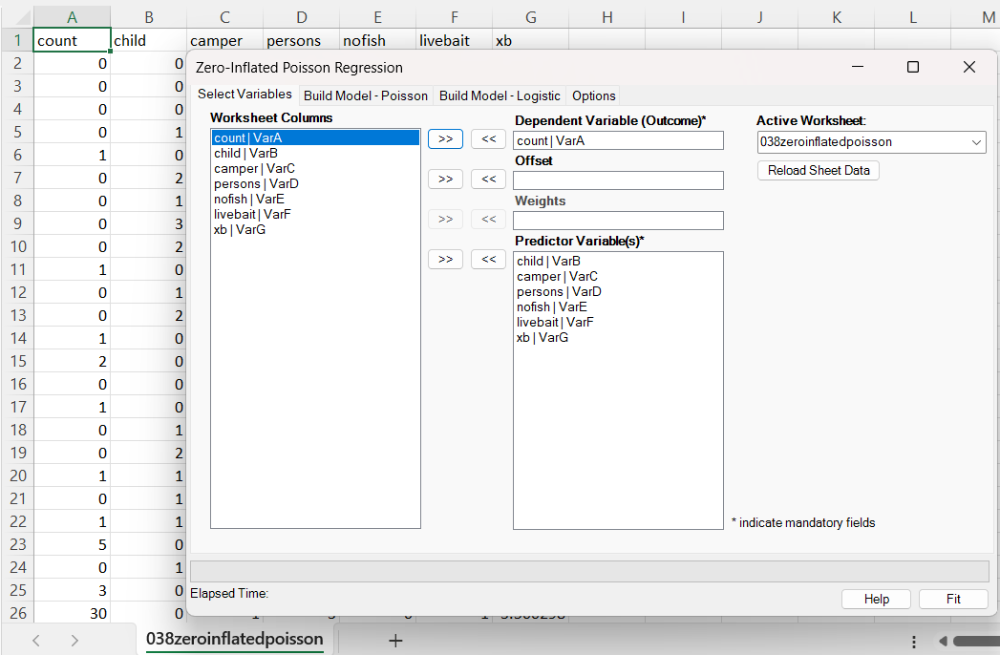
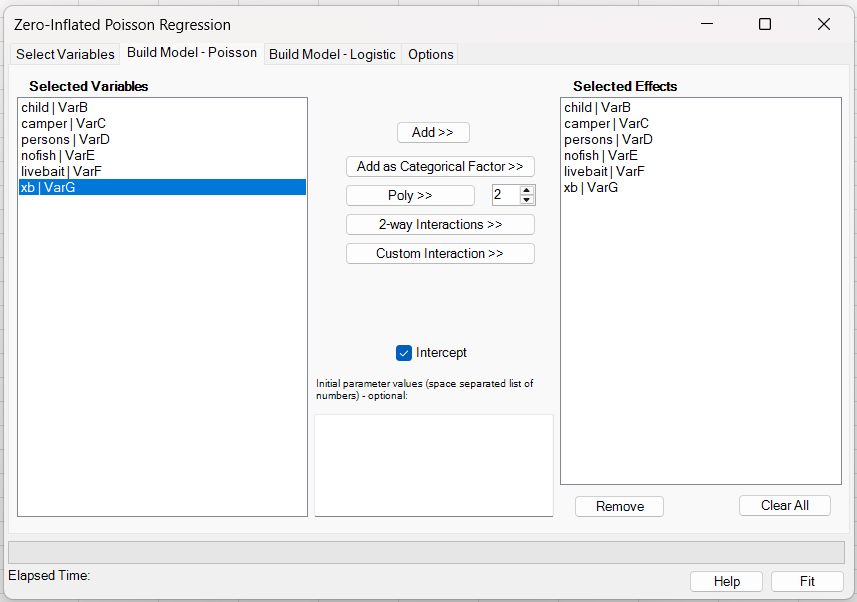
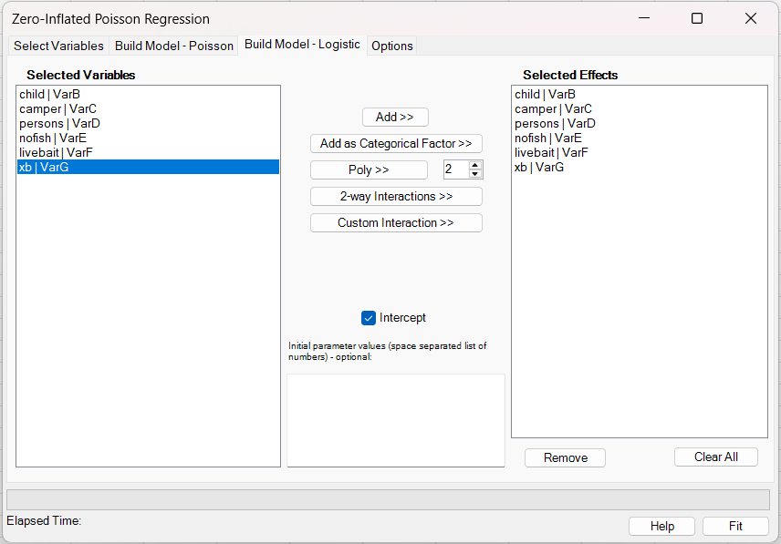
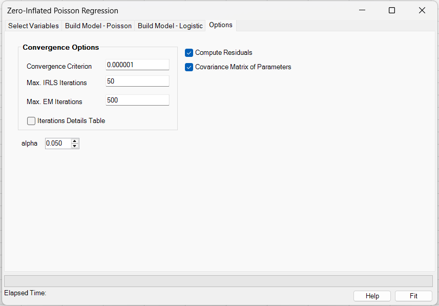
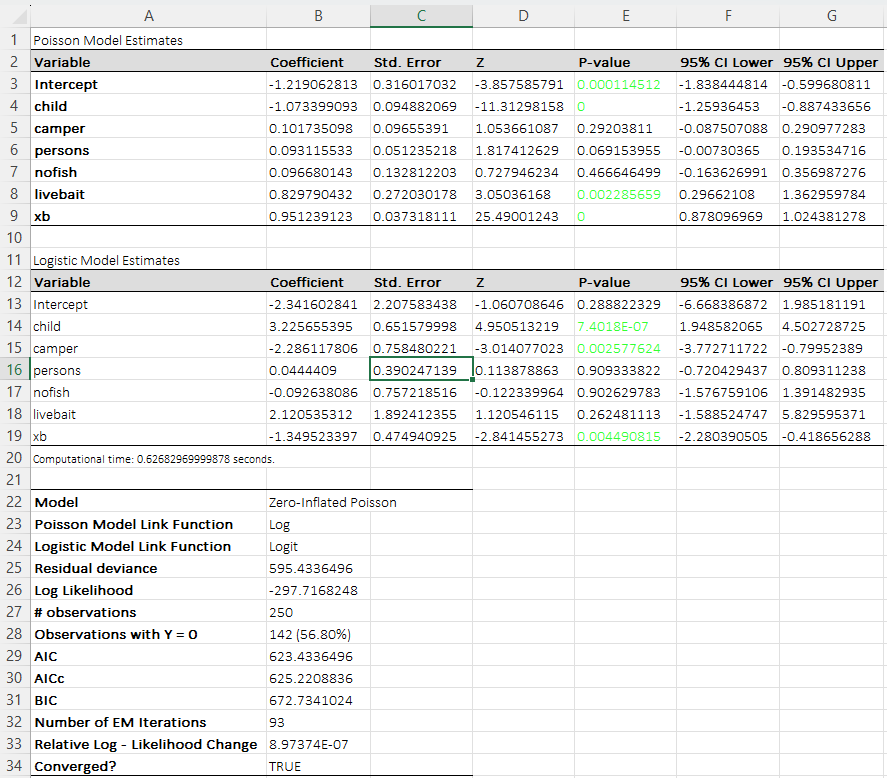
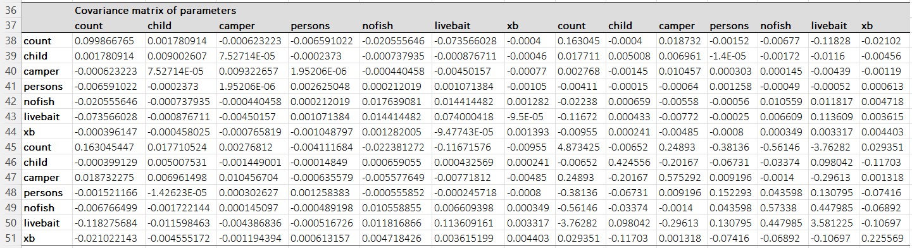

# Zero-Inflated Poisson Regression

**Includes:** ZIP model (Poisson count + logistic inflation part), separate authored effects for the Poisson and Logistic components, categorical factors, polynomial terms, continuous and categorical-factor interactions, EM-style fitting (with iterations/ε), optional starting values for both parts.  
**Purpose:** Model count data with excess zeros by combining a Poisson model with a separate zero-inflation process.

---

## Overview
A **zero-inflated Poisson (ZIP)** model is a two-part (mixture) model for count outcomes with **excess zeros**. It combines:

1. a **Poisson regression** for the expected count among observations that are “at risk” of having counts, and
2. a **logistic regression** for the probability of a **structural (always) zero**.

**Structural zero (definition):** A *structural zero* is a zero that occurs because an observation is in a latent "always-zero" state (not at risk for positive counts). In other words, even if the Poisson mean \(\mu_i\) is positive, a structural-zero observation still produces \(Y_i=0\) with probability 1; the ZIP model represents this using the inflation probability \(\pi_i\).

BESHStatNG fits the ZIP model by **maximum likelihood** using an **EM algorithm** (Expectation–Maximization). Each EM iteration updates the Poisson and logistic submodels using **IRLS** (iteratively reweighted least squares), so a ZIP fit can be understood as repeatedly fitting a weighted Poisson GLM and a weighted logistic GLM until the mixture likelihood converges.

A Poisson GLM can generate zeros (with probability \(\exp(-\mu)\)), but in many applications the observed data contain **more zeros than any Poisson regression can plausibly explain**. ZIP addresses this by allowing a second mechanism that generates “structural” zeros.

In a ZIP model, a zero can arise from:

- a **structural-zero** process (the observation is “not at risk” and always yields 0), or
- the **Poisson count** process (which can yield 0 with probability \(\exp(-\mu)\)).

ZIP estimates two sets of coefficients:

- **Count (Poisson) coefficients**: how predictors affect the expected count among non-structural observations.
- **Inflation (logistic) coefficients**: how predictors affect the probability of being a structural zero.

---

## 2) When to use ZIP

Use ZIP when:

- the outcome is a nonnegative count \(y = 0,1,2,\dots\),
- the data contain **more zeros than expected** under a Poisson GLM,
- it is scientifically plausible that some observations are **structural zeros**.

If variance is much larger than the mean even after accounting for extra zeros, consider a **zero-inflated negative binomial** model (if available) or other alternatives.

---

## 3) Dialog inputs and options

Open: **BESH Stat NG → Analyse → Regression → Zero-Inflated Poisson Regression**

### 3.1 Select Variables tab

- Choose the **Dependent Variable (Outcome)** (count response).
- Choose predictor variables (these will be used for both components unless you specify different effects on the component tabs).
- Optional: **Offset** (weights are not supported yet).



### 3.2 Build Model – Poisson tab

Select which predictors are included in the **count (Poisson)** component.



- **Add >>** adds the selected variable(s) as continuous main effects.
- **Add as Categorical Factor >>** marks the selected variable(s) as categorical main effects. Internally, BESHStatNG expands each selected factor into reference-coded indicator columns; if the factor is used in an interaction, the interaction is built from those expanded columns.
- **Poly >>** creates polynomial terms for the selected variable(s). The degree is taken from the numeric box next to the button.
- **2-way Interactions >>** creates all pairwise interactions among the currently selected variables.
- **Custom Interaction >>** creates one multi-way interaction term spanning all currently selected variables.
- **Initial parameter values** are optional. If supplied, they are used as starting values for the **Poisson** part, and the required count is based on the **expanded** Poisson design matrix.

Current limitations:

- Polynomial terms are supported only for **continuous** predictors.
- Interaction terms support **continuous × continuous**, **categorical × continuous**, and **categorical × categorical** combinations.
- Polynomial subterms inside interactions are not supported; create polynomial main effects separately when needed.

### 3.3 Build Model – Logistic tab

Select which predictors are included in the **inflation (logistic)** component.



- The Logistic tab uses an **independent effect list** from the Poisson tab. You can therefore specify different predictors and different derived terms in the two ZIP components.
- **Add >>** adds the selected variable(s) as continuous main effects.
- **Add as Categorical Factor >>** marks the selected variable(s) as categorical main effects.
- **Poly >>** creates polynomial terms for the selected variable(s).
- **2-way Interactions >>** creates all pairwise interactions among the currently selected variables.
- **Custom Interaction >>** creates one multi-way interaction term spanning all currently selected variables.
- **Initial parameter values** are optional. If supplied, they are used as starting values for the **Logistic** part, and the required count is based on the **expanded** Logistic design matrix.

Current limitations:

- Polynomial terms are supported only for **continuous** predictors.
- Interaction terms support **continuous × continuous**, **categorical × continuous**, and **categorical × categorical** combinations.
- Polynomial subterms inside interactions are not supported; create polynomial main effects separately when needed.

!!! note
    The **Selected Effects** list on each ZIP tab shows the authored terms, while the fitted coefficient tables may contain more columns after factor expansion (for example, one coefficient per non-reference factor level).

### 3.4 Options tab

- **Convergence Criterion**: tolerance \(\varepsilon\) for changes in log-likelihood.
- **Max. IRLS Iterations**: maximum IRLS steps per GLM update (Poisson and logistic).
- **Max. EM Iterations**: maximum EM iterations.
- **Iterations Details Table**: optionally output an iteration log.
- **Compute Residuals**: export fitted values and residuals to a separate CSV.
- **Covariance Matrix of Parameters**: output the full covariance matrix.
- **Alpha**: two-sided significance level used for Wald confidence intervals in both model components. Default: **0.05** (95% confidence interval).



---

## 4) Output tables and interpretation

BESHStatNG produces two coefficient tables:

1. **Poisson Model Estimates** (log link)
2. **Logistic Model Estimates** (logit link)

Each includes coefficient, standard error, Wald \(Z\), p-value, and a confidence interval at the selected level. The screenshots on this page use the default `alpha = 0.05`, so the example output shows 95% CI labels.

Example output layout:



Optional covariance matrix:



### 4.1 Interpreting coefficients

#### Poisson (count) part

The count component uses a log link:

$$
\log(\mu_i) = o_i + \mathbf{x}_i^T\beta
$$

A one-unit increase in predictor \(x_r\) multiplies the Poisson mean \(\mu\) by:

$$
\text{Rate ratio} = \exp(\beta_r).
$$

#### Logistic (inflation) part

The inflation component uses a logit link:

$$
\operatorname{logit}(\pi_i) = \log\left(\frac{\pi_i}{1-\pi_i}\right) = q_i + \mathbf{z}_i^\top\gamma
$$

A one-unit increase in \(z_r\) multiplies the odds of being a structural zero \(\pi/(1-\pi)\) by:

$$
\text{Odds ratio} = \exp(\gamma_r).
$$

### 4.2 Example interpretation (from the example output)

Using the example shown in the screenshots:

- **Poisson part, xb**: \(\hat\beta = 0.9512\). The rate ratio is \(\exp(0.9512) \approx 2.59\). Holding other predictors fixed, a one-unit increase in **xb** multiplies the expected count (among non-structural observations) by about **2.6×**.

- **Logistic part, child**: \(\hat\gamma = 3.2257\). The odds ratio is \(\exp(3.2257) \approx 25.2\). Holding other predictors fixed, a one-unit increase in **child** multiplies the odds of being a **structural zero** by about **25×**.

---

## 5) Model definition and mathematics

Let \(y_i \in \{0,1,2,\dots\}\) be the count outcome for observation \(i\).

### 5.1 Count (Poisson) component

The Poisson mean is

$$
\mu_i = \exp(o_i + \mathbf{x}_i^T\beta)
$$

where \(o_i\) is an optional **offset** and \(\mathbf{x}_i\) is the predictor vector for the count component.

Conditional on being in the count component:

$$
P(Y_i=y \mid \text{count}) = \frac{\exp(-\mu_i)\,\mu_i^y}{y!}.
$$

### 5.2 Inflation (logistic) component

The structural-zero probability is

$$
\pi_i = \frac{1}{1+\exp(-(\mathbf{z}_i^T\gamma))}
$$

where \(\mathbf{z}_i\) is the predictor vector for the inflation component.

!!! note
    In the current BESHStatNG ZIP implementation, the optional offset applies to the **Poisson count part only**.

### 5.3 ZIP mixture probabilities

- For \(y_i=0\):

$$
P(Y_i=0) = \pi_i + (1-\pi_i)\exp(-\mu_i)
$$

- For \(y_i>0\):

$$
P(Y_i=y) = (1-\pi_i)\,\frac{\exp(-\mu_i)\,\mu_i^y}{y!}
$$

### 5.4 Mean and variance

Unconditional mean:

$$
E(Y_i) = (1-\pi_i)\,\mu_i
$$

Unconditional variance:

$$
\mathrm{Var}(Y_i) = (1-\pi_i)\mu_i\big(1 + \pi_i\mu_i\big).
$$

BESHStatNG reports the fitted mean \(\widehat{E(Y_i)}=(1-\hat{\pi}_i)\hat{\mu}_i\) as **Prediction** in the residual export.

### 5.5 Log-likelihood (ZIP mixture)

For observation \(i\), let the Poisson mean be

\[
\mu_i=\exp(\eta_i), \qquad \eta_i=\mathbf{x}_i^\top\beta,
\]

and let the structural-zero probability be

\[
\pi_i=\operatorname{logit}^{-1}(\zeta_i), \qquad \zeta_i=\mathbf{z}_i^\top\gamma.
\]

The ZIP probability mass function is

\[
P(Y_i=0)=\pi_i+(1-\pi_i)\exp(-\mu_i),
\qquad
P(Y_i=y)= (1-\pi_i)\frac{\exp(-\mu_i)\mu_i^y}{y!}, \; y=1,2,\dots
\]

Define the indicator \(I_i=\mathbb{1}(y_i=0)\). The contribution of observation \(i\) to the log-likelihood is

\[
\ell_i(\beta,\gamma)
= I_i \log\!\Big(\pi_i+(1-\pi_i)\exp(-\mu_i)\Big)
+ (1-I_i)\left[
\log(1-\pi_i) - \mu_i + y_i\log(\mu_i) - \log(y_i!)
\right].
\]

The full log-likelihood reported by BESHStatNG is the sum over all observations:

\[
\ell(\beta,\gamma)=\sum_{i=1}^{n}\ell_i(\beta,\gamma).
\]

> **Numerical stability (implementation note).**  
> For \(y_i=0\), the term \(\log\!\big(\pi_i+(1-\pi_i)\exp(-\mu_i)\big)\) is evaluated using a stable *log-sum-exp* form:

> \[
> \log(a+b)=m+\log\!\big(\exp(\log a-m)+\exp(\log b-m)\big),
> \]

> with \(a=\pi_i\), \(b=(1-\pi_i)\exp(-\mu_i)\), and \(m=\max(\log a,\log b)\).

---

## 6) Estimation algorithm (EM with IRLS)

ZIP is fit by maximum likelihood. BESHStatNG uses an **EM algorithm** with a latent indicator \(S_i\):

- \(S_i=1\) means observation \(i\) is a **structural zero**.
- \(S_i=0\) means observation \(i\) is generated by the **Poisson count** component.

### 6.1 E-step

For \(y_i>0\), \(S_i\) must be 0.

For \(y_i=0\), the posterior probability that the zero is structural is

$$
\tau_i = P(S_i=1\mid y_i=0) = \frac{\pi_i}{\pi_i + (1-\pi_i)\exp(-\mu_i)}.
$$

### 6.2 M-step

Given \(\tau_i\):

- The **Poisson GLM** is updated using weights proportional to \(1-\tau_i\).
- The **logistic GLM** is updated using \(\tau_i\) as the fractional response (structural-zero membership probability).

Each GLM update is solved by IRLS up to the specified **Max. IRLS iterations**.

### 6.3 Convergence

EM iterations continue until:

$$
|\ell_{new} - \ell_{old}| < \varepsilon,
$$

or until the maximum EM iterations is reached.

### 6.4 EM over-relaxation (acceleration) with monotone fallback

Pure EM can converge slowly. To speed convergence, BESHStatNG applies a small **over-relaxation** (also called *step-length acceleration*) along the EM update direction. Let \(\theta\) collect all parameters from both components (Poisson \(\beta\) and inflation \(\gamma\)). After computing the usual EM update \(\theta_{EM}\) from \(\theta_{old}\), the add-in proposes an accelerated step

$$
\theta^{\ast} = \theta_{old} + s\,(\theta_{EM}-\theta_{old}),
$$

with step factor **\(s=1.2\)**. This is an extrapolation beyond the standard EM update (which corresponds to \(s=1\)).

Because over-relaxation can occasionally decrease the log-likelihood, BESHStatNG uses a **monotone fallback**: it evaluates the mixture log-likelihood at \(\theta^{\ast}\) and only accepts the accelerated step if it improves the log-likelihood. If not, the step factor is reduced toward 1 (backtracking) until an improving step is found; otherwise the algorithm falls back to the plain EM update \(\theta_{EM}\).

**Why this helps:** EM is guaranteed to be non-decreasing in log-likelihood but can be conservative. Over-relaxation often reduces the number of iterations by taking a longer step in a direction EM already indicates is beneficial, while the monotone fallback preserves EM’s stability.

---

## 7) Inference, standard errors, and confidence intervals

BESHStatNG reports Wald-style inference for each coefficient:

- Standard errors from the estimated covariance matrix.
- Wald statistic \(Z = \hat\theta/SE(\hat\theta)\).
- Two-sided p-value from the standard normal distribution.
- Confidence interval at level \(1-\alpha\):

$$
\hat\theta \pm z_{1-\alpha/2}\,SE(\hat\theta).
$$

In the current production UI, **Alpha** is user-selectable. The default is \(\alpha=0.05\), which gives a 95% confidence interval.

For the Poisson part, exponentiating the CI gives a CI for the **rate ratio**. For the logistic part, exponentiating gives a CI for the **odds ratio** of structural zeros.

---

## 8) Model diagnostics and relation to GLMs

ZIP is a **mixture** model, not a single GLM, but it is built from two GLMs:

- a Poisson GLM for counts,
- a logistic GLM for inflation.

BESHStatNG reports:

- **Log Likelihood** \(\ell(\hat\theta)\)
- **Residual deviance** \(D=-2\ell(\hat\theta)\)
- **AIC, AICc, BIC**
- counts of observations and zeros
- number of EM iterations and convergence information

### 8.1 Information criteria

Let \(\ell(\hat\theta)\) be the maximized log-likelihood, \(D=-2\,\ell(\hat\theta)\) the reported residual deviance, \(n\) the number of observations, and \(k\) the total number of estimated regression parameters across both components (including intercepts when present):

$$
D = -2\,\ell(\hat\theta),
\qquad
 k = p_{count} + p_{zero}.
$$

BESHStatNG uses the common definitions

$$
\mathrm{AIC} = D + 2k,
\qquad
\mathrm{BIC} = D + k\log(n),
$$

and the small-sample correction

$$
\mathrm{AICc} = D + 2k\,\frac{n}{n-k-1}.
$$

**Note on deviance:** In a standard GLM, deviance differences are often compared to a chi-square distribution for nested-model tests. In ZIP, deviance is defined from the mixture log-likelihood and is **not automatically a chi-square goodness-of-fit test**.

---

## 9) Residuals and fitted values

If **Compute Residuals** is enabled, BESHStatNG writes a residual table that includes predicted values and residuals. For ZIP:

- **Prediction** is the fitted unconditional mean:

$$
\hat y_i = \widehat{E(Y_i)} = (1-\hat{\pi}_i)\hat{\mu}_i.
$$

- **Raw residual**:

$$
r_i = y_i - \hat y_i.
$$

- **Pearson residual (ZIP variance-based)**:

$$
r^{(P)}_i = \frac{y_i-\hat y_i}{\sqrt{\widehat{\mathrm{Var}}(Y_i)}}
\qquad\text{with}\qquad
\widehat{\mathrm{Var}}(Y_i) = (1-\hat{\pi}_i)\hat{\mu}_i\big(1+\hat{\pi}_i\hat{\mu}_i\big).
$$

The residual CSV provided with this example is [038zeroinflatedpoisson_residuals.csv](../assets/data/038zeroinflatedpoisson/038zeroinflatedpoisson_residuals.csv).

---

## 10) Example data

This help page uses: [038zeroinflatedpoisson.csv](../assets/data/038zeroinflatedpoisson/038zeroinflatedpoisson.csv)

## 11) R code to reproduce the analysis

A close match can be obtained in R using `pscl::zeroinfl()` (or other ZIP packages). Example:

```r
# install.packages("pscl")
library(pscl)

dat <- read.csv("038zeroinflatedpoisson.csv")

# Example: count ~ predictors, zero ~ predictors
fit <- zeroinfl(
  count ~ child + camper + persons + nofish + livebait + xb |
          child + camper + persons + nofish + livebait + xb,
  data = dat,
  dist = "poisson"
)

summary(fit)

# Log-likelihood and information criteria
logLik(fit)
AIC(fit)
BIC(fit)

# Predicted mean E[Y] = (1 - pi) * mu
pred_mean <- predict(fit, type = "response")

# Component predictions
pi_hat <- predict(fit, type = "zero")  # structural-zero probability
mu_hat <- predict(fit, type = "count") # Poisson mean

# ZIP variance
var_zip <- (1 - pi_hat) * mu_hat * (1 + pi_hat * mu_hat)

# Residuals
raw_resid <- dat$count - pred_mean
pearson_zip <- (dat$count - pred_mean) / sqrt(var_zip)
```

### Expected differences vs. BESHStatNG

- **Optimization:** many R functions maximize the likelihood directly (e.g., quasi-Newton) rather than EM. With the same model specification, coefficients and standard errors should be very close, but small differences can occur due to optimizer details and starting values.
- **Information criteria:** BESHStatNG uses the standard parameter count \(k=p_{count}+p_{zero}\) (intercepts included when present). AIC/BIC should match typical R output when the fitted log-likelihood matches. Differences can still occur if a package uses a different effective \(n\) under weights or uses a different AICc convention.
- **Residuals:** BESHStatNG’s Pearson residuals use the ZIP variance \(\mathrm{Var}(Y)=(1-\pi)\mu(1+\pi\mu)\). Some packages report component-wise residuals (count part / zero part) in addition to mixture residuals, so residual tables may not be identical even when fitted values match.

---

## 12) Practical notes

- Use the **Poisson part** to interpret predictors’ effects on the expected count among non-structural observations.
- Use the **logistic part** to interpret predictors’ effects on the probability of being a structural zero.
- If many predictors are included in both parts, consider simplifying (different predictors per component) to improve interpretability.

## References

- Diane Lambert. Zero-Inflated Poisson Regression, With an Application to Defects in Manufacturing. Technometrics, Feb1992, 34.1
- D.S. Young, E.S. Roemmele, P. Yeh Zero-inflated modeling part I: Traditional zero-inflated count regression models, their applications, and computational tools. WIREs Computational Statistics, 14.1, 2022 https://doi.org/10.1002/wics.1541

## See also
- [Generalized Linear Models](generalized-linear-models-glm.md)
- [Negative-Binomial NB2](negative-binomial-regression-nb2.md)
- [Home](../index.md)
