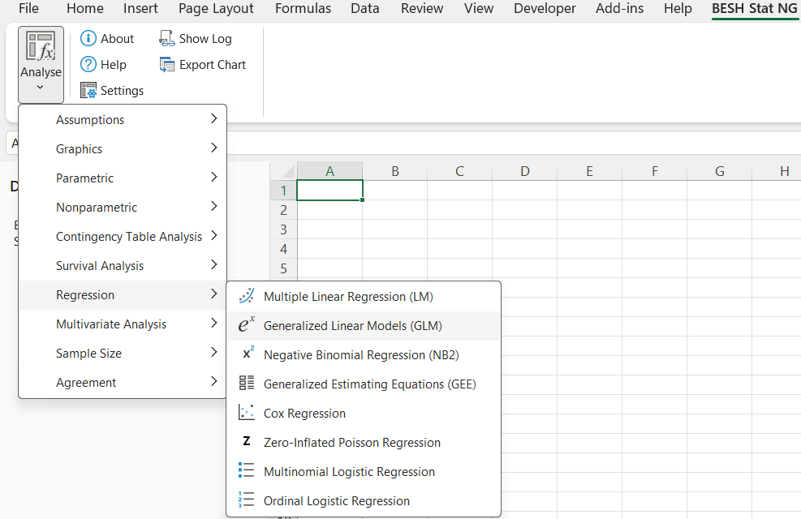
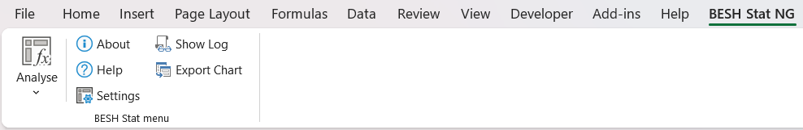
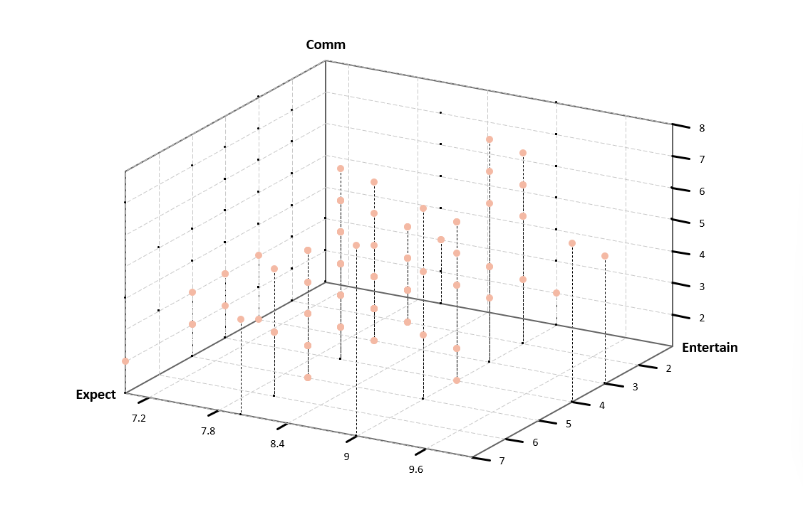
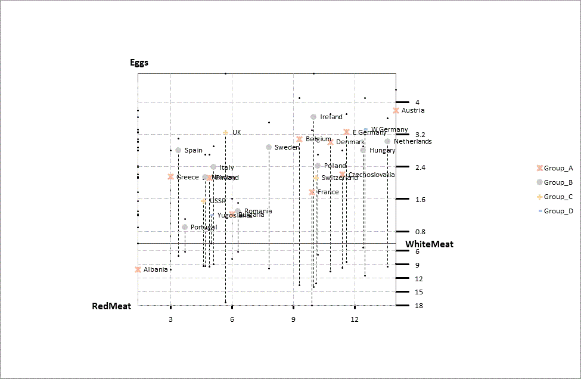

# BESHStatNG

**BESHStatNG** is an Excel-DNA based statistical add-in for **Microsoft Excel on Windows**.
It brings a broad set of statistical methods, charting tools, and worksheet functions directly into Excel for analysts, researchers, teachers, and students who want reproducible analysis without leaving the spreadsheet environment.

Website: https://beshstat.eu/  
Documentation: https://beshstat.eu/beshstatng/help/latest/  
Releases: https://github.com/PeterSlezak/BESHstatNG/releases



## Why BESHStatNG?

BESHStatNG is designed for people who want more than Excel's built-in Analysis ToolPak, but who still prefer an Excel-first workflow.

It focuses on:

- **Excel-native analysis** with ribbon dialogs and worksheet-based workflows
- **Broad statistical coverage** for applied analysis, teaching, and reporting
- **Reproducible output** that stays in the workbook
- **Formula-driven workflows** through an expanding UDF surface
- **Detailed online help** with method explanations, options, and examples
- **Open development** with source code and documentation available in this repository

## Current scope

Based on the current source and documentation in this repository, BESHStatNG includes:

- **54 documented methods**
- **114 Excel worksheet functions (UDFs)**
- **Dialog-driven workflows** plus formula-based analysis for many tasks
- **Versioned MkDocs documentation**

### Main method areas

- Descriptive statistics and distribution diagnostics
- Parametric tests and ANOVA
- Nonparametric tests
- Contingency tables and proportions
- Correlation and association measures
- Linear, generalized linear, negative binomial, ordinal, multinomial, and zero-inflated regression
- Mixed Models for Repeated Measures (MMRM)
- Generalized Estimating Equations (GEE)
- Survival analysis, including Kaplan–Meier, log-rank, and Cox regression
- Multivariate methods, including PCA, factor analysis, clustering, correspondence analysis, and Hotelling's T²
- Agreement and method comparison, including Passing–Bablok, Deming, and ICC
- Sample size calculations
- Statistical graphics and exportable charts

## What the project offers

### 1. Ribbon-based analyses inside Excel
BESHStatNG adds dialogs and task-focused forms to Excel so users can run analyses without writing code.

### 2. Worksheet functions for reusable models
The project includes a substantial and growing set of UDFs for:

- regression model fitting and summaries
- survival analysis
- sample size calculations
- contingency tables
- distribution functions
- parametric and nonparametric utilities
- assumption checks

This makes it possible to build reusable templates, teaching workbooks, and lightweight analytical pipelines directly in Excel.

### 3. Documentation that explains both usage and methods
The documentation covers:

- getting started
- implementation notes
- method-specific help pages
- UDF reference pages
- global settings and chart export
- what's new across versions

## Installation

The recommended way to install BESHStatNG is from the **GitHub Releases** page or the project website download page.

1. Download the latest `.msi` installer.
2. Close Excel before installing.
3. Run the installer.
4. Start Excel and enable the add-in if prompted.

If your environment blocks unsigned installers or unmanaged add-ins, consult your IT administrator.

## Documentation

Online help is published at:

https://beshstat.eu/beshstatng/help/latest/

The documentation source in this repository is built with **MkDocs**.

## Contributing and issue reporting

Contributions, bug reports, and workflow suggestions are welcome.

If you have found a bug, please open an issue and include:

- the BESHStatNG version
- the Excel version and Office bitness
- the Windows version
- exact steps to reproduce the problem
- the expected behavior and the actual behavior
- the full error message or stack trace, if available
- a simplified workbook, screenshot, or sample data if it helps reproduce the issue

If you plan to submit a fix, please also include short validation notes describing how the change was tested in Excel and whether any unit tests or documentation were updated.

Useful links:

- Contributing guide: [CONTRIBUTING.md](.github/CONTRIBUTING.md)
- Issue tracker: https://github.com/PeterSlezak/BESHstatNG/issues
- Releases: https://github.com/PeterSlezak/BESHstatNG/releases

## Build from source

### Prerequisites

- Windows
- Microsoft Excel desktop
- Visual Studio with **.NET Framework 4.8** support
- NuGet package restore enabled

### Main project stack

- Visual Basic .NET
- Excel-DNA
- .NET Framework 4.8
- MkDocs for documentation

### Build the add-in

1. Clone the repository.
2. Restore NuGet packages.
3. Open the project in Visual Studio.
4. Build the solution in `Release` mode.
5. Package the installer if you use a separate setup project or installer workflow locally.

## Repository structure

```text

BESHStatNG.sln
/BESHStatNG/                    BESHStatNG excel-DNA based add-in project source code
           src/                 application code
              /ExcelUDFs/       Excel worksheet functions
              /StatTests/       statistical method implementations
              /RegModels/       regression model code
              /UI/              Windows Forms UI and ribbon handlers
              /Help/            help-link mapping and help integration
           tools/               helper scripts
/BESHStatNG.Test/               unittest project
/BESHStatNG_Help_MkDocs/        mkdocs documetnation source files
/BESHStatNG_Installer/          wix installer
/tools
/.github
README.md
```

## Notes

- BESHStatNG.sln is the main solution for the Excel add-in itself.
- BESHStatNG.Test contains the separate test solution and supporting reference material.
- BESHStatNG_Help_MkDocs contains the source for the published online documentation.
- BESHStatNG_Installer contains the installer/build packaging projects.
- .github/assets stores screenshots and other media used by the GitHub landing page.

## Intended users

BESHStatNG is especially useful for:

- researchers working in Excel
- teachers preparing statistical demonstrations
- students learning applied statistics
- analysts who prefer spreadsheet-based workflows
- users who need reproducible tables and charts directly in workbooks
- biomedical and clinical users who want accessible statistical tooling in Excel

## Project status

BESHStatNG is under active development.

Current priorities include:

- expanding documentation and worked examples
- strengthening UDF discoverability and formula workflows
- extending agreement, validation, and study-planning functionality

## Support and links

- Website: https://beshstat.eu/
- Documentation: https://beshstat.eu/beshstatng/help/latest/
- Releases: https://github.com/PeterSlezak/BESHstatNG/releases
- Issues: https://github.com/PeterSlezak/BESHstatNG/issues

## Screenshots


