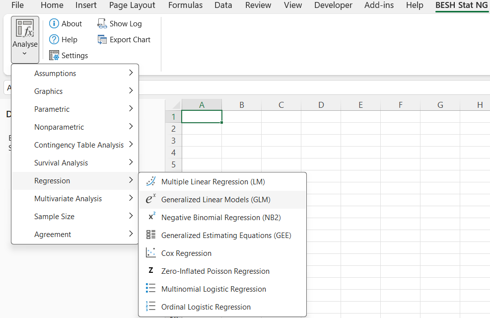
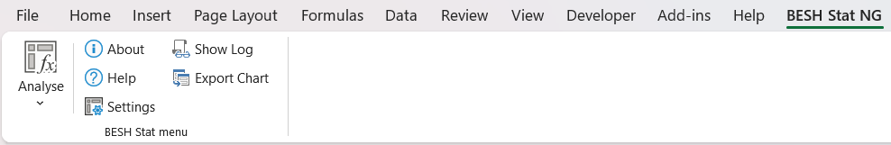
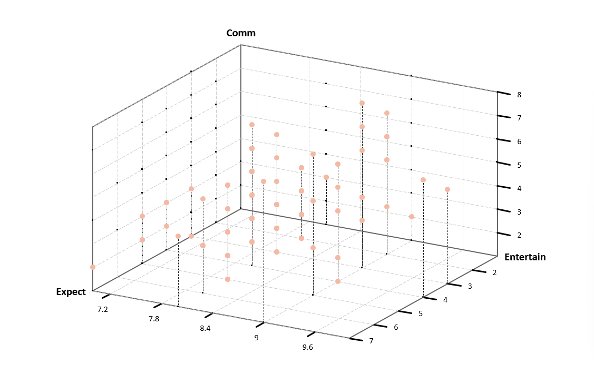
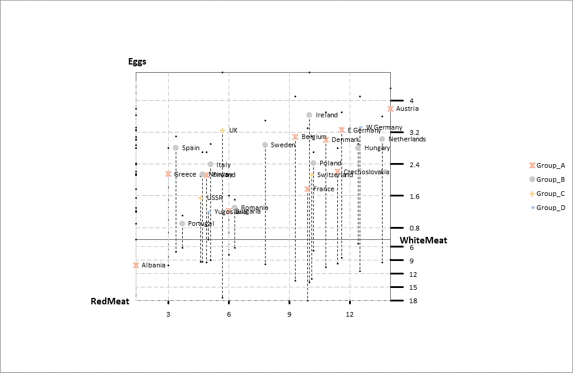

# BESHStatNG

**BESHStatNG** is a free, open-source statistical add-in for **Microsoft Excel on Windows**, built with **Excel-DNA** and **VB.NET**. It brings a broad collection of statistical analyses, regression and longitudinal models, statistical process control, advanced charts, resampling tools, model-reporting utilities, and worksheet functions directly into Excel.

BESHStatNG is designed for researchers, analysts, teachers, students, biomedical users, and other Excel users who want reproducible statistical workflows without moving their data out of the spreadsheet environment.

- **Website:** https://beshstat.eu/
- **Download:** https://beshstat.eu/download/
- **Documentation:** https://beshstat.eu/beshstatng/help/latest/
- **Tutorials:** https://beshstat.eu/tutorials/
- **Validation:** https://beshstat.eu/validation/
- **GitHub Releases:** https://github.com/PeterSlezak/BESHstatNG/releases



## Why BESHStatNG?

BESHStatNG is intended for users who want more than Excel's built-in Analysis ToolPak while keeping an Excel-first workflow.

Key design goals include:

- **Excel-native analysis** through ribbon dialogs, workbook-based result tables, and Excel charts
- **Broad applied statistical coverage** for research, teaching, biomedical analysis, quality improvement, and routine reporting
- **Modern regression and longitudinal modeling**, including LM, GLM, GEE, MMRM, LMM, survival models, ordinal models, and multinomial models
- **Formula-driven analysis** through a large collection of Excel worksheet functions (UDFs)
- **Reproducible resampling and stochastic workflows** with configurable random seeds
- **Consistent statistical presentation**, including application-wide alpha and p-value display settings
- **Transparent validation** with unit tests, reference datasets, NIST benchmarks, and public validation materials
- **Open development** with source code, documentation, issue templates, and release history available in this repository

## Major capabilities

### Regression and longitudinal models

BESHStatNG includes a substantial set of regression workflows:

- Multiple linear regression with continuous predictors, factors, polynomial terms, interactions, ANOVA, VIF, residual diagnostics, Cook's distance, and partial correlations
- Generalized Linear Models (GLM), including Gaussian, Binomial, Poisson, Gamma, and related workflows
- Negative Binomial regression (NB2)
- Zero-Inflated Poisson regression
- Generalized Estimating Equations (GEE), including multiple working-correlation structures and LS-estimate support
- Mixed Models for Repeated Measures (**MMRM**) with ML/REML estimation, flexible within-subject covariance structures, Kenward-Roger, Satterthwaite and other inference options, Type III tests, LS-means, contrasts, and custom estimates
- Linear Mixed Models (**LMM**) with random intercepts/slopes, flexible G-side covariance structures, optional R-side covariance models, ML/REML fitting, Kenward-Roger and Satterthwaite inference, BLUPs, residuals, and diagnostics
- Ordinal logistic regression
- Multinomial logistic regression
- Cox proportional hazards regression

### Survival and classifier reporting

- Kaplan-Meier analysis and survival plots
- Log-rank testing
- Cox proportional hazards models
- ROC analysis
- Confusion matrices and threshold-performance tables
- Sensitivity, specificity, predictive values, precision/recall, and related classifier metrics
- Calibration assessment and calibration plots
- Brier score and prediction-performance summaries

### Propensity-score and causal-inference workflows

Propensity Score Matching tools support workflows such as:

- logistic-regression or supplied propensity scores
- nearest-neighbor and optimal pair matching
- calipers and common-support restrictions
- weighting and subclassification
- coarsened exact matching
- covariate-balance diagnostics
- standardized mean differences
- Love plots
- matched-pair and sensitivity outputs

### Statistical process control

BESHStatNG includes both univariate and multivariate Statistical Process Control tools.

**Control Charts** include:

- Individuals and Moving Range charts
- X-bar, R, and S charts
- p, np, c, and u charts
- CUSUM
- EWMA
- Moving Average charts
- Phase I / Phase II workflows, historical limits, exclusions, and configurable signal rules

**Multivariate Control Charts** include:

- Hotelling's T-squared charts
- Generalized Variance charts
- PCA T-squared and PCA Q monitoring
- MEWMA
- Crosier MCUSUM
- covariance diagnostics, variable contributions, signals, and audit-oriented output

### ANOVA, classical tests, and nonparametric methods

- Paired and unpaired t-tests
- One-way ANOVA
- Repeated-measures ANOVA
- Two-way nested ANOVA
- Multiple-comparison procedures including Fisher's LSD, Bonferroni, Tukey-Kramer, and Games-Howell
- Multiple-comparison confidence-interval plots
- Mann-Whitney, Wilcoxon signed-rank, Kruskal-Wallis, Friedman, Cochran's Q, and Skillings-Mack tests
- Spearman and Kendall rank correlation
- Hotelling's T-squared test
- Theil-Sen simple regression
- normality, variance-homogeneity, symmetry, and outlier diagnostics

### Agreement and method comparison

- Passing-Bablok regression
- Deming regression
- Weighted Deming regression
- Bland-Altman analysis
- Lin's Concordance Correlation Coefficient
- Cohen's and weighted kappa
- Intraclass Correlation Coefficients
- resampling-based confidence intervals for supported agreement methods

### Multivariate analysis

- Principal Component Analysis (PCA), including score labels, grouping, scree plots, biplots, and 3D loading plots
- Exploratory Factor Analysis
- K-means clustering
- Hierarchical clustering
- Correspondence Analysis
- Multiple Correspondence Analysis
- Discriminant Analysis

### Sample-size planning

Sample-size tools cover a growing set of designs, including:

- paired and unpaired means
- single and independent proportions
- log-rank tests
- Cox regression
- Intraclass Correlation Coefficients
- Bland-Altman agreement
- equivalence and non-inferiority settings where supported

### Resampling

A shared resampling framework supports reusable workflows such as:

- jackknife
- bootstrap percentile intervals
- bootstrap BCa intervals
- permutation methods
- exact enumeration where applicable

See the dedicated [Resampling documentation](https://beshstat.eu/beshstatng/help/latest/methods/resampling/).

## Statistical graphics

BESHStatNG provides Excel-native charting tools alongside the statistical procedures. Current chart types include:

- Histogram, including an optional aligned horizontal Tukey box plot
- Box-and-whisker plots with configurable palettes, individual observations, mean markers/lines, and legacy appearance
- ROC and calibration plots
- Kaplan-Meier plots
- Normal probability plots
- 3D XYZ scatter plots with optional animated GIF export
- Scatter-plot matrices
- Polar plots
- Convex-hull plots
- Kite charts
- Grouped, stacked, and comparative categorical histograms
- Violin plots
- Sankey diagrams
- Dumbbell plots
- Ladder / before-after plots
- Bullet charts
- CDF and ECDF plots with grouped comparisons, percentile references, and fitted distributions
- PCA, clustering, correspondence-analysis, control-chart, and other method-specific plots

### Selected chart examples

| Sankey diagram | Dumbbell plot |
|---|---|
|  |  |

| Bullet chart | CDF / ECDF plot |
|---|---|
|  |  |

More examples are available in the [online documentation](https://beshstat.eu/beshstatng/help/latest/) and [tutorials](https://beshstat.eu/tutorials/).

## Excel worksheet functions (UDFs)

In addition to ribbon-driven analyses, BESHStatNG exposes a large and growing collection of worksheet functions for reusable, formula-driven workflows.

UDF coverage includes:

- regression fitting, coefficient tables, predictions, diagnostics, LS-means, and contrasts
- MMRM and LMM workflows
- GEE, GLM, NB2, ZIP, Cox, ordinal, and multinomial models
- survival analysis
- classifier reporting and ROC workflows
- propensity-score analysis and balance diagnostics
- agreement and method-comparison methods
- sample-size calculations
- PCA and other multivariate methods
- contingency tables and proportions
- parametric and nonparametric tests
- distribution functions
- assumption checks
- chart-ready plot data

This makes it possible to create reusable analytical workbooks and teaching templates in which results update when source data change.

See the [UDF Cookbook](https://beshstat.eu/beshstatng/help/latest/udf/udf-cookbook/) for practical examples.

## Global settings and statistical presentation

BESHStatNG includes persistent application-wide settings for commonly reused analysis and reporting options.

Current global settings include:

- default significance level (**alpha**)
- default random seed
- p-value decimal precision
- formatting of very small p-values (`< threshold`, scientific notation, or fixed decimal)
- optional `> threshold` formatting for p-values very close to 1
- diagnostic trace logging

Supported result tables use the underlying numeric p-values for significance decisions while applying the selected display format separately. This preserves full numerical precision in standard Excel result cells while providing consistent presentation across supported analyses and UDF report outputs.

See [Global Settings](https://beshstat.eu/beshstatng/help/latest/global-settings/) for details.

## Documentation, tutorials, and worked examples

The documentation repository contains method-specific guides, UDF references, worked examples, downloadable datasets, screenshots, global settings, chart-export guidance, and version history.

Useful starting points:

- [Getting started](https://beshstat.eu/beshstatng/help/latest/getting-started/)
- [What's new](https://beshstat.eu/beshstatng/help/latest/whats-new/)
- [MMRM](https://beshstat.eu/beshstatng/help/latest/methods/mixed-models-for-repeated-measures-mmrm/)
- [LMM](https://beshstat.eu/beshstatng/help/latest/methods/linear-mixed-models-lmm/)
- [Propensity Score Matching](https://beshstat.eu/beshstatng/help/latest/methods/propensity-score-matching/)
- [Control Charts](https://beshstat.eu/beshstatng/help/latest/methods/control-charts/)
- [Multivariate Control Charts](https://beshstat.eu/beshstatng/help/latest/methods/multivariate-control-charts/)
- [Resampling](https://beshstat.eu/beshstatng/help/latest/methods/resampling/)
- [UDF Cookbook](https://beshstat.eu/beshstatng/help/latest/udf/udf-cookbook/)
- [Tutorials](https://beshstat.eu/tutorials/)

The tutorials emphasize practical Excel workflows, interpretation, and reusable examples rather than only software syntax.

## Validation and numerical checking

BESHStatNG includes a separate unit-test project and public validation materials. The validation workflow includes:

- automated unit tests
- reference datasets
- comparison with external/reference statistical outputs where applicable
- NIST linear-regression benchmark datasets
- NIST one-way balanced ANOVA benchmark datasets
- mixed-model reference checks
- regression, resampling, and numerical-validation tests
- public test-result artifacts for release transparency

See the current public summary on the [Validation page](https://beshstat.eu/validation/).

## Installation

The recommended installation method is the signed MSI installer available from the BESHStatNG website or GitHub Releases.

1. Download the current installer from https://beshstat.eu/download/.
2. Close Excel before installation.
3. Run the `.msi` installer.
4. Start Excel and enable the add-in if prompted.

BESHStatNG provides separate builds for 32-bit and 64-bit Excel where applicable. From version 1.0.0 onward, the MSI installer is digitally signed; the signature can be inspected in **Properties → Digital Signatures** before installation.

## Build from source

### Prerequisites

- Windows
- Microsoft Excel desktop
- Visual Studio with **.NET Framework 4.8** support
- NuGet package restore enabled

### Main project stack

- Visual Basic .NET
- Excel-DNA
- .NET Framework 4.8
- MkDocs for documentation
- WiX for installer packaging

### Build the add-in

1. Clone this repository.
2. Restore NuGet packages.
3. Open `BESHStatNG.sln` in Visual Studio.
4. Build the required configuration in `Release` mode.
5. Run the relevant tests in `BESHStatNG.Test`.
6. Package the installer with the installer project or the project's release packaging workflow.

## Repository structure

```text
BESHStatNG.sln
/BESHstatNG/                         Excel-DNA add-in project
    src/
        AppInfrastructure/           global settings and shared application infrastructure
        BaseStat/                    core statistical functions and resampling infrastructure
        DM/                          data import, result tables, and output writers
        ExcelUDFs/                   Excel worksheet functions
        Graphics/                    chart generation and export support
        Help/                        help-link integration
        RegModels/                   regression, mixed models, survival, PSM, and multivariate models
        StatTests/                   statistical tests
        UI/                          Windows Forms dialogs and ribbon handlers
        Update/                      update/version support
    tools/                           project helper scripts
/BESHStatNG.Test/                    unit tests, reference datasets, and validation artifacts
/BESHStatNG_Help_MkDocs/             MkDocs documentation source and worked-example assets
/BESHStatNG_Installer/               WiX installer project
/.github/                            contribution files, issue templates, and README assets
README.md
```

The codebase also contains abstractions separating core data/result handling from Excel-specific infrastructure, supporting continued work on portability without changing the current Windows/Excel-DNA user interface.

## Contributing and issue reporting

Contributions, bug reports, validation notes, documentation improvements, and workflow suggestions are welcome.

Before opening an issue, please check the documentation and current release notes. For reproducible bug reports, include where possible:

- BESHStatNG version
- Excel version and Office bitness
- Windows version
- exact steps to reproduce the problem
- expected and actual behavior
- full error message or relevant log excerpt
- a simplified workbook, screenshot, or sample dataset
- whether the issue occurs through a ribbon dialog, worksheet function, or both

If you submit a fix, validation notes are especially useful: describe how the change was tested and whether related unit tests, reference outputs, documentation, or example workbooks were updated.

Useful links:

- [Contributing guide](.github/CONTRIBUTING.md)
- [Open an issue](https://github.com/PeterSlezak/BESHstatNG/issues/new/choose)
- [Issue tracker](https://github.com/PeterSlezak/BESHstatNG/issues)
- [Releases](https://github.com/PeterSlezak/BESHstatNG/releases)

## Project status

BESHStatNG is under active development. Recent development has focused on:

- MMRM and LMM workflows and inference
- propensity-score and causal-inference tools
- statistical process control
- expanded statistical graphics
- ANOVA multiple-comparison reporting and plots
- PCA visualization enhancements
- reusable resampling infrastructure
- consistent global alpha and p-value presentation
- validation, worked examples, tutorials, and formula-driven workflows

For the detailed change history, see [What's New](https://beshstat.eu/beshstatng/help/latest/whats-new/).

## Support and links

- **Website:** https://beshstat.eu/
- **Download:** https://beshstat.eu/download/
- **Documentation:** https://beshstat.eu/beshstatng/help/latest/
- **Tutorials:** https://beshstat.eu/tutorials/
- **Validation:** https://beshstat.eu/validation/
- **Releases:** https://github.com/PeterSlezak/BESHstatNG/releases
- **Issues:** https://github.com/PeterSlezak/BESHstatNG/issues

## Additional screenshots



### 3D scatter plot




